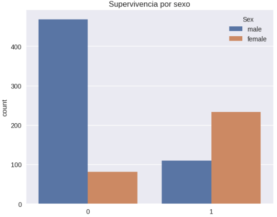
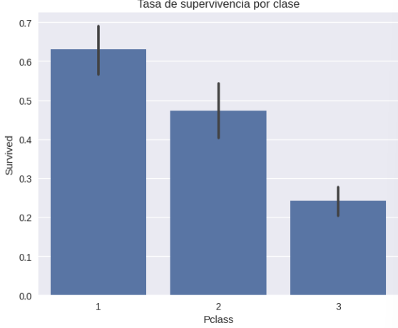
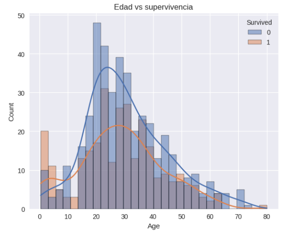
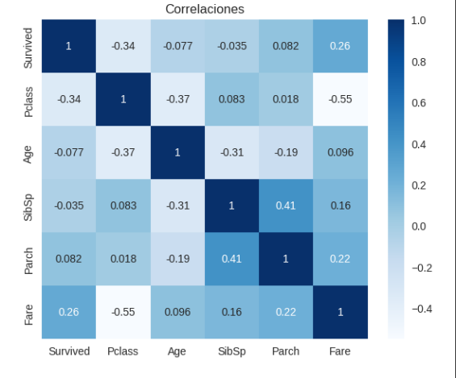

# Práctica 1 — EDA Titanic

## Contexto

Esta práctica consistió en realizar un **Análisis Exploratorio de Datos (EDA)** sobre el dataset del Titanic, disponible en [Kaggle](https://www.kaggle.com/competitions/titanic/data).

La solución se encuentra en  [GoogleColab](https://colab.research.google.com/drive/1pCw_QCZsqQB8gcLmOhqY-XBz3gmItlxT?usp=sharing).

El objetivo fue explorar y comprender la estructura de los datos, identificar patrones iniciales y posibles problemas de calidad que afecten el modelado posterior.

## Objetivos

- Conocer la estructura y significado de las variables del dataset del Titanic.  
- Identificar relaciones iniciales entre variables y la supervivencia.  
- Generar visualizaciones para respaldar los hallazgos.  

## Actividades 

| Actividad                                   | Tiempo | Resultado esperado                   |
|---------------------------------------------|:------:|--------------------------------------|
| Investigación del dataset y la competencia  | 10m    | Comprensión del contexto y variables |
| Configuración de entorno en Google Colab    | 5m     | Librerías y entorno listos           |
| Cargar el dataset de Kaggle                 | 10m    | Conectar Colar con Kaggle API        |
| Conocer el dataset                          | 10m    | Probar los primeros comandos         |
| Visualizaciones iniciales                   | 15m    | Gráficos y relaciones clave          |

## Desarrollo

1. **Investigación inicial**  
    - Dataset: contiene información sobre pasajeros del Titanic (ej. sexo, edad, clase de ticket, familiares a bordo, número de cabina y supervivencia).  
    - Variable objetivo: `Survived` (1 = sobrevivió, 0 = no sobrevivió).  

2. **Preguntas iniciales**

### 2.1: ¿Qué factores crees que más influyeron en la supervivencia?
- Los factores que podrían influir en la supervivencia son la edad y el sexo ya que debían tener prioridad los niños y sus madres.  
- La clase de ticket también podría influir ya que los pasajeros de primera clase tuvieron mayor acceso a botes salvavidas y mejores ubicaciones en el barco, lo que incrementó sus posibilidades de sobrevivir.  
- Tamaño del grupo familiar (sibsp y parch): Viajar acompañado podría influir tanto positiva como negativamente, dependiendo de si facilitó la asistencia mutua o si dificultó la evacuación.  

### 2.2: ¿Qué desafíos de calidad de datos esperas encontrar?
- Valores faltantes: Especialmente en variables como `age` y `cabin`.  
- Datos no estructurados o inconsistentes: En campos como `ticket` y `cabin`, que no siguen un formato único.  

### 2.3: ¿Qué variables podrían estar correlacionadas?
- `pclass` y `fare`: El precio del ticket está directamente relacionado con la clase del pasajero.  
- `sibsp` y `parch`: Ambas describen el tamaño de la familia a bordo, por lo que podrían correlacionarse.  
- `pclass` y `survival`: Los pasajeros de clases más altas tuvieron mayores tasas de supervivencia.  

3. **Configuración del entorno**  
   - Uso de Google Colab con librerías `pandas`, `numpy`, `matplotlib`, `seaborn`.  
   - Conexión directa con Kaggle API para descarga del dataset.  

4. **Conociendo el dataset**  
   - Dimensiones: 891 filas × 12 columnas.  
   - Valores faltantes: `Cabin`, `Age`.  

5. **EDA visual** (ver Evidencias)  
    - Supervivencia por sexo: Las mujeres sobrevivieron en mayor proporción que los hombres.  
    - Tasa de supervivencia por clase: Primera clase tuvo mayor tasa de supervivencia (~63%), tercera clase la más baja (~24%).  
    - Distribución de edad: Picos en adultos jóvenes; los menores de 10 años tienen mayor supervivencia.  
    - Correlaciones numéricas: `Fare` correlaciona positivamente con `Survived` y negativamente con `Pclass`.  

## Evidencias
**Figura 1: Supervivencia por sexo.**

**Figura 2: Tasa de supervivencia por clase.**

**Figura 3: Distribución de edad por supervivencia.**

**Figura 4: Matriz de correlaciones.**

## Reflexión

Este análisis confirmó hipótesis iniciales, el sexo y la clase fueron determinantes clave en la supervivencia, y los niños tuvieron ventaja.

Como siguiente paso, se podrían crear variables derivadas (ej. tamaño del grupo familiar) y aplicar imputación de Age para no perder datos valiosos.

## Referencias
- [Kaggle](https://www.kaggle.com/competitions/titanic/data)

