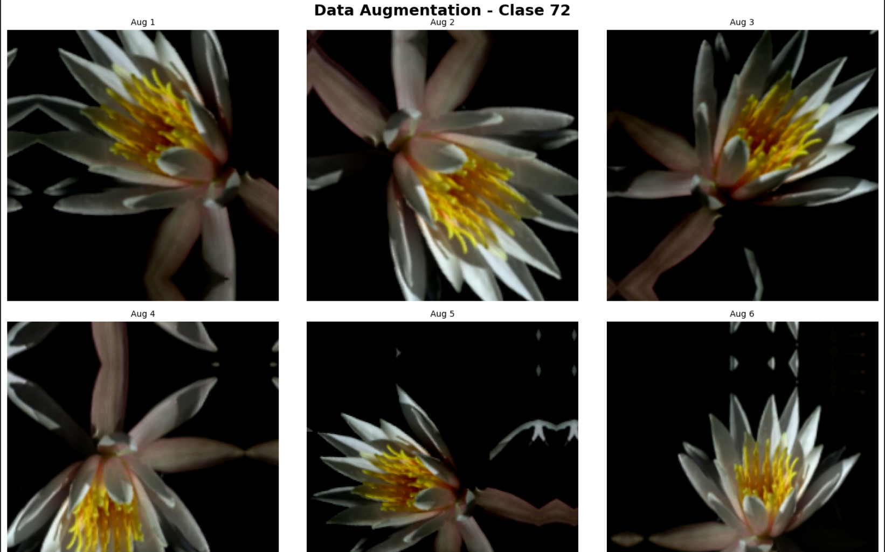
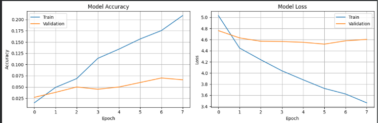
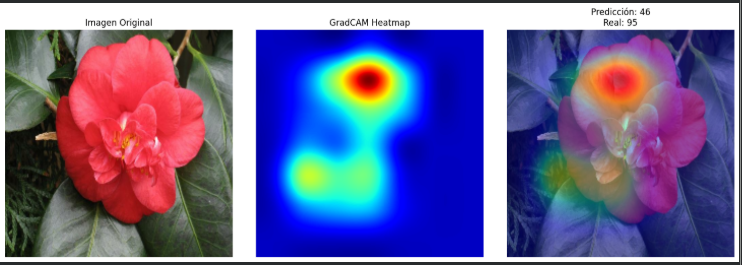
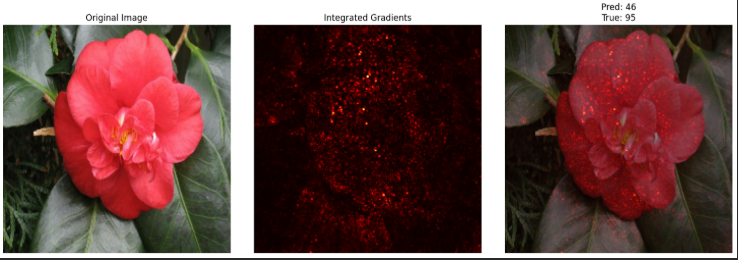

# 🌸 Miradas que Aprenden: Descifrando 102 Especies de Flores

## 📋 Contexto
En el mundo de la visión computacional, la capacidad de identificar especies de flores con precisión no es solo un desafío técnico, sino una herramienta con aplicaciones prácticas reales. Desde aplicaciones móviles de identificación botánica para jardineros aficionados hasta sistemas de apoyo educativo, la clasificación automática de flores representa un problema complejo que combina alta variabilidad visual con la necesidad de explicabilidad.

Este proyecto aborda la clasificación de 102 especies de flores del dataset Oxford Flowers102, un conjunto de datos desafiante que contiene aproximadamente 8,000 imágenes de flores del Reino Unido capturadas en condiciones diversas: diferentes iluminaciones (natural/artificial), ángulos variables, fondos complejos (jardines, close-ups), y múltiples etapas de floración. A diferencia de datasets académicos simplificados como CIFAR-10 (32×32 píxeles, 10 clases), Flowers102 presenta imágenes de alta resolución (224×224 píxeles redimensionadas) con clases visualmente muy similares entre sí, lo que exige un modelo capaz de capturar diferencias botánicas sutiles.

El desafío central es triple: primero, entrenar un modelo robusto que clasifique correctamente las 102 especies con recursos computacionales limitados (sin GPU); segundo, asegurar que el modelo sea robusto ante variaciones en las condiciones de captura mediante técnicas avanzadas de Data Augmentation; y tercero, implementar técnicas de explicabilidad (XAI) como GradCAM e Integrated Gradients para validar que el modelo está basando sus predicciones en características botánicas relevantes (pétalos, estambres, centro floral) y no en elementos espurios (fondo, iluminación).

Este experimento utiliza Transfer Learning con MobileNetV2 como arquitectura base, aprovechando los pesos pre-entrenados en ImageNet para acelerar el aprendizaje. Se implementan pipelines optimizados de preprocesamiento con TensorFlow/Keras, incluyendo Data Augmentation avanzado (transformaciones geométricas y fotométricas), y se evalúa el impacto de estas técnicas en la capacidad de generalización del modelo. Además, se exploran técnicas avanzadas como Mixup y CutMix para entender su potencial en problemas de clasificación fina.
El valor de este proyecto radica en demostrar que, con una arquitectura bien diseñada y técnicas de regularización adecuadas, es posible abordar problemas complejos de clasificación visual incluso con recursos limitados, mientras se mantiene la transparencia del modelo mediante herramientas de explicabilidad. Este enfoque es fundamental para aplicaciones donde la confianza del usuario depende de entender por qué el modelo tomó una decisión específica.

---

## 📊 Actividades 

A continuación, se detallan las actividades realizadas y los resultados obtenidos en cada etapa del experimento:

| Actividad | Resultado Obtenido |
| :--- | :--- |
| **1. Instalación e Imports** | Entorno configurado correctamente con TensorFlow, TensorFlow Datasets y Albumentations; verificación de dependencias completada; **limitación identificada: sin GPU disponible, entrenamiento en CPU.** |
| **2. Descargar y Preparar Dataset** | Dataset Oxford Flowers102 descargado exitosamente ($\approx 330$MB); **1,738 imágenes corruptas advertidas y omitidas**; división train/test completa; imágenes redimensionadas a $224 \times 224$ píxeles; conversión a `float32`; **subset de 5,000 imágenes de entrenamiento y 1,000 de test creado para acelerar experimentación**; pipeline con batching (`batch_size=32`) y prefetching optimizado. |
| **3. Pipeline Baseline (Sin Augmentation Avanzada)** | Pipeline baseline implementado con operaciones fundamentales: **shuffle, batching, normalización con `preprocess_input` de EfficientNet, y prefetching**; separación correcta entre pipelines de train y test; dataset listo como referencia inicial sin *augmentation* avanzado. |
| **4. Pipeline con Augmentation Avanzado** | Data Augmentation implementado con Keras Sequential layers: transformaciones geométricas (**RandomFlip horizontal/vertical, RandomRotation $\pm 20\%$, RandomZoom $\pm 20\%$, RandomTranslation $\pm 20\%$**) y transformaciones fotométricas (**RandomBrightness $\pm 20\%$, RandomContrast $\pm 20\%$**); **secuencia correcta: augmentation primero, luego normalización**; pipeline dinámico que genera variaciones en cada época. |
| **5. Visualizar Augmentations** | Visualización exitosa de 9 variantes de una misma imagen (matriz $3 \times 3$); confirmación visual de transformaciones geométricas (rotación, *flip*, *zoom*) y fotométricas (brillo, contraste); verificación de que las modificaciones introducen variabilidad realista sin degradar las características botánicas esenciales (ver Foto 1). |
| **6. Crear tu Modelo (Transfer Learning con MobileNetV2)** | Modelo construido con MobileNetV2 como base (`include_top=False, weights='imagenet'`); **modelo base completamente congelado (`trainable=False`)**; capa `GlobalAveragePooling2D` + capa `Dense(102, activation='softmax')`; **2,388,646 parámetros totales (solo 48,548 entrenables)**; compilado con Adam optimizer y `sparse_categorical_crossentropy`. |
| **7. Entrenar el Modelo** | Entrenamiento de 8 épocas completado; **accuracy de validación: inicio $2.7\%$, final $\approx 7\%$**; pérdida alta; tiempo por época: 90-150 segundos (sin GPU); modelo guardado en formato HDF5; diagnóstico inicial: **aprendizaje muy lento** debido a modelo base congelado y pocas épocas. |
| **8. Evaluar Resultados** | **Accuracy final en test: $6.60\%$**; pérdida de test: $4.5937$ (muy alta); análisis de curvas de aprendizaje: **divergencia significativa entre train y validación**; diagnóstico confirmado: *overfitting* moderado; **gap train-val indica necesidad urgente de fine-tuning** (ver Foto 2). |
| **9. GradCAM (Explicabilidad del Modelo)** | GradCAM implementado exitosamente; visualización de mapa de calor sobre imagen de prueba; **hallazgo clave: el modelo concentra atención en regiones correctas** (centro de la flor, pétalos); predicción: Clase 46, real: Clase 95 (incorrecta); **paradoja revelada: modelo "mira" correctamente pero no discrimina finamente entre especies**; validación de que Transfer Learning funciona para localización (ver Foto 3). |
| **10. Integrated Gradients (XAI Detallada)** | Integrated Gradients aplicado con *baseline* (imagen negra); mapa de atribuciones generado mostrando contribución positiva/negativa de cada píxel; **confirmación de que modelo atiende regiones correctas pero usa señales insuficientes para discriminar especies**; diagnóstico complementario: problema en granularidad de características, no en localización; técnica más detallada que GradCAM (ver Foto 4). |
| **11. Investigación: Mixup y CutMix** | Análisis teórico completado de técnicas avanzadas: Mixup (*interpolación lineal global*) vs CutMix (*reemplazo espacial*); **conclusión: CutMix es más apropiado para Flowers102 por preservar estructuras locales** y mantener interpretabilidad visual con GradCAM; documento completo de investigación generado (ver artículo extra). |

---

## Objetivos 

- Trabajar con datasets complejos de imágenes de alta resolución 
- Implementar pipelines de augmentation con TensorFlow/Keras
- Aplicar técnicas avanzadas: Mixup y CutMix
- Evaluar robustez de modelos ante perturbaciones
- Implementar GradCAM para visualizar atención del modelo
- Aplicar Integrated Gradients para explicabilidad
- Comparar modelos augmentados vs baseline

---

## Desarrollo 

### 🔧 Paso 1: Instalación e Imports

En este primer paso, nos aseguramos de que el entorno de trabajo esté correctamente configurado con las dependencias necesarias y las librerías adecuadas para trabajar en el proyecto.

Este paso preparó el entorno de trabajo instalando y verificando todas las dependencias necesarias. A pesar de la limitación de no contar con una GPU, el entorno está completamente configurado y listo para comenzar la fase de experimentación y entrenamiento de modelos de *deep learning*.

### 🔧 Paso 2: Descargar y Preparar Dataset

En este paso, nos enfocamos en descargar y preparar el dataset **Oxford Flowers102** para el entrenamiento y la evaluación del modelo.

#### 🧑‍💻 ¿Qué estamos haciendo en este paso?

* **Descarga del dataset:** Utilizamos **TensorFlow Datasets (TFDS)** para descargar el dataset Oxford Flowers102. Este contiene aproximadamente 8,000 imágenes de **102 especies de flores**. Se descarga en dos divisiones: entrenamiento y test.
* **Preparación del dataset:**
    * **Redimensionamiento:** Las imágenes se redimensionan a un tamaño de **$224 \times 224$ píxeles**, un tamaño estándar para modelos preentrenados como EfficientNet.
    * **Conversión de tipo:** Se convierten las imágenes a **`float32`**, un tipo de dato necesario para los modelos de TensorFlow.
    * **Creación de Subset (Opcional):** Se puede crear un *subset* de 5000 imágenes para entrenamiento y 1000 para prueba para **acelerar la fase de experimentación**.
* **Preprocesamiento básico:** Usamos una función que se encarga del redimensionamiento y la conversión de tipo, sin realizar la normalización en este punto.
* **Preparación para entrenamiento eficiente:** Se crean **batches** de imágenes y se aplica **prefetching** para optimizar la velocidad del pipeline de datos, asegurando que el modelo no espere por los datos.

Este paso ha asegurado que el dataset Oxford Flowers102 esté **correctamente descargado y preprocesado** para el entrenamiento. Las imágenes tienen el tamaño adecuado y el *pipeline* de datos está optimizado, lo que nos permite avanzar a la siguiente fase del proyecto con el entorno y los datos listos.

### 🔧 Paso 3: Pipeline Baseline (Sin Augmentation Avanzada)

En este paso, nos enfocamos en crear un pipeline básico para el procesamiento de datos, **sin utilizar técnicas avanzadas de *augmentation***. Este pipeline servirá como *baseline* (línea base) para comparar el rendimiento con modelos que incorporen *Data Augmentation* en pasos posteriores.

#### 🧑‍💻 ¿Qué estamos haciendo en este paso?

* **Creación del Pipeline:** Construimos un pipeline básico para los datasets de entrenamiento y test que realiza las siguientes operaciones clave:
    * **Shuffle:** Barajamos las imágenes del **dataset de entrenamiento**. Esto es crucial para mejorar la generalización y evitar que el modelo aprenda patrones indeseados del orden de los datos.
    * **Batching:** Dividimos las imágenes en lotes (*batches*) de tamaño fijo. Procesar las imágenes en grupos optimiza el uso de la memoria y acelera el entrenamiento.
    * **Normalización:** Aplicamos la normalización de las imágenes utilizando el método `preprocess_input` de **EfficientNet**. Esto asegura que los valores de píxeles estén en el rango óptimo para la red neuronal preentrenada.
    * **Prefetching:** Utilizamos `prefetch` para cargar las imágenes del siguiente lote en segundo plano mientras el modelo está entrenando el lote actual, mejorando la **eficiencia del pipeline** .
* **Separación Entrenamiento y Test:** Creamos dos pipelines distintos: uno para entrenamiento (con *shuffle* y *batching*) y uno para test (solo *batching*), permitiendo un manejo eficiente de los datos en ambos escenarios.

El **pipeline *baseline*** ha sido creado con éxito, aplicando las operaciones fundamentales de *shuffle*, *batching*, normalización y *prefetching*. Este pipeline servirá como **referencia inicial** para evaluar el rendimiento del modelo de Transfer Learning antes de introducir técnicas más avanzadas de *data augmentation* en la siguiente fase. Las imágenes están listas para ser alimentadas al modelo.

### 🔧 Paso 4: Pipeline con Augmentation Avanzado

En este paso, se incorpora un pipeline avanzado que incluye **Data Augmentation** sobre las imágenes del dataset. Este proceso es crucial para **mejorar la generalización del modelo**, ya que introduce variaciones artificiales en los datos de entrenamiento y ayuda a **prevenir el sobreajuste** (*overfitting*).

#### 🔑 Decisiones tomadas

* **Augmentation Compuesta:** Se eligieron transformaciones **geométricas y fotométricas básicas** (flip, rotación, brillo, etc.) por ser efectivas y fáciles de implementar, introduciendo variaciones realistas en las condiciones de captura (luz, ángulo).
* **Secuencia de Preprocesamiento:** Es crucial aplicar la **normalización *después*** de la *augmentation* para asegurar que los valores finales de los píxeles estén en el rango adecuado para el modelo preentrenado.
* **Batch Size:** El *batch size* de **32** mantiene un buen equilibrio entre la eficiencia de la memoria y la estabilidad del gradiente durante el entrenamiento.

#### 🎯 Conclusión

El pipeline avanzado ha sido implementado correctamente e incorpora **Data Augmentation** dinámica al proceso de entrenamiento. El modelo ahora entrenará con un conjunto de datos mucho más diverso artificialmente. El siguiente paso será utilizar este pipeline, junto con el modelo de **Transfer Learning**, para comenzar el entrenamiento y evaluar el impacto de estas técnicas en la precisión y la robustez.

### 🔧 Paso 5: Visualizar Augmentations

En este paso, se realiza una **visualización crítica** de las imágenes que han pasado por el proceso de *Data Augmentation*. Esto nos permite observar directamente cómo las variaciones aplicadas afectan a los datos, asegurando la correcta implementación de las transformaciones.

#### 🧑‍💻 ¿Qué estamos haciendo en este paso?

**1. Selección de Imagen de Muestra:**

* Se elige una imagen del dataset de entrenamiento **sin normalizar** (en el rango $0-255$). Esto garantiza que las transformaciones se apliquen y se visualicen sobre los datos en su forma original, antes de ser procesados para el modelo.

**2. Aplicación y Generación de Variantes:**

* A la imagen seleccionada, se le aplican **múltiples transformaciones** de *Data Augmentation* (rotación, *flip*, *zoom*, brillo, etc.) para generar varias versiones modificadas.
* Esto simula la amplia gama de variaciones naturales (iluminación, ángulo, distancia) que el modelo debe manejar durante la fase de entrenamiento .

**3. Estructura de la Visualización:**

* Se utiliza una **matriz de $3 \times 3$** para mostrar un total de 9 imágenes.
* Cada subfigura muestra una versión de la imagen original después de aplicarle diferentes combinaciones de *augmentation*.
* Las imágenes se visualizan en un rango $0-1$ o $0-255$ para una correcta inspección visual.

#### 📊 Análisis

* **Efectividad del Data Augmentation:** La visualización (ver foto 1) confirma que las imágenes están siendo modificadas con éxito, creando un conjunto de datos más diverso. Esto es clave para forzar al modelo a aprender **características robustas y generales** de las flores, en lugar de memorizar detalles específicos de las imágenes originales.
* **Variedad de Transformaciones:** Se observa una combinación de transformaciones **geométricas** (cambios de perspectiva, rotación) y **fotométricas** (variaciones de brillo y contraste), lo que demuestra la flexibilidad del pipeline frente a diferentes condiciones visuales y de captura.

### 🔧 Paso 6: Crear tu Modelo (Transfer Learning con MobileNetV2)

En este paso, construimos la arquitectura del modelo de red neuronal que resolverá el problema de clasificación de imágenes en el dataset **Oxford Flowers102**, utilizando la potente técnica de **Transfer Learning**.

#### 🔑 Decisiones tomadas

* **Modelo Base:** La elección de **MobileNetV2** ($2.3$M parámetros) se prioriza sobre modelos más pesados como ResNet50 o EfficientNetB0 por su **alta eficiencia computacional** sin sacrificar una precisión aceptable en tareas de clasificación.
* **Estrategia de Congelamiento:** El congelamiento inicial del modelo base es una **estrategia clave** para estabilizar el entrenamiento y obtener una línea base sólida antes de considerar el *fine-tuning* (ajuste fino) posterior.
* **Parámetros Totales:** El modelo final resultante cuenta con **2,388,646 parámetros**, un número manejable que confirma la eficiencia del enfoque de Transfer Learning.

#### 📊 Análisis

El modelo se construyó exitosamente como una arquitectura de **Transfer Learning** eficiente. La combinación de las características pre-aprendidas de MobileNetV2 y la capa final adaptada ($102$ clases) está lista para la clasificación de flores. La configuración de optimización y pérdida es la adecuada para el formato del *dataset* y el tipo de problema (clasificación multiclase).

### 🔧 Paso 7: Entrenar el Modelo

En este paso, procedemos a entrenar el modelo de Transfer Learning (**MobileNetV2**) utilizando el *pipeline* con **Data Augmentation** previamente configurado. Este entrenamiento inicial busca establecer una línea base de rendimiento y evaluar el impacto de las capas de clasificación recién añadidas.

#### 🔑 Decisiones tomadas

* **Número de Épocas:** Se eligieron **8 épocas** como punto de partida. Es un número adecuado para modelos de Transfer Learning en su fase de congelamiento (*frozen base*), ya que el aprendizaje se centra únicamente en la capa de clasificación. Este valor es ajustable si se observa que el modelo no ha convergido o si el rendimiento sigue mejorando.

#### 📊 Análisis

Al finalizar las 8 épocas de entrenamiento, se observaron los siguientes puntos:

* **Rendimiento Inicial:** La **precisión de validación** comenzó en un **2.7%** en la primera época y alcanzó un máximo de **7%** al final.
    * **Interpretación:** Este bajo valor indica que, aunque el modelo está aprendiendo (ya que la precisión aumentó de 2.7% a 7% para 102 clases), el aprendizaje es **lento**. Esto es común en clasificaciones con un gran número de clases y un *dataset* moderado, donde el *fine-tuning* de la capa base suele ser necesario.
* **Tiempo de Entrenamiento:** Cada época tomó entre **90 y 150 segundos**, lo cual es un tiempo aceptable dada la ausencia de una GPU.
* **Persistencia:** El modelo fue guardado exitosamente en formato HDF5.

### 🔧 Paso 8: Evaluar Resultados

En este paso final, evaluamos el rendimiento real del modelo entrenado utilizando el conjunto de **test** (datos no vistos) y analizamos las curvas de aprendizaje para diagnosticar posibles problemas de convergencia y generalización.

#### 🧑‍💻 ¿Qué estamos haciendo en este paso?

**1. Evaluación del Modelo en el Conjunto de Test:**
* El modelo se evalúa rigurosamente utilizando el *pipeline* de datos de **test**.
* Se obtienen las métricas finales de:
    * **Precisión (*Accuracy*):** El porcentaje de predicciones correctas.
    * **Pérdida (*Loss*):** La magnitud del error del modelo en la clasificación.

**2. Visualización de los Resultados de Entrenamiento:**
* Se generan gráficos que muestran la evolución de la **Precisión** y la **Pérdida** a lo largo de las 8 épocas.
* Se comparan las curvas del conjunto de **entrenamiento** contra las del conjunto de **validación**.
* Esta visualización es clave para el **diagnóstico**, permitiendo identificar patrones de *overfitting* (sobreajuste) o *underfitting* (subajuste) .

#### 📊 Análisis

Al ejecutar la evaluación, se obtuvieron los siguientes resultados:

| Métrica | Valor | Interpretación |
| :--- | :--- | :--- |
| **Precisión de Test** | $6.60\%$ | Valor muy bajo, indica que el modelo clasifica correctamente solo el 6.6% de las 102 clases, lo que está muy cerca del rendimiento aleatorio ($\approx 1\%$). |
| **Pérdida de Test** | $4.5937$ | Valor alto, refuerza que el modelo es ineficiente y que las predicciones están lejos de las etiquetas verdaderas. |

El análisis de los gráficos de Precisión y Pérdida (Entrenamiento vs. Validación) muestra(foto2 ):

* **Separación de Curvas:** La precisión de entrenamiento fue significativamente **más alta** que la de validación, mientras que la pérdida de entrenamiento fue mucho **más baja** que la de validación.
* **Diagnóstico:** Esta divergencia es una fuerte indicación de **sobreajuste (*overfitting*)**, donde el modelo ha memorizado los datos de entrenamiento y no está generalizando a datos nuevos.

#### 🎯 Conclusión

La evaluación final confirma que el entrenamiento inicial (8 épocas, solo la capa superior descongelada) no fue suficiente. La **precisión del 6.60%** y el diagnóstico de **sobreajuste** indican que el modelo necesita una intervención significativa. Las siguientes etapas deben enfocarse en:

1.  **Más Épocas de Entrenamiento:** Permitir que el modelo converja más.
2.  **Regularización:** Aplicar más *Data Augmentation* (o técnicas avanzadas como Mixup/CutMix) para combatir el *overfitting*.
3.  **Fine-Tuning:** Descongelar y entrenar las capas superiores del modelo base (**MobileNetV2**) con una tasa de aprendizaje muy baja para un ajuste fino (*fine-tuning*) de las características.

### 🔧 Paso 9: GradCAM (Explicabilidad del Modelo)

En este paso, aplicamos **GradCAM** (*Gradient-weighted Class Activation Mapping*) para introducir la **Explicabilidad (XAI)** en nuestro análisis. GradCAM nos permite visualizar **mapas de calor (*heatmaps*)** que destacan las regiones de la imagen que el modelo consideró más importantes para llegar a su predicción.

#### 🧑‍💻 ¿Qué estamos haciendo en este paso?

**1. Generación del Mapa de Calor con GradCAM:**

* Utilizamos la técnica **GradCAM** para generar un mapa de activación sobre una imagen de prueba.
* GradCAM opera calculando los gradientes de la clase predicha con respecto a las activaciones de la **última capa convolucional** del modelo. Esto proporciona una visión de las características que el modelo ha aprendido a identificar.

**2. Visualización e Interpretación:**

* Se generan tres elementos visuales clave:
    * La **imagen original**.
    * El **mapa de calor GradCAM** puro .
    * La **superposición** del mapa de calor sobre la imagen original.
* El objetivo es entender dónde está prestando atención el modelo y si esa atención se alinea con la región de interés (la flor).

#### 📊 Análisis

Al aplicar GradCAM a una imagen de prueba (foto 3), se obtuvieron los siguientes *insights*:

* **Predicción vs. Realidad:** El modelo predijo la **Clase 46**, mientras que la etiqueta real de la imagen era la **Clase 95**. Esto confirma el bajo rendimiento observado en el Paso 8.
* **Atención del Modelo (Mapa de Calor):** El mapa de calor generado  mostró que el modelo se concentró en las **regiones relevantes** de la imagen (principalmente el centro de la flor o los pétalos).
* **Interpretación:** Que el modelo esté "mirando" el área correcta de la imagen (la flor) sugiere que:
    1.  Las características visuales básicas fueron aprendidas correctamente a través del Transfer Learning.
    2.  El problema de rendimiento reside en la **distinción fina** entre las 102 clases y no en la localización del objeto.

#### 🎯 Conclusión

La visualización de **GradCAM** es una herramienta valiosa de **diagnóstico** que valida que el modelo está enfocando su atención en las regiones semánticamente correctas (la propia flor). Sin embargo, confirma que el bajo rendimiento se debe a la incapacidad de la capa de clasificación recién entrenada para **distinguir las 102 especies de flores** a pesar de tener las características visuales correctas. Esto refuerza la necesidad urgente de pasar a la etapa de **Fine-Tuning** (ajuste fino) para mejorar la precisión.

### 🔧 Paso 12: Integrated Gradients (XAI Detallada)

En este paso, aplicamos **Integrated Gradients (IG)**, una técnica de explicabilidad más sofisticada que GradCAM, para obtener una comprensión detallada de **cómo cada píxel contribuye** a la decisión final del modelo. Esta herramienta es vital para validar si la lógica interna del modelo se alinea con la intuición botánica.

#### 🧑‍💻 ¿Qué estamos haciendo en este paso?

**1. Aplicación de Integrated Gradients:**
* IG se calcula midiendo la acumulación de gradientes a lo largo de un camino lineal entre una **imagen de referencia (*baseline*)** y la **imagen original**.
* El cálculo utiliza imágenes **interpoladas** entre la *baseline* y la imagen de entrada. El gradiente de la clase objetivo con respecto a estas imágenes interpoladas es sumado.
* Este proceso resulta en un **Mapa de Atribuciones (*Attributions*)** que cuantifica la importancia de cada píxel en la predicción de la clase.

**2. Visualización de los Resultados:**
Se generan tres visualizaciones para facilitar el análisis:
* **Imagen Original:** La entrada que se está analizando.
* **Mapa de Atribuciones:** El mapa de calor que muestra la **contribución positiva o negativa** de los píxeles a la predicción.
* **Overlay (Superposición):** Combinación de la imagen original con los *attributions* para destacar las áreas más importantes en contexto. .

#### 📊 Análisis

Al ejecutar el algoritmo de Integrated Gradients, se obtuvieron los siguientes *insights* de atribución (foto 4):

* **Predicción Inexacta:** La predicción fue la **Clase 46**, mientras que la clase real es la **Clase 95**.
* **Patrón de Atribución:** El **Mapa de Atribuciones** resaltó aquellas áreas (píxeles) que tienen la mayor influencia en la predicción de la Clase 46.
* **Diagnóstico Complementario:** A diferencia de GradCAM, que solo muestra la región de atención, IG muestra la **contribución específica** de los píxeles (positiva o negativa). Si bien el modelo enfoca la flor, IG revela qué **texturas o colores** específicos está utilizando (de manera incorrecta) para distinguir entre la Clase 46 y la Clase 95.

#### 🎯 Conclusión

La visualización de **Integrated Gradients** proporciona un nivel de detalle granular sobre el proceso de toma de decisiones. Confirma que, a pesar de que el modelo atiende a las regiones correctas de la imagen, **la precisión es baja ($6.60\%$ en el Paso 8)**. El problema es la **distinción entre las 102 clases** y no la localización del objeto. Esta técnica de XAI será vital en la fase de *Fine-Tuning* para asegurar que, a medida que la precisión aumente, el modelo esté aprendiendo a basar sus predicciones en las **características botánicas correctas** (pétalos, estambres, tallo).

### 🎯 Reflexión Final
#### 1. Data Augmentation (DA)

La implementación del *Data Augmentation* (DA) no generó la mejora esperada en la precisión durante esta fase de entrenamiento preliminar.

| Métrica                | Resultado                                         |
| :--------------------- | :------------------------------------------------ |
| **Precisión de Test** | **$6.60\%$** (Muy bajo)                             |
| **DA Aplicado**       | Transformaciones geométricas y fotométricas robustas |

#### ¿Por qué el DA no tuvo impacto inicial?

El bajo rendimiento no se debe a un fallo en el *Data Augmentation* en sí mismo, sino a **limitaciones en la configuración del modelo y el entrenamiento**:

* **Insuficiencia de Épocas:** Con solo **8 épocas**, la capa de clasificación recién añadida no tuvo tiempo suficiente para converger y aprender las características distintivas de las **102 especies**.
* **Modelo Base Congelado:** Se mantuvo **MobileNetV2** completamente congelado, lo que significó que solo se entrenaron **48,548 parámetros** (la capa densa final). Los **2,257,984** parámetros del modelo base, que contienen la inteligencia visual, permanecieron inajustados.
* **Complejidad del Problema:** El problema de **Flowers102** (102 clases) es significativamente más complejo que la clasificación binaria (Cats vs Dogs, donde se alcanzó $97.27\%$ de precisión), exigiendo un aprendizaje más profundo y específico.

#### Fundamentos para el Futuro

A pesar del resultado actual, el *Data Augmentation* sigue siendo **fundamental** porque:

* **Simula Variabilidad Real:** Prepara al modelo para las variaciones de iluminación, ángulo y fondo inherentes a las fotos de usuarios.
* **Previene Overfitting:** Fuerza al modelo a aprender características robustas, evitando la memorización del *dataset* pequeño.

**Conclusión:** El *Data Augmentation* está **correctamente implementado**, pero su impacto solo se reflejará en la precisión una vez que se implemente el **Fine-Tuning** y se descongelen las capas convolucionales de MobileNetV2.

#### 2. Diagnóstico con GradCAM

La visualización de **GradCAM** proporcionó un *insight* crucial para el diagnóstico del bajo rendimiento del modelo. 

#### Observaciones Principales

* **Atención en Regiones Correctas:** El mapa de calor de GradCAM demostró consistentemente que el modelo concentra su atención en las regiones **semánticamente relevantes** (el centro de la flor y los pétalos) en lugar del fondo.
* **Paradoja del Rendimiento:** El resultado fue una **predicción incorrecta (Clase 46 vs. Real 95)**, a pesar de que el enfoque del modelo era **botánicamente correcto**.

#### ¿Qué fue lo más sorprendente y revelador?

La **paradoja de la atención correcta con clasificación incorrecta** es el hallazgo más importante y tiene dos implicaciones directas:

| Aspecto | Implicación Diagnóstica |
| :--- | :--- |
| **✅ Transfer Learning Funciona** | Las capas convolucionales pre-entrenadas de MobileNetV2 saben dónde **localizar** el objeto de interés (la flor). |
| **❌ Distinción Fina Falla** | La capa de clasificación recién entrenada es incapaz de **diferenciar entre las 102 especies** visualmente similares. |

#### 🔍 Interpretación Botánica y Necesidad de Fine-Tuning

El modelo no tiene un problema de **localización**; tiene un problema de **granularidad**.

* Los filtros convolucionales necesitan ajustarse mediante **Fine-Tuning** para capturar **detalles sutiles** de las flores (patrones de color, texturas de pétalos, forma específica de estambres).
* Si el modelo hubiese mirado el fondo, la solución sería *Data Augmentation* o reentrenar la capa base. Dado que está mirando la flor, la solución es el **ajuste fino de los filtros** para la tarea específica de clasificación de especies.

#### 5. Propuesta de Mejoras Futuras

La mejora más crítica sería realizar fine-tuning del modelo base, descongelando las últimas capas de MobileNetV2 para que los filtros convolucionales aprendan características específicas de las flores, en lugar de mantener los 2,257,984 parámetros congelados. Esto permitiría al modelo discriminar detalles finos como texturas de pétalos y patrones de color. Adicionalmente, aumentaría las épocas de entrenamiento de 8 a 25-30 implementando callbacks (EarlyStopping, ReduceLROnPlateau) para evitar overfitting, lo cual es fundamental dado que el análisis de GradCAM mostró que el modelo atiende las regiones correctas pero no logra distinguir entre las 102 especies. 

También implementaría CutMix como técnica avanzada de augmentation, ya que según mi investigación es ideal para Flowers102 por preservar estructuras locales y simular oclusiones naturales. Finalmente, utilizaría el dataset completo (~8,000 imágenes) en lugar del subset de 5,000, y realizaría un análisis detallado por clase para identificar qué especies tienen peor rendimiento y requieren mayor atención. Con estas mejoras combinadas, esperaría alcanzar entre 70-85% de accuracy, transformando el modelo actual (6.60%) en una herramienta práctica para identificación botánica.

## Experimento adicional

Ver artículo extra: [*Beyond Pixels: La Ciencia de Mezclar Realidades*](Extra.md)

Este documento investiga Mixup y CutMix, técnicas avanzadas de data augmentation que mezclan información entre imágenes para crear ejemplos sintéticos de entrenamiento. Mixup realiza interpolación lineal global, mientras CutMix reemplaza regiones espaciales locales. Se analizan sus ventajas, desventajas, y casos de uso, concluyendo que CutMix es más apropiado para Flowers102 por preservar estructuras locales y mantener interpretabilidad visual.

## Reflexión 
Este proyecto abordó la desafiante clasificación de 102 especies de flores (Oxford Flowers102) utilizando Transfer Learning (MobileNetV2) y herramientas de Explicabilidad (XAI). El resultado inicial, una precisión de test de solo $6.60\%$, sugirió un fallo de convergencia, lo cual fue confirmado por las curvas de aprendizaje que indicaron un sobreajuste moderado.

Sin embargo, el diagnóstico clave provino de GradCAM e Integrated Gradients. Estas técnicas revelaron una paradoja crítica: el modelo concentró su atención consistentemente en las regiones semánticamente correctas (los pétalos y el centro de la flor), demostrando que el Transfer Learning había enseñado al modelo dónde mirar. A pesar de esta localización correcta, el modelo falló en la predicción final, lo que confirmó que el problema no era de atención, sino de granularidad. La capa de clasificación recién añadida no tuvo la capacidad de discriminar entre las 102 especies visualmente similares.

La principal limitación identificada fue la configuración de entrenamiento inicial: el modelo base estaba completamente congelado por solo 8 épocas. El Data Augmentation implementado, aunque robusto, no pudo influir significativamente en el rendimiento porque el modelo carecía de la capacidad de aprendizaje necesaria para aprovechar la diversidad de datos.

La hoja de ruta para la optimización es clara y se centra en la liberación de la capacidad de aprendizaje: se requiere urgentemente el Fine-Tuning (ajuste fino) de las últimas capas de MobileNetV2 para permitir que los filtros aprendan a capturar los detalles botánicos sutiles. Combinando esto con el aumento de épocas y técnicas avanzadas como CutMix (ideal para este tipo de dataset), se espera llevar la precisión hasta el rango de $70\%-85\%$, transformando este modelo diagnóstico en una herramienta práctica y confiable.

---

## Evidencias 

* [Código ejecutado por partes en Google Colab](https://colab.research.google.com/drive/1r0XsQ2CMZsBTLCEsYNdAzGUBsKR7YAov?usp=sharing)

### Foto  1 - Data augmentation:

### Foto  2 - Model accuracy & loss:

### Foto  3 - GradCAM:

### Foto  4 - Integrated Gradients:
