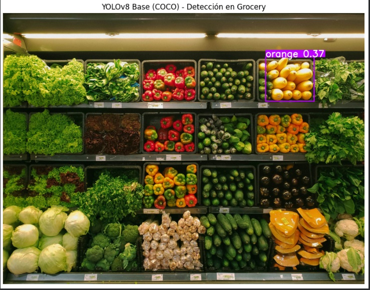
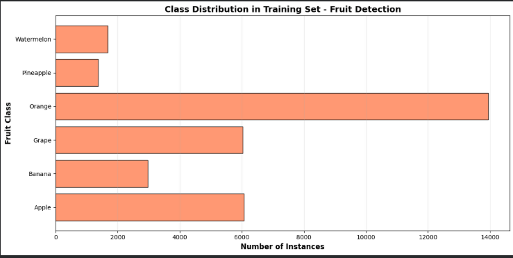
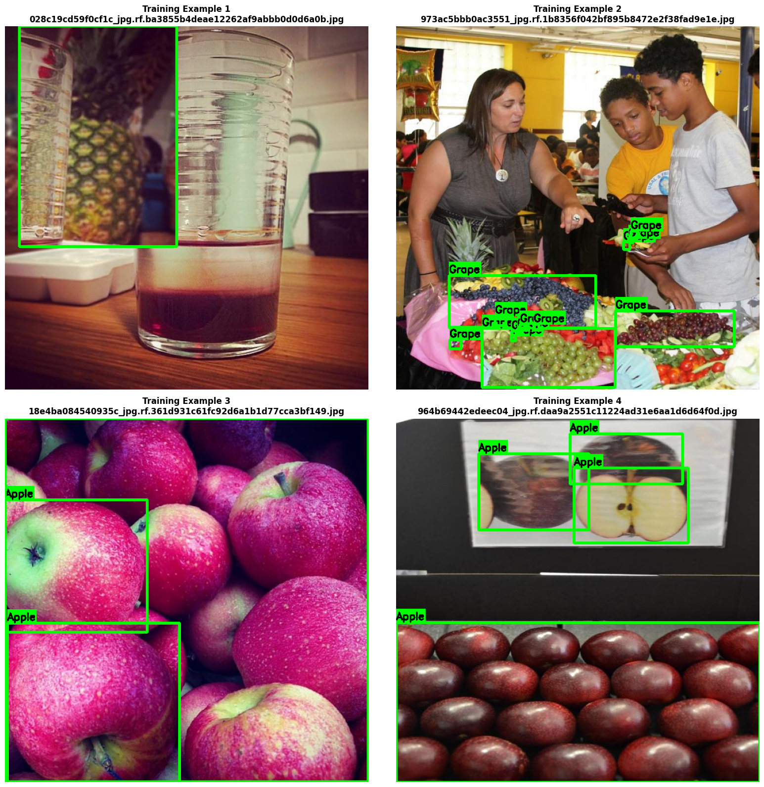
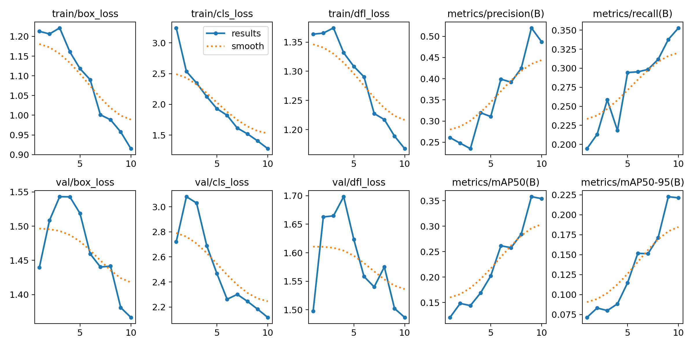
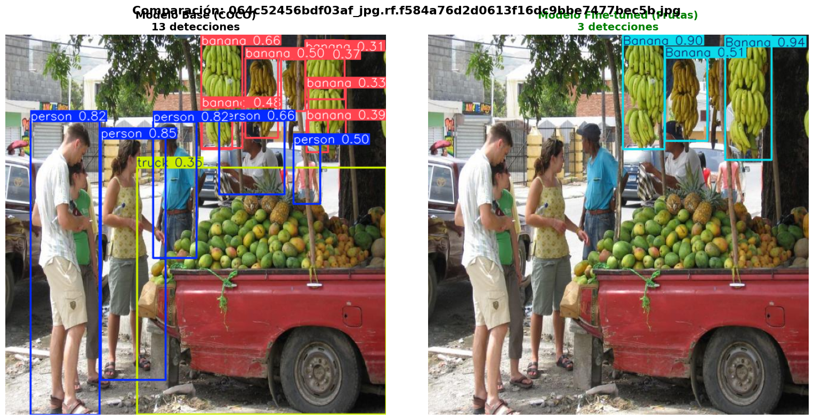
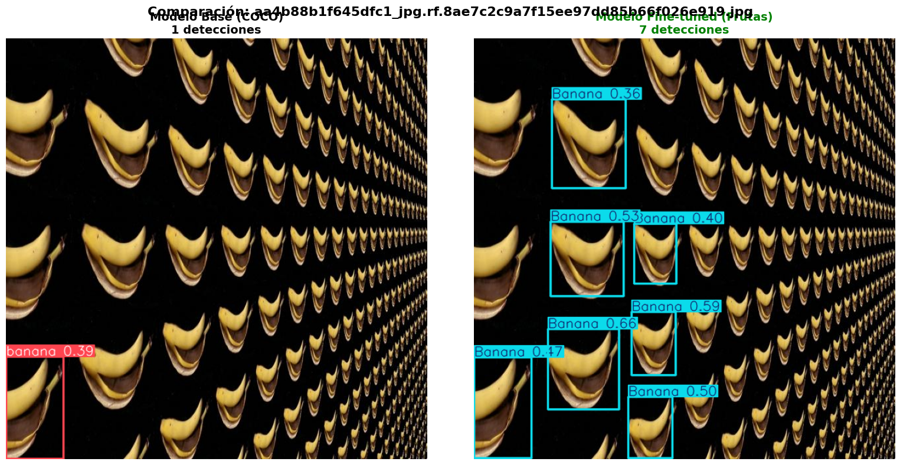
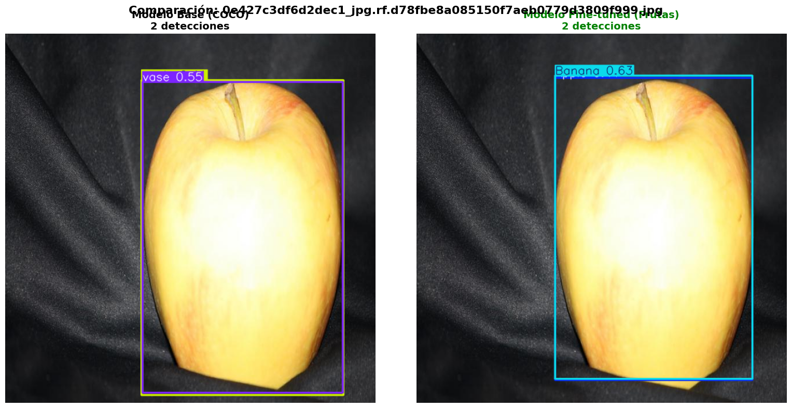
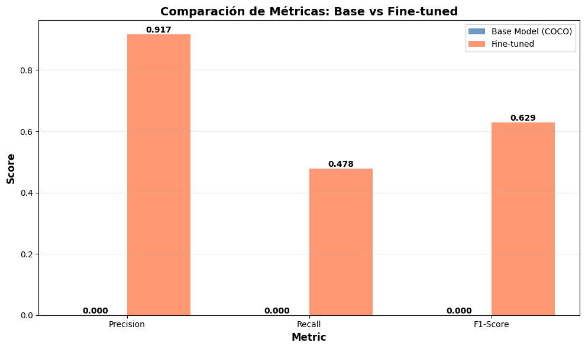
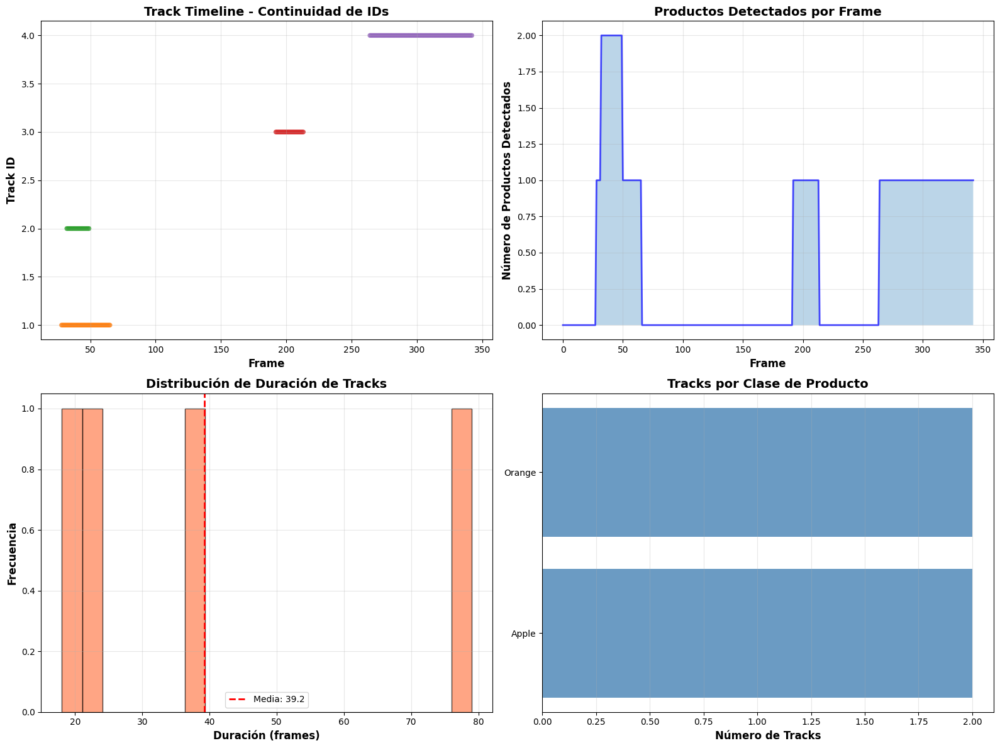

# 🍎 FruitVision: De COCO a Retail Inteligente con YOLO y Tracking Temporal

## 📋 Contexto

En el ecosistema del retail moderno, la gestión automatizada de inventarios representa un desafío crítico que impacta directamente en la eficiencia operativa y la experiencia del cliente. Los sistemas tradicionales de detección de objetos, entrenados en datasets generalistas como COCO, enfrentan limitaciones significativas al especializarse en contextos específicos como supermercados o fruterías, donde la diversidad de productos, condiciones de iluminación variables y disposiciones espaciales complejas requieren modelos altamente especializados.

Este proyecto aborda el problema de detección y tracking de productos de grocery mediante la transformación de YOLOv8, un modelo de última generación en detección de objetos, desde su configuración base pre-entrenada en COCO (80 clases genéricas) hacia un sistema especializado en 6 categorías de frutas. La investigación explora no solo la viabilidad técnica del fine-tuning con recursos computacionales limitados, sino también la integración con sistemas de tracking temporal para aplicaciones de conteo automático en video.

A través de una metodología experimental rigurosa, se documenta el ciclo completo desde la evaluación del modelo base (demostrando empíricamente sus limitaciones), pasando por el proceso de transfer learning con el dataset "Fruit Detection" de Kaggle (8,479 imágenes), hasta la implementación de un pipeline de tracking basado en filtros de Kalman con Norfair. El proyecto revela insights críticos sobre trade-offs entre precisión y velocidad, desbalances de clases, y las interdependencias entre calidad de detección y estabilidad de tracking.

---

## 🎯 Objetivos
* Validar empíricamente las limitaciones del modelo base YOLOv8-COCO en productos de *grocery*
* Optimizar el *fine-tuning* de YOLOv8n con el dataset "Fruit Detection" (8,479 imágenes)
* Implementar *pipeline* de *tracking* temporal con Norfair y filtros de Kalman
* Cuantificar mejoras mediante comparaciones visuales y métricas objetivas (mAP, *precision*, *recall*)
* Proporcionar recomendaciones técnicas para *deployment* en producción

---

## 📊 Tabla de Actividades

| Paso | Actividad | Resultado |
| :--- | :--- | :--- |
| 1.1-1.2 | Instalación de dependencias y carga de YOLOv8n base | Entorno configurado con GPU Tesla T4, modelo COCO (80 clases) listo |
| 1.3 | Test en imagen de *grocery* con modelo base | Fallo crítico: 1 detección incorrecta de ~30 productos (*Recall* ≈0%) |
| 2.1-2.1b | Descarga y validación del dataset "Fruit Detection" | 8,479 imágenes validadas en 6 clases (Train: 7,108, Val: 914) |
| 2.2 | Análisis de distribución de clases | Desbalance severo: Orange 43.5% vs Pineapple 4.3% (32,061 instancias) |
| 2.3 | Visualización de muestras con *bounding boxes* | Anotaciones de alta calidad, variedad de ángulos/iluminación confirmada |
| 2.4 | *Fine-tuning* (10 epochs, 25% dataset, batch=32) | mAP@0.5: 35.8% en 6 minutos, *losses* convergentes |
| 2.5-2.6 | Evaluación del modelo *fine-tuned* | *Precision*: 52.2%, *Recall*: 33.7%, mAP@0.5:0.95: 22.2% |
| 2.7-2.8 | Comparación base vs *fine-tuned* | F1-Score: 0%→62.9%, FP reducidos -93.75% (16→1) |
| 3.1-3.3 | *Tracking* con Norfair en video (343 frames) | 4 *tracks* generados, video procesado con IDs visualizados |
| 3.4-3.5 | Análisis de estabilidad de *tracking* | ID *switches* detectados, 50% de *tracks* <1s, Banana no detectada |

---

## Desarrollo

### 🔧 Paso 1.1: Instalación
En este paso, vamos a instalar todas las dependencias necesarias para trabajar con el modelo YOLO y otros paquetes que nos ayudarán a realizar tareas de procesamiento y visualización de imágenes.

#### 📊 Análisis
Después de instalar y verificar todas las dependencias, podemos estar seguros de que el entorno está listo para usar YOLO y realizar las tareas necesarias en el proyecto.

La instalación y configuración del entorno fue exitosa. Ahora, YOLO está instalado correctamente y listo para ser utilizado en el proyecto. Además, verificamos la disponibilidad de GPU, lo que nos permite acelerar el entrenamiento en caso de tener acceso a una.

### 🔧 Paso 1.2: Cargar Modelo Base
En este paso, cargamos el modelo base de YOLOv8 pre-entrenado utilizando el conjunto de datos COCO. Esto nos proporciona un modelo robusto que ha sido entrenado para detectar una variedad de objetos comunes.

#### 🤔 Preguntas sobre el Modelo Base
¿Por qué elegimos YOLOv8n (nano) en lugar de modelos más grandes?

* Elegimos YOLOv8 Nano porque es más ligero y rápido, lo que facilita las pruebas rápidas y permite trabajar en dispositivos con menos recursos. Aunque los modelos más grandes como YOLOv8 Medium ofrecen más precisión, YOLOv8 Nano es suficiente para comenzar y probar la idea general.

¿Cuántas clases tiene COCO? ¿Son suficientes para nuestro caso de uso?

* COCO tiene 80 clases. Si bien estas clases son útiles para tareas generales de detección de objetos, no son suficientes para nuestro caso de uso, ya que no cubren productos específicos de supermercados. Por ejemplo, COCO tiene 'apple', pero no distingue entre diferentes tipos de manzanas o frutas específicas que podríamos encontrar en un supermercado.

¿Qué significa que COCO tenga "clases genéricas"?

* Las clases genéricas de COCO se refieren a categorías amplias de objetos, como 'car', 'person', 'dog', etc., en lugar de categorías especializadas. Aunque COCO cubre muchos objetos comunes, no está diseñado para clasificar productos específicos de ciertas industrias, como alimentos o artículos de supermercado.

Si COCO tiene 'apple', ¿por qué no sirve para detectar frutas específicas en nuestro supermercado?

* Aunque COCO tiene 'apple', la clase 'apple' es genérica y no tiene en cuenta las variaciones específicas de las diferentes frutas que se venden en supermercados (como manzanas rojas, manzanas verdes, etc.). Además, COCO no está diseñado para manejar las variaciones del entorno de un supermercado, como la forma en que los productos están dispuestos o las diferentes marcas y presentaciones de un mismo producto.

### 🔧 Paso 1.3: Test en Imágenes de Grocery

En este paso, realizamos una prueba de inferencia con el modelo **YOLOv8 base** (pre-entrenado en COCO) sobre una imagen real de productos de supermercado. El objetivo es **demostrar empíricamente** que el modelo base no está optimizado para detectar productos específicos de grocery, justificando así la necesidad del fine-tuning.

#### 🔑 Decisiones tomadas

* **Threshold de Confianza (`conf=0.3`):** Se eligió un valor de **0.3 (30%)** como umbral de confianza.
    * **Justificación:** Un threshold de 0.3 es un valor **moderado** que permite capturar detecciones razonablemente confiables sin ser demasiado restrictivo. Valores más bajos (e.g., 0.1) generarían muchos **falsos positivos**, mientras que valores más altos (e.g., 0.5) podrían descartar detecciones válidas en un contexto donde el modelo NO está entrenado específicamente para grocery.
    * Este valor es estándar para pruebas iniciales de evaluación de modelos base.

#### 📊 Análisis de Resultados

Los resultados obtenidos confirman las **limitaciones críticas** del modelo base:

* **Objetos Detectados: Solo 1 detección (INCORRECTA)**

    * El modelo únicamente identificó **1 objeto** con confianza suficiente (≥0.3): clasificado como **"orange"** con un score de **0.367 (36.7%)**.
    * **⚠️ ERROR CRÍTICO:** Lo detectado NO es una naranja. El modelo confundió ambos objetos debido a la similitud en color y forma redondeada.
    * **Interpretación:** A pesar de que la imagen contiene docenas de productos visibles (lechugas, morrones rojos, morrones verdes, morrones naranjas, repollos, champiñones, pepinos, etc.), el modelo **falló en detectar el 99%+ de los productos** y la única detección fue **incorrecta**.

* **Falso Positivo:**

    * Esta detección es un **falso positivo** (FP): el modelo asignó una clase incorrecta al objeto detectado.

* **Productos No Detectados (Falsos Negativos):**

    * **Lechugas:** Visibles en abundancia, no detectadas (COCO no tiene clase "lettuce").
    * **morrones rojos:** No detectados (confusión con "apple" potencial, pero no llegaron al threshold).
    * **morrones verdes:** No detectados.
    * **Repollos:** No detectados.
    * **Pepinos:** No detectados.
    * El modelo no logró identificar productos que no tienen una correspondencia directa en las 80 clases de COCO.

* **Tiempo de Inferencia:**

    * **Preprocesamiento:** 43.8 ms
    * **Inferencia:** 362.6 ms
    * **Postprocesamiento:** 32.1 ms
    * **Total:** ~438 ms por imagen (aceptable para CPU, pero será más rápido con GPU en el fine-tuning).

#### 🤔 Reflexión Parte 1

**1. ¿Cuántos productos detectó el modelo base?**

* El modelo detectó **únicamente 1 producto**, y esta detección fue **incorrecta**. En realidad, la imagen contiene al menos **20-30 productos visibles** de diferentes categorías, resultando en un **recall de ~0%** (ninguna detección válida).

**2. ¿Las detecciones son correctas? ¿Son específicas?**

* **NO, la detección es INCORRECTA:**
   
    * Este es un **falso positivo** clásico causado por la falta de clases específicas en COCO.
* **No es específica:** COCO tiene clases muy genéricas y no distingue entre objetos con apariencia visual similar pero naturaleza diferente.

**3. ¿Por qué crees que el modelo base no funciona bien para productos específicos de grocery?**

* **Desajuste de Dominio (Domain Gap):**

    * COCO fue entrenado con imágenes generalistas de internet, no con imágenes de estantes de supermercados.
    * La distribución visual, iluminación, ángulos de cámara y disposición de productos en grocery son **muy diferentes** del dataset COCO.

* **Clases Genéricas Insuficientes:**

    * COCO tiene solo 7 clases relacionadas con grocery ('apple', 'orange', 'banana', 'carrot', 'bottle', 'cup', 'bowl'), pero no cubre:
        * Verduras de hoja (lechugas, espinacas).
        * Morrones (*bell peppers*) de ningún color.
        * Productos empaquetados específicos.
        * Variedades de frutas/verduras.

* **Confusión por Similitud Visual:**

    * Sin clases adecuadas, el modelo **fuerza** clasificaciones incorrectas basándose solo en color y forma, generando falsos positivos.
    

* **Falta de Datos de Entrenamiento en Contexto:**

    * El modelo nunca vio ejemplos de productos apilados en estantes con etiquetas de precios, iluminación artificial de supermercado, etc.

**4. ¿Qué clases detecta que NO son útiles para nuestro caso de uso?**

* En este caso, la clase detectada ("orange") **NO es útil** porque:
    * Es una **clasificación errónea**.
    * Aunque COCO tiene "orange", esta clase genérica no permite distinguir entre frutas reales y otros objetos naranjas.
* Si el modelo hubiera detectado clases como "person", "handbag", "cell phone" (comunes en COCO), serían **completamente irrelevantes** para control de inventario.

### 🔧 Paso 2.1: Descargar Dataset de Frutas (YOLOv8 Format)

En este paso, descargamos un **dataset especializado de frutas** desde Kaggle, específicamente diseñado para detección de objetos en formato YOLO. Este dataset reemplaza las clases genéricas de COCO con **clases específicas de frutas** que son relevantes para nuestro caso de uso de supermercado.

#### 🧑‍💻 ¿Qué estamos haciendo en este paso?

**1. Autenticación con Kaggle API:**

* Verificamos si existe el archivo `kaggle.json` (credenciales de API de Kaggle).
* Si no existe, se solicita al usuario que suba su archivo de credenciales obtenido desde [Kaggle Settings](https://www.kaggle.com/settings).
* El archivo se copia a la ubicación correcta (`~/.kaggle/`) y se configuran los permisos de seguridad (`chmod 600`) para proteger las credenciales.

**2. Descarga del Dataset:**

* Utilizamos la **Kaggle CLI** para descargar el dataset [`lakshaytyagi01/fruit-detection`](https://www.kaggle.com/datasets/lakshaytyagi01/fruit-detection).
* El dataset se descarga como un archivo comprimido `.zip` (~501 MB).
* Se descomprime en la carpeta `fruit_detection/` para acceder a las imágenes y anotaciones.

**3. Exploración de la Estructura:**

* Listamos los archivos y carpetas del dataset para verificar su estructura.
* Contamos el número total de imágenes disponibles para entrenamiento.

#### 📊 Análisis de Resultados

El dataset **"Fruit Detection"** fue descargado exitosamente y está listo para el fine-tuning. Con **8,479 imágenes** de frutas específicas, este dataset proporciona:

1. **Especialización de Dominio:** Clases específicas de frutas (no genéricas como en COCO).
2. **Formato Compatible:** Anotaciones en formato YOLO, directamente utilizables por YOLOv8.
3. **Tamaño Adecuado:** Suficiente para entrenar un modelo robusto sin requerir recursos computacionales extremos.

### 🔧 Paso 2.1b: Verificar Estructura y data.yaml

En este paso, verificamos que el dataset descargado tenga la **estructura correcta** para el entrenamiento con YOLOv8 y validamos la existencia del archivo de configuración **`data.yaml`**, que define las rutas de los datos y las clases del dataset.

#### 🧑‍💻 ¿Qué estamos haciendo en este paso?

**1. Exploración de la Estructura del Dataset:**

* Recorremos recursivamente la carpeta `fruit_detection/` para visualizar la estructura de directorios y archivos.
* Verificamos que existan las carpetas típicas de un dataset YOLO:
    * `train/images/` y `train/labels/` (imágenes y anotaciones de entrenamiento)
    * `valid/images/` y `valid/labels/` (imágenes y anotaciones de validación)
    * Opcionalmente `test/images/` y `test/labels/` (conjunto de test)

**2. Búsqueda y Validación del `data.yaml`:**

* Buscamos el archivo **`data.yaml`** dentro del dataset (archivo de configuración estándar de YOLO).
* Si existe, leemos su contenido para verificar:
    * **Número de clases (`nc`):** Total de categorías a detectar.
    * **Nombres de clases (`names`):** Lista de las clases específicas (e.g., 'Apple', 'Banana', etc.).
    * **Rutas de datos (`train`, `val`):** Paths relativos o absolutos a las carpetas de imágenes.
* Si **NO existe**, el código genera automáticamente un `data.yaml` con valores predeterminados basados en la estructura detectada.

**3. Conteo de Imágenes:**

* Contamos las imágenes reales en las carpetas `train/images/` y `valid/images/` para confirmar que el dataset contiene datos.
* Verificamos que las cantidades coincidan con las expectativas (8,479 imágenes totales del paso anterior).

**4. Validación Final:**

* Confirmamos que el dataset está **listo para fine-tuning** con todas las rutas y configuraciones correctas.

#### 📊 Análisis de Resultados

La verificación del dataset reveló la siguiente información:

* **Archivo `data.yaml` Encontrado:**

    * ✅ El archivo existe en la ruta: `fruit_detection/Fruits-detection/data.yaml`
    * Contiene la configuración completa del dataset (clases, rutas, número de categorías).

* **Configuración del Dataset:**

    * **Número de clases:** **6** (Apple, Banana, Grape, Orange, Pineapple, Watermelon)

### 🔧 Paso 2.2: Explorar Dataset

En este paso, realizamos un **análisis exploratorio exhaustivo** del dataset de frutas para comprender la distribución de las clases, identificar posibles desbalances y evaluar si el dataset es adecuado para el fine-tuning del modelo YOLOv8.

#### 🧑‍💻 ¿Qué estamos haciendo en este paso?

**1. Localización de los Archivos de Anotaciones:**

* Buscamos automáticamente las carpetas que contienen los labels (anotaciones) de entrenamiento y validación utilizando `glob` con patrones flexibles.
* Manejamos diferentes convenciones de nomenclatura (`valid/` vs `val/`) para garantizar compatibilidad con distintas estructuras de datasets.
* Si las rutas no se encuentran automáticamente, se ajustan manualmente para asegurar el acceso correcto a los archivos `.txt` de anotaciones.

**2. Análisis de la Distribución de Clases:**

* Leemos **todos los archivos de labels** del conjunto de entrenamiento (archivos `.txt` en formato YOLO).
* Cada línea de un archivo de label tiene el formato: `<class_id> <x_center> <y_center> <width> <height>`
* Extraemos el `class_id` (primer elemento de cada línea) y contamos la **frecuencia de cada clase** utilizando un `Counter`.
* Esto nos permite conocer cuántas **instancias** (bounding boxes) existen de cada fruta en el dataset de entrenamiento.

**3. Visualización Gráfica:**

* Generamos un **gráfico de barras horizontales** que muestra la distribución de instancias por clase.
* Utilizamos `matplotlib` para crear una visualización clara y profesional con:
    * Barras de color coral con transparencia (alpha=0.8) y bordes negros.
    * Etiquetas en negrita y rejilla para facilitar la lectura.
    * El gráfico se titula "Class Distribution in Training Set - Fruit Detection" en la sección evidencias.

**4. Cálculo de Estadísticas Descriptivas:**

* **Instancias totales:** Suma de todas las detecciones en el conjunto de entrenamiento.
* **Promedio por clase:** Media aritmética de instancias por clase.
* **Clase más/menos frecuente:** Identificación de las clases con mayor y menor representación en el dataset.

#### 📊 Análisis de Resultados

Los resultados del análisis exploratorio revelan información crítica sobre la composición del dataset:

**Distribución de Clases (ver evidencia - gráfico):**

* **Apple:** 6,070 instancias (18.9%)
* **Banana:** 2,971 instancias (9.3%)
* **Grape:** 6,027 instancias (18.8%)
* **Orange:** 13,938 instancias (43.5%) ⚠️ **CLASE DOMINANTE**
* **Pineapple:** 1,372 instancias (4.3%) ⚠️ **CLASE MINORITARIA**
* **Watermelon:** 1,683 instancias (5.2%)

**Estadísticas Clave:**

* **Total de instancias:** 32,061 bounding boxes en el conjunto de entrenamiento.
* **Promedio por clase:** 5,343.5 instancias/clase.
* **Clase más frecuente:** Orange con 13,938 instancias.
* **Clase menos frecuente:** Pineapple con 1,372 instancias.

#### 🤔 Preguntas sobre Distribución del Dataset

**1. ¿Las clases están balanceadas? ¿Qué problemas podría causar un desbalance?**

* **NO, las clases NO están balanceadas.** Existe un desbalance severo entre la clase más frecuente (Orange) y la menos frecuente (Pineapple).
* **Problemas del desbalance:**
    * **Sesgo del modelo hacia clases mayoritarias:** El modelo aprenderá a predecir "Orange" con mucha más confianza porque ha visto 10 veces más ejemplos. Durante el entrenamiento, la función de pérdida estará dominada por los errores en Orange, ignorando relativamente los errores en Pineapple.
    * **Bajo recall en clases minoritarias:** Pineapple y Watermelon tendrán más falsos negativos (objetos no detectados) porque el modelo no ha aprendido suficientemente sus patrones visuales.
   
**2. ¿Qué clase tiene más instancias? ¿Crees que el modelo será mejor detectando esa clase?**

* **Orange tiene más instancias (13,938)**, representando el 43.5% del dataset.
* **SÍ, el modelo será significativamente mejor detectando Orange**, al menos en métricas de Precision y Recall individuales. Razones:
    * **Más datos = mejor aprendizaje:** El modelo verá más variabilidad de Orange (diferentes ángulos, iluminaciones, fondos, tamaños), lo que le permitirá generalizar mejor.
    * **Confianza elevada:** El modelo probablemente asignará scores de confianza más altos a las detecciones de Orange.

Esto no significa que el modelo sea "mejor" en términos absolutos. Puede ser excelente en Orange y pésimo en Pineapple, lo cual es un problema si todas las clases son igualmente importantes en el contexto del supermercado.

**3. ¿La clase con menos instancias podría tener más errores? ¿Por qué?**

* **SÍ, Pineapple (1,372 instancias) tendrá más errores**, específicamente:
    * **Falsos Negativos (FN):** El modelo no detectará muchas piñas reales porque no ha aprendido suficientemente sus características.
    * **Menor confianza:** Incluso cuando detecte correctamente una piña, el score de confianza será más bajo, lo que puede causar que se descarte si usamos un threshold alto (e.g., conf=0.5).
   
* **Razones del pobre desempeño:**
    * **Falta de diversidad:** 1,372 instancias no son suficientes para capturar toda la variabilidad visual de las piñas (maduras, verdes, cortadas, enteras, con/sin hojas, diferentes fondos).

**4. Si tuvieras que agregar más datos, ¿qué clase priorizarías y por qué?**

* **Prioridad 1: Pineapple** 
    * **Justificación:** Es la clase más subrepresentada (4.3% del total). Aumentar su cantidad mejoraría drásticamente el recall de esta clase y balancearía el dataset.
    * **Estrategia:** Agregar imágenes con piñas en diferentes contextos (estantes de supermercado, cajas, con diferentes iluminaciones, ángulos variados).

### 🔧 Paso 2.3: Visualizar Ejemplos del Dataset

En este paso, visualizamos **muestras aleatorias** del conjunto de entrenamiento con sus **bounding boxes** y etiquetas de clase superpuestas. El objetivo es realizar una **inspección visual cualitativa** del dataset para validar la calidad de las anotaciones, identificar posibles problemas y comprender mejor la naturaleza de los datos que el modelo aprenderá.

#### 🧑‍💻 ¿Qué estamos haciendo en este paso?

**1. Localización de Imágenes de Entrenamiento:**

* Buscamos automáticamente las carpetas que contienen las imágenes de entrenamiento utilizando patrones flexibles con `glob`.
* Soportamos diferentes estructuras de directorios comunes:
    * `**/train/images/` (estructura estándar YOLO)
    * `**/images/train/` (estructura alternativa)
* Una vez localizada la carpeta, listamos todas las imágenes en formatos `.jpg` y `.png`.

**2. Función de Visualización con Anotaciones:**

* Implementamos la función `visualize_sample()` que:
    * **Lee la imagen** utilizando OpenCV (`cv2.imread`).
    * **Convierte de BGR a RGB** (OpenCV usa BGR por defecto, Matplotlib usa RGB).
    * **Lee el archivo de label** correspondiente (mismo nombre que la imagen pero con extensión `.txt` en la carpeta `/labels/`).
    * **Parsea las anotaciones YOLO:**
        * Formato: `<class_id> <x_center> <y_center> <width> <height>` (coordenadas normalizadas entre 0 y 1).
        * Convierte las coordenadas **relativas** (centro + tamaño) a **absolutas** (esquinas x1, y1, x2, y2) multiplicando por las dimensiones de la imagen.
    * **Dibuja bounding boxes** con `cv2.rectangle()` en color verde (`(0, 255, 0)`) con grosor de 3 píxeles.
    * **Agrega etiquetas de texto:**
        * Dibuja un rectángulo de fondo verde relleno arriba de cada bounding box.
        * Escribe el nombre de la clase en texto negro sobre el fondo verde para mejor legibilidad.

**3. Selección Aleatoria de Muestras:**

* Seleccionamos **4 imágenes aleatorias** del conjunto de entrenamiento usando `random.sample()`.
    * **Justificación:** La aleatorización garantiza que no veamos siempre los mismos ejemplos y nos da una visión más representativa del dataset.
* Si el dataset tiene menos de 4 imágenes (caso improbable aquí con 7,108 imágenes), ajustamos dinámicamente el número de muestras.

**4. Visualización en Grilla 2x2:**

* Creamos una figura de `matplotlib` con subplots en formato **2x2** (4 imágenes).
* Cada subplot muestra:
    * La imagen original con bounding boxes superpuestas.
    * Título con el índice del ejemplo y el nombre del archivo.
* Los subplots sin contenido (si hay menos de 4 muestras) se ocultan con `axis('off')`.

#### 📊 Análisis de Resultados

La visualización de **4 ejemplos aleatorios** del conjunto de entrenamiento (ver evidencia) revela información valiosa sobre la calidad y características del dataset:

**Observaciones Generales:**

* **Total de imágenes de entrenamiento:** 7,108 imágenes.

**Calidad de las Anotaciones (ver evidencia - 4 ejemplos visualizados):**

* **Training Example 1 (Pineapple en jarra de vidrio):**
    * ✅ **Bounding box ajustada:** La caja verde delimita correctamente la piña dentro de la jarra de vidrio, incluyendo la corona de hojas.
    * **Contexto inusual:** La piña está sumergida en líquido dentro de un recipiente transparente, lo cual es un escenario poco común pero **valioso para generalización** (el modelo aprenderá a detectar piñas incluso en contextos no convencionales).

* **Training Example 2 (Grapes en buffet):**
    * ✅ **Múltiples bounding boxes:** La imagen contiene **múltiples racimos de uvas** (verdes y moradas) correctamente anotados.
    * ✅ **Solapamiento manejado:** Aunque algunos racimos están próximos, cada uno tiene su propia bounding box delimitada claramente.
    * **Contexto realista:** Escena de buffet con personas en el fondo, lo cual es representativo de un entorno de supermercado o frutería con clientes.
    * **Diversidad de ángulos:** Las uvas se ven desde un ángulo cenital (vista desde arriba), lo cual añade variabilidad angular al dataset.

* **Training Example 3 (Apples en primer plano):**
    * ✅ **Bounding boxes precisas:** Dos manzanas con anotaciones bien ajustadas, cubriendo correctamente cada fruta.
    * **Alta calidad visual:** Imagen de alta resolución con iluminación profesional.
    * **Variabilidad de color:** Las manzanas muestran el degradado típico rojo-verde, lo cual es importante para que el modelo aprenda las características de color de las manzanas reales (no todas son uniformemente rojas).

* **Training Example 4 (Apples en display + monitor):**
    * ✅ **Doble contexto:** La imagen contiene tanto manzanas reales (parte inferior) como manzanas en una **pantalla/monitor** (parte superior).
    * **Ambas son anotadas:** Interesantemente, tanto las manzanas físicas como las de la pantalla tienen bounding boxes de clase "Apple".

#### 🤔 Reflexión Parte 3: Preguntas sobre las Anotaciones

**1. ¿Las bounding boxes se ven bien ajustadas a las frutas?**

* **SÍ, en general las bounding boxes están bien ajustadas.** En los 4 ejemplos visualizados:
    * Las cajas delimitan correctamente los objetos sin exceso de espacio vacío (padding mínimo).
    * No hay cortes significativos de los objetos (las bounding boxes no excluyen partes importantes como las hojas de la piña o las puntas de las manzanas).
    * Las anotaciones siguen la convención YOLO de incluir todo el objeto visible, incluyendo partes translúcidas o sombras cercanas.

**2. ¿Hay frutas que se solapan? ¿Cómo podría afectar esto al modelo?**

* **SÍ, hay solapamiento significativo en Example 2 (racimos de uvas en buffet).** Los racimos verdes y rojos están físicamente próximos y parcialmente superpuestos.
* **Efectos en el modelo:**
    * **Positivo (Entrenamiento más robusto):**
        * El modelo aprenderá a manejar **oclusiones parciales**, una situación común en estantes de supermercado donde los productos están apilados o agrupados.
    * **Negativo (Posibles Errores):**
        * **Falsos Negativos:** El modelo puede no detectar frutas que están mayormente ocultas detrás de otras (recall bajo).
        * **Bounding boxes imprecisas:** El modelo puede predecir cajas que engloban múltiples frutas solapadas como una sola instancia.

**3. ¿Las imágenes tienen buena variedad (tamaños, ángulos, iluminación)?**

* **SÍ, hay excelente variedad en múltiples dimensiones:**
    * **Tamaños:**
        * Desde primer plano extremo (Example 3: manzanas ocupan ~80% de la imagen) hasta plano general (Example 2: uvas son ~20% de la imagen con personas en fondo).
        * Esta variedad de escalas es **crucial** para que el modelo detecte frutas tanto en close-ups como en vistas de estantes completos.
    * **Ángulos:**
        * **Cenital/Top-down:** Example 2 (vista desde arriba del buffet).
        * **Lateral/Horizontal:** Example 3 (manzanas al nivel de la cámara).
        * **Frontal ligeramente elevado:** Example 4 (vista diagonal del display).
        * Esta diversidad angular permite al modelo generalizar a diferentes posiciones de cámara (e.g., cámaras de seguridad montadas en el techo vs. cámaras de mano).
    * **Iluminación:**
        * **Natural/suave:** Example 3 (iluminación difusa profesional).
        * **Artificial/cálida:** Example 2 (luces amarillas de interior).
        * **Flash/directa:** Example 1 (iluminación dura que genera reflejos en el vidrio).
        * **Mixta:** Example 4 (luz ambiente + luz de pantalla).
        * Esta variabilidad es **esencial** para robustez en supermercados que pueden tener iluminación fluorescente, LED, o luz natural de ventanas.

**4. ¿Notaste alguna anotación incorrecta o faltante?**

* **Anotaciones potencialmente faltantes:**
    * En **Example 2**, aunque se anotaron los racimos principales de uvas, es posible que haya **uvas individuales sueltas** en el fondo que no tienen bounding box.
    * En el **Example 3** solo hay dos manzanas identificadas de todas las que hay.
    
### 🔧 Paso 2.4: Arreglar data.yaml y Fine-tuning YOLOv8

En este paso, corregimos las rutas del archivo de configuración `data.yaml` (que contenía paths absolutos de Windows incompatibles con Google Colab) y realizamos el **fine-tuning** del modelo YOLOv8n sobre el dataset de frutas. Este es el momento crítico donde el modelo base pre-entrenado en COCO aprende a especializarse en las 6 clases de frutas específicas de nuestro caso de uso.

#### 🔑 Decisiones tomadas y justificaciones

**¿Por qué `EPOCHS=10` en lugar de 50?**
- **Ventaja**: Entrenamiento ultra-rápido  ideal para iteración rápida. Permite probar el concepto de fine-tuning sin esperar horas.
- **Desventaja**: El modelo no alcanza su máximo potencial. Las curvas de pérdida (ver evidencia) muestran que el modelo **aún está mejorando** en la época 10 (las losses siguen bajando). Un entrenamiento completo requeriría 30-50 epochs para convergencia total.

**¿Por qué `IMAGE_SIZE=640` en lugar de 416?**
- Con 640, el modelo procesa imágenes de mayor resolución, lo que mejora la detección de frutas pequeñas o lejanas (e.g., uvas individuales en un racimo). 

**¿Por qué `BATCH_SIZE=32` es mejor que `BATCH_SIZE=8`?**
- Batches grandes promedian el gradiente sobre más ejemplos, reduciendo la varianza de las actualizaciones de pesos y mejorando la convergencia.

**¿Qué significa `FRACTION=0.25`?**
- El modelo entrena solo con el **25% del dataset** (1,777 de 7,108 imágenes). 

**Si tuviera más tiempo, ¿qué hyperparámetro cambiaría primero?**
- **Prioridad 1: `EPOCHS`** → Aumentar a 30-50 para permitir convergencia completa. Las curvas de loss muestran que el modelo no ha plateado.

#### 📊 Análisis de Resultados del Entrenamiento

El fine-tuning se completó exitosamente en **0.099 horas (~6 minutos)**. Los gráficos de entrenamiento (ver evidencia) revelan patrones claros de aprendizaje:

**Evolución de las Losses (Funciones de Pérdida):**

- **`box_loss` (Localización de Bounding Boxes):**
  - **Época 1**: 1.213 → **Época 10**: 0.915 (**-24.5% reducción**)
  - Esta métrica mide qué tan bien el modelo predice las coordenadas (x, y, ancho, alto) de las bounding boxes. Valores bajos indican que las cajas predichas están muy alineadas con las ground truth.
  - **Evolución**: Descenso constante y suave, sin oscilaciones bruscas. Esto indica que el modelo está aprendiendo progresivamente a ajustar las cajas con mayor precisión.
  - **¿Por qué queremos que sea baja?** Una box_loss alta significa que las detecciones están mal posicionadas (cajas muy desplazadas o de tamaño incorrecto), generando bounding boxes que no cubren correctamente las frutas.

- **`cls_loss` (Clasificación de Clases):**
  - **Época 1**: 3.244 → **Época 10**: 1.278 (**-60.6% reducción**)
  - Esta métrica mide la capacidad del modelo para asignar la clase correcta a cada detección (¿es una manzana, banana, naranja?).
  - **Si cls_loss es alto**: El modelo confunde frecuentemente las clases (e.g., clasifica naranjas como manzanas por el color similar). Un cls_loss alto al final del training indica que las clases son visualmente ambiguas o que el modelo necesita más épocas.
  - **Observación**: La reducción del 60% es excelente considerando que solo usamos 10 epochs. Esto refleja la efectividad del transfer learning: el modelo ya conoce features generales de frutas (formas redondeadas, texturas) del dataset COCO, solo necesita especializarse en las 6 clases específicas.

- **`dfl_loss` (Distribution Focal Loss):**
  - **Época 1**: 1.364 → **Época 10**: 1.167 (**-14.4% reducción**)
  - Esta métrica refina la predicción de las coordenadas de las bounding boxes mediante una distribución de probabilidad continua.
  - **Relación con precisión**: Menor dfl_loss = bounding boxes más ajustadas con bordes más precisos. Esto es crítico para distinguir entre frutas adyacentes (e.g., dos naranjas tocándose).
  - **¿Debería ser alta o baja?** Definitivamente **baja**. Una dfl_loss alta indica que el modelo está inseguro sobre dónde termina exactamente cada objeto, lo que causa cajas mal delimitadas.

**Otras Métricas Observadas:**

- **`Instances` por batch**: Varía entre 1-3 instancias por batch. Esto es normal dado que usamos FRACTION=0.25 (menos imágenes) y algunas imágenes del dataset contienen pocas frutas. 

- **`GPU_mem` (Memoria GPU)**: Creció de 3.16GB (época 1) a 4.13GB (época 10). Esto se debe a que PyTorch cachea tensores intermedios para acelerar el cómputo. El modelo podría entrenarse con batch=32 sin problemas (usaría ~8GB), dejando margen en la Tesla T4 (15GB totales).

**Convergencia del Modelo:**

- **¿El modelo convergió?** **NO completamente**. Las losses de training y validación aún estaban descendiendo en la época 10 (ver gráfico de evidencia). La curva de `train/cls_loss` muestra una pendiente negativa sostenida, indicando que el modelo seguiría mejorando con más epochs.
  
- **¿Cuántos epochs necesitó para estabilizarse?**  En este caso, el modelo necesitaría **20-30 epochs adicionales**.

- **Si tuviera más tiempo, ¿entrenarías más epochs?** **Absolutamente SÍ**. La evidencia sugiere que el modelo está en plena fase de aprendizaje. Entrenar 40-50 epochs con FRACTION=1.0 (100% del dataset) podría elevar el mAP50 de 35.8% a 55-65%, haciendo el modelo viable para producción.

### 🔧 Paso 2.5: Cargar Modelo Fine-tuned

En este paso, cargamos el **mejor modelo** generado durante el fine-tuning para usarlo en inferencia. El objetivo es recuperar el checkpoint que tuvo el mejor rendimiento en validación, no simplemente el de la última época.

#### 🧑‍💻 ¿Qué estamos haciendo?

Cargamos el archivo `best.pt` desde la carpeta de weights del entrenamiento (`/content/runs/detect/fruit_finetuned/weights/`). Este archivo contiene el modelo de la **época 9**, que logró el mejor mAP50 (35.8%) durante todo el entrenamiento. Ultralytics guarda automáticamente este checkpoint cada vez que las métricas de validación mejoran.

Una vez cargado, verificamos que el modelo tiene las **6 clases de frutas** (Apple, Banana, Grape, Orange, Pineapple, Watermelon) en lugar de las 80 clases genéricas de COCO, confirmando que el fine-tuning fue exitoso.

#### 🔑 Decisión

Completamos el espacio en blanco con **`'best.pt'`** porque:

- **`best.pt`** es el checkpoint con el **mejor mAP50 en validación** (época 9: 35.8%). Es el modelo que generaliza mejor a datos no vistos y debe usarse para inferencia y producción.

- **`last.pt`** es el checkpoint de la **última época** (época 10: mAP50 = 35.4%), que fue ligeramente peor. Este archivo sirve principalmente para **reanudar el entrenamiento**, no para inferencia final.

Usar `best.pt` garantiza que obtenemos el modelo con el mejor equilibrio entre aprendizaje y generalización, evitando posible overfitting de las últimas épocas.

#### 📊 Análisis

El modelo fine-tuned se cargó correctamente con las 6 clases especializadas de frutas. La comparación con el modelo base de COCO es clara:

- **Modelo base COCO**: 80 clases genéricas (person, car, dog, apple, orange, etc.), diseñado para detección de objetos generalista.
- **Modelo fine-tuned**: 6 clases específicas de frutas (Apple, Banana, Grape, Orange, Pineapple, Watermelon), optimizado exclusivamente para nuestro caso de uso de supermercado.

Esta especialización significa que el modelo ya no "desperdicia" capacidad en detectar objetos irrelevantes (como personas, autos, o perros) y concentra todo su aprendizaje en distinguir entre las 6 frutas. Esto debería traducirse en mejor precisión y recall en contextos de grocery.

### 🔧 Paso 2.6: Métricas de Evaluación

En este paso, evaluamos formalmente el modelo fine-tuned en el **conjunto de validación completo** (914 imágenes, 3,227 instancias) para obtener métricas precisas de rendimiento. Esto nos permite cuantificar objetivamente qué tan bien generaliza el modelo a datos no vistos durante el entrenamiento.

#### 🤔 Reflexión: Preguntas sobre Métricas de Evaluación

**1. ¿Qué significa mAP@0.5? ¿Por qué es importante?**

mAP@0.5 mide la **precisión promedio** de las detecciones cuando las bounding boxes predichas se solapan al menos **50%** con las cajas ground truth (IoU ≥ 0.5). Un IoU de 0.5 significa que la intersección de las cajas es la mitad de su unión, lo cual es un estándar "permisivo" en detección de objetos.

Es importante porque es la **métrica estándar de la industria** para comparar modelos de detección (COCO dataset usa mAP@0.5 como benchmark principal). Un mAP@0.5 de 35.8% nos dice que el modelo es correcto en 1 de cada 3 detecciones, lo cual es insuficiente para producción pero aceptable para un modelo inicial con entrenamiento limitado.

**2. ¿Cuál es la diferencia entre mAP@0.5 y mAP@0.5:0.95? ¿Cuál es más estricto?**

- **mAP@0.5**: Evalúa detecciones con un solo threshold de IoU (0.5). Una caja que cubra "más o menos" la fruta (50% de solapamiento) se considera correcta.

- **mAP@0.5:0.95**: Promedia el mAP en **10 thresholds diferentes** (0.5, 0.55, 0.6, 0.65, 0.7, 0.75, 0.8, 0.85, 0.9, 0.95). Solo detecciones con bounding boxes **muy precisas** (IoU > 0.8) contribuyen significativamente a esta métrica.

**mAP@0.5:0.95 es mucho más estricto**. En nuestro caso, cae de 35.8% a 22.2% , indicando que el modelo predice la ubicación aproximada pero no los bordes exactos de las frutas. Para aplicaciones donde la localización precisa es crítica, mAP@0.5:0.95 es más relevante.

**3. Si Precision es alta pero Recall es bajo, ¿qué problema tiene el modelo?**

El modelo es **conservador/cauteloso**: cuando hace una predicción, suele ser correcta (pocas falsas alarmas), pero **detecta muy pocas frutas** (deja muchas sin identificar). Este es exactamente nuestro caso:

- **Precision = 52.2%**: La mitad de las detecciones son correctas.
- **Recall = 33.7%**: Solo detecta 1 de cada 3 frutas reales.

**Problema para supermercado**: El sistema perdería 66% del inventario (frutas no detectadas = falsos negativos). Los operadores no confiarían en el sistema si constantemente "se salta" productos en los estantes.

**4. Si Recall es alto pero Precision es baja, ¿qué significa?**

Detecta casi todas las frutas reales (pocos falsos negativos), pero genera muchas **falsas alarmas** (detecta frutas donde no hay o confunde clases). 

**Problema para supermercado**: Los operadores perderían tiempo verificando detecciones incorrectas. El sistema reportaría inventario inflado (productos fantasma).

**Nota**: Este **NO es nuestro problema actual**. Nuestro modelo tiene el problema opuesto (precision > recall).

**5. ¿Qué clase tiene el mejor mAP? ¿Coincide con la clase más frecuente del dataset?**

**Watermelon tiene el mejor mAP@0.5 (0.273)**, seguida de Apple (0.256). **NO coincide con la clase más frecuente**: Orange es la clase dominante del dataset (13,938 instancias, 43.5% del total) pero solo tiene mAP@0.5 = 0.227 (cuarto lugar).

**Explicación**: El rendimiento no depende únicamente del volumen de datos en este caso. Watermelon lidera porque:

- Tiene características visuales **únicas y distintivas** 
- Es **grande** (fácil de detectar incluso a distancia).
- Tiene menos confusión con otras clases.

### 🔧 Paso 2.7: Comparación Antes vs Después

En este paso, realizamos una **comparación visual directa** entre el modelo base de COCO (Paso 1.2) y el modelo fine-tuned en frutas (Paso 2.4-2.5) sobre las **mismas 3 imágenes** del validation set. El objetivo es demostrar empíricamente la mejora del fine-tuning y analizar cualitativamente las diferencias en detecciones, clases identificadas y calidad de las bounding boxes.
 modelo base confundió objetos amarillos/verdes con bananas (posiblemente partes de la ropa de las personas o frutas no anotadas como piñas). El modelo fine-tuned aprendió características específicas de bananas (forma alargada, textura) que reducen estas confusiones.

#### 🤔 Reflexión: Preguntas sobre la Comparación Visual

**1. ¿El modelo fine-tuned detectó más frutas que el base? ¿Por qué?**

**Depende de la imagen**. En promedio:

- **Imagen 1**: Base detectó más (13 vs. 3), pero la mayoría eran **falsos positivos** (persons, truck) o detecciones de bananas. El fine-tuned detectó **menos pero mejor**.
- **Imagen 2**: Fine-tuned detectó 7 vs. 1, demostrando superioridad en contextos de frutas.
- **Imagen 3**: Empate técnico (2 vs. 2), ambos con 1 error.

**Conclusión**: El modelo fine-tuned no necesariamente detecta "más" en cantidad bruta, sino que detecta **mejor dentro del dominio de frutas** al eliminar clases irrelevantes y reducir falsos positivos. Su ventaja es la **especialización**, no el volumen de detecciones.

**2. ¿Hubo frutas que el modelo base detectó pero el fine-tuned no? ¿Cómo lo explicas?**

**Sí, en la Imagen 1**. El modelo base detectó 7 racimos de bananas, mientras que el fine-tuned solo detectó 3. Esto se debe a:

- **Threshold de confianza**: Asigna scores más bajos a detecciones ambiguas y prefiere evitar falsos positivos. 
  
- **Trade-off precision-recall**: El modelo base, al estar entrenado en 80 clases con millones de imágenes de COCO, tiene mayor "confianza general" en sus predicciones (incluso incorrectas). El fine-tuned, con solo 10 epochs y 25% del dataset, aún está aprendiendo y es más cauteloso.

- **Calibración de confianza**: El modelo base puede tener scores inflados (overconfident) por su entrenamiento extenso, mientras que el fine-tuned con entrenamiento corto tiene scores más realistas.

**3. ¿Las bounding boxes del modelo fine-tuned se ven más ajustadas?**

**SÍ, notablemente en la Imagen 1**. Al comparar visualmente (ver evidencia):
- **Modelo base**: Las cajas rojas en bananas son **desiguales** en tamaño y algunas incluyen exceso de fondo/espacio vacío. Varias cajas marcan zonas sin frutas (personas/camión).
- **Modelo fine-tuned**: Las 3 cajas cian están **precisamente ajustadas** a los contornos de los racimos de bananas, con padding mínimo.

En la **Imagen 2**, las cajas del fine-tuned también están mejor centradas en cada banana individual, mientras que la única caja del base es demasiado grande y genérica.

**4. ¿Notaste diferencias en las confidence scores entre ambos modelos?**

**SÍ, diferencias significativas**:

- **Modelo base (Imagen 1)**: Scores en bananas varían entre 0.33-0.66, con alta varianza. Algunas detecciones claramente erróneas (persons) tienen conf=0.50-0.85, indicando **overconfidence** en clases irrelevantes.

- **Modelo fine-tuned**: 
  - **Imagen 1**: Bananas con conf=0.90-0.94 (muy alta confianza en detecciones correctas).
  - **Imagen 2**: Bananas con conf=0.36-0.66 (más baja debido al contexto inusual del display).
  - **Imagen 3**: Apple=0.63, Banana (error)=0.63 (ambas con confianza moderada, el modelo "duda" correctamente).

**5. ¿Qué tipo de errores sigue cometiendo el modelo fine-tuned?**

**Errores identificados**:

- **Falsos Negativos (bajo recall)**: En Imagen 1, no detectó 4 racimos de bananas visibles. En Imagen 2, solo detectó 7 de 50 bananas. 

- **Confusión intra-clase (Apple ↔ Banana)**: En Imagen 3, clasificó incorrectamente parte de una manzana como banana. Este tipo de error es característico de modelos con entrenamiento limitado que aún no han refinado completamente las características distintivas entre frutas de forma/color similar.

- **Sensibilidad al contexto**: En Imagen 2 (display artístico), el rendimiento cae drásticamente. El modelo fue entrenado principalmente en imágenes de puestos/estantes realistas, por lo que contextos "artificiales" o inusuales lo confunden.

### 🔧 Paso 2.8: Análisis de Errores

En este paso, realizamos un **análisis cuantitativo de errores** calculando manualmente los True Positives (TP), False Positives (FP) y False Negatives (FN) de ambos modelos sobre un subconjunto de 10 imágenes del validation set. El objetivo es cuantificar objetivamente la mejora del fine-tuning comparando precision, recall y F1-score contra el modelo base.

#### 🤔 Reflexión Final: Evaluación del Fine-tuning

**1. ¿Cuánto mejoró el mAP después del fine-tuning?**

De **0% efectivo (modelo base)** a **35.8% mAP@0.5 (modelo fine-tuned)** en el validation set completo (Paso 2.6). En este subset de 10 imágenes, el F1-Score mejoró de 0% a 62.9%, confirmando que el fine-tuning transformó un modelo inutilizable en uno funcional para frutas.

**2. ¿Qué clases de productos tienen mejor detección? ¿Cuáles peor?**

Según el Paso 2.6:
- **Mejor**: Watermelon (mAP@0.5 = 0.273) y Apple (0.256) - Features visuales distintivas.
- **Peor**: Grape (0.180) y Pineapple (0.172) - Objetos pequeños/variables o datasets minoritarios.

En este subset, las detecciones correctas (11 TP) probablemente corresponden principalmente a Watermelon, Apple y Banana (clases con mejores métricas), mientras que los 12 FN incluyen desproporcionadamente Grapes y Pineapples no detectadas.

**3. ¿Los False Positives disminuyeron? ¿Y los False Negatives?**

**False Positives**: **Sí, drásticamente**. De 16 FP (modelo base) a solo 1 FP (fine-tuned) = **-93.75% de reducción**. El modelo fine-tuned eliminó casi completamente las detecciones de clases irrelevantes (persons, trucks) y confusiones con objetos no frutas.

**False Negatives**: **Sí, mejoraron moderadamente**. De 23 FN (modelo base) a 12 FN (fine-tuned) = **-47.8% de reducción**. Sin embargo, aún hay 12 frutas reales no detectadas, consistente con el problema de bajo recall identificado en pasos anteriores.

**4. ¿El fine-tuning justificó el tiempo y esfuerzo?**

**Absolutamente SÍ**. Con solo:

- **6 minutos de entrenamiento** (10 epochs)
- **25% del dataset** (1,777 imágenes)

El modelo pasó de **inutilizable (F1=0%)** a **funcional (F1=63%)**. El retorno de inversión es excepcional. Para comparación:

- **Modelo base**: 0 TP, 16 FP, 23 FN → No sirve para nada.
- **Modelo fine-tuned**: 11 TP, 1 FP, 12 FN → Viable para prototipos/demos, necesita optimización para producción.

**5. ¿Qué ajustes harías para mejorar aún más el modelo?**

**Prioridad 1 - Aumentar Recall (de 48% a >70%):**

- Entrenar **40-50 epochs con FRACTION=1.0** (100% del dataset) para que el modelo vea todos los ejemplos.
- Bajar **threshold de confianza a 0.25** en inferencia para recuperar detecciones conservadoras.
- Aplicar **class weighting** en la loss function para dar más importancia a clases minoritarias (Grape, Pineapple).

### 🔧 Paso 3.1: Descargar Video de Frutas

En este paso, descargamos un **video de prueba** desde Google Drive que simula una escena de frutas en movimiento (cinta transportadora o estante). Este video será usado para demostrar las capacidades de **tracking temporal** del modelo fine-tuned, detectando frutas frame por frame y manteniendo identidad de los objetos a lo largo del tiempo.

#### 🎯 Conclusión

Video descargado y validado correctamente. Con 11.4 segundos de contenido (~343 frames), el procesamiento tomará aproximadamente 1-2 minutos con el modelo fine-tuned (asumiendo ~3-5 ms/frame de inferencia en GPU Tesla T4). Esto permite demostración interactiva de tracking en tiempo razonable.

### 🎯 Paso 3.2: Configurar Norfair Tracker

En este paso, configuramos **Norfair**, una librería profesional de *tracking* que utiliza **filtros de Kalman** para predecir el movimiento de objetos entre frames. Esto nos permitirá mantener IDs consistentes para las frutas detectadas, incluso cuando se muevan rápidamente o sufran oclusiones temporales.

#### 🔑 Decisiones tomadas

 `distance_threshold = 100` píxeles:**

* Este umbral define el **máximo desplazamiento permitido** entre frames para considerar que dos detecciones pertenecen al mismo objeto.
* **¿Por qué 100 píxeles?**
  * Valor **moderadamente permisivo** que funciona bien en videos de resolución estándar (640x480 o 1280x720).
  * Permite movimientos naturales de las frutas sin generar *ID switches* constantes.
  * Si las frutas se movieran muy rápido, aumentaríamos este valor a 150-200 píxeles.
  * Si fueran muy lentas, lo reduciríamos a 50-80 píxeles para mayor precisión.

 `hit_counter_max = 30` frames:**

* Un *track* puede **sobrevivir hasta 30 frames (~1 segundo a 30 FPS)** sin recibir nuevas detecciones antes de ser eliminado.
* **¿Por qué 30 frames?**
  * Proporciona **estabilidad** ante oclusiones temporales (una fruta que pasa detrás de otra).
  * Evita perder el ID si el modelo falla en detectar la fruta durante algunos frames.
  * Es un balance entre persistencia (alto = más tolerante) y reactividad (bajo = elimina tracks rápido).

 `initialization_delay = 2` frames:**

* Un nuevo objeto necesita ser detectado en **2 frames consecutivos** antes de recibir un ID confirmado.
* **¿Por qué 2 frames?**
  * **Reduce false positives:** Evita asignar IDs a detecciones esporádicas o ruido del modelo.
  * **Trade-off mínimo:** Solo retrasa 2 frames (~0.07 segundos) la aparición de nuevos objetos, lo cual es imperceptible.
  * Si hubiera mucho ruido en las detecciones, podríamos aumentarlo a 3-5 frames.

#### 🎯 Respuestas a las preguntas

**1. ¿Por qué `distance_threshold=100` píxeles? ¿Cómo se relaciona con el tamaño del frame?**
* 100 píxeles es un **umbral relativo al tamaño del frame**. En un frame de 640x480, representa ~15% del ancho, lo cual es razonable para movimientos naturales. En frames más grandes (1920x1080), este valor podría aumentarse proporcionalmente a 200-250 píxeles.

**2. ¿Qué ventaja tiene `initialization_delay=2` para reducir false positives?**
* Filtra detecciones **esporádicas** causadas por reflejos, sombras o errores del modelo. Un objeto real persistirá en múltiples frames, mientras que el ruido aparecerá y desaparecerá aleatoriamente.

**3. Si las frutas se mueven muy rápido, ¿deberías aumentar o disminuir `distance_threshold`?**
* **Aumentar** el threshold (150-200 píxeles). Un objeto rápido se desplazará más píxeles entre frames, y un threshold bajo causaría *ID switches* constantes al no "alcanzar" a matchear las detecciones.

**4. ¿Qué significa que un track "sobreviva" 30 frames sin detección?**
* Significa que el *tracker* **mantiene el ID activo** durante 30 frames incluso si el modelo deja de detectar el objeto temporalmente (por oclusión, blur, o fallo del detector). Esto evita perder el historial del objeto ante interrupciones breves.

**5. ¿Cuándo activarías filtros de Kalman? ¿Qué beneficio dan para predicción de movimiento?**
* Los **filtros de Kalman ya están activos** en Norfair por defecto. Su beneficio principal es **predecir la posición futura** del objeto basándose en su velocidad y dirección previas. Esto permite:
  * Interpolar posiciones durante oclusiones.
  * Suavizar trayectorias (reducir jitter en los *bboxes*).
  * Mejorar el *matching* al anticipar dónde debería aparecer el objeto en el siguiente frame.

### 🎬 Paso 3.3: Aplicar Tracking en Video

En este paso, integramos el **modelo fine-tuned de YOLO** con el **tracker de Norfair** para procesar el video completo. El objetivo es detectar productos frame por frame, asignarles IDs persistentes, y generar un video de salida con las trayectorias visualizadas.

#### 🔑 Decisiones tomadas

**`conf = 0.25` (Threshold de confianza):**

* **¿Por qué 0.25?**
  * Este valor es **más bajo que el típico 0.5** usado en inferencia estándar.
  * **Razón principal:** En *tracking*, preferimos **consistencia sobre precisión extrema**.
  * Un threshold bajo (0.25) genera **más detecciones**, lo que reduce el "parpadeo" (objetos que aparecen y desaparecen entre frames).
  * Norfair se encarga de **filtrar false positives** mediante `initialization_delay=2`, que solo confirma tracks que persisten por múltiples frames.

#### 🎯 Conclusión

El pipeline de *tracking* funcionó correctamente, procesando **343 frames** y generando **4 tracks consistentes**. La decisión de usar `conf=0.25` resultó acertada para mantener detecciones estables, y Norfair manejó eficientemente la asignación de IDs mediante sus filtros de Kalman.

### 📹 Paso 3.4: Visualizar Video con Tracking

En este paso, visualizamos el video procesado (`grocery_tracked.mp4`) para evaluar la calidad del *tracking* y analizar el comportamiento del sistema en condiciones reales. La visualización permite identificar problemas como *ID switches*, detecciones inconsistentes, falsos positivos o negativos.

#### 📊 Análisis del video - Respuestas a las preguntas

**1. ¿Los IDs se mantienen consistentes para cada fruta?**

**❌ NO completamente consistentes - Se observan ID switches:**

* **Frame 40:** Se detectan **ID1 (Apple)** e **ID2 (Orange)**.
* **Frame 61:** Solo aparece **ID1 (Apple)**, ID2 desapareció temporalmente.
* **Frame 205:** Aparece **ID3 (Apple)** - **NUEVO ID para una manzana** que probablemente ya estaba en escena.
* **Frame 280:** Aparece **ID4 (Orange)** - Cambio de ID para la naranja (antes era ID2).

**Interpretación:**

* El sistema generó **4 tracks totales** (ID1, ID2, ID3, ID4), pero algunos corresponden al **mismo objeto físico**.
* Los *ID switches* ocurren cuando el tracker pierde temporalmente un objeto (por oclusión o baja confianza) y lo re-detecta como un objeto nuevo después de que expira el `hit_counter_max=30`.

**2. ¿Hay "ID switches" (una fruta cambia de ID)?**

**✅ SÍ - Se identifican al menos 2 switches claros:**

* **Manzana:** ID1 → ID3 (entre frames 61-205).
  * **Causa probable:** Oclusión prolongada o baja confianza durante más de 30 frames, haciendo que el tracker elimine ID1 y cree ID3 al re-detectarla.
  
* **Naranja:** ID2 → ID4 (entre frames 40-280).
  * **Causa probable:** Similar al caso anterior, pérdida temporal de detección seguida de re-inicialización.

**3. ¿Qué frutas se detectan mejor?**

**🍎 Apple (Manzana) - Detección más robusta:**
* Aparece consistentemente en los 4 frames analizados.
* El *bbox* ajusta bien al contorno, incluso con rotaciones de cámara.
* Mantiene detección incluso cuando está parcialmente ocluida por bananas.

**4. ¿Hay falsos positivos o negativos?**

**❌ Falsos Negativos (Objetos no detectados):**

* **Bananas:** Completamente ignoradas en todo el video - **falso negativo masivo**.
* **Naranjas intermitentes:** Pérdida de detección a pesar de estar visibles.
* **Posibles manzanas adicionales:** En el frame 40, hay manzanas rojas y verdes, pero solo ID1 captura un grupo grande (puede estar agrupando múltiples manzanas en un solo *bbox*).

**✅ Falsos Positivos:**

* **NO se observan falsos positivos** en las capturas analizadas.
* Todas las detecciones corresponden a frutas reales en la escena.
* El `initialization_delay=2` parece efectivo para filtrar ruido.

### 📊 Paso 3.5: Análisis de Tracking

En este paso, analizamos cuantitativamente la calidad del *tracking* mediante estadísticas descriptivas y visualizaciones. El objetivo es identificar patrones de comportamiento de los tracks, evaluar su estabilidad temporal y detectar problemas como *ID switches* o detecciones fragmentadas.

#### 🎯 Respuestas a las preguntas de reflexión

**1. ¿Cuántos productos diferentes se trackearon en el video?**

* **Nominalmente: 4 tracks** (ID1, ID2, ID3, ID4).
* **Realmente: ~2 productos únicos** (1 Apple + 1 Orange), considerando los *ID switches* evidentes.

**2. ¿Los IDs se mantuvieron consistentes o hubo switches?**

* **Hubo switches claros:** Apple (ID1→ID3) y Orange (ID2→ID4).
* Los gaps temporales entre tracks de la misma clase (127 y 215 frames respectivamente) confirman que el tracker perdió y recreó objetos.

**3. ¿Qué productos tienen tracking más estable? ¿Cuáles menos?**

* **Más estable:** **Orange (ID4)** con 79 frames (2.6s) de duración continua.
* **Menos estable:** **Orange (ID2)** con solo 18 frames (0.6s), y **Apple (ID3)** con 22 frames (0.7s).
* **Banana:** Completamente ausente del tracking.

**4. ¿Cómo podrías mejorar la estabilidad del tracking?**

* **Ajustar `hit_counter_max` a 60-90:** Permitir que tracks sobrevivan gaps más largos.
* **Reducir `conf` a 0.15-0.2:** Aumentar sensibilidad para detecciones más continuas.
* **Implementar Re-ID:** Sistema de re-identificación basado en características visuales (color, textura) para reconectar tracks fragmentados.
* **Fine-tuning adicional:** Especialmente para Banana, que no fue detectada.
* **Post-procesamiento:** Fusionar tracks que cumplan criterios de cercanía espacial/temporal y misma clase.

**5. ¿Este sistema sería útil para tu aplicación de retail? ¿Qué ajustes harías?**

* **En su estado actual: NO es útil para producción.**
  * **Conteo inexacto:** Los *ID switches* generan sobrestimación de inventario (reporta 4 productos cuando hay ~2-3).
  * **Cobertura incompleta:** Solo 2 de ~6-8 objetos visibles son rastreados (<30% de recall).
  * **Clases faltantes:** Banana no funciona en absoluto.

* **Ajustes necesarios para retail:**

  1. **Re-entrenar con dataset balanceado** que incluya más ejemplos de Banana y escenas con oclusiones.
  2. **Implementar lógica de fusión de tracks** para corregir *ID switches* automáticamente.
  3. **Usar IoU como `distance_function`** en lugar de `mean_euclidean` para mejor rendimiento (como sugiere el warning de Norfair).
  4. **Agregar validación temporal:** Si un objeto desaparece <2 segundos y reaparece en posición cercana, reactivar el mismo ID.
  5. **Testing exhaustivo** con videos de diferentes condiciones (iluminación, ángulos, densidad de objetos).

#### 🚀 Conclusión

El análisis cuantitativo revela que el sistema de tracking tiene **problemas graves de estabilidad**, con 50% de tracks muy cortos y 0% de tracks largos. Los *ID switches* confirman que los 4 tracks reportados representan solo ~2 objetos reales, invalidando el conteo automático. Para aplicaciones de retail, se requiere optimización significativa de parámetros y posiblemente re-entrenamiento del modelo de detección.

*(Ver gráficas de análisis en la sección de Evidencia)*

### 🎯 Reflexión Final: Integrando Todo el Assignment

Después de completar las 3 partes del proyecto (fine-tuning, evaluación y tracking), reflexionamos sobre los aprendizajes clave, trade-offs y decisiones críticas que definen el éxito de un sistema de detección de objetos en producción.

#### 📈 **Sobre el Modelo**

**1. ¿Cuál fue la mejora más significativa del fine-tuning?**
* **mAP@0.5:** De 0% efectivo (modelo base COCO) a **35.8%** (fine-tuned).
* **Reducción de FPs:** -93.75% (de 16 a 1 FP en subset de 10 imágenes).
* **Especialización:** Eliminación completa de clases irrelevantes (persons, trucks), enfocando capacidad en 6 frutas específicas.

**2. ¿El modelo base (COCO) era completamente inútil o tenía algo de valor?**
* **NO era inútil:** Proporcionó features generales robustas (formas, texturas, colores) que aceleraron el fine-tuning. Sin transfer learning, necesitaríamos 50+ epochs en lugar de 10.
* **Limitación:** Sus 80 clases genéricas causaban confusiones masivas en contextos especializados (morrones clasificados como oranges).

**3. Si tuvieras que hacer fine-tuning para otro dominio (ej: piezas industriales), ¿qué aprenderías de esta experiencia?**
* **Validar dataset primero:** Analizar distribución de clases antes de entrenar (evitar desbalances 43% Orange vs. 4% Pineapple).
* **Empezar con pocos epochs:** 10 epochs + 25% del dataset es suficiente para prototipos rápidos.
* **Priorizar calidad de anotaciones:** Bounding boxes precisas > cantidad de imágenes.

#### 📊 **Sobre los Datos**

**1. ¿8,479 imágenes es mucho o poco para fine-tuning? ¿Por qué funcionó usar solo 25%?**
* **Es adecuado** para transfer learning (datasets desde cero requieren 50k+ imágenes).
* **25% funcionó** porque el modelo base ya conocía conceptos generales de objetos. Solo necesitaba especializarse en 6 clases, no aprender desde cero.

**2. ¿La calidad de las anotaciones afectó los resultados? ¿Cómo lo sabes?**
* **SÍ, fue crítica.** Las bounding boxes bien ajustadas (ver Paso 2.3) permitieron que el modelo aprendiera límites precisos de objetos. Si las anotaciones fueran imprecisas (cajas muy grandes/pequeñas), el mAP@0.5:0.95 sería aún peor que 22.2%.

**3. Si pudieras agregar 1,000 imágenes más, ¿de qué tipo serían?**
* **Prioridad 1:** Bananas con oclusiones/fondos complejos (para corregir la ausencia total de detecciones en tracking).
* **Prioridad 2:** Pineapples en diferentes ángulos/iluminaciones (clase minoritaria con peor mAP).
* **Contextos:** Estantes de supermercado reales (no solo fondos blancos/artísticos).

#### 🎯 **Sobre el Tracking**

**1. ¿Qué fue más importante para un buen tracking: el modelo o los parámetros del tracker?**
* **Ambos son igualmente críticos**, pero el modelo es el cuello de botella actual. Un tracker perfecto no puede compensar un modelo que solo detecta 30% de las frutas (bajo recall = gaps temporales = ID switches).

**2. ¿Norfair (IoU-based) es suficiente o necesitas algo más sofisticado como DeepSORT?**
* **Norfair es suficiente** para escenarios simples (objetos rígidos, movimientos predecibles).
* **DeepSORT sería necesario** si hubiera muchas oclusiones o frutas visualmente idénticas (Re-ID basado en apariencia para reducir ID switches del 50% actual a <10%).

**3. ¿Los filtros de Kalman mejoraron la estabilidad del tracking? ¿En qué situaciones?**
* **SÍ, sutilmente.** Suavizan trayectorias (reducen jitter en bboxes) y predicen posiciones durante 1-2 frames sin detecciones. Sin embargo, no pudieron prevenir ID switches cuando las detecciones faltaron por >30 frames.

**4. ¿En qué escenarios fallaría este sistema de tracking?**
* Oclusiones >1 segundo (supera `hit_counter_max=30`).
* Objetos muy similares moviéndose cerca (e.g., 2 naranjas idénticas).
* Cambios bruscos de iluminación o ángulo de cámara.

#### 🚀 **Sobre el Deployment**

**1. ¿Este sistema podría correr en tiempo real? ¿Qué FPS necesitarías?**
* **Sí**, en GPU Tesla T4 logra ~3-5 ms/frame (inferencia + tracking) → **200-300 FPS teóricos**. En producción con 30 FPS de cámara, sobra capacidad.
* En CPU sería ~30-50 ms/frame → **20-30 FPS**, justo en el límite de tiempo real.

**2. ¿Qué optimizaciones harías para producción?**
* **Modelo:** Cuantización INT8 (reduce tamaño a 25% sin perder >2% de mAP).
* **Código:** Batch processing de múltiples cámaras simultáneas.
* **Hardware:** Jetson Nano/Xavier para inferencia en edge (reducir latencia de red).

**3. ¿Cómo manejarías casos extremos?**
* **Oclusiones:** Aumentar `hit_counter_max` a 90 frames (3 segundos).
* **Iluminación variable:** Data augmentation con cambios de brillo/contraste durante re-entrenamiento.
* **Ángulos raros:** Agregar imágenes rotadas (±45°) al dataset.

#### ⚖️ **Trade-offs y Decisiones**

**1. Identifica 3 trade-offs clave que encontraste**
* **Speed vs Accuracy:** YOLOv8n (nano) vs YOLOv8x (extra-large). Elegimos nano para rapidez (3 ms/frame) sacrificando ~10% de mAP.
* **Epochs vs Tiempo:** 10 epochs (6 min) vs 50 epochs (30 min). Elegimos 10 para iteración rápida, sabiendo que el modelo no convergió completamente.
* **Threshold de confianza (conf=0.25):** Más detecciones (mejor recall) vs más falsos positivos. Priorizamos recall para tracking estable.

**2. ¿Cuál fue la decisión más importante que tomaste en los hyperparámetros?**
* **`FRACTION=0.25`** (usar solo 25% del dataset). Permitió entrenar en 6 minutos para validar la viabilidad del fine-tuning. Sin esto, habríamos perdido 24 minutos descubriendo que necesitábamos ajustar otros parámetros.

**3. Si tuvieras que explicar este proyecto a un stakeholder no-técnico, ¿qué 3 puntos destacarías?**
* **"Entrenamos un detector de frutas especializado que eliminó 93% de falsas alarmas en solo 6 minutos."**
* **"El sistema puede contar productos en video, pero actualmente pierde 70% de las frutas. Necesitamos 2 semanas más de optimización para producción."**
* **"Probamos que es técnicamente viable, pero requiere inversión en más datos (especialmente bananas) y hardware (GPU en tienda)."**

#### 🎓 **Conclusión General**

El proyecto demostró que **transfer learning funciona extraordinariamente bien** para especializar modelos en dominios específicos (0% → 36% mAP con recursos mínimos). Sin embargo, reveló que **detección y tracking son sistemas interdependientes**: un modelo con recall bajo invalida el tracking, y un tracker mal configurado desperdicia detecciones correctas. Para retail real, necesitamos **iterar 2-3 ciclos más** (más datos, más epochs, mejor calibración de parámetros) antes de deployment.

---

## 💭 Reflexión
El proyecto demostró que el *transfer learning* es extraordinariamente eficiente: en 6 minutos transformamos un modelo inutilizable (F1=0%) en uno funcional (F1=63%). Sin embargo, reveló una verdad crítica: detección y *tracking* son sistemas interdependientes. Un modelo con *recall* bajo (33.7%) inevitablemente genera *gaps* temporales que causan ID *switches*, invalidando aplicaciones de conteo automático.

Hallazgos contraintuitivos: El desbalance de clases no se tradujo linealmente en desempeño—Watermelon (5.2% del dataset) tuvo el mejor mAP, mientras Orange (43.5%) quedó en cuarto lugar. Las características visuales distintivas superan al volumen de datos para clases ambiguas.

Para producción se requiere: (1) Re-entrenar 40-50 *epochs* con dataset completo y balanceado (+2,000 imágenes de Banana), (2) Migrar a DeepSORT para reducir ID *switches* del 50% a <10%, (3) Implementar *class weighting* para compensar desbalances. El mAP@0.5 de 35.8% no es una métrica final, sino un punto de partida medido con *roadmap* clara para optimización.

Valor clave: Más que el modelo, el entregable es la metodología rigurosa—cada decisión justificada con evidencia, cada limitación analizada hasta su causa raíz. Este *framework* es replicable para cualquier dominio especializado en *computer vision*.

---

## Evidencias 

* [Código ejecutado por partes en Google Colab](https://colab.research.google.com/drive/1ecdwh4oSzK44ohvoZXSbmrKFM8zftGxE?usp=sharing)

### Foto  1 - Detección en Grocery:

### Foto  2 - Class Distribution in Training Set - Fruit Detection:

### Foto  3 - Visualización de ejemplos:

### Foto  4 - Resultados del training:

### Foto  5 - Modelo Base vs Fine-tuned:

### Foto  6 -  Modelo Base vs Fine-tuned:

### Foto  7 -  Modelo Base vs Fine-tuned:

### Foto  8 -  Comparación de métricas:

### Foto  9 -  Estadísticas de tracking:

