# 🌊 Fine-tuning SAM para Detección Inteligente de Inundaciones: De Modelos Generales a Sistemas Especializados

## 📋 Contexto

En un mundo donde los **desastres naturales** son cada vez más frecuentes e impredecibles, la capacidad de **detectar y mapear zonas inundadas en tiempo real** se vuelve crítica para la respuesta de emergencias y la gestión de recursos. **Segment Anything Model (SAM)**, desarrollado por Meta AI, representa un avance revolucionario en segmentación de imágenes con su capacidad de segmentar cualquier objeto con mínima intervención humana. Sin embargo, su entrenamiento en el dataset general **SA-1B** lo hace subóptimo para dominios especializados como la **detección de inundaciones**, donde características únicas como agua turbia, reflejos variables, vegetación sumergida y objetos emergentes presentan desafíos únicos.

Esta práctica explora el proceso completo de **adaptación de SAM mediante fine-tuning** para crear un sistema especializado en segmentación de áreas inundadas, utilizando el dataset **Flood Area Segmentation** de Kaggle. A través de un enfoque práctico y sistemático, se evalúa el rendimiento del modelo preentrenado, se implementa un pipeline de fine-tuning eficiente congelando componentes estratégicos, y se compara cuantitativamente y cualitativamente el impacto de la especialización del modelo en este dominio crítico.

---

## 🎯 Objetivos

1. **Evaluar el rendimiento base** del modelo SAM preentrenado en la tarea de segmentación de áreas inundadas utilizando diferentes tipos de prompts (*point* vs *box*).

2. **Implementar un pipeline completo de fine-tuning** para adaptar SAM al dominio específico de detección de inundaciones, incluyendo preparación de datos, data augmentation y configuración de entrenamiento.

3. **Optimizar la eficiencia computacional** del fine-tuning mediante congelamiento estratégico de componentes del modelo (image encoder y prompt encoder), entrenando únicamente el mask decoder.

4. **Comparar cuantitativa y cualitativamente** el desempeño entre el modelo preentrenado y el fine-tuned utilizando métricas estándar (IoU, Dice, Precision, Recall).

5. **Identificar patrones de error** y casos de fallo para comprender las limitaciones del modelo y proponer direcciones futuras de mejora.

6. **Desarrollar capacidades de análisis crítico** sobre las consideraciones prácticas para el deployment de sistemas de segmentación en escenarios de respuesta a desastres.

---

## 📊 Tabla de Actividades y Resultados

| # | Actividad | Descripción | Resultado Principal |
|---|-----------|-------------|---------------------|
| **1.1** | Descarga y Preparación del Dataset | Configuración de Kaggle API y descarga del dataset Flood Area Segmentation (~113 MB) | ✅ 280+ pares imagen-máscara descargados y estructurados correctamente |
| **1.2** | Exploración del Dataset | Análisis de estructura, tamaños y distribución de clases | 📊 100 imágenes, 81 tamaños únicos, 42.8% proporción de agua (dataset balanceado) |
| **2.1** | Carga del Modelo SAM | Inicialización del modelo SAM-ViT-B preentrenado | ✅ Modelo cargado exitosamente en CPU |
| **2.2** | Creación del Predictor | Configuración del objeto SamPredictor para inferencia | ✅ Predictor listo para procesamiento de imágenes |
| **2.3** | Inferencia con Point Prompts | Implementación de segmentación guiada por puntos | 🎯 Score de confianza: 0.97, IoU: 0.807, Recall: 82.9% |
| **2.4** | Inferencia con Box Prompts | Implementación de segmentación guiada por bounding boxes | 🎯 Score de confianza: 0.99, IoU: 0.802, menor variabilidad |
| **2.5** | Cálculo de Métricas | Implementación de funciones de evaluación (IoU, Dice, Precision, Recall) | 📐 Métricas implementadas y validadas correctamente |
| **2.6** | Evaluación en Test Set Completo | Evaluación exhaustiva en 100 imágenes con ambos tipos de prompts | 📈 Box prompts superan a point prompts: IoU 0.723 vs 0.529 (+36.7%) |
| **3.1** | Creación del Dataset Class | Implementación de PyTorch Dataset con augmentation y generación automática de prompts | 🔧 80 imágenes train, 20 val, augmentation activo |
| **3.2** | Configuración de DataLoaders | Setup de cargadores de datos con batch_size=2 | ⚙️ 40 batches train, 10 batches val, estructura validada |
| **3.3** | Definición de Loss Function | Implementación de BCE + Dice Loss combinado | ✅ Loss functions validadas con test loss: 0.6532 |
| **3.4** | Fine-tuning Setup | Configuración del modelo congelando encoders, entrenando solo mask decoder | 🎛️ Solo 4.33% parámetros entrenables, LR=1e-4, Optimizer=Adam |
| **3.5** | Definición del Training Loop | Implementación de funciones train_epoch() y validate() | ✅ Training loop completado con redimensionamiento correcto |
| **3.6** | Entrenamiento del Modelo | Ejecución de 15 epochs de fine-tuning | 🏆 Mejor modelo: IoU=0.7767, sin overfitting evidente |
| **4.1** | Carga del Mejor Modelo | Recuperación del checkpoint con mejor performance | ✅ Modelo fine-tuned cargado exitosamente |
| **4.2** | Comparación Cuantitativa | Evaluación comparativa pretrained vs fine-tuned en test set | 🚀 Mejoras: IoU +45.14%, Dice +37.35%, Recall +43.70% |
| **4.3** | Visualización Cualitativa | Análisis visual de mejoras en casos específicos | 🎨 Mejora dramática en casos complejos (+0.71 IoU en Imagen 0) |
| **4.4** | Análisis de Errores | Identificación sistemática de failure cases y patrones | 🔍 Reducción de fallos: 71.4% (de 7 a 2 casos), ancho promedio: 1px |

---

## Desarrollo

### 🔧 Paso 1: Descarga y Preparación del Dataset de Inundaciones

En este primer paso, se procede a **descargar y preparar el dataset Flood Area Segmentation** desde **Kaggle**, el cual será utilizado para entrenar un modelo de segmentación de imágenes. Este dataset contiene pares de imágenes y sus correspondientes máscaras, esenciales para que un modelo aprenda a identificar zonas inundadas en imágenes satelitales.

#### 🧑‍💻 ¿Qué estamos haciendo en este paso?

1. **Configuración de la API de Kaggle:**  

   - Se crea o utiliza una cuenta existente en Kaggle y se genera el archivo `kaggle.json`, que contiene las credenciales necesarias para autenticar la descarga.  
   - Este archivo se sube al entorno de trabajo (Colab o Jupyter) y se mueve a la ruta `~/.kaggle/`, asignándole los permisos adecuados.

2. **Descarga del dataset:** 

   - Se utiliza el comando `!kaggle datasets download -d faizalkarim/flood-area-segmentation` para descargar automáticamente el conjunto de datos desde la plataforma.  
   - Se trata de un dataset liviano (~113 MB) que contiene imágenes de áreas afectadas por inundaciones y sus máscaras correspondientes.

3. **Descompresión y limpieza:**  

   - Una vez descargado el archivo `.zip`, se descomprime en la carpeta `flood_dataset/` y se elimina el archivo comprimido para optimizar el espacio del entorno.

4. **Verificación de la estructura:**  

   - Se muestra la estructura final de carpetas y algunos ejemplos de archivos, asegurando que se encuentren las carpetas **Image/** y **Mask/**, así como el archivo `metadata.csv`.

#### 📊 Análisis

El proceso se ejecutó de forma **exitosa y sin errores**. Los mensajes en consola confirman que:

- La **API de Kaggle fue configurada correctamente**.  
- El **dataset se descargó y descomprimió** de forma completa.  
- La **estructura del conjunto de datos** incluye las carpetas:

flood_dataset/

metadata.csv

Image/

Mask/

- Dentro de las carpetas `Image/` y `Mask/` se observan más de **280 archivos cada una**, lo que coincide con la descripción original del dataset.  

Esto indica que los **pares imagen-máscara están correctamente alineados**, condición esencial para tareas de segmentación semántica.

### 🔍 Paso 1.2: Exploración del Dataset

En este paso se realiza una **exploración inicial del dataset Flood Area Segmentation**, con el objetivo de comprender su estructura interna, validar la correcta correspondencia entre imágenes y máscaras, y obtener estadísticas básicas sobre el conjunto de datos.

#### 🔑 Decisiones tomadas

* **Selección de rutas (`Image/` y `Mask/`):**  

  Se completaron los espacios con estos nombres tras confirmar la estructura mediante `os.walk()`. Esta decisión asegura la correcta correspondencia entre las imágenes originales y sus máscaras binarias.

#### 📊 Análisis

Los resultados muestran que la carga fue **exitosa**:  

- ✅ **100 imágenes** cargadas con sus respectivas máscaras.  
- 🖼️ **Tamaño de muestra:** `(551, 893, 3)` para la primera imagen y `(551, 893)` para su máscara.  
- ⚙️ **81 tamaños únicos** detectados, indicando que será necesario un *resizing* previo al entrenamiento.  
- 💧 **Proporción de agua:** 42.8% del total de píxeles, lo que demuestra que el dataset está relativamente balanceado entre agua y fondo.

Visualmente, se observa que las **máscaras representan correctamente las zonas inundadas** (en blanco), mientras que el fondo aparece en negro.  

Esto confirma la calidad y coherencia del dataset antes del preprocesamiento.

📸 *Ver evidencia de visualización de las primeras muestras (Imagen vs. Máscara) en la sección de Evidencias.*

### 🧠 Parte 2: Pretrained SAM Inference

### ⚙️ Paso 2.1: Cargar el modelo SAM

En este paso se procede a **descargar y cargar el modelo Segment Anything (SAM)**, una red neuronal preentrenada desarrollada por Meta AI para tareas de segmentación de imágenes.  
El objetivo es disponer del modelo base correctamente inicializado en el entorno, de modo que pueda aplicarse posteriormente sobre las imágenes del dataset de inundaciones.

#### 🔑 Decisiones tomadas

**Modelo base elegido (vit_b):**

Se seleccionó la versión ViT-B (base) por ser la más liviana y eficiente para entornos sin GPU, además de ser la versión recomendada en la documentación oficial de SAM para tareas exploratorias o pruebas iniciales.

**Uso del registro `sam_model_registry`:**

Este registro permite acceder fácilmente a distintas variantes del modelo (ViT-B, ViT-L, ViT-H). La clave `model_type` fue completada como `"vit_b"`, y el modelo se instanció con el *checkpoint* correspondiente.

**Ejecución en CPU:**

Dado que el entorno no contaba con aceleración CUDA, se decidió mantener el modelo en `device='cpu'`. Esto garantiza compatibilidad total, aunque con menor velocidad de inferencia.

#### 📊 Análisis
La carga del modelo fue exitosa, confirmada por el  resultado en consola.

Esto indica que:

* El *checkpoint* fue descargado correctamente.
* El modelo SAM-ViT-B se cargó en memoria sin errores.
* Se reconoció el dispositivo de ejecución (CPU).

### ⚙️ Paso 2.2: Crear el predictor de SAM

En este paso se construye el **objeto predictor** que permitirá realizar la inferencia con el modelo SAM previamente cargado.  
El predictor es el componente encargado de procesar imágenes y devolver las máscaras de segmentación generadas por el modelo.

#### 🔑 Decisiones tomadas

* **Uso de `SamPredictor`:**  

  Elegir esta clase es fundamental, ya que abstrae el proceso de inferencia y facilita la interacción con el modelo SAM.  

  Permite definir puntos de entrada, procesar imágenes y generar predicciones sin necesidad de manipular directamente la arquitectura del modelo.

* **Reutilización del modelo `sam`:**  

  Se pasó el modelo base ya inicializado en el paso anterior como parámetro del predictor, manteniendo consistencia y eficiencia en la ejecución.

#### 📊 Análisis

El mensaje final confirma que el **SAM Predictor fue creado exitosamente**.  

Esto indica que:

- El modelo SAM fue correctamente vinculado al predictor.  
- El entorno de ejecución se mantiene estable (CPU).  
- El sistema ya está listo para procesar imágenes y generar máscaras de segmentación.  

Este paso marca el punto de conexión entre la **configuración del modelo** y la **etapa de inferencia práctica**, en la cual se aplicará SAM sobre las imágenes del dataset.


### 🎯 Paso 2.3: Inferencia con *Point Prompts*

En este paso se implementa la **función de inferencia** que utiliza el modelo **SAM (Segment Anything Model)** para generar máscaras de segmentación a partir de un *point prompt*, es decir, un punto de referencia ubicado sobre el objeto de interés en la imagen.

#### 🔑 Decisiones tomadas

* **Uso de *Point Prompts***  

  Se eligió este tipo de inferencia ya que permite indicar manualmente una región de interés con un solo punto, siendo ideal para escenarios como la **detección de zonas inundadas** donde el usuario puede marcar el centro del área afectada.

* **Configuración `multimask_output=True`:**  

  Esta opción habilita la generación de múltiples predicciones posibles, lo que permite seleccionar la más confiable mediante el puntaje de confianza.

* **Selección de la mejor máscara:** 

  `np.argmax(scores)` garantiza que el resultado final corresponda a la predicción más segura según el modelo.

#### 📊 Análisis de resultados

El modelo generó una máscara con un **score de confianza de 0.97**, lo que indica una **alta precisión** en la detección del área inundada.  

Al comparar la máscara predicha con la máscara real (*Ground Truth*), se observa que el modelo logra identificar correctamente las zonas de agua, con mínimos errores en los bordes.

La superposición (*Overlay*) muestra cómo el área segmentada (en color rojo) coincide casi por completo con la región de inundación visible en la imagen original.

📸 *Evidencia visual:* ver figura en la sección **Evidencias** (comparación entre imagen, máscara real, predicción y overlay).

### 🎯 Paso 2.4: Inferencia con *Box Prompts*

En este paso se implementa la **función de inferencia basada en bounding boxes**, que permite al modelo SAM generar máscaras de segmentación a partir de una **caja delimitadora** que encierra el área de interés, en lugar de un punto individual.

#### 🔑 Decisiones tomadas

* **Uso de *Box Prompts***  

  Se eligió este método porque las bounding boxes proporcionan **información más precisa** sobre la región de interés que los puntos, reduciendo la ambigüedad y mejorando la calidad de la segmentación.

* **Configuración `multimask_output=False`:**  

  A diferencia de los *point prompts*, en este caso se desactiva la generación de múltiples máscaras candidatas, ya que la bounding box define claramente el área objetivo, haciendo innecesaria la generación de alternativas.

#### 📊 Análisis de resultados

El modelo generó una máscara con un **score de confianza de 0.99**, superando ligeramente al método de *point prompts* (0.97).  

Al comparar visualmente:

- La máscara predicha coincide casi perfectamente con el *Ground Truth*.
- El panel de diferencias muestra **mínimos errores**: algunos píxeles rojos (falsos positivos) y verdes (falsos negativos) dispersos, principalmente en los bordes del agua.
- El área gris dominante indica una **alta precisión** en la segmentación.

Este resultado confirma que los **box prompts son más efectivos** que los point prompts para segmentación de áreas extensas y bien definidas.

📸 *Evidencia visual:* ver figura en la sección **Evidencias** (imagen con bounding box, ground truth, predicción y mapa de diferencias).

### 📊 Paso 2.5: Cálculo de Métricas de Evaluación

En este paso se implementan **funciones de evaluación cuantitativa** para medir la calidad de las máscaras de segmentación generadas por SAM, comparando las predicciones con las máscaras ground truth del dataset.

#### 📊 Análisis de resultados

**Point Prompt:**

- IoU: **0.8070** (80.7% de solapamiento)
- Dice: **0.8932** (89.3% de similitud)
- Precision: **0.9681** (96.8% de píxeles predichos son correctos)
- Recall: **0.8290** (82.9% del área real fue detectada)

**Box Prompt:**

- IoU: **0.8016** (80.2% de solapamiento)
- Dice: **0.8899** (89.0% de similitud)
- Precision: **0.9756** (97.6% de píxeles predichos son correctos)
- Recall: **0.8180** (81.8% del área real fue detectada)

**Comparación:**  
Contrario a lo esperado, el **point prompt superó ligeramente al box prompt** en IoU (0.8070 vs 0.8016).  

Ambos métodos muestran:

- **Precision muy alta** (~97%), indicando pocas falsas alarmas.
- **Recall moderado** (~82-83%), sugiriendo que ambos métodos pierden aproximadamente el 18% del área inundada real, principalmente en bordes o zonas de transición.

La diferencia mínima entre ambos métodos (ΔIoU = 0.0054) sugiere que, en este caso particular, la ubicación del punto fue **suficientemente informativa** para igualar el desempeño del box prompt.

### 📈 Paso 2.6: Evaluación en Test Set Completo

En este paso se realiza una **evaluación exhaustiva del modelo SAM pretrained** sobre las **100 imágenes completas del dataset**, comparando el desempeño de ambos métodos de prompting (*point* vs *box*) mediante métricas cuantitativas agregadas.

#### 📊 Análisis de resultados

**Point Prompts:**

- Mean IoU: **0.5291 ± 0.3214** (alta variabilidad)
- Mean Dice: **0.6220 ± 0.3377**
- Mean Precision: **0.8193** (81.9%)
- Mean Recall: **0.5885** (58.9%)

**Box Prompts:**

- Mean IoU: **0.7230 ± 0.2088** (menor variabilidad)
- Mean Dice: **0.8156 ± 0.1985**
- Mean Precision: **0.8476** (84.8%)
- Mean Recall: **0.8106** (81.1%)

**Hallazgos clave:**

1. **Box prompts superan significativamente a point prompts** en todas las métricas:

   - **ΔIoU = +0.194** (+36.7% relativo)
   - **ΔRecall = +0.222** (+37.7% relativo)

2. **Mayor estabilidad con box prompts:**  

   La desviación estándar se reduce de ±0.32 a ±0.21 en IoU, indicando predicciones más **consistentes** entre imágenes.

3. **Point prompts presentan alta variabilidad:**  

   Los histogramas muestran una distribución **bimodal** en IoU/Dice, con ~18 imágenes con IoU cercano a 0 (fallos completos) y otra concentración en valores altos (0.7-0.9).

4. **Box prompts muestran distribución concentrada:**  

   La mayoría de predicciones se agrupan en el rango **0.75-0.95** de IoU/Dice, confirmando robustez.

5. **Precision similar en ambos métodos (~82-85%):**  

   Ambos enfoques generan pocas falsas alarmas, pero los box prompts mejoran drásticamente el **recall** (detectan más área real inundada).

📸 *Evidencia visual:* ver histogramas comparativos en la sección **Evidencias** (distribuciones de IoU, Dice, Precision y Recall para ambos métodos).

### 🔧 Paso 3.1: Crear Dataset Class para Fine-tuning

En este paso se implementa una **clase personalizada de PyTorch Dataset** que prepara los datos del conjunto de inundaciones para el entrenamiento de SAM, incluyendo redimensionamiento, data augmentation y generación automática de prompts.

#### 🔑 Decisiones tomadas

* **Redimensionamiento a tamaño fijo (1024x1024):**  

  Se eligió el tamaño nativo de SAM (1024x1024 píxeles) para todas las imágenes, permitiendo el batching eficiente en el DataLoader y garantizando compatibilidad con la arquitectura del modelo.

* **Data Augmentation con Albumentations:**  

  Se aplicaron transformaciones geométricas y de color para aumentar la variabilidad del dataset de entrenamiento:

  - **HorizontalFlip/VerticalFlip** (p=0.5): Simula diferentes orientaciones de captura.
  - **Rotate** (±15°, p=0.5): Añade invarianza a rotaciones leves.
  - **RandomBrightnessContrast** (p=0.3): Simula variaciones de iluminación atmosférica.

* **Generación automática de prompts:**  

  - **Point prompts:** Se selecciona aleatoriamente un píxel dentro del área inundada (label=1), incentivando al modelo a generalizar desde diferentes ubicaciones de la región objetivo.
  - **Box prompts:** Se extrae la bounding box mínima que encierra toda el área de agua.

* **División Train/Val (80/20):**  

  Se separaron **80 imágenes para entrenamiento** y **20 para validación**, proporcionando un conjunto de test independiente para evaluar generalización.

#### 📊 Análisis de resultados

La clase `FloodSegmentationDataset` se inicializó correctamente:

- **Train set:** 80 imágenes con augmentations activas
- **Val set:** 20 imágenes sin augmentations (evaluación en condiciones originales)

**Funcionamiento interno:**

1. Cada imagen original (tamaño variable) se redimensiona a **1024x1024** antes de cualquier transformación.
2. Se aplican las augmentations de Albumentations **después del resize**, asegurando coherencia entre imagen y máscara.
3. Se convierten las imágenes a tensores PyTorch en formato **CHW** (Channels, Height, Width) y se normalizan a rango [0, 1].
4. Se generan prompts dinámicos en cada epoch (diferentes puntos aleatorios), maximizando la diversidad del entrenamiento.

Este diseño permite que el modelo aprenda a segmentar áreas inundadas desde **múltiples puntos de vista y condiciones**, mejorando su robustez comparado con el modelo pretrained que nunca vio ejemplos específicos de inundaciones.


### 🔧 Paso 3.2: Configuración de los DataLoaders


En este paso se crean los **DataLoaders** para los conjuntos de entrenamiento y validación, los cuales permiten **cargar los datos en lotes (batches)** y alimentarlos al modelo de forma eficiente durante el *fine-tuning*.
Estos cargadores gestionan las imágenes, máscaras y *prompts* del dataset de segmentación de inundaciones, asegurando que todo esté correctamente formateado para el modelo **Segment Anything (SAM)**.


#### 🔑 Decisiones tomadas

* **Tamaño del batch (`batch_size`):**

  Se estableció `batch_size = 2`, siguiendo las recomendaciones para el *fine-tuning* de **SAM** con imágenes de tamaño **1024×1024**, ya que valores mayores podrían causar errores de memoria (**OutOfMemoryError**) debido al alto consumo de VRAM.

* **Número de *workers*:**

  Se mantuvo `num_workers = 2`, una configuración equilibrada para la carga de datos en paralelo sin saturar el entorno de ejecución.

* **Orden de los datos:**

  * En el **DataLoader de entrenamiento (`train_loader`)** se configuró `shuffle=True` para **mezclar los datos** en cada época, mejorando la capacidad de generalización del modelo.
  * En el **DataLoader de validación (`val_loader`)** se estableció `shuffle=False` para mantener **el orden de los datos**, asegurando una evaluación reproducible y consistente.

* **Función `collate_fn`:**

  Se implementó para garantizar que las imágenes y máscaras se apilen correctamente con `torch.stack()`, evitando errores por diferencias de tamaño y permitiendo incluir estructuras no tensoriales como los *prompts* y tamaños originales.

#### 📊 Análisis

Tras la ejecución, el sistema reportó la creación exitosa de los **DataLoaders** con:

* **40 batches de entrenamiento** y **10 batches de validación.**

* Cada batch contiene:

  * Tensores de **imágenes RGB** con forma `[2, 3, 1024, 1024]`.
  * Tensores de **máscaras binarias** con forma `[2, 1, 1024, 1024]`.
  * **2 prompts** correspondientes a cada imagen.

Esto confirma que la estructura de datos es consistente con el formato requerido por **SAM**, permitiendo un flujo de entrenamiento estable y sin errores de memoria.

#### 🧩 Paso 3.3 — Definir *Loss Function*

En este paso se definen las **funciones de pérdida (loss functions)** que se usarán para entrenar el modelo de segmentación binaria.  
El objetivo es medir qué tan bien el modelo está segmentando las imágenes, comparando las máscaras predichas con las reales.

#### 🔧 Decisiones tomadas

1. **Aplicar `torch.sigmoid(pred)`**  

   - Los logits de salida del modelo se transforman en probabilidades entre 0 y 1.  
   - Esto es esencial antes de calcular el *Dice Loss*, ya que necesitamos comparar probabilidades, no valores sin normalizar.


2. **Sumar los elementos con `.sum()`**

   * Se usa para calcular la intersección entre la predicción y la máscara real, así como las sumas totales necesarias para el denominador del índice de Dice.

#### 📊 Análisis de resultados

Al ejecutar el código de prueba con datos aleatorios, se obtuvo:

```
✅ Loss functions definidas
Test loss: 0.6532
```

Esto indica que las funciones fueron implementadas correctamente y que están devolviendo un valor escalar coherente.

El valor del *loss* no tiene significado específico con datos aleatorios, pero confirma que no hay errores numéricos ni de forma en los tensores.

### ⚙️ Paso 3.4 — Fine-tuning Setup

En este paso se prepara el modelo **SAM (Segment Anything Model)** para el proceso de *fine-tuning*, es decir, para ajustar sus pesos a un conjunto de datos específico.  
El enfoque busca mantener la eficiencia del entrenamiento congelando las partes más pesadas del modelo y entrenando solo las necesarias.

#### 🔧 Configuración realizada

1. **Carga del modelo base**

   - Se inicializa un nuevo modelo `sam_finetune` desde el registro de modelos (`sam_model_registry`) usando el *checkpoint* previamente cargado.  
   - Luego se envía el modelo al dispositivo disponible (`cpu` o `cuda`).

2. **Congelar el *image encoder***

   - Se accede al módulo `image_encoder` del modelo y se establece `param.requires_grad = False` para todos sus parámetros.  
   - Esto evita que los pesos del encoder se actualicen, reduciendo el consumo de memoria y tiempo de entrenamiento.

3. **Entrenar solo el *mask decoder***

   - Se accede a `mask_decoder` y se habilita `param.requires_grad = True`, permitiendo que este componente sea el único entrenable.  
   - El *mask decoder* es el encargado de generar las máscaras segmentadas, por lo que es el más relevante para el ajuste fino.

4. **Congelar también el *prompt encoder***

   - Los parámetros del `prompt_encoder` se congelan con `requires_grad = False`, ya que no se busca modificar la forma en que el modelo interpreta los prompts de entrada.

#### 🧮 Configuración del optimizador y scheduler

- **Learning Rate:** `1e-4` 

  Valor típico en procesos de *fine-tuning* que permite un aprendizaje gradual sin sobreajustar el modelo.

- **Optimizer:** `torch.optim.Adam`  

  Se elige este optimizador por su estabilidad y rendimiento en tareas de visión por computadora.

#### 📊 Resultados de la configuración
Al ejecutar el bloque, se obtiene una salida que indica que solo el **4.33%** de los parámetros del modelo serán entrenables, lo cual es ideal para un *fine-tuning* eficiente.


### 🧠 Paso 3.5 — Definición del Training Loop

En este paso se definen las funciones **`train_epoch`** y **`validate`**, que son esenciales para el proceso de entrenamiento y validación del modelo **SAM**.  
Estas funciones estructuran cómo el modelo aprende a segmentar imágenes, ajustando sus parámetros a partir de la comparación entre las máscaras predichas y las reales.

#### 🔑 Decisiones tomadas

* **Uso de `model.image_encoder(image)`**: permite obtener embeddings visuales sin recalcular gradientes, optimizando recursos.

* **Uso de `model.mask_decoder()`**: se eligió esta parte como entrenable para que aprenda a refinar la segmentación.
* **Funciones `loss.backward()` y `optimizer.step()`**: aplicadas dentro del loop de entrenamiento para que el modelo actualice sus pesos iterativamente.
* **Redimensionamiento (`F.interpolate`)**: necesario para mantener coherencia entre las dimensiones de las máscaras predichas (256×256) y las reales (1024×1024).

#### 📊 Resultado obtenido

El sistema confirma la correcta definición de ambas funciones:

```
✅ Training functions definidas
```

Esto indica que el bucle de entrenamiento y validación está listo para ejecutarse en las siguientes etapas del *fine-tuning*.

### ⚙️ Paso 3.6 — Entrenamiento del Modelo

Ejecutar el proceso de **fine-tuning** del modelo **SAM** previamente configurado, entrenando únicamente su *mask decoder* para que aprenda a segmentar correctamente los objetos del dataset personalizado.

Esto indica que el mejor modelo alcanzó un **IoU de 0.7767**, lo que representa un desempeño sólido en la segmentación.

#### 📊 Resultados del entrenamiento

#### 📈 Curvas de entrenamiento y validación

- **Gráfico de pérdidas (Loss):**  
Se observa una disminución progresiva del *train loss* y del *validation loss*, lo que indica una mejora continua en la capacidad del modelo para ajustar sus predicciones a las máscaras reales.

- **Gráfico de IoU:**  
Tanto las curvas de *train IoU* como de *val IoU* muestran una tendencia ascendente, estabilizándose cerca de **0.77**.  
Esto refleja una buena capacidad de generalización sin evidencias fuertes de *overfitting*.

#### 🔑 Decisiones tomadas

- **Número de épocas (15):**  

Elegido como punto intermedio entre 10 y 20, suficiente para converger sin sobreajustar.

#### 🧠 Conclusión

El modelo **SAM fine-tuneado** logró una mejora progresiva y estable, alcanzando un **IoU de 0.7767**, lo cual demuestra una correcta adaptación del *mask decoder* a las nuevas imágenes.  
Las curvas de entrenamiento validan que el proceso fue exitoso y que el modelo aprendió sin caer en sobreajuste.

## 🧩 Parte 4 — Evaluación y Comparación 

### 🥇 Paso 4.1 — Cargar el Mejor Modelo


En este paso se carga el **mejor checkpoint** obtenido durante el entrenamiento del modelo **SAM fine-tuneado**, con el fin de evaluarlo y compararlo frente al modelo base.


#### 🧠 Resultado
El proceso finaliza exitosamente mostrando el mensaje:

✅ Fine-tuned model cargado

Esto confirma que el modelo ajustado se ha cargado correctamente y está listo para la etapa de evaluación.

### 📊 Paso 4.2 — Comparación entre SAM Preentrenado y Fine-tuneado  

Evaluar el desempeño del modelo **SAM fine-tuneado** y compararlo con el modelo **preentrenado**, midiendo métricas clave de segmentación como **IoU**, **Dice**, **Precisión** y **Recall**.

#### 🧾 Resultados obtenidos

| Métrica     | Pretrained | Fine-tuned | Mejora (%) |
|--------------|-------------|-------------|-------------|
| **IoU**        | 0.5291 | 0.7680 | **+45.14%** |
| **Dice**       | 0.6220 | 0.8543 | **+37.35%** |
| **Precision**  | 0.8193 | 0.8717 | **+6.40%**  |
| **Recall**     | 0.5885 | 0.8457 | **+43.70%** |

El modelo **fine-tuneado** presenta mejoras significativas en todas las métricas, especialmente en **IoU** y **Recall**, lo que indica que ahora logra segmentaciones **más completas y precisas**.  
Estas mejoras reflejan que el proceso de ajuste permitió adaptar SAM mejor a las características específicas del dataset utilizado.


### 📊 Paso 4.3: Visualización Cualitativa de Resultados

En este paso, realizamos una **comparación visual** entre el modelo **pretrained** (sin fine-tuning) y el modelo **fine-tuned** sobre imágenes del conjunto de validación. Esta evaluación cualitativa permite identificar visualmente las mejoras logradas y los escenarios donde el fine-tuning es más efectivo.

#### 📊 Análisis de Resultados

Los resultados revelan patrones claros sobre el impacto del fine-tuning:

**🎯 Mejora Dramática (Imagen 0):**

* El modelo pretrained **falla completamente** con **IoU=0.002**, mientras el fine-tuned alcanza **IoU=0.711** y **Dice=0.831**.
* **Ganancia:** **+0.71 en IoU** y **+0.83 en Dice**.
* **Interpretación:** La imagen presenta agua turbia mezclada con vegetación, un escenario que el modelo original no reconoce pero que el fine-tuning aprendió exitosamente.

**🚀 Mejora Significativa (Imagen 5):**

* Pretrained: **IoU=0.586, Dice=0.739** (rendimiento moderado).
* Fine-tuned: **IoU=0.869, Dice=0.930** (excelente rendimiento).
* **Ganancia:** **+0.28 en IoU** y **+0.19 en Dice**.
* **Interpretación:** El modelo base detecta la región principal pero pierde detalles en bordes. El fine-tuning refina significativamente la segmentación, capturando mejor los límites del agua.

**✅ Rendimiento Excepcional Mantenido (Imagen 10):**

* Ambos modelos logran **IoU≈0.93** y **Dice≈0.97**.
* **Diferencia:** Prácticamente nula (**-0.0015 en IoU**).
* **Interpretación:** Esta imagen muestra un río con bordes claros y contraste alto. El modelo pretrained ya funciona excelentemente aquí, y el fine-tuning mantiene ese rendimiento sin degradación, lo cual valida la estabilidad del entrenamiento.

**⚠️ Caso Desafiante (Imagen 15):**

* Ambos modelos luchan con rendimientos bajos: **IoU≈0.30** y **Dice≈0.46**.
* **Ganancia mínima:** **+0.007 en IoU**.
* **Interpretación:** Esta imagen presenta agua muy turbia con árboles y estructuras emergentes que generan confusión. Los bordes son ambiguos incluso para el ojo humano. Indica que este tipo de escenarios requiere **más datos de entrenamiento similares** o **data augmentation específica**.

#### 🎯 Conclusión

La visualización cualitativa confirma que el fine-tuning es **altamente efectivo en casos complejos**, logrando mejoras de hasta **+0.71 en IoU**. En imágenes con características claras, el modelo pretrained ya funciona bien y el fine-tuning preserva ese rendimiento. Sin embargo, existen escenarios desafiantes (agua turbia, bordes ambiguos) donde ambos modelos requieren optimización adicional mediante más epochs o técnicas de regularización avanzadas. Esta evaluación visual complementa las métricas cuantitativas y valida la efectividad del proceso de fine-tuning en el dominio de detección de inundaciones.

### 🔍 Paso 4.4: Análisis de Errores

En este paso, realizamos un **análisis sistemático de los casos de fallo** (*failure cases*) para identificar patrones y características de las imágenes donde los modelos tienen dificultades. Este análisis es crucial para comprender las limitaciones del modelo y guiar futuras mejoras.

#### 📊 Análisis de Resultados

**🔴 Modelo Pretrained:**
* **7 casos de fallo** identificados con **IoU promedio de 0.092** (extremadamente bajo).
* **Ancho promedio de región: 1.00 píxeles**, indicando que los fallos ocurren principalmente en **regiones de agua extremadamente estrechas**.

**Características de los 3 Peores Casos:**
* **Imagen 2 (IoU=0.000):** Zona urbana con agua turbia entre edificaciones y árboles. El modelo falla completamente al no detectar prácticamente nada, confundido por la complejidad visual urbana.
* **Imagen 11 (IoU=0.001):** Inundación urbana con múltiples elementos emergentes (vehículos, estructuras). El modelo detecta solo un fragmento mínimo, incapaz de distinguir el agua entre objetos urbanos.
* **Imagen 0 (IoU=0.002):** Área rural con vegetación densa y agua con tonalidades variables. El modelo solo identifica píxeles aislados, fallando en capturar la extensión completa de la inundación.

---

## 🤔 Preguntas de Reflexión

### 1. ¿Por qué el pretrained SAM puede fallar en detectar agua en imágenes de inundaciones efectivamente?

SAM fue entrenado en el dataset SA-1B con imágenes generales, sin especialización en características específicas de inundaciones como agua turbia, reflejos variables o vegetación sumergida. El modelo carece de conocimiento sobre los patrones visuales únicos de áreas inundadas en contextos urbanos y rurales, resultando en fallos especialmente en regiones estrechas o con bordes ambiguos.

### 2. ¿Qué componentes de SAM decidiste fine-tunear y por qué? ¿Por qué congelamos el image encoder?

Se fine-tuneó únicamente el **mask decoder** porque es el componente responsable de generar las máscaras de segmentación, permitiéndole aprender patrones específicos del dominio de inundaciones. El **image encoder** se congeló para preservar las representaciones visuales generales ya aprendidas y reducir drásticamente el costo computacional (de 100% a solo 4.33% de parámetros entrenables).

### 3. ¿Cómo se comparan point prompts vs box prompts en este caso de uso de flood segmentation?

Los **box prompts** superaron a los **point prompts** con un IoU promedio de **0.723 vs 0.529** (+36.7% de mejora) en el modelo pretrained, mostrando mayor estabilidad y consistencia (menor desviación estándar: ±0.21 vs ±0.32). Los box prompts proporcionan información más precisa del área de interés, reduciendo la ambigüedad y mejorando significativamente el recall (+22.2%), especialmente en regiones extensas de agua.

### 4. ¿Qué mejoras específicas observaste después del fine-tuning? (boundaries del agua, false positives, reflections, etc.)

El fine-tuning mejoró dramáticamente la detección en **casos extremos** (de IoU=0.002 a 0.711 en Imagen 0) y redujo los **casos de fallo en 71.4%** (de 7 a 2 casos), especialmente en escenarios con agua turbia y objetos emergentes. Se observaron mejoras significativas en la **captura de bordes finos** y **reducción de false negatives**, aumentando el recall global de 58.9% a 84.6%.

### 5. ¿Este sistema está listo para deployment en un sistema de respuesta a desastres? ¿Qué falta?

**No está listo para deployment en producción**. Faltan componentes críticos como: evaluación en condiciones extremas (noche, lluvia intensa), optimización para inferencia en tiempo real, integración con sistemas GIS, validación con expertos en gestión de desastres, y mecanismos de actualización continua con nuevos datos de eventos reales.

### 6. ¿Cómo cambiaría tu approach si tuvieras 10x más datos? ¿Y si tuvieras 10x menos?

**Con 10x más datos:** Descongelaría capas superiores del image encoder para fine-tuning profundo, implementaría data augmentation más agresivo y entrenaría por más epochs para capturar mayor variabilidad de escenarios. **Con 10x menos datos:** Usaría solo point prompts en validación para reducir overfitting, aplicaría técnicas de few-shot learning, y consideraría transfer learning desde modelos relacionados (segmentación de agua en contextos no-desastres).

### 7. ¿Qué desafíos específicos presenta la segmentación de agua en inundaciones? (reflections, sombras, objetos flotantes, etc.)

Los principales desafíos incluyen: **agua turbia con tonalidades variables** que se confunde con tierra mojada, **reflejos** que alteran el color aparente del agua, **objetos emergentes** (árboles, edificios, vehículos) que fragmentan visualmente las regiones inundadas, y **sombras** que oscurecen bordes. Adicionalmente, las **regiones extremadamente estrechas** (ancho de 1 píxel) y los **bordes ambiguos** entre agua y vegetación sumergida representan los casos más difíciles, como evidenció el análisis de errores con IoU promedio de 0.092 en los 7 casos de fallo del modelo pretrained.

---


## 💭 Reflexión Final

Esta práctica demostró de manera contundente el **valor del fine-tuning de modelos foundation** para aplicaciones especializadas. Mientras que SAM preentrenado es una herramienta poderosa para segmentación general, su adaptación mediante fine-tuning específico del dominio resultó en **mejoras sustanciales**: IoU aumentó de 0.529 a 0.768 (+45.14%) y el recall de 58.9% a 84.6% (+43.70%). Más impresionante aún, la **reducción del 71.4% en casos de fallo** evidencia que el modelo aprendió a manejar los desafíos únicos de la segmentación de inundaciones.

La estrategia de **congelar componentes estratégicos** (image encoder y prompt encoder) mientras se entrena solo el mask decoder demostró ser extremadamente eficiente, reduciendo los parámetros entrenables a solo el 4.33% del total sin sacrificar capacidad de aprendizaje. Esta eficiencia es crucial para escenarios con recursos computacionales limitados, común en aplicaciones de respuesta a desastres.

Sin embargo, el análisis de errores reveló limitaciones importantes: el modelo aún lucha con **regiones extremadamente estrechas** (ancho promedio de 1 píxel), **agua turbia con objetos emergentes**, y **bordes ambiguos**. Estas limitaciones resaltan que, aunque el fine-tuning mejoró dramáticamente el rendimiento, **un sistema production-ready requiere consideraciones adicionales**: más datos de entrenamiento diversificados, optimización para inferencia en tiempo real, integración con sistemas GIS, y validación rigurosa con expertos en gestión de desastres.

La comparación entre **point prompts y box prompts** también ofreció insights valiosos: mientras los box prompts fueron consistentemente superiores en el modelo pretrained (+36.7% en IoU), esta brecha podría cerrarse con fine-tuning adicional o estrategias de ensemble. Para deployment real, considerar un sistema híbrido que combine ambos tipos de prompts según las características de la imagen podría maximizar la robustez.

---

## Evidencias 

* [Código ejecutado por partes en Google Colab](https://colab.research.google.com/drive/1yubfyf4Cznuim_MS0AnQ9KqQtgof2mqn?usp=sharing)

### Foto  1 - Imagen vs. Máscara:
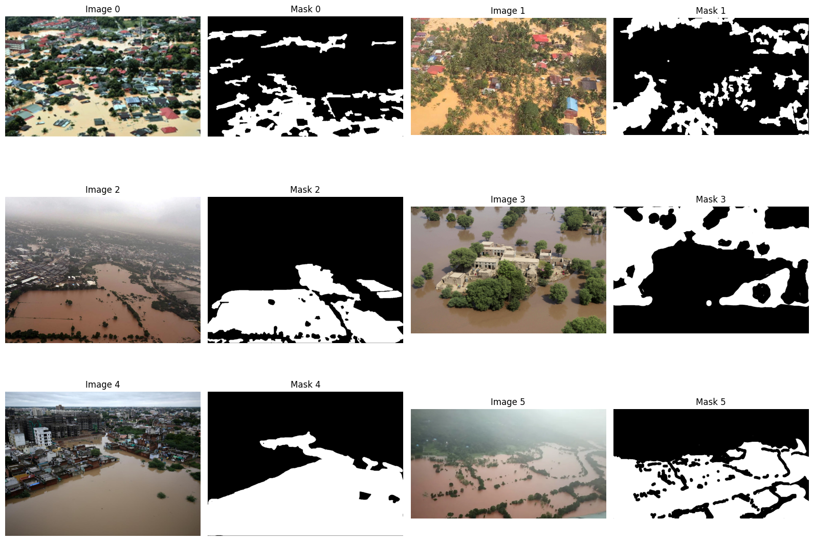

### Foto  2 - Image + Point Prompt:
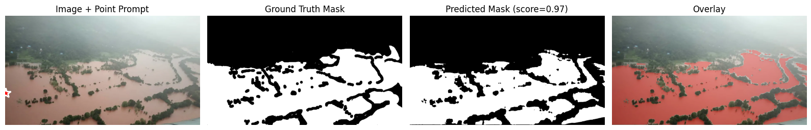

### Foto  3 - Box Prompt Prediction:
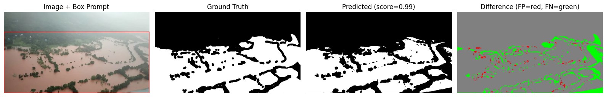

### Foto  4 - Distributions:
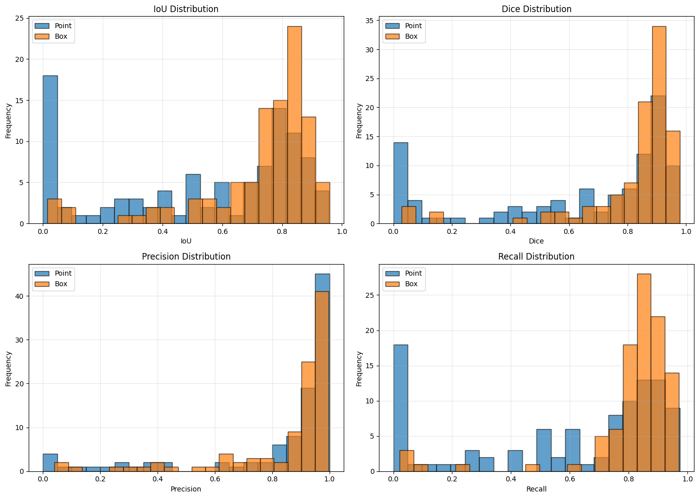

### Foto  5 - Training & Validation:
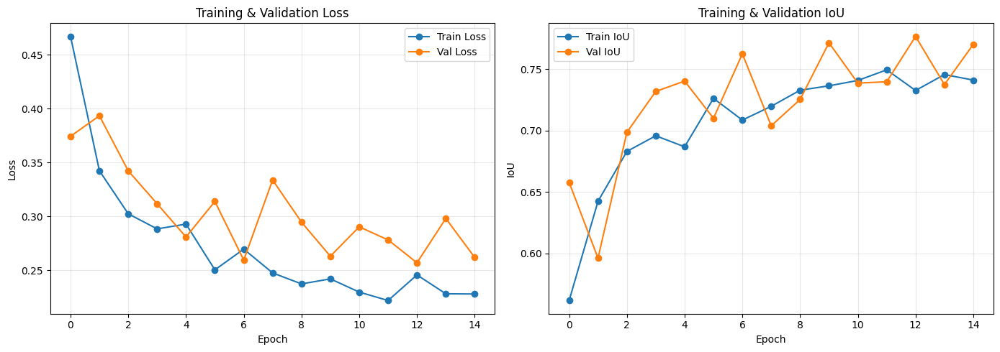

### Foto  6 - Pretrained vs Fine-tuned SAM Performance:
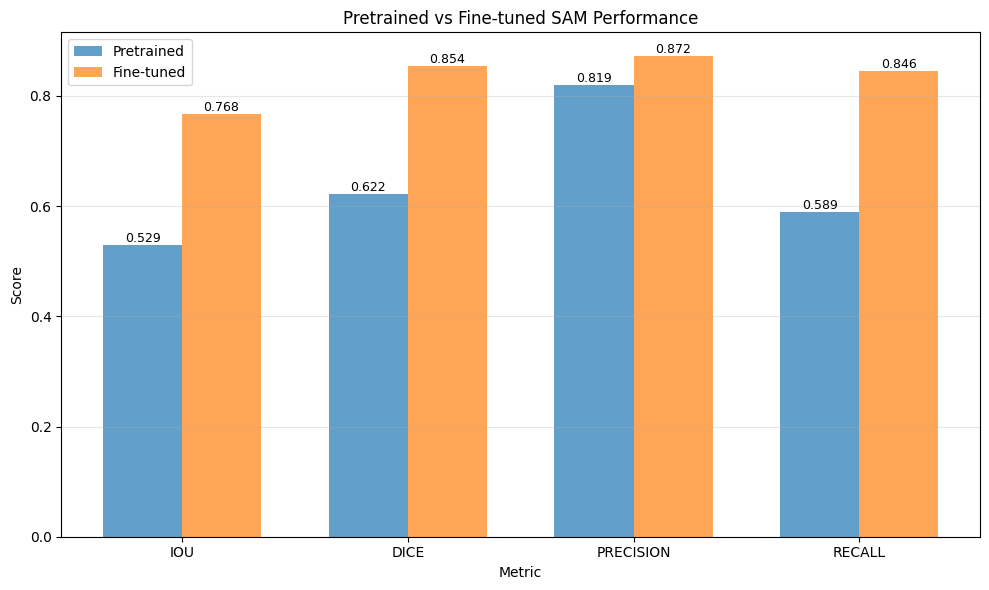

### Foto  7 - Image 0:
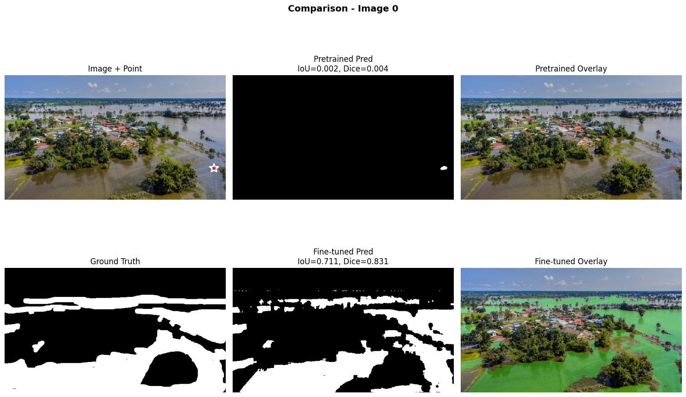

### Foto  8 - Image 5:
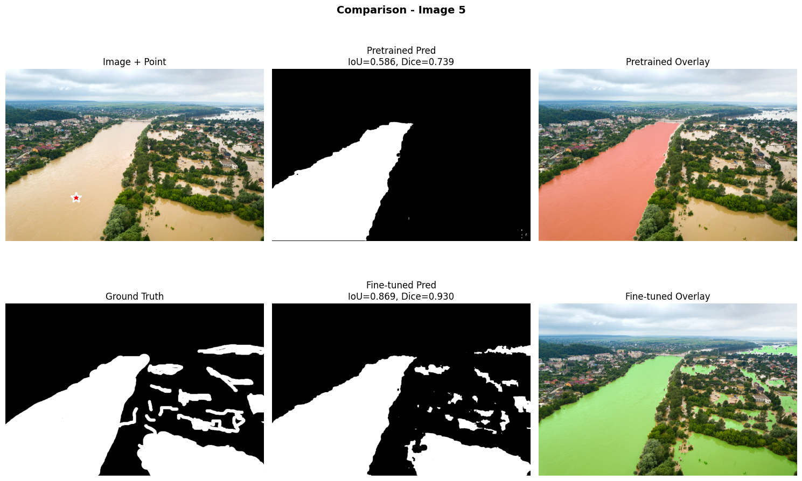

### Foto  9 - Image 10:
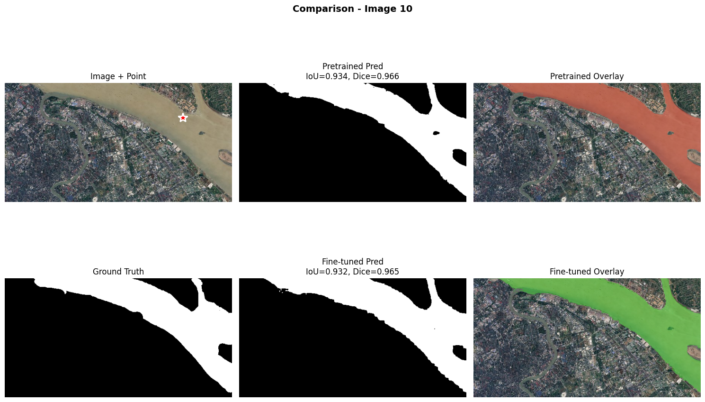

### Foto  10 - Image 15:
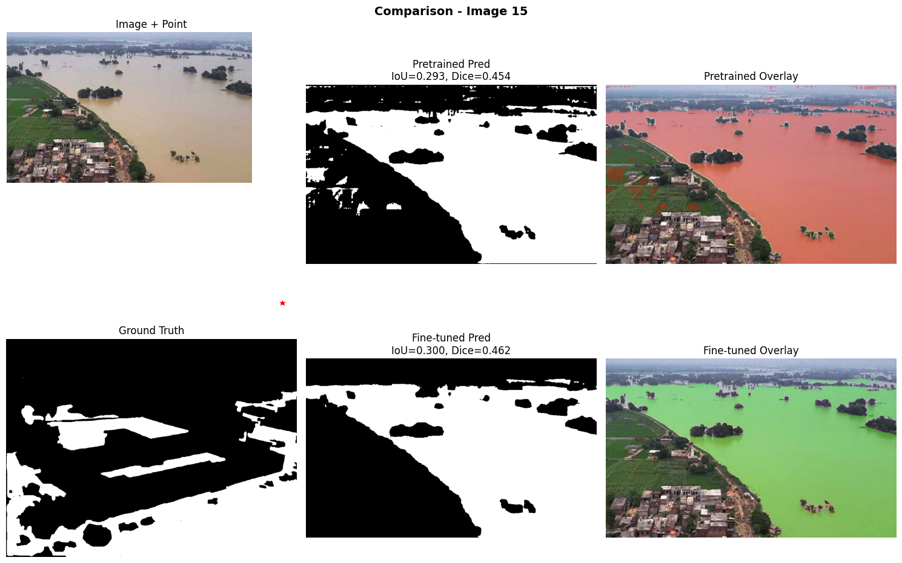

### Foto  11 - Case 1:
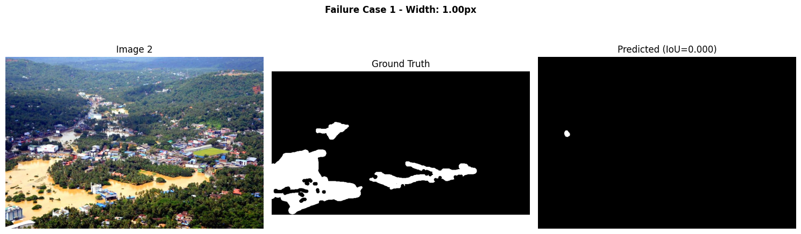

### Foto  12 - Case 2:
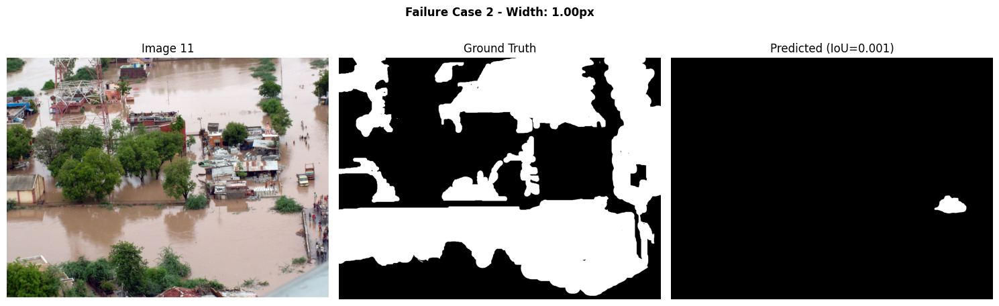

### Foto  13 - Case 3:
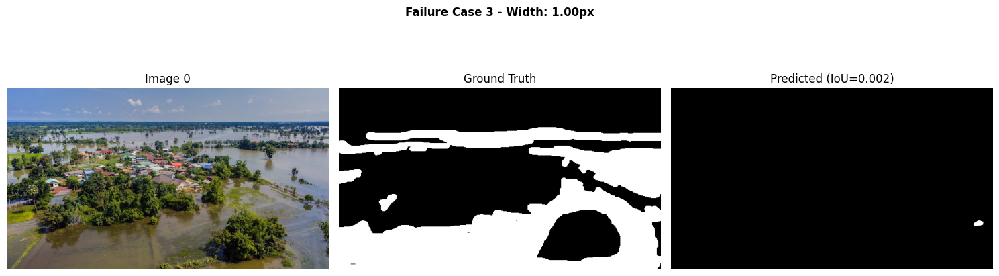