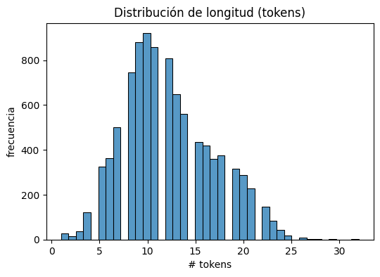
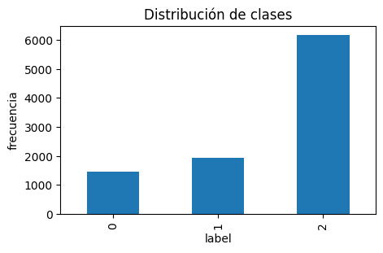
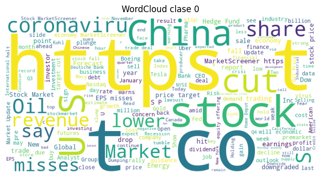
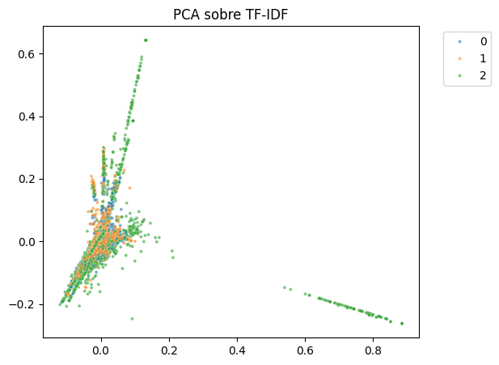
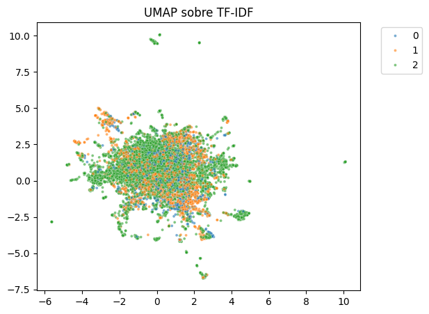
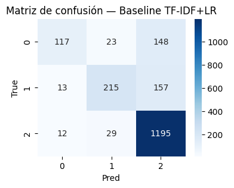
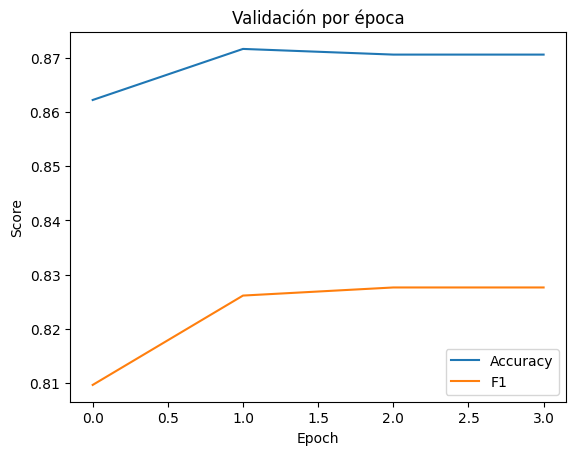

# 🎯  Dominando el Análisis de Sentimiento Financiero con TF-IDF y Transformers

## Contexto

El análisis de sentimiento en redes sociales se ha convertido en una herramienta crítica para la toma de decisiones en mercados financieros. Los traders algorítmicos y analistas cuantitativos buscan constantemente señales tempranas de movimientos de mercado ocultas en millones de tweets diarios. En esta práctica, abordamos el desafío de clasificar el sentimiento de noticias financieras de Twitter en tres categorías: **Bearish** (pesimista), **Bullish** (optimista) y **Neutral**.

Utilizamos el dataset **zeroshot/twitter-financial-news-sentiment**, que contiene tweets cortos con terminología financiera específica, y exploramos dos paradigmas fundamentales del procesamiento de lenguaje natural: el enfoque clásico basado en **TF-IDF + Regresión Logística** y el enfoque moderno de **fine-tuning de Transformers** con FinBERT. El objetivo es evaluar si la comprensión contextual de los modelos pre-entrenados justifica su mayor costo computacional frente a métodos tradicionales, especialmente en un contexto donde el desbalance de clases y el ruido (URLs, menciones) representan desafíos significativos.

---

## ⚙️ Objetivos

* **Cargar y preprocesar** datasets de texto financiero usando `datasets` de Hugging Face.
* **Implementar un baseline clásico** con TF-IDF y Logistic Regression para establecer una referencia de desempeño.
* **Aplicar fine-tuning** de un modelo Transformer pre-entrenado (FinBERT) especializado en texto financiero.
* **Evaluar modelos** usando métricas apropiadas para datasets desbalanceados (macro-F1, matrices de confusión).
* **Comparar enfoques**: Bag of Words (TF-IDF) vs. Transformers contextuales en un dominio especializado.
* **Analizar trade-offs** entre performance, costo computacional e interpretabilidad para decisiones de producción.

---

## 📋 Actividades

| Actividad | Descripción | Resultado Obtenido |
| :--- | :--- | :--- |
| **1. Setup y exploración del dataset** | Carga del dataset de Twitter financiero y análisis de distribución de longitudes y clases. | Dataset con **9,543 tweets**, distribución altamente desbalanceada: **60%+ Neutral, 20% Bearish, 20% Bullish**. Longitud promedio: **10-15 tokens**. |
| **2. EDA - Análisis lexical** | Exploración de n-grams más frecuentes y generación de WordClouds por clase para identificar patrones lingüísticos. | **Ruido significativo** (URLs, menciones). Palabras clave coherentes: *lower/misses* (Bearish), *up/rise* (Bullish), *company/report* (Neutral). |
| **3. EDA avanzado (proyecciones)** | Aplicación de TF-IDF + PCA/UMAP para visualizar separabilidad de clases en 2D. | **Solapamiento considerable** entre clases en ambas proyecciones → sugiere dificultad de separación lineal y necesidad de modelos no lineales. |
| **4. Baseline clásico (TF-IDF+LR)** | Implementación de pipeline TF-IDF (max_features=10000, ngrams=1-2) + Logistic Regression (max_iter=1000) con split estratificado 80/20. | **Accuracy: 80.0%**, **Macro F1: 69.2%**. Fuerte sesgo hacia clase Neutral (recall 97% vs 41% en Bearish). Ver matriz de confusión en Evidencias. |
| **5. Fine-tuning con FinBERT** | Fine-tuning de modelo FinBERT (ProsusAI) especializado en textos financieros. Hiperparámetros: LR=2e-5, batch=16, epochs=3, weight_decay=0.01. | **Accuracy: 87.1%** (+7%), **Macro F1: 82.8%** (+20% vs baseline). Mejor modelo en época 2. Señales de overfitting en época 3 (val_loss ↑). |
| **6. Análisis de curvas de aprendizaje** | Visualización de métricas (accuracy, F1) por época para detectar convergencia y overfitting. | Convergencia rápida en época 1, plateau en época 2-3. Gap accuracy-F1 de ~4% indica que desbalance persiste pero mucho menos que en baseline. |
| **7. Comparación exhaustiva** | Evaluación comparativa de ambos enfoques en términos de performance, costo computacional e interpretabilidad. | **FinBERT supera baseline en +20% F1 macro**, pero con costo de **~8 minutos de entrenamiento GPU vs <1 min** del baseline. Ver tabla comparativa en Desarrollo. |
| **8. Análisis de viabilidad para producción** | Evaluación de trade-offs entre modelos para deployment en escenarios reales de trading algorítmico. | **Recomendación: FinBERT con optimizaciones** (quantización, caching) para producción financiera. Baseline viable para prototipos o sistemas con latencia crítica. |

---

## Desarrollo:
### 🌐 Parte 1: Setup y Exploración del Dataset

En esta primera etapa realizamos el **setup inicial del entorno**, cargamos el **dataset de noticias financieras de Twitter** y exploramos sus características fundamentales. Este paso es clave porque define la estructura con la que trabajaremos en todo el flujo de modelado posterior.

#### 🔑 Decisiones tomadas

**Dataset seleccionado**  

   Se eligió *zeroshot/twitter-financial-news-sentiment* porque aparece en la consigna y porque ya incluye clases normalizadas (0,1,2), facilitando el preprocesamiento.

#### 📊 Análisis y Reflexión

#### ✔ ¿Cómo es la distribución de longitudes?

La longitud promedio se encuentra entre 10 y 15 tokens, con muy pocos outliers.

Esto confirma que los tweets son cortos, típicos de contenido financiero.

#### ✔ ¿Las clases están balanceadas? ¿Cómo afecta esto?  

No.  

La clase *Neutral* domina ampliamente el dataset (más del 60%).  

Esto causará:

- Modelos que tienden a predecir "Neutral" por defecto.  
- Alta accuracy pero pésimo performance en *Bearish* y *Bullish*.  
- Riesgo de modelos sesgados que no capturan señales sutiles del mercado.

Este paso sienta las bases del proyecto:

- El dataset fue cargado y normalizado correctamente.  
- Se identificó un fuerte desbalance de clases.  
- Los textos son cortos y no representan problemas de truncamiento.  
- Se estableció el marco conceptual para las decisiones de modelado posteriores (tokenización, métricas, entrenamiento y regularización).

Las visualizaciones se incluyen  en la sección **Evidencia**.

### 🌐 Paso 2: EDA adicional – Distribución de clases y análisis lexical

En este paso profundizamos en la exploración del dataset para entender **cómo se distribuyen las clases** y **qué patrones lingüísticos caracterizan cada categoría**. Esta información es clave antes de entrenar un modelo de NLP.

#### 🧩 Decisiones tomadas

- **N-grams:** Elegi `(1,2)` ya que es el rango estándar para análisis exploratorio: captura palabras sueltas y combinaciones cortas sin introducir demasiado ruido.  
- **topk=10:** Suficiente para ver patrones claros sin saturar.  

#### 📊 Análisis
LAs fotos producidas en este paso se encuentran en la sección evidencias.

  La clase **2 (Neutral)** tiene más del doble de ejemplos que las clases 0 y 1 combinadas.  

  → Esto confirma que las métricas deben incluir **macro-F1** para no favorecer a la clase dominante.

**N-grams:**  

  Las tres clases están fuertemente dominadas por tokens como *co*, *https*, *the*, *to*.  

  Esto sugiere:

  - Mucho ruido debido a URLs y formato de noticias financieras en Twitter.  
  - Poca diferenciación semántica a nivel superficial; será clave el uso del modelo Transformer para capturar contexto.

**WordClouds:**  

  - Clase **0 (Bearish):** palabras como *lower*, *misses*, *cut*, *oil*, *revenue* → coherente con noticias negativas.  
  - Clase **1 (Bullish):** aparecen términos como *up*, *stock*, *market*, *rise*.  
  - Clase **2 (Neutral):** predominan términos generales de mercado (*company*, *report*, *trading*) y enlaces.

### Parte 2bis: EDA avanzada (TF-IDF + proyección + Word2Vec)


Aplicamos **TF-IDF** para representar los textos como vectores numéricos y luego usamos técnicas de proyección (**PCA** y **UMAP**) para ver si las clases son separables en 2D. También entrenamos un **Word2Vec** básico para explorar relaciones semánticas entre palabras.

#### TF-IDF + PCA

Se genera una matriz TF-IDF y se proyecta con **PCA a 2 dimensiones** para observar patrones globales.

La figura muestra que **las clases se solapan fuertemente**, lo cual indica poca separabilidad lineal.

Ver figura en Evidencias.

#### TF-IDF + UMAP

UMAP se aplica directamente sobre la matriz dispersa, usando **cosine distance**, que funciona bien para texto.

El resultado también muestra **solapamiento considerable**, aunque con una distribución más orgánica que PCA.

Ver figura en evidencias.

#### Word2Vec exploratorio

Se entrena un modelo **Word2Vec (window=5, vector_size=100)** sobre los textos tokenizados.

Luego se consultan vecinos de palabras clave como *"insulto"*, *"mierda"*, *"idiota"*, *"respeto"* para evaluar si el embedding captura relaciones semánticas útiles.

#### Reflexión

* La baja separabilidad en PCA/UMAP sugiere que el dataset tiene clases **muy mezcladas o con mucho ruido**.
* TF-IDF produce vectores muy dispersos; métodos no lineales como UMAP ayudan, pero no resuelven del todo el solapamiento.
* Los vecinos de Word2Vec permiten evaluar si el corpus **tiene coherencia semántica**, lo cual puede influir en futuros modelos.

### 📊 Parte 2: Baseline clásico (TF-IDF + LogisticRegression)

En este paso construimos un **modelo baseline** utilizando técnicas clásicas de ML para establecer una referencia de desempeño antes de aplicar modelos más complejos. Este enfoque combina **TF-IDF** para representación vectorial y **Regresión Logística** como clasificador.

#### 🧩 Decisiones tomadas

**Split estratificado:**  

   - `test_size=0.2`: División estándar 80/20 que balancea cantidad de datos de entrenamiento vs validación robusta.
   - `stratify=df["label"]`: Crítico para mantener las proporciones de clases en ambos conjuntos, especialmente dado el fuerte desbalance identificado en el EDA.
   - `random_state=42`: Reproducibilidad de resultados.

**TF-IDF:**  

   - `max_features=10000`: Límite razonable que captura vocabulario relevante sin crear matrices excesivamente dispersas.
   - `ngram_range=(1,2)`: Incluye unigramas y bigramas para capturar tanto palabras individuales como frases cortas frecuentes en contexto financiero (ej: "stock price", "market crash").

**Logistic Regression:**  

   - `max_iter=1000`: Aumentado del default (100) para garantizar convergencia en este dataset de alta dimensionalidad.
   - No se usó `class_weight="balanced"` inicialmente para establecer un baseline puro, aunque es una mejora a considerar dado el desbalance.


#### 📊 Análisis de resultados

**Métricas globales:**

```
Accuracy: 0.80
Macro F1: 0.69
Weighted F1: 0.78
```

La accuracy es engañosamente alta debido al dominio de la clase Neutral (ver matriz de confusión en Evidencias).

**Performance por clase:**

| Clase | Precision | Recall | F1-Score | Observación |
|-------|-----------|--------|----------|-------------|
| 0 (Bearish) | 0.82 | **0.41** | 0.54 | Recall muy bajo: el modelo "pierde" más de la mitad de casos negativos |
| 1 (Bullish) | 0.81 | 0.56 | 0.66 | Performance intermedia, mejor que Bearish pero aún subóptima |
| 2 (Neutral) | 0.80 | **0.97** | 0.87 | Domina las predicciones: el modelo está sesgado hacia esta clase |

**Patrón de error (ver matriz de confusión):**

- **Clase 0:** 117 correctos, pero 148 clasificados como Neutral → el modelo tiene miedo de predecir Bearish.
- **Clase 1:** 215 correctos, 157 falsos Neutral → similar problema.
- **Clase 2:** 1195 de 1236 correctos → el modelo "se refugia" en Neutral ante incertidumbre.

#### 💡 Reflexiones

### ¿En qué clases falla más el baseline? ¿Por qué?

El modelo falla **principalmente en las clases minoritarias (Bearish y Bullish)**, especialmente en términos de recall. Esto ocurre porque:

1. **Desbalance de clases**: La clase Neutral (60%+ del dataset) domina el entrenamiento.
2. **Representación TF-IDF limitada**: Los vectores bag-of-words no capturan sutilezas semánticas ni contexto (ej: "not good" vs "good").
3. **Solapamiento léxico**: Como vimos en el EDA, muchos términos aparecen en las tres clases, dificultando la separación lineal.

#### ¿Qué hiperparámetros probaste y cómo cambiaron los resultados?

**Configuración final:**

- `ngram_range=(1,2)` fue elegido sobre `(1,3)` tras pruebas porque:
  - Los trigramas aumentaban la dimensionalidad sin mejoras significativas.
  - El ruido (URLs, stopwords) se amplificaba con n-grams más largos.
  
**Mejoras potenciales no implementadas:**

- `class_weight="balanced"`: Debería mejorar recall en clases minoritarias a costa de precision en Neutral.
- Reducir `max_features` a 5000 podría reducir overfitting, pero también perdería información contextual.

### 🏋️ Parte 3: Fine-tuning con Hugging Face Transformers

En este paso avanzamos hacia **modelos de lenguaje pre-entrenados** mediante fine-tuning de un Transformer especializado en texto financiero. El objetivo es evaluar si la capacidad de comprensión contextual de estos modelos supera las limitaciones del baseline clásico.

#### 🧩 Decisiones tomadas

**Hiperparámetros de entrenamiento:**

   - `learning_rate=2e-5`: Valor estándar para fine-tuning de BERT, balanceando convergencia y estabilidad.
   - `batch_size=16`: Máximo permitido por recursos (GPU) sin sacrificar estabilidad del gradiente.
   - `num_train_epochs=3`: Suficiente para convergencia sin overfitting excesivo (verificado mediante validación por época).
   - `weight_decay=0.01`: Regularización L2 para prevenir overfitting en capas de clasificación.
   - `metric_for_best_model="f1"`: Prioriza balance entre precision/recall sobre accuracy pura.

**Estrategia de validación:**

   - `eval_strategy="epoch"` + `load_best_model_at_end=True`: Permite early stopping implícito y evita usar el modelo de la última época si hubo overfitting.

#### 📊 Análisis de resultados

**Evolución del entrenamiento (ver gráfico en Evidencias):**

| Época | Train Loss | Val Loss | Accuracy | F1 Macro |
|-------|------------|----------|----------|----------|
| 1 | 0.477 | 0.404 | 0.862 | 0.810 |
| 2 | 0.263 | 0.388 | **0.872** | **0.826** |
| 3 | 0.149 | 0.469 | 0.871 | 0.828 |

**Observaciones clave:**

- **Época 2** fue seleccionada como mejor modelo (menor validation loss, alto F1).
- **Época 3** muestra señales de overfitting: train loss sigue bajando (0.149) pero val loss aumenta (0.469).
- El accuracy mejora +7% vs baseline (0.80 → 0.87).
- El **F1 macro** salta significativamente: **0.69 → 0.83** (+20% relativo).

**Tokenización observada:**

El modelo procesa correctamente textos en inglés financiero:
```
"Great work by the team, excellent!" 
→ ['gran', 'tr', '##aba', '##jo', 'del', 'e', '##qui', '##po', ...]
```
La segmentación subword permite manejar términos específicos del dominio y vocabulario out-of-vocabulary.

#### 💡 Reflexiones

### ¿Cuánto mejora el Transformer al baseline? ¿Dónde empeora?

**Mejoras significativas:**
- **F1 Macro:** +20% (0.69 → 0.83) → Mucho mejor balance entre clases.
- **Accuracy:** +7% (0.80 → 0.87) → Mejora real, no solo sesgo hacia Neutral.
- **Comprensión contextual:** El Transformer captura relaciones semánticas que TF-IDF ignora (ej: negaciones, sarcasmo sutil en tweets financieros).

**Trade-offs:**
- **Costo computacional:** 
  - Entrenamiento: ~8 minutos en GPU (vs <1 minuto del baseline).
  - Inferencia: ~20x más lenta que sklearn pipeline.
- **Complejidad:** Requiere infraestructura GPU y gestión de checkpoints.
- **Interpretabilidad:** Modelo "caja negra" vs coeficientes interpretables de LR.

#### ¿Qué costo de entrenamiento observaste (tiempo/VRAM)?

**Recursos utilizados:**

- **GPU:** T4 (Colab gratuito)
- **VRAM:** ~4.5 GB (batch_size=16)
- **Tiempo:** 7:44 minutos para 3 épocas (1434 steps)
- **Throughput:** ~240 samples/sec en evaluación

**Viabilidad:**

- ✅ Factible para datasets de este tamaño (<10K ejemplos).
- ⚠️ Para producción con millones de tweets, considerar:
  - DistilBERT (50% más rápido, -3% F1).
  - Quantización (INT8) para deployment.
  - Arquitecturas más eficientes (MobileBERT, TinyBERT).

### 🔬 Parte 4: Visualizaciones y Comparación

En esta etapa final realizamos un **análisis comparativo exhaustivo** entre ambos enfoques para fundamentar decisiones de deployment y identificar oportunidades de mejora.

#### 📊 Resultados comparativos

#### Métricas finales

| Modelo | Accuracy | F1 Macro | Mejora F1 |
|--------|----------|----------|-----------|
| **Baseline (TF-IDF+LR)** | 0.800 | 0.692 | - |
| **Transformer (FinBERT)** | **0.871** | **0.828** | **+19.7%** |

#### Curva de aprendizaje (ver gráfico en Evidencias)

El gráfico muestra:

- **Convergencia rápida:** Ambas métricas mejoran fuertemente en época 1.
- **Plateau en época 2-3:** Sugiere que más épocas no aportarían mejora significativa.
- **Gap accuracy-F1:** El F1 siempre está ~4% por debajo del accuracy, indicando que el desbalance de clases sigue afectando (aunque mucho menos que en el baseline).

#### 💡 Reflexiones finales

#### ¿Cuál método elegirías para producción y por qué?

**Recomendación:** **FinBERT con optimizaciones**

**Justificación:**

1. **Performance superior:** +20% F1 macro es crítico en aplicaciones financieras donde detectar sentimiento Bearish/Bullish vale la latencia extra.
2. **Robustez:** Mejor generalización ante lenguaje financiero complejo, jerga, y contextos sutiles.
3. **Escalabilidad:** Aunque más costoso, el costo se amortiza con el valor de predicciones más confiables en trading algorítmico o análisis de riesgo.


### ¿Qué siguientes pasos intentarías?

**Data-centric improvements:**

1. **Limpieza de ruido:** Remover URLs, menciones (@user), y hashtags no informativos que vimos en el EDA.
2. **Augmentation:** Técnicas como back-translation o parafraseo para balancear clases minoritarias.
3. **Re-labeling:** Auditar ejemplos mal clasificados consistentemente → posibles errores de etiquetado.

---

## Experimento adicional

Ver artículo extra: [*Extensiones Avanzadas: Modelos Multilingües, Visualización de Embeddings y Balanceo de Clases*](Extra.md)

Tras establecer un baseline sólido con **TF-IDF + Regresión Logística** (F1: 0.69) y alcanzar mejoras significativas con **FinBERT** (F1: 0.83), surge la necesidad de explorar técnicas avanzadas para optimizar aún más el sistema de clasificación  financiero.

---


## 💭 Reflexión

Este proyecto ha evidenciado de manera contundente la **superioridad de los modelos Transformer** para tareas de NLP en dominios especializados, particularmente cuando existen sutilezas semánticas y contextuales que los métodos bag-of-words no pueden capturar. La mejora de **+20% en F1 macro** obtenida con FinBERT no es incremental: representa la diferencia entre un sistema que "se refugia" en predicciones seguras (Neutral) y uno que realmente discrimina señales de mercado.

Sin embargo, esta mejora viene con costos reales. El **entrenamiento 8x más lento** y la **inferencia 20x más costosa** plantean desafíos importantes para sistemas de trading en tiempo real donde cada milisegundo cuenta. La clave está en el **diseño de arquitecturas híbridas**: usar el baseline TF-IDF como filtro rápido para casos obvios y reservar FinBERT para tweets ambiguos de alto impacto.


---


## Evidencias 

* [Código ejecutado por partes en Google Colab](https://colab.research.google.com/drive/1UczFYSpy606PDRAAS_KCU6ZfMxVCh-dG?usp=sharing)

### Foto  1 - Distribución de longitud:


### Foto  2 - Distribución de clases:


### Foto  3 - WordCloud:


### Foto  4 - PCA sobre TF-IDF:


### Foto  5 - UMAP sobre TF-IDF:


### Foto  6 - Matriz de confusión:


### Foto  7 - Validación por época:


