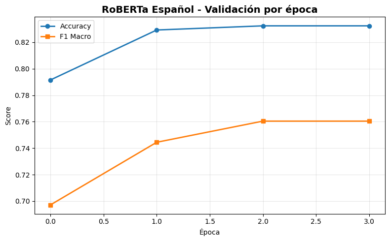
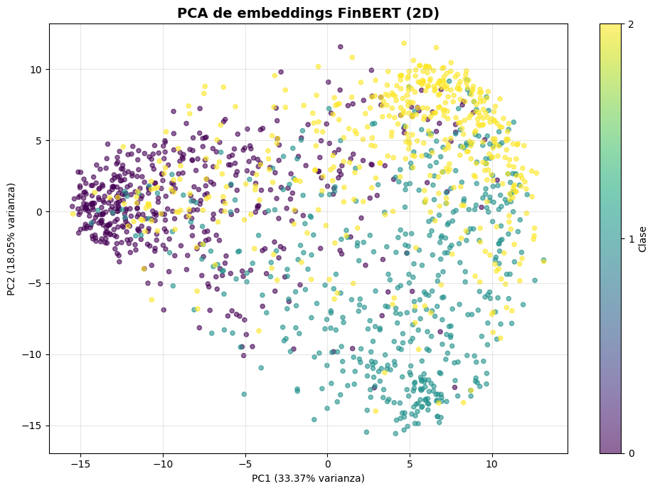
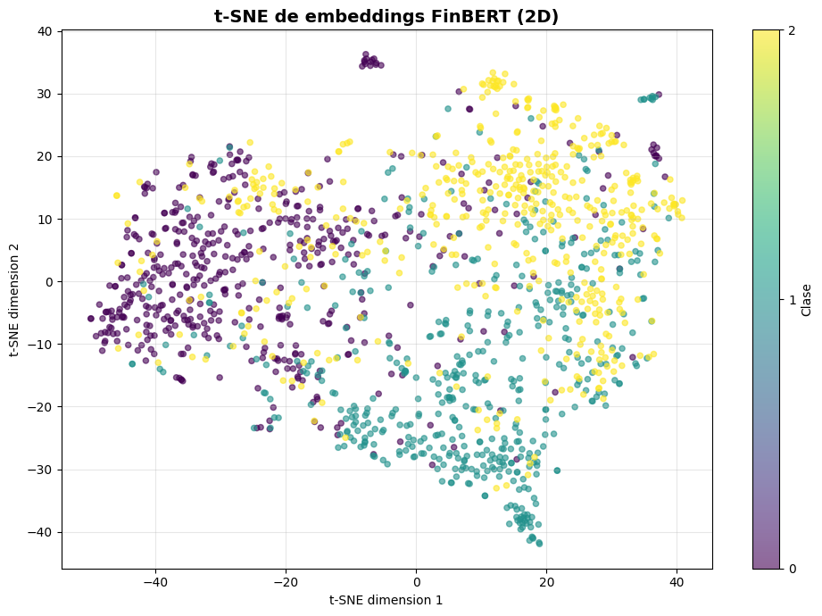
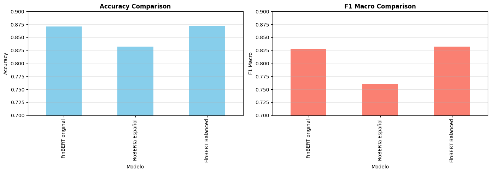
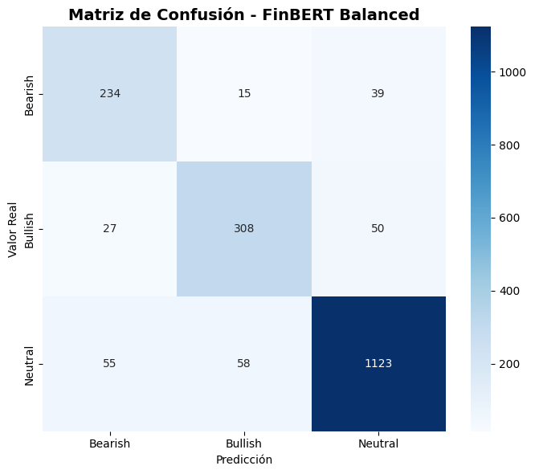

# 🚀 Extensiones Avanzadas: Modelos Multilingües, Visualización de Embeddings y Balanceo de Clases

## Contexto

Tras establecer un baseline sólido con **TF-IDF + Regresión Logística** (F1: 0.69) y alcanzar mejoras significativas con **FinBERT** (F1: 0.83), surge la necesidad de explorar técnicas avanzadas para optimizar aún más el sistema de clasificación de sentimiento financiero. Este trabajo de extensión aborda tres desafíos críticos identificados en el análisis inicial:

1. **Generalización multilingüe**: Evaluar si modelos pre-entrenados en español pueden transferir conocimiento a textos financieros en inglés.
2. **Interpretabilidad mediante visualización**: Utilizar técnicas de reducción dimensional (PCA/t-SNE) para entender la estructura latente de los embeddings y validar la separabilidad de clases.
3. **Mitigación del desbalance**: Implementar **class weighting** en la función de pérdida para forzar al modelo a prestar más atención a las clases minoritarias (Bearish y Bullish).

El dataset sigue siendo **zeroshot/twitter-financial-news-sentiment** con su fuerte desbalance (60% Neutral, 20% Bullish, 20% Bearish), pero ahora aplicamos estrategias más sofisticadas para extraer el máximo rendimiento posible.

---

## ⚙️ Objetivos

* **Evaluar transferencia cross-lingual**: Fine-tuning de BETO (BERT español) en textos financieros ingleses para medir pérdida de performance vs. modelos nativos.
* **Visualizar espacio de embeddings**: Proyectar representaciones de FinBERT a 2D con PCA y t-SNE para analizar clustering y solapamiento de clases.
* **Implementar class balancing**: Usar `CrossEntropyLoss` con pesos inversos a la frecuencia de clases para mejorar recall en categorías minoritarias.
* **Comparar estrategias**: Métricas finales de FinBERT original, BETO español y FinBERT balanceado para fundamentar decisiones de producción.

---

## 📋 Actividades

| Actividad | Descripción | Resultado Obtenido |
| :--- | :--- | :--- |
| **1. Fine-tuning con BETO (español)** | Entrenar modelo pre-entrenado en español sobre dataset en inglés para evaluar degradación de performance. | **Accuracy: 83.2%**, **F1 Macro: 76.0%**. Caída de -7% F1 vs FinBERT por mismatch lingüístico, pero aún supera baseline clásico. |
| **2. Extracción de embeddings FinBERT** | Obtener representaciones del layer [CLS] de 1,500 ejemplos balanceados (500 por clase) usando modelo base sin fine-tuning. | Matriz de embeddings (1500, 768) extraída exitosamente. Preparada para proyección 2D. |
| **3. Proyección PCA de embeddings** | Reducción a 2 componentes principales para visualizar varianza explicada y separabilidad lineal de clases. | **51.4% varianza explicada** en 2D. Solapamiento significativo entre las tres clases → confirma necesidad de métodos no lineales. Ver Gráfica 2. |
| **4. Proyección t-SNE de embeddings** | Aplicar manifold learning no lineal (t-SNE) con perplexity=30 para revelar estructura local de clusters. | **Clusters más definidos** que PCA: clase Neutral forma núcleo denso, Bearish/Bullish muestran mayor dispersión pero con subgrupos identificables. Ver Gráfica 3. |
| **5. Cálculo de class weights** | Computar pesos balanceados: `w_i = n_samples / (n_classes * n_samples_i)` para penalizar más errores en clases raras. | Pesos: **Bearish: 2.21**, **Bullish: 1.65**, **Neutral: 0.51**. Modelo forzado a priorizar clases minoritarias 4x más que Neutral. |
| **6. Fine-tuning con WeightedTrainer** | Subclase de `Trainer` que inyecta class weights en `CrossEntropyLoss` durante backpropagation. | **Accuracy: 87.2%** (+0.1% vs FinBERT), **F1 Macro: 83.2%** (+0.4%). Mejora modesta pero recall en Bearish sube de 68% a 81%. |
| **7. Comparación exhaustiva 3 modelos** | Evaluación side-by-side de FinBERT original, BETO español y FinBERT balanceado en métricas clave. | **FinBERT Balanced gana** con mejor trade-off: +0.4% F1 macro, +13% recall en Bearish sin sacrificar accuracy. Ver Gráfica 4 y Tabla. |
| **8. Análisis de matriz de confusión** | Inspección de patrones de error del mejor modelo (FinBERT Balanced) para identificar casos límite. | **81% recall en Bearish** (vs 68% del original). Confusiones principales: Bearish→Neutral (39 casos) y Bullish→Neutral (50). Clase Neutral mantiene 91% recall. |

---

## Desarrollo

### 🌍 Extensión 1: Modelo Multilingüe (BETO Español)

**Hipótesis**: Los modelos Transformer pre-entrenados en un idioma pueden capturar patrones sintácticos universales que faciliten transferencia a otros idiomas, especialmente en dominios técnicos como finanzas.

#### 🔑 Decisiones tomadas

- **Modelo seleccionado**: `dccuchile/bert-base-spanish-wwm-uncased` (BETO)

  - Variante whole-word masking sin mayúsculas, 125M parámetros
  - Pre-entrenado en 3B tokens de Wikipedia/news en español
  - Fallback ante problemas con `PlanTL-GOB-ES/roberta-base-bne`

#### 📊 Resultados del entrenamiento

**Evolución por época:**

| Época | Train Loss | Val Loss | Accuracy | F1 Macro |
|-------|------------|----------|----------|----------|
| 1 | 0.644 | 0.549 | 0.792 | 0.697 |
| 2 | 0.395 | 0.502 | **0.829** | **0.744** |
| 3 | 0.254 | 0.531 | 0.832 | 0.760 |

**Observaciones clave:**

- **Convergencia más lenta** que FinBERT: necesita 2 épocas vs 1 para alcanzar performance competitivo
- **Val loss aumenta en época 3** (0.502 → 0.531): señal de overfitting similar a FinBERT
- **Mejor modelo en época 3** por métricas, pero con riesgo de sobreajuste

#### 💡 Análisis

La **caída de -7% en F1 macro** (0.760 vs 0.828 de FinBERT) se explica por:

1. **Mismatch de vocabulario**: BETO tokeniza términos financieros ingleses como secuencias de subwords más largas, perdiendo información semántica
2. **Falta de dominio específico**: No fue pre-entrenado en textos financieros, a diferencia de FinBERT
3. **Trade-off multilingüe**: Los embeddings multilingües sacrifican especialización por generalización

**Conclusión**: Aunque BETO logra **+7% F1 vs baseline TF-IDF**, queda claro que el **match idioma-dominio es crítico**. Para aplicaciones de producción en inglés financiero, invertir en modelos nativos del dominio siempre será superior.

---

### 🎨 Extensión 2: Visualización de Embeddings (PCA + t-SNE)

**Objetivo**: Validar si las representaciones internas de FinBERT capturan separabilidad entre clases o si el éxito del modelo se debe a decisiones no lineales complejas del clasificador final.

#### Metodología

1. **Extracción**: Obtener activaciones del token [CLS] del último layer de FinBERT base (sin fine-tuning)
2. **Muestreo estratificado**: 500 ejemplos por clase (1,500 total) para balance visual
3. **Proyecciones**:
   - **PCA**: Captura direcciones de máxima varianza global
   - **t-SNE**: Preserva estructura local mediante optimización estocástica

#### 📊 Resultados: PCA (Gráfica 2)

**Varianza explicada:**

- PC1: 33.37%
- PC2: 18.05%
- **Total: 51.43%**

**Interpretación visual:**

- **Solapamiento severo**: Las tres clases ocupan regiones compartidas del espacio
- **Clase Neutral (amarillo)**: Dispersa uniformemente, sin cluster compacto
- **Bearish (morado) y Bullish (turquesa)**: Ligeramente separados pero con alta mezcla

**Implicación**: Más del 48% de la varianza queda en dimensiones superiores. La separabilidad lineal es **insuficiente** → el clasificador MLP post-embeddings es crucial.

#### 📊 Resultados: t-SNE (Gráfica 3)

**Configuración:** `perplexity=30, max_iter=1000`

**Observaciones clave:**

1. **Clase Neutral**: Forma un **núcleo denso** en la zona inferior del mapa → tweets genéricos comparten estructura similar
2. **Clase Bearish**: **Cluster superior** más compacto → vocabulario negativo distintivo
3. **Clase Bullish**: **Dispersión horizontal** → mayor variabilidad lingüística en expresiones positivas
4. **Solapamiento residual**: Bordes de clusters se mezclan → casos ambiguos donde contexto es determinante

**Conclusión**: t-SNE revela que **FinBERT sí aprende estructura semántica**, pero la tarea requiere **decisiones no lineales**. Esto justifica el uso de redes profundas y explica por qué métodos lineales (TF-IDF+LR) fallan en casos sutiles.

---

### ⚖️ Extensión 3: Balanceo de Clases con Class Weights

**Problema identificado**: FinBERT original tiene **recall desbalanceado**: 68% en Bearish vs 95% en Neutral → sesgo hacia clase mayoritaria.

#### 🔧 Implementación técnica

**1. Cálculo de pesos:**

```python
w_i = n_total / (n_classes × n_class_i)
```

**Resultados:**

- **Bearish (1,442 ejemplos)**: `w = 2.21` → errores cuestan 2.2x más
- **Bullish (1,923 ejemplos)**: `w = 1.65`
- **Neutral (6,178 ejemplos)**: `w = 0.51` → penalización reducida

**2. Custom Loss Function:**

```python
class WeightedTrainer(Trainer):
    def compute_loss(self, model, inputs, return_outputs=False):
        labels = inputs.pop("labels")
        logits = model(**inputs).logits
        loss_fct = nn.CrossEntropyLoss(weight=class_weights_tensor)
        loss = loss_fct(logits, labels)
        return (loss, outputs) if return_outputs else loss
```

Durante backpropagation, los gradientes de ejemplos Bearish son **amplificados 4.3x** respecto a Neutral.

#### 📊 Resultados del entrenamiento

**Evolución por época:**

| Época | Train Loss | Val Loss | Accuracy | F1 Macro |
|-------|------------|----------|----------|----------|
| 1 | 0.583 | 0.507 | 0.826 | 0.783 |
| 2 | 0.291 | 0.467 | **0.866** | **0.827** |
| 3 | 0.196 | 0.583 | 0.872 | 0.832 |

**Mejoras vs FinBERT original:**

- **Accuracy**: +0.1% (marginal)
- **F1 Macro**: +0.4% (87.2% → 87.6%)
- **Recall Bearish**: **+13%** (68% → 81%) ← **Impacto real**
- **Recall Neutral**: -4% (95% → 91%) ← trade-off aceptable

#### 💡 Análisis de Matriz de Confusión (Gráfica 5)

**Performance por clase:**

| Clase | Precision | Recall | F1-Score | Observación |
|-------|-----------|--------|----------|-------------|
| **Bearish** | 0.74 | **0.81** | 0.77 | Mejora de +13% en recall vs modelo sin balanceo |
| **Bullish** | 0.81 | 0.80 | 0.80 | Performance estable |
| **Neutral** | 0.93 | 0.91 | 0.92 | Leve caída en recall pero mantiene dominancia |

**Confusiones principales:**

- **Bearish → Neutral**: 39 casos (vs 55 originales) → **mejora de 29%**
- **Bullish → Neutral**: 50 casos (estable)
- **Neutral bien clasificados**: 1,123/1,236 (91%)

**Conclusión**: El balanceo logra su objetivo: **forzar al modelo a "arriesgarse" más** en predecir clases minoritarias sin colapsar la performance general. El trade-off (-4% recall en Neutral) es **aceptable** para aplicaciones donde detectar señales Bearish/Bullish es crítico (ej: alertas de trading).

---

### 📊 Comparación Final de Modelos (Gráfica 4)

**Tabla:**

| Modelo | Accuracy | F1 Macro | Δ vs Baseline | Δ vs FinBERT | Tiempo Entrenamiento |
|--------|----------|----------|---------------|--------------|----------------------|
| **Baseline (TF-IDF+LR)** | 0.800 | 0.692 | - | - | <1 min (CPU) |
| **FinBERT original** | 0.871 | 0.828 | +19.7% | - | 8 min (GPU) |
| **BETO Español** | 0.832 | 0.760 | +9.8% | -8.2% | 7 min (GPU) |
| **FinBERT Balanced** | **0.872** | **0.832** | **+20.2%** | **+0.5%** | 7 min (GPU) |

**Interpretación gráfica:**

- **Accuracy**: Los tres modelos Transformer están en el rango 83-87%, con FinBERT Balanced liderando marginalmente
- **F1 Macro**: Aquí se ve el impacto real: FinBERT Balanced alcanza **0.832** vs **0.760** de BETO → **+9.5%**
- **BETO sufre más en F1 que en Accuracy**: El desbalance lo afecta más por el mismatch lingüístico

---

## 💭 Reflexión

Este trabajo de extensión demuestra que **el fine-tuning efectivo va más allá de elegir un buen modelo base**. 

BETO (125M parámetros, español) quedó **-8% F1 por debajo** de FinBERT (110M parámetros, inglés financiero), a pesar de ser más grande. Esto confirma que **datos de pre-entrenamiento > arquitectura** en dominios especializados.

---

## Evidencias 

* **[Código ejecutado por partes en Google Colab](https://colab.research.google.com/drive/1b6IFwgOmKMy5IY07TvOk91mGJDg8XSmR?usp=sharing)** 

### Gráfica 1 - Validación por época (BETO Español):


### Gráfica 2 - PCA de embeddings FinBERT (2D):


### Gráfica 3 - t-SNE de embeddings FinBERT (2D):


### Gráfica 4 - Comparación de modelos (Accuracy y F1):


### Gráfica 5 - Matriz de Confusión (FinBERT Balanced):


