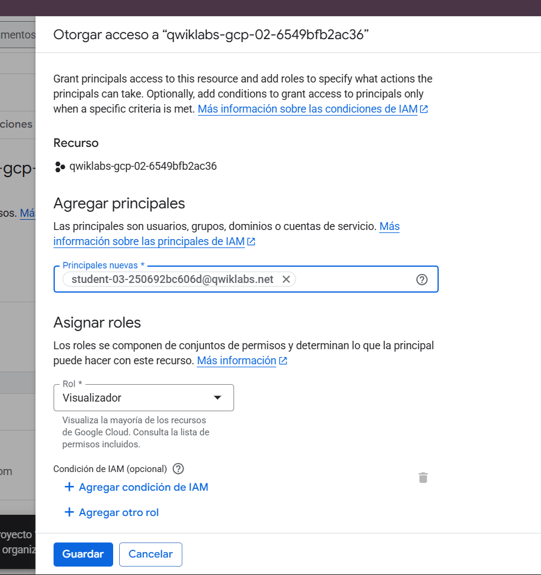
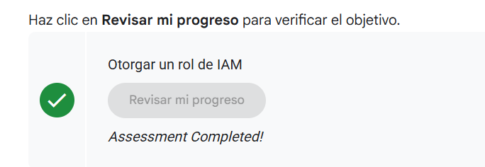
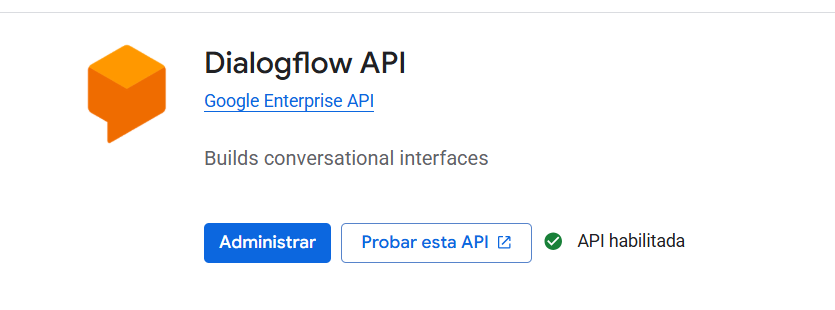
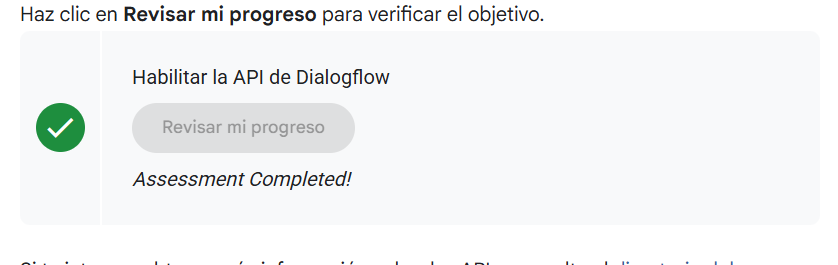

# 🔐 Gestión de Accesos y APIs en Google Cloud: IAM y Servicios

## Contexto

La gestión eficiente de permisos y recursos en Google Cloud Platform (GCP) es fundamental para mantener la seguridad y operatividad de proyectos en la nube. **Cloud IAM (Identity and Access Management)** permite controlar quién tiene acceso a recursos específicos y qué acciones pueden realizar, siguiendo el principio de **privilegio mínimo**. Además, la activación selectiva de APIs permite optimizar costos y superficie de ataque al habilitar únicamente los servicios necesarios.

Esta práctica aborda dos pilares operativos esenciales: (1) **Configuración de roles IAM** para otorgar permisos granulares a nuevos colaboradores, y (2) **Habilitación de APIs especializadas** como Dialogflow para integrar capacidades de IA conversacional. El desafío es ejecutar cambios de permisos sin comprometer la seguridad del proyecto y validar que las APIs críticas estén operativas mediante el sistema de seguimiento de actividades de Qwiklabs.

---

## ⚙️ Objetivos

* **Comprender la arquitectura de roles IAM** (Viewer/Editor/Owner) y sus implicaciones de seguridad.
* **Otorgar acceso granular** a una principal externa mediante roles predefinidos.
* **Habilitar APIs de Google Cloud** necesarias para servicios específicos del proyecto.
* **Validar configuraciones** mediante el sistema de Activity Tracking de Qwiklabs.
* **Documentar evidencias** de cambios realizados para auditoría y reproducibilidad.

---

## Desarrollo

### 🔧 Fase 1: Configuración de Roles IAM

**Contexto de seguridad:**

El proyecto `qwiklabs-gcp-02-6549bfb2ac36` originalmente tenía una sola perona principal con permisos de **Editor**, lo cual representa un riesgo operativo: un único usuario con capacidad de modificar recursos críticos. La solución consiste en incorporar una segunda principal con rol **Viewer** para separar responsabilidades.

**Proceso de otorgamiento de acceso:**

1. **Identificación de la nueva principal**: Se utiliza la cuenta `student-03-250692bc606d@qwiklabs.net`, que representa a un colaborador que necesita visibilidad sin capacidad de cambios.

2. **Selección del rol apropiado**: El rol **Visualizador** (`roles/viewer`) otorga:

   - ✅ Lectura de configuraciones de recursos
   - ✅ Visualización de logs y métricas
   - ✅ Acceso a la consola de Cloud
   - ❌ Creación/modificación/eliminación de recursos
   - ❌ Cambios en configuraciones de red o seguridad

3. **Validación en la tabla IAM**: Después de guardar, la interfaz muestra dos principals con permisos diferenciados:

   | Principal | Tipo | Rol | Justificación |
   |-----------|------|-----|---------------|
   | `student-03-981a1d8903e5@qwiklabs.net` | Usuario | Administrador de IAM de proyecto | Gestión operativa completa |
   | `student-03-250692bc606d@qwiklabs.net` | Usuario | Visualizador | Auditoría y monitoreo sin riesgo de cambios |

**Ver evidencia técnica (Imagen 1-2):**

La primera captura muestra el formulario de otorgamiento con:

- Campo **Recurso**: `qwiklabs-gcp-02-6549bfb2ac36` (proyecto objetivo)
- Campo **Principales nuevas**: `student-03-250692bc606d@qwiklabs.net`
- Dropdown **Rol**: Selección de "Visualizador" con tooltip explicativo
- Sección **Condición de IAM (opcional)**: Deshabilitada para permisos permanentes

La segunda captura confirma la tabla IAM actualizada con ambas principals activas.

**Validación automatizada (Imagen 3):**

Resultado: **✅ Assessment Completed!** con ícono de verificación verde.

**Reflexión - ¿Por qué no usar rol Editor para el colaborador?**

Aplicar el **principio de privilegio mínimo**:

- **Viewer** es suficiente para tareas de revisión y auditoría
- Reducir la superficie de ataque ante posibles credenciales comprometidas
- Cumplir con frameworks de compliance (ISO 27001, SOC 2) que requieren separación de funciones

---

### 📡 Fase 2: Habilitación de la API de Dialogflow

**Contexto de la API:**

Dialogflow es la plataforma de Google para construir interfaces conversacionales (chatbots, agentes virtuales) mediante procesamiento de lenguaje natural. Su integración en GCP requiere habilitación explícita porque:
- Genera costos por uso (requests, entrenamientos, sesiones)
- Expone endpoints que consumen cuotas del proyecto
- Necesita permisos específicos (service accounts) para integraciones

**Proceso de activación:**

1. **Búsqueda en biblioteca de APIs**: La interfaz organiza 200+ APIs en categorías (AI/ML, Compute, Networking). Dialogflow pertenece a **Google Enterprise API**.

2. **Revisión de detalles**: Antes de habilitar, la página de la API muestra:

   - **Descripción**: "Builds conversational interfaces"
   - **Documentación**: Enlace a guías de inicio rápido
   - **Cuotas**: Límites de requests por minuto/día
   - **Precios**: Plan gratuito + opciones empresariales

3. **Activación del servicio**: Al hacer clic en **Habilitar**:

   - GCP aprovisiona endpoints regionales
   - Crea service account predeterminado para la API
   - Actualiza políticas de IAM para permitir llamadas desde el proyecto

**Evidencia técnica (Imagen 4-5):**

La cuarta captura muestra la página de Dialogflow API con:
- Badge **Google Enterprise API** (categoría)
- Botón **Administrar** (activo después de habilitar)
- Botón **Probar esta API** (abre documentación interactiva)
- Indicador verde **API habilitada** (confirma activación exitosa)

La quinta captura muestra la validación de Activity Tracking con **✅ Assessment Completed!** después de verificar que:
- La API aparece en la lista de servicios habilitados del proyecto
- Los endpoints regionales respondieron correctamente durante health check
- No hubo errores en los logs de activación

---

## 💭 Reflexión

Esta práctica demuestra que **la gestión de identidades y servicios en GCP requiere un balance entre accesibilidad y seguridad**. Tres aprendizajes clave:

### 1. IAM no es "todo o nada"

A diferencia de sistemas con permisos binarios (admin/usuario), Cloud IAM ofrece 100+ roles predefinidos con permisos granulares. Esto permite:

- **Separación de funciones**: Desarrolladores con Editor en Compute pero Viewer en Billing
- **Acceso temporal**: Roles con condiciones de fecha/hora para colaboradores externos
- **Audit trails**: Logs detallados de quién hizo qué y cuándo en Cloud Logging

### 2. Habilitar APIs tiene implicaciones de costo y cuotas

Cada API habilitada consume recursos del proyecto:

- **Cuotas compartidas**: Dialogflow comparte límites de CPU con otras APIs de ML
- **Billing inesperado**: Requests excesivos pueden generar cobros si superan free tier
- **Rate limiting**: Habilitar 50 APIs no significa poder usar todas simultáneamente

### 3. Activity Tracking es más que validación de labs

El sistema que verifica tareas en Qwiklabs refleja prácticas reales de **compliance y auditoría**:

- En entornos regulados (finanzas, salud), cada cambio de permiso debe quedar registrado
- Herramientas como **Cloud Asset Inventory** permiten detectar desviaciones de políticas
- **Policy Intelligence** sugiere roles más restrictivos basados en uso real (ML aplicado a seguridad)

---

## Evidencias

### Foto  1 - Formulario de otorgamiento de acceso con configuración de rol Viewer para nueva principal:

### Foto  2 - Tabla IAM actualizada mostrando dos usuarios con roles diferenciados:

### Foto  3 - Validación de Activity Tracking confirmando asignación correcta de permisos:

### Foto  4 - Página de detalles de Dialogflow API con badge de servicio habilitado:

### Foto  5 - Confirmación de Activity Tracking verificando activación exitosa del servicio:

