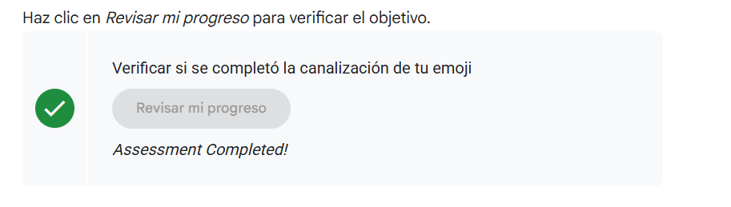
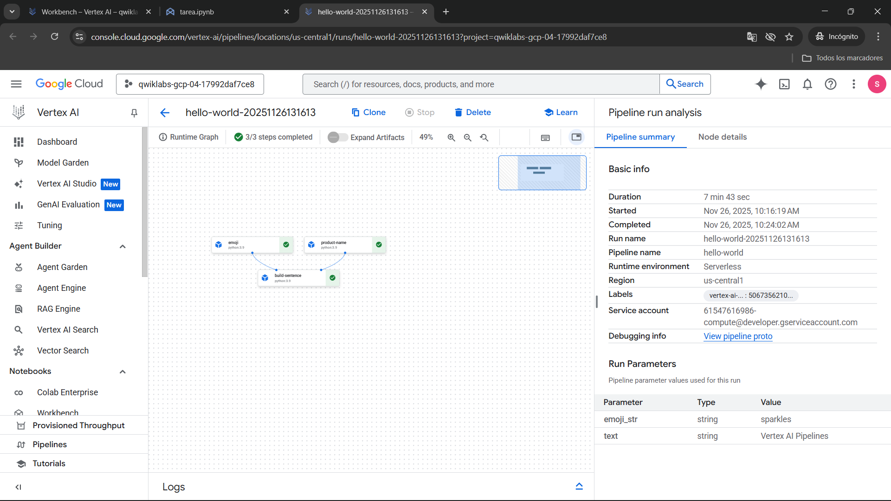
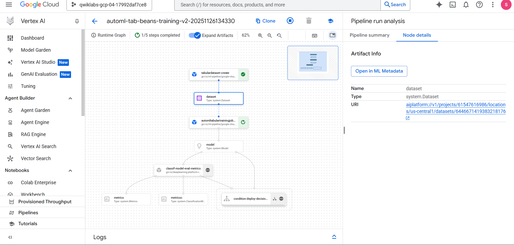
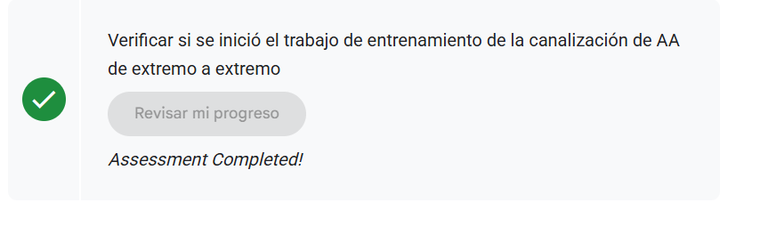

# 🔄 Vertex AI Pipelines: Automatización de Flujos de Trabajo de Machine Learning

## Contexto

El desarrollo de modelos de Machine Learning en producción requiere **procesos reproducibles, escalables y automatizados**. Vertex AI Pipelines integra las capacidades de Google Cloud para orquestar flujos de trabajo completos de ML mediante **Kubeflow Pipelines (KFP)**, permitiendo:

- **Containerización de pasos**: Cada componente ejecuta en su propio contenedor con dependencias aisladas
- **Trazabilidad de artefactos**: Registro automático de datasets, modelos y métricas generadas
- **Ejecución condicional**: Lógica de negocio para decidir deployment basado en métricas de evaluación
- **Integración nativa con Vertex AI**: Componentes predefinidos para AutoML, entrenamiento personalizado y endpoints

Esta práctica aborda dos escenarios: (1) **Pipeline introductorio** con componentes personalizados en Python para comprender la arquitectura de KFP, y (2) **Pipeline de ML de extremo a extremo** que entrena, evalúa y despliega un modelo de clasificación tabular con AutoML, demostrando MLOps en acción.

---

## ⚙️ Objetivos

* **Comprender la arquitectura de Vertex AI Pipelines** (componentes, artefactos, DAGs).
* **Crear componentes personalizados** mediante funciones Python con decoradores KFP.
* **Compilar y ejecutar pipelines** utilizando el SDK de Kubeflow Pipelines v2.
* **Implementar lógica condicional** para toma de decisiones automatizada (ej. deploy si AUC > 0.95).
* **Interactuar con servicios de Vertex AI** mediante componentes predefinidos (AutoML, Model Registry, Endpoints).
* **Validar ejecuciones** a través del sistema de Activity Tracking de Qwiklabs.

---

## Desarrollo

### 🔧 Fase 1: Configuración del Entorno y Dependencias

**Contexto de infraestructura:**

Vertex AI Workbench proporciona notebooks Jupyter gestionados con capacidades de escalado automático. Para este lab, se aprovisiona una instancia `lab-workbench` con:

- **Kernel Python 3.9**: Compatible con KFP v2 y TensorFlow 2.x
- **Acceso a Cloud Storage**: Para almacenar artefactos de pipeline en `gs://{PROJECT_ID}-labconfig-bucket`
- **Service Account preconfigurado**: Con permisos para invocar APIs de Vertex AI

**Instalación de bibliotecas:**

El SDK de KFP v2 introduce cambios arquitectónicos respecto a v1:

- **Decoradores `@component`**: Reemplazan `func_to_container_op()` de KFP v1
- **Artifacts tipados**: `Input[Dataset]`, `Output[Model]` para trazabilidad ML
- **Compilación V2**: Genera JSON YAML-compatible con Argo Workflows

```python
# Instalación modular para evitar conflictos de dependencias
USER_FLAG = "--user"
%pip install $USER_FLAG google-cloud-aiplatform==1.59.0
%pip install $USER_FLAG kfp google-cloud-pipeline-components==0.1.1 --upgrade

# Resolución de conflictos geoespaciales (geopandas depende de shapely/pygeos)
%pip uninstall -y shapely pygeos geopandas
%pip install shapely==1.8.5.post1 pygeos==0.12.0 geopandas>=0.12.2
```

**Verificación de versiones:**
```python
!python3 -c "import kfp; print('KFP SDK version: {}'.format(kfp.__version__))"
# Output esperado: KFP SDK version: 1.8.x (≥ 1.6 requerido)
```

**Configuración de variables de proyecto:**

```python
import os
PROJECT_ID = ""

# Obtención dinámica del ID del proyecto
if not os.getenv("IS_TESTING"):
    shell_output = !gcloud config list --format 'value(core.project)' 2>/dev/null
    PROJECT_ID = shell_output[0]
    print("Project ID:", PROJECT_ID)

# Bucket para artefactos de pipeline
BUCKET_NAME = f"gs://{PROJECT_ID}-labconfig-bucket"

# Región y endpoint de Vertex AI
REGION = "us-central1"
PIPELINE_ROOT = f"{BUCKET_NAME}/pipeline_root/"
```

**Importación de bibliotecas KFP v2:**

```python
from typing import NamedTuple
import kfp
from kfp import dsl
from kfp.v2 import compiler
from kfp.v2.dsl import (Artifact, Dataset, Input, Model, Output,
                        ClassificationMetrics, Metrics, component)
from kfp.v2.google.client import AIPlatformClient

from google.cloud import aiplatform
from google_cloud_pipeline_components import aiplatform as gcc_aip
```

---

### 📦 Fase 2: Pipeline Introductorio - Componentes Personalizados

**Objetivo pedagógico:**

Antes de trabajar con modelos de ML, este pipeline enseña:

- Cómo definir componentes reutilizables con `@component`
- Manejo de dependencias externas (`packages_to_install`)
- Paso de outputs entre componentes mediante `NamedTuple`

**Arquitectura del pipeline:**

```
┌─────────────┐     ┌──────────────┐     ┌────────────────┐
│ product_name│────>│    emoji     │────>│ build_sentence │
└─────────────┘     └──────────────┘     └────────────────┘
      ↓                    ↓                      ↓
   "Vertex AI         "sparkles" ➔ ✨      "Vertex AI Pipelines is ✨"
   Pipelines"
```

**Componente 1: product_name (Paso simple de datos)**

```python
@component(
    base_image="python:3.9",
    output_component_file="first-component.yaml"  # Opcional: para compartir componente
)
def product_name(text: str) -> str:
    """Componente que retorna el texto de entrada sin transformación."""
    return text
```

**Detalles técnicos:**

- `base_image`: Imagen Docker base del contenedor (Python 3.9 oficial)
- `output_component_file`: Genera YAML reutilizable (`kfp.components.load_component_from_file()`)
- Tipado `-> str`: KFP infiere automáticamente el artifact de salida

**Componente 2: emoji (Manejo de dependencias externas)**

```python
@component(
    base_image="python:3.9",
    output_component_file="second-component.yaml",
    packages_to_install=["emoji"]  # Se instala en el contenedor al ejecutar
)
def emoji(text: str) -> NamedTuple("Outputs", [("emoji_text", str), ("emoji", str)]):
    """Convierte código de texto (ej. 'sparkles') a emoji Unicode (✨)."""
    import emoji

    emoji_text = text
    emoji_str = emoji.emojize(f':{emoji_text}:', language='alias')
    print(f"output one: {emoji_text}; output_two: {emoji_str}")
    
    return (emoji_text, emoji_str)
```

**Innovaciones clave:**

- `packages_to_install`: KFP ejecuta `pip install emoji` en el contenedor antes de correr la función
- `NamedTuple` con claves: Permite acceder a outputs específicos mediante `emoji_task.outputs["emoji"]`

**Componente 3: build_sentence (Consumo de múltiples outputs)**

```python
@component(base_image="python:3.9", output_component_file="third-component.yaml")
def build_sentence(product: str, emoji: str, emojitext: str) -> str:
    """Construye oración combinando outputs de componentes previos."""
    print("We completed the pipeline, hooray!")
    
    end_str = product + " is "
    end_str += emoji if len(emoji) > 0 else emojitext
    
    return end_str
```

**Conexión de componentes en el pipeline:**

```python
@dsl.pipeline(
    name="hello-world",
    description="Pipeline introductorio con componentes personalizados",
    pipeline_root=PIPELINE_ROOT,
)
def intro_pipeline(text: str = "Vertex AI Pipelines", emoji_str: str = "sparkles"):
    # Paso 1: Obtener nombre del producto
    product_task = product_name(text)
    
    # Paso 2: Convertir texto a emoji
    emoji_task = emoji(emoji_str)
    
    # Paso 3: Construir oración usando outputs previos
    consumer_task = build_sentence(
        product_task.output,              # Output único del paso 1
        emoji_task.outputs["emoji"],      # Output específico del NamedTuple
        emoji_task.outputs["emoji_text"], # Otro output del mismo componente
    )
```

**Compilación y ejecución:**

```python
# 1. Compilar pipeline a JSON (compatible con Argo Workflows)
compiler.Compiler().compile(
    pipeline_func=intro_pipeline,
    package_path="intro_pipeline_job.json"
)

# 2. Crear cliente de Vertex AI Pipelines
api_client = AIPlatformClient(project_id=PROJECT_ID, region=REGION)

# 3. Ejecutar pipeline
response = api_client.create_run_from_job_spec(
    job_spec_path="intro_pipeline_job.json"
)
```

**Evidencia técnica (Foto 1-2):**

La **Foto 1** muestra el sistema de validación de Qwiklabs con:

- ✅ **Assessment Completed!** para la tarea "Verificar si se completó la canalización de tu emoji"
- Icono verde de confirmación
- Botón "Revisar mi progreso" (activo después de la ejecución exitosa)

La **Foto 2** muestra el pipeline completado en la consola de Vertex AI con:

- **Runtime Graph**: DAG visual con 3 nodos (emoji, product-name, build-sentence)
- **3/3 steps completed**: Checkmarks verdes en todos los componentes
- **Pipeline summary**: Duración de 7 min 43 sec, completado el 26/11/2025 a las 10:24:02
- **Run Parameters**: 
  - `emoji_str: "sparkles"` (tipo: string)
  - `text: "Vertex AI Pipelines"` (tipo: string)

**Análisis del grafo de ejecución:**

El DAG muestra dependencias claras:

1. `emoji` y `product-name` ejecutan en paralelo (sin dependencias mutuas)
2. `build-sentence` espera a que ambos completen antes de ejecutar
3. Cada nodo tiene ícono de estado (✅ = success, ⏳ = running, ❌ = failed)

---

### 🤖 Fase 3: Pipeline de ML de Extremo a Extremo

**Contexto del dataset:**

Se utiliza el **UCI Machine Learning Dry Beans Dataset** (KOKLU & OZKAN, 2020), que contiene 13,611 imágenes de 7 tipos de frijoles con 16 características geométricas:

- **Features**: Area, Perimeter, MajorAxisLength, MinorAxisLength, AspectRatio, Eccentricity, ConvexArea, EquivDiameter, Extent, Solidity, Roundness, Compactness, ShapeFactor1-4
- **Target**: Class (7 categorías: SEKER, BARBUNYA, BOMBAY, CALI, HOROZ, SIRA, DERMASON)

**Arquitectura del pipeline:**

```
┌──────────────────────┐
│ TabularDatasetCreate │ (BigQuery → Vertex AI Dataset)
└──────────┬───────────┘
           │
           ▼
┌──────────────────────┐
│  AutoMLTrainingJob   │ (Entrenamiento de modelo de clasificación)
└──────────┬───────────┘
           │
           ▼
┌──────────────────────┐
│  classif_model_eval  │ (Evaluación + ROC curve + Confusion Matrix)
└──────────┬───────────┘
           │
           ▼
    ┌──────────────┐
    │  Condition   │ (¿AUC ROC > 0.95?)
    └──────┬───────┘
           │
    ┌──────┴──────┐
    │ YES         │ NO
    ▼             ▼
┌────────────┐   🛑 Fin
│ ModelDeploy│   (No se despliega)
└────────────┘
```

**Componente personalizado: classif_model_eval_metrics**

Este componente es el **núcleo de la lógica MLOps**:

```python
@component(
    base_image="gcr.io/deeplearning-platform-release/tf2-cpu.2-3:latest",
    output_component_file="tables_eval_component.yaml",
    packages_to_install=["google-cloud-aiplatform"],
)
def classif_model_eval_metrics(
    project: str,
    location: str,
    api_endpoint: str,
    thresholds_dict_str: str,  # JSON con umbrales: '{"auRoc": 0.95}'
    model: Input[Model],        # Modelo entrenado de AutoML
    metrics: Output[Metrics],   # Métricas textuales
    metricsc: Output[ClassificationMetrics],  # ROC curve + Confusion Matrix
) -> NamedTuple("Outputs", [("dep_decision", str)]):
    """
    Evalúa modelo de clasificación y decide deployment basado en umbrales.
    
    Proceso:
    1. Obtiene evaluaciones del Model Registry de Vertex AI
    2. Renderiza curva ROC y matriz de confusión en UI de Pipelines
    3. Compara AUC ROC con umbral definido
    4. Retorna "true" o "false" para activar deployment condicional
    """
    import json
    import logging
    from google.cloud import aiplatform
    from google.protobuf.json_format import MessageToDict

    # Función auxiliar: Obtener métricas de evaluación
    def get_eval_info(client, model_name):
        response = client.list_model_evaluations(parent=model_name)
        metrics_list = []
        
        for evaluation in response:
            metrics = MessageToDict(evaluation._pb.metrics)
            logging.info(f"Evaluation metrics: {metrics}")
            metrics_list.append(metrics)
        
        return evaluation.name, metrics_list

    # Función auxiliar: Verificar umbrales
    def classification_thresholds_check(metrics_dict, thresholds_dict):
        for metric_name, threshold_value in thresholds_dict.items():
            if metric_name in ["auRoc", "auPrc"]:  # Mayor es mejor
                if metrics_dict[metric_name] < threshold_value:
                    logging.warning(f"{metric_name}={metrics_dict[metric_name]} < {threshold_value}")
                    return False
        return True

    # Función auxiliar: Renderizar métricas en UI
    def log_metrics(metrics_list, metricsc):
        # 1. Curva ROC
        fpr, tpr, thresholds = [], [], []
        for item in metrics_list[0]["confidenceMetrics"]:
            fpr.append(item.get("falsePositiveRate", 0.0))
            tpr.append(item.get("recall", 0.0))
            thresholds.append(item.get("confidenceThreshold", 0.0))
        
        metricsc.log_roc_curve(fpr, tpr, thresholds)

        # 2. Matriz de confusión
        confusion_matrix = metrics_list[0]["confusionMatrix"]
        annotations = [spec["displayName"] for spec in confusion_matrix["annotationSpecs"]]
        metricsc.log_confusion_matrix(annotations, confusion_matrix["rows"])

    # Inicializar cliente de Vertex AI
    aiplatform.init(project=project)
    model_resource_path = model.uri.replace("aiplatform://v1/", "")
    
    client = aiplatform.gapic.ModelServiceClient(
        client_options={"api_endpoint": api_endpoint}
    )

    # Obtener y renderizar métricas
    eval_name, metrics_list = get_eval_info(client, model_resource_path)
    log_metrics(metrics_list, metricsc)

    # Decidir deployment
    thresholds_dict = json.loads(thresholds_dict_str)
    deploy = classification_thresholds_check(metrics_list[0], thresholds_dict)
    
    dep_decision = "true" if deploy else "false"
    logging.info(f"Deployment decision: {dep_decision}")
    
    return (dep_decision,)
```

**Definición del pipeline completo:**

```python
import time
DISPLAY_NAME = f'automl-beans{int(time.time())}'  # Nombre único con timestamp

@kfp.dsl.pipeline(
    name="automl-tab-beans-training-v2",
    pipeline_root=PIPELINE_ROOT
)
def pipeline(
    bq_source: str = "bq://aju-dev-demos.beans.beans1",  # Tabla de BigQuery
    display_name: str = DISPLAY_NAME,
    project: str = PROJECT_ID,
    gcp_region: str = "us-central1",
    api_endpoint: str = "us-central1-aiplatform.googleapis.com",
    thresholds_dict_str: str = '{"auRoc": 0.95}',  # Umbral: AUC ROC > 95%
):
    # PASO 1: Crear dataset tabular desde BigQuery
    dataset_create_op = gcc_aip.TabularDatasetCreateOp(
        project=project,
        display_name=display_name,
        bq_source=bq_source
    )

    # PASO 2: Entrenar modelo con AutoML Tabular
    training_op = gcc_aip.AutoMLTabularTrainingJobRunOp(
        project=project,
        display_name=display_name,
        optimization_prediction_type="classification",
        budget_milli_node_hours=1000,  # ~1 hora de entrenamiento
        column_transformations=[
            {"numeric": {"column_name": "Area"}},
            {"numeric": {"column_name": "Perimeter"}},
            # ... (16 features numéricas)
            {"categorical": {"column_name": "Class"}},  # Target
        ],
        dataset=dataset_create_op.outputs["dataset"],  # Dataset del paso 1
        target_column="Class",
    )

    # PASO 3: Evaluar modelo y decidir deployment
    model_eval_task = classif_model_eval_metrics(
        project,
        gcp_region,
        api_endpoint,
        thresholds_dict_str,
        training_op.outputs["model"],  # Modelo entrenado del paso 2
    )

    # PASO 4: Deployment condicional (solo si AUC > 0.95)
    with dsl.Condition(
        model_eval_task.outputs["dep_decision"] == "true",
        name="deploy_decision",
    ):
        deploy_op = gcc_aip.ModelDeployOp(
            model=training_op.outputs["model"],
            project=project,
            machine_type="e2-standard-4",  # 4 vCPUs, 16 GB RAM
        )
```

**Compilación y ejecución:**

```python
# 1. Compilar pipeline
compiler.Compiler().compile(
    pipeline_func=pipeline,
    package_path="tab_classif_pipeline.json"
)

# 2. Ejecutar con parámetros específicos
response = api_client.create_run_from_job_spec(
    "tab_classif_pipeline.json",
    pipeline_root=PIPELINE_ROOT,
    parameter_values={
        "project": PROJECT_ID,
        "display_name": DISPLAY_NAME
    }
)
```

**Evidencia técnica (Foto 3-4):**

La **Foto 3** muestra el pipeline de ML en ejecución con:

- **Pipeline name**: `automl-tab-beans-training-v2-20251126134330`
- **Runtime Graph**: DAG expandido con 5+ nodos visibles
- **1/5 steps completed** (62% progreso): Completados `tabulardataset-create` y `dataset` (artifact)
- **Node details panel**: Muestra información del artifact `dataset`:
  - **Name**: dataset
  - **Type**: system.Dataset
  - **URI**: `aiplatform://v1/projects/61547616986/locations/us-central1/datasets/6446671419383218176`
  - Botón **Open in ML Metadata**: Para explorar linaje en Vertex ML Metadata

La **Foto 4** confirma la validación de Activity Tracking:

- ✅ **Assessment Completed!**
- Mensaje: "Verificar si se inició el trabajo de entrenamiento de la canalización de AA de extremo a extremo"

**Análisis del grafo de ejecución:**

El grafo muestra la naturaleza secuencial del pipeline ML:

1. **tabulardataset-create**: Ejecutado ✅ (creó dataset desde BigQuery)
2. **automl-tabular-training-job**: En progreso ⏳ (entrenamiento de modelo, ~1 hora)
3. **classif-model-eval-metrics**: Pendiente (espera a que training complete)
4. **condition-deploy-decision**: Pendiente (nodo condicional)
5. **model-deploy**: Pendiente (solo ejecuta si condition = true)

---

## 💭 Reflexión

Esta práctica demuestra que **Vertex AI Pipelines transforma flujos de trabajo de ML experimentales en sistemas de producción reproducibles**. Tres aprendizajes críticos:

### 1. La containerización resuelve "funciona en mi máquina"

Cada componente ejecuta en contenedores aislados con:

- **Dependencias explícitas**: `packages_to_install=["emoji", "scikit-learn"]`
- **Versiones pinneadas**: `base_image="python:3.9"` evita sorpresas por actualizaciones
- **Portabilidad**: El mismo pipeline puede ejecutar en Kubernetes, Vertex AI o on-premise con Kubeflow

### 2. Lógica condicional en pipelines es MLOps avanzado

El bloque `with dsl.Condition()` implementa **gates de calidad automatizados**:

```python
with dsl.Condition(model_eval_task.outputs["dep_decision"] == "true"):
    deploy_op = ...  # Solo ejecuta si AUC ROC > umbral
```

### 3. Trazabilidad de artefactos es auditoría, no burocracia

**Impacto en regulación:**
La FDA (Food and Drug Administration) exige que modelos de ML médicos documenten:

1. Datos de entrenamiento
2. Proceso de validación
3. Cambios en el modelo a lo largo del tiempo

Vertex AI Pipelines genera automáticamente esta documentación mediante artifacts tipados (`Input[Dataset]`, `Output[Model]`).

---

## 🔍 Comparativa: Pipeline Manual vs Automatizado

| Aspecto | Pipeline Manual (Scripts Python) | Vertex AI Pipelines |
|---------|----------------------------------|---------------------|
| **Reproducibilidad** | Depende de documentación humana | Compilación declarativa (JSON) |
| **Paralelización** | Requiere código custom (multiprocessing) | Automática si no hay dependencias |
| **Monitoreo** | Logs dispersos en Cloud Logging | UI centralizada con DAG visual |
| **Costos** | Difícil rastrear recursos por experimento | Cada run tiene etiqueta de costos |
| **Rollback** | Restaurar código + datos manualmente | Reejecutar pipeline de versión anterior |

---

## Evidencias

### Foto 1 - Validación de Activity Tracking confirmando pipeline de emoji completado:


### Foto 2 - Consola de Vertex AI mostrando ejecución exitosa del pipeline hello-world:


### Foto 3 - Pipeline de ML en ejecución mostrando creación de dataset y training job iniciado:


### Foto 4 - Confirmación de Activity Tracking para inicio de trabajo de entrenamiento:

