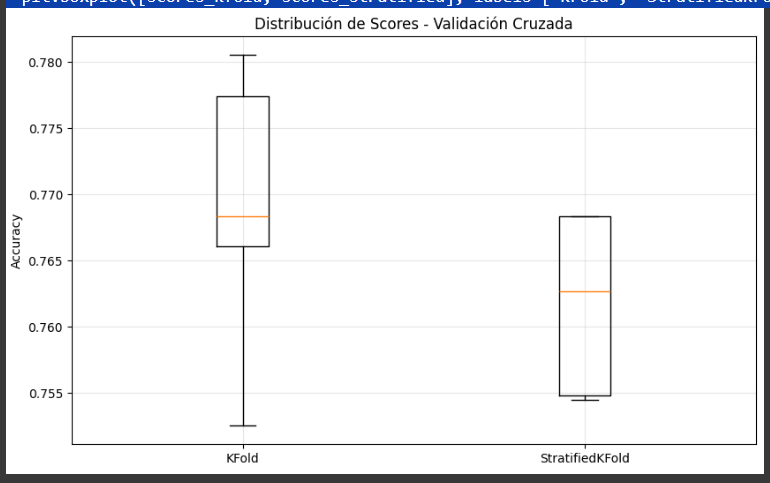
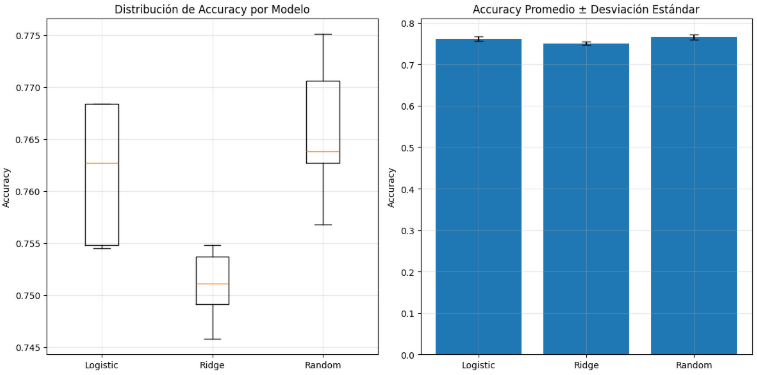
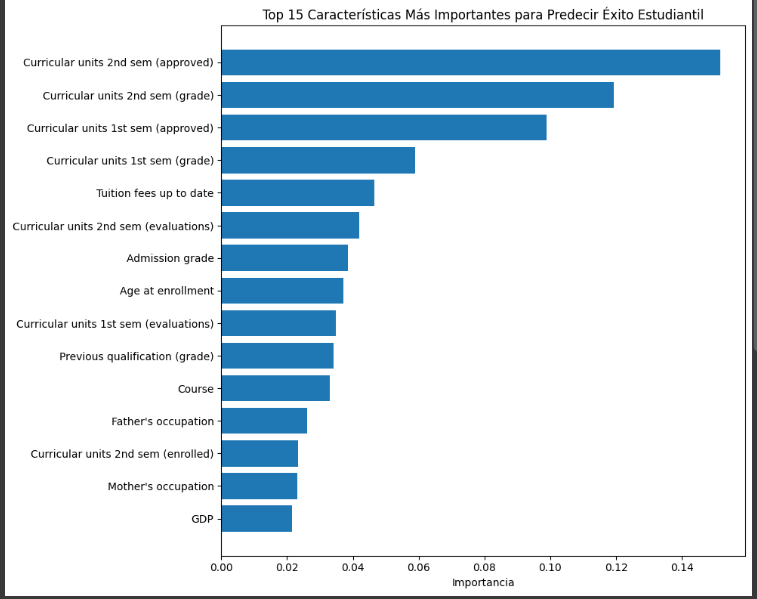
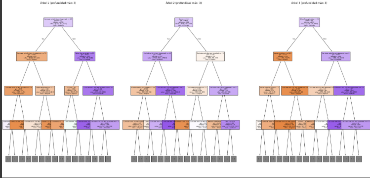

# 📝 Práctica 5 — Validación y Selección de Modelos 

## Contexto

En esta práctica trabajamos con un dataset de estudiantes con el objetivo de **predecir abandono, inscripción y graduación** en educación superior.  

El propósito fue **aprender técnicas de validación cruzada, comparar modelos de clasificación, optimizar hiperparámetros y aplicar métodos de explicabilidad**.  

El enfoque combina aspectos **técnicos** (uso de pipelines, cross-validation, GridSearchCV, RandomizedSearchCV, Random Forest) con aspectos **prácticos** (interpretación de resultados, detección de sesgos y aplicabilidad en educación).  

De esta forma, se busca no solo entrenar un modelo con buen desempeño, sino también que sea confiable y explicable en un contexto real.

---

## 📋 Marco Teórico

En esta práctica se trabajan distintos conceptos fundamentales del *Machine Learning clásico*, necesarios para comprender y aplicar técnicas de validación y selección de modelos.

### Train/Test Split
Consiste en dividir los datos en dos subconjuntos:  
- **Entrenamiento**: utilizado para ajustar el modelo.  
- **Prueba**: utilizado para evaluar su rendimiento en datos no vistos.  

Este proceso permite estimar cómo se comportará el modelo en producción y evita la sobreestimación de su precisión.

### Clasificación vs Regresión
- **Clasificación**: la variable objetivo es categórica (ejemplo: abandono, inscrito, graduado).  
- **Regresión**: la variable objetivo es continua (ejemplo: predicción de ingresos, precio de una vivienda).  

La diferencia radica en el tipo de salida que produce cada modelo y en las métricas usadas para evaluarlos.

### Data Leakage
El *data leakage* (contaminación de datos) ocurre cuando información del conjunto de prueba o de datos futuros se filtra en el proceso de entrenamiento. Esto genera métricas artificialmente infladas y modelos que fallan en producción.  
Un ejemplo común es normalizar o escalar todo el dataset antes de dividirlo en train/test.

### Pipeline
Un *pipeline* es una secuencia ordenada de pasos (transformaciones y modelo) que se ejecutan de forma automática. Los pipelines garantizan reproducibilidad, evitan errores de orden y ayudan a prevenir *data leakage*.  
Ejemplo: primero estandarizar los datos con `StandardScaler` y luego entrenar un modelo.

### Validación Cruzada (Cross-Validation)
Es una técnica que divide los datos en *k* particiones (folds). El modelo se entrena y valida *k* veces, usando en cada iteración un fold diferente como prueba.  
El resultado final es el promedio de todas las pruebas, lo que ofrece una estimación más robusta y confiable del desempeño del modelo.

### Métricas de Estabilidad
Además del promedio de métricas como accuracy, se analiza la desviación estándar obtenida en la validación cruzada.  
- Un modelo **estable** tiene poca variación entre folds.  
- Un modelo **inestable** puede mostrar buen desempeño en algunos folds y muy malo en otros.

### Comparación de Modelos
Para seleccionar el mejor modelo se entrenan y evalúan diferentes algoritmos bajo las mismas condiciones.  
En este caso, se comparan modelos como **Logistic Regression, RidgeClassifier y Random Forest**, considerando no solo la precisión, sino también su estabilidad y robustez.

---

## 🎯 Objetivos

- Aprender a prevenir data leakage usando pipelines
- Implementar validación cruzada (cross-validation) robusta
- Comparar múltiples modelos de forma sistemática
- Interpretar métricas de estabilidad y selección de modelos

---

## Actividades (con tiempos estimados)

| Actividad                              | Resultado esperado                                                         |
| -------------------------------------- | -------------------------------------------------------------------------- |
| Setup inicial                          | Librerías cargadas y entorno listo.                                        |
| Cargar y explorar datos de estudiantes | Dataset cargado y explorado.                                               |
| Preparar datos para validación         | Variables listas en formato numérico y sin errores.                        |
| Implementar Validación Cruzada         | Comparación entre KFold y StratifiedKFold, análisis de estabilidad.        |
| Competencia de Múltiples Modelos       | Selección del mejor algoritmo (Random Forest).                             |
| GridSearchCV y RandomizedSearchCV      | Optimización de hiperparámetros del modelo ganador.                        |
| Explicabilidad del modelo              | Análisis de características más influyentes y decisiones individuales.     |
| Preguntas de Reflexión                 | Respuestas a cuestiones conceptuales clave sobre validación y estabilidad. |

---

## Desarrollo

### 🏠 1. Setup inicial

En este paso se prepara el entorno de trabajo para realizar la práctica. Esto incluye:
- Instalar librerías necesarias como ucimlrepo para cargar datasets de UCI ML Repository.
- Importar librerías esenciales para manipulación de datos (pandas, numpy), visualización (matplotlib.pyplot) y machine learning (sklearn).
- Importar clases y funciones para modelado, validación, escalado y pipelines.

Preparar el entorno asegura que todos los pasos posteriores se puedan ejecutar sin errores y evita problemas de dependencias o imports faltantes. Además, facilita la prevención de data leakage, la validación cruzada y el uso de pipelines, fundamentales para esta práctica.

#### 💡 PISTAS:

- **RidgeClassifier** → Regularización L2 para controlar complejidad del modelo lineal.
- **RandomForestClassifier** → Combina varios árboles de decisión para mejorar precisión y estabilidad.
- **cross_val_score** → Evalúa el modelo con validación cruzada y evita usar los mismos datos para entrenar y validar.
- **StratifiedKFold** → Mantiene proporción de clases en cada pliegue, importante en datasets desbalanceados.
- **StandardScaler** → Normaliza características para que tengan la misma escala, importante para algoritmos basados en distancia o gradiente.

### 🎓  2. Cargar y explorar datos de estudiantes

**Contexto de negocio:**

- Problema: Predecir abandono estudiantil y éxito académico en educación superior
- Objetivo: Identificar estudiantes en riesgo para implementar estrategias de apoyo
- Variables: 36 características (demográficas, académicas, socioeconómicas)
- Valor: Reducir tasas de abandono, mejorar retención estudiantil

- Se carga el dataset desde UCI ML Repository usando fetch_ucirepo.
- Se separan las features (X) de la variable objetivo (y).
- Se explora la información básica del dataset: número de estudiantes y características, nombres de las primeras columnas y estadísticas de interés (edad al matricularse, etc.).
- Se analiza la variable objetivo: clases presentes, distribución y significado de cada categoría.

Conocer el dataset permite entender la estructura de los datos antes de entrenar modelos.

Identificar si las clases están balanceadas es clave para seleccionar métricas adecuadas y técnicas de validación cruzada.

Revisar estadísticas básicas ayuda a detectar posibles valores atípicos o inconsistencias.


- **Muestras y características**  
  El dataset contiene **4424 estudiantes** y **36 características**.  
  Estas variables incluyen información de tipo **demográfica** (edad, estado civil, nacionalidad), **académica** (curso, modalidad de asistencia, calificaciones previas) y **socioeconómica** (nivel educativo de los padres, situación laboral, entre otras).

- **Variable objetivo (`Target`)**  
  La variable de salida representa el resultado académico de cada estudiante. Existen **tres categorías posibles**:  
  1. **Dropout** → El estudiante abandonó la carrera.  
  2. **Enrolled** → El estudiante sigue inscrito pero no ha finalizado.  
  3. **Graduate** → El estudiante completó la carrera y se graduó.

- **Balance de clases**  
  Las clases **no están balanceadas**: algunas categorías (como abandono y graduación) son más frecuentes que otras (inscripción en curso).  
  Esto implica que la métrica de **accuracy** puede no ser suficiente y será necesario usar métricas como **F1-score** o **balanced accuracy** junto con validación estratificada.

- **Ejemplo de variables**  
  Entre las primeras columnas del dataset se encuentran:  
  - *Marital Status* (estado civil)  
  - *Application mode* (modo de aplicación)  
  - *Daytime/evening attendance* (asistencia diurna/nocturna)  
  - *Previous qualification (grade)* (nota de estudios previos)  
  - *Mother’s qualification* y *Father’s qualification* (educación de los padres)  

- **Edad de matrícula**  
  La variable **Age at enrollment** muestra:  
  - Promedio: **23.3 años**  
  - Rango: **17 a 70 años**

📌 **Conclusión de la exploración**  
El dataset combina información de diferentes dominios (demográfico, académico y socioeconómico). La variable objetivo es **multiclase** con clases desbalanceadas, lo cual representa un desafío de modelado.  
Será importante aplicar técnicas de validación adecuadas, como **StratifiedKFold**, para preservar la proporción de clases en los experimentos.

### 🔧 3. Preparar datos para validación

En este paso se adaptan las variables del dataset para que sean compatibles con los modelos de *scikit-learn*.  
La preparación de datos es esencial porque muchas veces los datasets contienen variables en formato **string** o categórico que no pueden procesarse directamente en los algoritmos de machine learning.

Las acciones realizadas fueron:

- **Conversión de la variable objetivo (`Target`)**  
  El dataset trae la columna objetivo como categorías (`Dropout`, `Enrolled`, `Graduate`).  
  Se creó un **mapeo numérico** para traducir estas clases a enteros:
  - `Dropout → 0`
  - `Enrolled → 1`
  - `Graduate → 2`  

  Esto permite que *sklearn* entrene modelos de clasificación correctamente.

- **Chequeo de tipos de datos**  
  Se verificó si la variable objetivo estaba en formato string y, en caso afirmativo, se transformó usando el diccionario `reverse_mapping`.

- **Separación de features y target**  
  - `X_features`: contiene las 36 características del estudiante (variables demográficas, académicas y socioeconómicas).  
  - `y_target`: contiene la variable de salida en formato numérico.  

- **Validación de las dimensiones**  
  Se imprimieron las formas de `X` e `y`, además de las clases únicas disponibles, para confirmar que los datos quedaron consistentes.


### 🔄 4. Implementar Validación Cruzada

En este paso buscamos responder la pregunta:  
**¿Qué tan estable es el desempeño de nuestro modelo según la forma de partir los datos?**

#### ⚙️ Decisiones tomadas

- **Pipeline con `StandardScaler` + `LogisticRegression`**  
  Se eligió este pipeline porque:
  - La regresión logística requiere que los datos estén **escalados** para evitar que variables con distinta magnitud dominen la función de costo.  
  - El `StandardScaler` convierte todas las variables a media 0 y varianza 1, lo que mejora la convergencia del modelo.  
  - La regresión logística (`LogisticRegression`) es un modelo interpretable y adecuado para clasificación multiclase (Dropout, Enrolled, Graduate).

- **Comparación de dos técnicas de validación cruzada**:  
  - **KFold**: divide los datos en 5 particiones aleatorias, sin preocuparse por la proporción de clases.  
  - **StratifiedKFold**: divide en 5 particiones, pero manteniendo la **misma proporción de clases** en cada fold, algo fundamental en datasets desbalanceados.  

#### 📊 Resultados obtenidos

- **KFold**  
  - Scores: `[0.7525, 0.7661, 0.7684, 0.7774, 0.7805]`  
  - Media: **0.7690**  
  - Desviación estándar: **0.0098**

- **StratifiedKFold**  
  - Scores: `[0.7684, 0.7684, 0.7627, 0.7548, 0.7545]`  
  - Media: **0.7618**  
  - Desviación estándar: **0.0061**

Se generó un gráfico de cajas comparando ambas técnicas de validación cruzada que se encuentra en evidencias como grafica 1.

- El **KFold** mostró una media más alta de accuracy (~0.769), pero con **mayor variabilidad** en los resultados.  
- El **StratifiedKFold** tuvo una media ligeramente inferior (~0.762), pero con **menor dispersión**, lo que indica **mayor estabilidad**.  

Entonces:

- **KFold**: logra mejor media de accuracy, pero es menos estable.  
- **StratifiedKFold**: aunque el promedio es un poco más bajo, garantiza que cada fold represente bien las proporciones de clases.  

### 🏆 5. Competencia de Múltiples Modelos

En este paso realizamos una **competencia entre diferentes algoritmos de clasificación** para identificar cuál ofrece mejor desempeño en el diagnóstico médico.  

#### ⚙️ Decisiones tomadas

1. **Logistic Regression (con escalado)**  
   - Se utilizó un `Pipeline` con `StandardScaler` y `LogisticRegression`.  
   - La regresión logística requiere escalado para que la magnitud de las variables no afecte el ajuste del modelo.  
   - Es un modelo **interpretable** y ampliamente usado en problemas médicos.

2. **Ridge Classifier (con regularización L2)**  
   - Variante de la regresión logística que incluye regularización L2 para evitar **overfitting**.  
   - También requiere escalado, por lo que se incluyó `StandardScaler`.  

3. **Random Forest (ensemble, sin escalado)**  
   - Modelo basado en múltiples árboles de decisión (bagging).  
   - No requiere escalado ya que los árboles se basan en umbrales de variables y no en magnitudes.  
   - Se espera un mejor desempeño en datasets con relaciones no lineales.  

#### 📊 Resultados obtenidos

- **Logistic Regression**  
  - Accuracy promedio: **0.7618**  
  - Desviación estándar: **0.0061**  
  - Muy estable (scores: `[0.768, 0.768, 0.763, 0.755, 0.755]`)

- **Ridge Classifier**  
  - Accuracy promedio: **0.7509**  
  - Desviación estándar: **0.0032**  
  - Muy estable, pero con menor desempeño que la regresión logística estándar.  

- **Random Forest**  
  - Accuracy promedio: **0.7658**  
  - Desviación estándar: **0.0064**  
  - Muy estable y el **mejor resultado global**.  

Se generaron dos gráficas comparativas que se encuentran en evidencias como grafica 2.

1. **Distribución de Accuracy por Modelo (Boxplot)**  
   - Permite ver la dispersión de los scores de validación cruzada.  
   - El modelo **Random Forest** muestra valores consistentemente más altos.  

2. **Accuracy Promedio ± Desviación Estándar (Barplot)**  
   - Resume el rendimiento promedio de cada modelo junto con su estabilidad.  
   - El **Random Forest** lidera en accuracy, mientras que Ridge queda rezagado.  

- **Ganador**: **Random Forest**, con un accuracy promedio de **0.7658** y variabilidad baja.  
- **Ridge Classifier** resultó el más débil, lo que muestra que en este dataset la regularización fuerte no fue beneficiosa.  
- **Logistic Regression** se mantiene como alternativa estable e interpretable, aunque con menor rendimiento que Random Forest.  

### 🎁 BONUS: ¿Qué significan las métricas de validación?

- **Cross-Validation**:  
  Técnica que divide los datos en **k partes (folds)** para entrenar y evaluar múltiples veces.  
  Permite estimar el desempeño del modelo de forma más robusta que un único split.

- **Accuracy promedio**:  
  La **media** de rendimiento esperado en datos nuevos.  
  Resume el desempeño global del modelo en todos los folds.

- **Desviación estándar**:  
  Indica qué tan **estable o variable** es el modelo entre diferentes divisiones de datos.  
  Valores bajos significan mayor consistencia.

- **StratifiedKFold**:  
  Mantiene la **proporción** de clases en cada fold, lo cual es especialmente importante en datasets desbalanceados para evitar sesgos.

### ⚙️ 6. GridSearchCV y RandomizedSearchCV

En este paso realizamos la **optimización de hiperparámetros** para el modelo ganador de la competencia (**Random Forest**).  
La motivación es que, incluso después de elegir el mejor algoritmo, su rendimiento puede variar según los valores de sus hiperparámetros.  
Por lo tanto, necesitamos ajustar dichos parámetros de forma sistemática.

#### 🔑 Decisiones tomadas

1. **Selección de métodos de búsqueda**
   - Usamos **GridSearchCV** y **RandomizedSearchCV** de `sklearn.model_selection`.  
   - Ambos permiten explorar combinaciones de hiperparámetros, pero con estrategias diferentes:  
     - **GridSearchCV** prueba **todas las combinaciones posibles** (exhaustivo).  
     - **RandomizedSearchCV** selecciona **combinaciones aleatorias** (más rápido en espacios grandes).  

2. **Espacios de búsqueda**
   - **Random Forest**: número de estimadores, profundidad máxima y tamaño mínimo de split.  
   - **Logistic Regression**: parámetro de regularización `C` y número de iteraciones.  
   - **Ridge**: fuerza de regularización `alpha`.  

   Como el modelo ganador fue **Random Forest**, el espacio de búsqueda usado incluyó:
   - `n_estimators`: [50, 100, 200]  
   - `max_depth`: [None, 10, 20, 30]  
   - `min_samples_split`: [2, 5, 10]  

#### 📊 Resultados obtenidos

- **GridSearchCV** (36 combinaciones probadas):  
  - Mejores parámetros: `max_depth=None`, `min_samples_split=5`, `n_estimators=100`  
  - Accuracy promedio: **0.7783**  

- **RandomizedSearchCV** (20 combinaciones aleatorias):  
  - Mejores parámetros: `n_estimators=100`, `min_samples_split=5`, `max_depth=30`  
  - Accuracy promedio: **0.7783**  

**Comparación de eficiencia:**
- GridSearch evaluó **36 configuraciones** → más exhaustivo pero más lento.  
- RandomizedSearch evaluó **20 configuraciones** → más rápido, mismo resultado.  

**Modelo final optimizado:**  
- Accuracy promedio = **0.7783 ± 0.0067**  

#### 🧾 Interpretación

- Ambos métodos encontraron configuraciones con desempeño muy similar.  
- **GridSearchCV** asegura explorar todo el espacio definido, pero es más costoso computacionalmente.  
- **RandomizedSearchCV** fue más eficiente, obteniendo prácticamente el mismo resultado en menos tiempo.  
- El **Random Forest optimizado** mantiene un rendimiento estable y es el modelo final seleccionado.  

#### 💡 Guía de decisión (cuándo usar cada método)

- **GridSearchCV** cuando tienes **pocos** hiperparámetros y **suficiente** tiempo de cómputo.  
- **RandomizedSearchCV** cuando tienes **muchos** hiperparámetros o tiempo limitado.  
- **Pipeline + SearchCV** siempre previene **data leakage** automáticamente.  
- **cross_val_score** en el resultado final valida que la optimización no causó **overfitting**.  

### 🔍 7. ¿Por qué el modelo toma esas decisiones?

En este paso buscamos **explicabilidad del modelo ganador (Random Forest)** para comprender cómo llega a sus predicciones y qué factores influyen en el abandono o éxito estudiantil.  
La motivación es que un modelo no solo debe ser preciso, sino también **interpretable**, para que las decisiones puedan respaldar intervenciones reales en la educación superior.

#### 🔑 Decisiones tomadas

1. **Modelo para explicabilidad**
   - Se utilizó el **Random Forest optimizado** (modelo ganador).  
   - Al no requerir escalado, se trabajó directamente con los datos originales.  

2. **Técnicas aplicadas**
   - **Feature Importance** → Importancia relativa de cada característica.  
   - **Análisis por categorías** → Se agruparon variables en factores académicos, demográficos y económicos.  
   - **Predicciones individuales** → Ejemplo de interpretación para un estudiante en riesgo.  
   - **Visualización de árboles** → Se graficaron árboles individuales para mostrar reglas de decisión.  
   - **Diversidad del bosque** → Se explicó cómo la variabilidad entre árboles potencia al Random Forest.  

#### 📊 Resultados obtenidos

- **Top 10 características más importantes:**
  1. Curricular units 2nd sem (approved) → **0.1516**
  2. Curricular units 2nd sem (grade) → **0.1193**
  3. Curricular units 1st sem (approved) → **0.0987**
  4. Curricular units 1st sem (grade) → **0.0589**
  5. Tuition fees up to date → **0.0466**
  6. Curricular units 2nd sem (evaluations) → **0.0419**
  7. Admission grade → **0.0385**
  8. Age at enrollment → **0.0372**
  9. Curricular units 1st sem (evaluations) → **0.0349**
  10. Previous qualification (grade) → **0.0343**

- Se generó la **Gráfica 3** mostrando las 15 características más importantes se encuentra en evidencias.
- La característica más relevante fue: **Curricular units 2nd sem (approved)**.  
- Esto sugiere que para reducir el abandono estudiantil se debe intervenir en:
  1. Monitorear y mejorar: Curricular units 2nd sem (approved)  
  2. Monitorear y mejorar: Curricular units 2nd sem (grade)  
  3. Monitorear y mejorar: Curricular units 1st sem (approved)  

**👤 Análisis individual**

- Estudiante #0 → Predicción: **Dropout**  
  - Probabilidades:  
    - Dropout: **73.7%**  
    - Enrolled: 8.2%  
    - Graduate: 18.1%  

- **Top 5 características que influyeron en esta predicción:**
  - Curricular units 2nd sem (approved) → 0.00 (importancia 0.1516)  
  - Curricular units 2nd sem (grade) → 0.00 (importancia 0.1193)  
  - Curricular units 1st sem (approved) → 0.00 (importancia 0.0987)  
  - Curricular units 1st sem (grade) → 0.00 (importancia 0.0589)  
  - Tuition fees up to date → 1.00 (importancia 0.0466)  

- Esto muestra cómo el **desempeño en los primeros semestres** y el **pago de matrícula** son determinantes en el riesgo de abandono.

**Visualización de árboles**
- Se graficaron **3 árboles representativos de los 100 del bosque**.  
- Promedio de profundidad (5 primeros árboles): **21.2**  
- Promedio de nodos: **1139**  

La **Gráfica 4** en evidencias muestra ejemplos de reglas de decisión de los árboles con profundidad limitada (máx=3).  

- Ejemplo de regla:  
|--- Curricular units 2nd sem (approved) <= 3.50

| |--- Curricular units 2nd sem (evaluations) <= 7.50

| | |--- Curricular units 1st sem (enrolled) <= 0.50

 **🌲 Diversidad del bosque**

El poder del **Random Forest** proviene de la **diversidad entre sus árboles**:
- Cada árbol se entrena con una muestra distinta (**bootstrap**).  
- Cada división de nodos usa un subconjunto aleatorio de características.  
- La predicción final es el **voto mayoritario**.  

Ejemplo (Estudiante #0):  
- Árbol 1 → Graduate  
- Árbol 2 → Dropout  
- Árbol 3 → Dropout  
- Árbol 4 → Dropout  
- Árbol 5 → Dropout  
- **Predicción final** → Dropout (voto mayoritario).  

- Los **factores académicos** explican la mayoría de las decisiones del modelo.  
- La explicabilidad permite generar **acciones concretas de intervención** en estudiantes en riesgo.  
- El análisis individual muestra cómo los **primeros semestres son críticos** para predecir abandono.  
- Los árboles individuales ilustran las **reglas de decisión** que sustentan las predicciones globales.  

#### ¿Por qué es importante la explicabilidad?

- **Confianza:** Los educadores necesitan **entender** por qué el modelo predice abandono.  
- **Intervenciones:** Knowing las características importantes permite crear **estrategias** específicas.  
- **Bias detection:** La explicabilidad ayuda a detectar **sesgos** en el modelo.  
- **Regulaciones:** Muchos contextos requieren modelos **interpretables** por ley.  
- **Mejora continua:** Entender el modelo ayuda a **optimizar** futuras versiones.  

### 🏁 8. Preguntas de Reflexión

#### ❓ ¿Qué es *data leakage* y por qué es peligroso?
El *data leakage* ocurre cuando el modelo tiene acceso a información del conjunto de prueba (o del futuro) durante el entrenamiento.  

Es peligroso porque el modelo aprende con datos que no debería ver, generando métricas artificialmente altas pero un mal desempeño real en producción.

#### ❓ ¿Cuándo usar *KFold* vs *StratifiedKFold*?
- **KFold:** se usa cuando las clases están balanceadas o no importa mantener la proporción de clases en cada pliegue.  
- **StratifiedKFold:** se usa en clasificación cuando las clases están desbalanceadas, ya que asegura que cada pliegue mantenga la misma proporción de clases que el dataset completo.

#### ❓ ¿Cómo interpretar "95.2% ± 2.1%" en *cross-validation*?
- **95.2%:** es el promedio de exactitud (accuracy) obtenido en las distintas particiones.  
- **± 2.1%:** es la desviación estándar, que mide la variabilidad entre pliegues. Un valor bajo indica que el modelo es estable y consistente.

#### ❓ ¿Por qué *Random Forest* no necesita *StandardScaler*?
Porque los árboles de decisión (y, por extensión, los *Random Forests*) no se basan en distancias ni pendientes.  

Ellos dividen los datos en base a umbrales en las características, por lo que la escala de las variables no afecta la construcción de los árboles.

#### ❓ En diagnóstico médico, ¿prefieres un modelo con 98% accuracy pero inestable, o 95% accuracy pero muy estable?
Se prefiere el modelo con **95% de accuracy pero estable**, porque en contextos médicos la confiabilidad y consistencia son más importantes que un máximo rendimiento puntual.  

Un modelo inestable puede dar resultados contradictorios y generar riesgos en diagnósticos críticos.

---

## Reflexión

Esta práctica permitió integrar varios conceptos fundamentales de **machine learning aplicado**:  
- Aprendimos la importancia de usar **pipelines y validación cruzada** para evitar data leakage y obtener métricas más realistas.  
- Comprobamos que la elección de la técnica de validación (KFold vs StratifiedKFold) influye directamente en la **estabilidad del modelo**.  
- La comparación de modelos mostró que los algoritmos basados en ensambles como **Random Forest** pueden superar en rendimiento a modelos lineales, sin necesidad de escalado.  
- Con la optimización de hiperparámetros, entendimos que incluso un buen modelo puede mejorar al ajustar sus configuraciones.  
- Finalmente, la explicabilidad nos recordó que no basta con tener un modelo preciso: también debe ser **comprensible, confiable y éticamente responsable** para poder aplicarse en contextos sensibles como la educación o la salud.  

En resumen, la práctica no solo fortaleció habilidades técnicas, sino también el criterio para seleccionar, validar y explicar modelos en escenarios reales.

---

## Evidencias

* [Código ejecutado por partes en Google Colab](https://colab.research.google.com/drive/1jRoMeZl_ik6VE4CDl8ydQ0eVNZFfg-gB?usp=sharing)

### Gráfica 1:


### Gráfica 2:


### Gráfica 3:


### Gráfica 2:



### Código completo que se ejecutó:

```python
!pip install ucimlrepo
# Importar librerías que vamos a usar
import pandas as pd
import numpy as np
import matplotlib.pyplot as plt

# Para validación y selección de modelos
from sklearn.linear_model import LogisticRegression, RidgeClassifier
from sklearn.ensemble import RandomForestClassifier
from sklearn.model_selection import train_test_split, cross_val_score, KFold, StratifiedKFold
from sklearn.preprocessing import StandardScaler
from sklearn.pipeline import Pipeline
# Para cargar datos desde UCI ML Repository
from ucimlrepo import fetch_ucirepo
from sklearn.metrics import accuracy_score, classification_report

print("Setup completo!")

# Cargar dataset de estudiantes desde UCI
student_data = fetch_ucirepo(id=697)

# Preparar datos
X = student_data.data.features
y = student_data.data.targets

print("Dataset: Student Dropout and Academic Success")
print(f"Estudiantes: {X.shape[0]}, Características: {X.shape[1]}")
print(f"Objetivo: Predecir {len(y.columns)} variable(s)")

# Explorar variable objetivo
target_col = y.columns[0]  # Primera columna objetivo
y_series = y[target_col]
print(f"\nVariable objetivo: {target_col}")

# Mapear valores para mejor interpretación
target_mapping = {0: 'Dropout', 1: 'Enrolled', 2: 'Graduate'}
y_mapped = y_series.map(target_mapping)

# Distribución de clases
print("\nDistribución de resultados académicos:")
value_counts = y_mapped.value_counts()
for outcome, count in value_counts.items():
    percentage = (count / len(y_mapped)) * 100
    print(f"  {outcome}: {count} estudiantes ({percentage:.1f}%)")

# Ver algunas características
print(f"\nPrimeras características:")
print(X.columns.tolist()[:10], "...")

# Estadísticas básicas
print(f"\nAge at enrollment:")
if 'Age at enrollment' in X.columns:
    age_col = X['Age at enrollment']
    print(f"  Promedio: {age_col.mean():.1f} años")
    print(f"  Rango: {age_col.min():.0f}-{age_col.max():.0f} años")

# Preparar variable objetivo como serie simple
# Convertir strings a números para sklearn
target_mapping = {0: 'Dropout', 1: 'Enrolled', 2: 'Graduate'}
reverse_mapping = {'Dropout': 0, 'Enrolled': 1, 'Graduate': 2}

# Si y_series contiene strings, convertir a números
if y_series.dtype == 'object':
    y_target = y_series.map(reverse_mapping)
else:
    y_target = y_series

X_features = X       # Features del dataset

print("Datos preparados para validación:")
print(f"X shape: {X_features.shape}")
print(f"y shape: {y_target.shape}")
print(f"Clases únicas: {sorted(y_target.unique())}")
print(f"Mapeo: {target_mapping}")

# === VALIDACIÓN CRUZADA PARA ESTABILIDAD ===

print("🔬 VALIDACIÓN CRUZADA: ¿Qué tan estable es nuestro modelo?")

# 1. Crear pipeline robusto para usar en CV
pipeline_robust = Pipeline([
    ('scaler', StandardScaler()),
    ('classifier', LogisticRegression(max_iter=1000, random_state=42))
])

print("Pipeline creado para validación cruzada")

# 2. Crear KFold básico
kfold = KFold(n_splits=5, shuffle=True, random_state=42)

# 3. Evaluar con KFold usando cross_val_score
scores_kfold = cross_val_score(
    pipeline_robust, X_features, y_target, cv=kfold, scoring='accuracy'
)

print(f"\nKFOLD RESULTS:")
print(f"   Scores individuales: {scores_kfold}")
print(f"   Media: {scores_kfold.mean():.4f}")
print(f"   Desviación estándar: {scores_kfold.std():.4f}")
print(f"   Resultado: {scores_kfold.mean():.4f} ± {scores_kfold.std():.4f}")

# 4. Crear StratifiedKFold (mantiene proporción de clases)
stratified_kfold = StratifiedKFold(n_splits=5, shuffle=True, random_state=42)

# 5. Evaluar con StratifiedKFold
scores_stratified = cross_val_score(
    pipeline_robust, X_features, y_target, cv= stratified_kfold, scoring='accuracy'
)

print(f"\nSTRATIFIED KFOLD RESULTS:")
print(f"   Scores individuales: {scores_stratified}")
print(f"   Media: {scores_stratified.mean():.4f}")
print(f"   Desviación estándar: {scores_stratified.std():.4f}")
print(f"   Resultado: {scores_stratified.mean():.4f} ± {scores_stratified.std():.4f}")

# 6. Comparar estabilidad (menor desviación = más estable)
print(f"\nCOMPARACIÓN DE ESTABILIDAD:")
if scores_stratified.std() < scores_kfold.std():
    print("   StratifiedKFold es MÁS ESTABLE (menor variabilidad)")
    mejor_cv = "StratifiedKFold"
else:
    print("   KFold es MÁS ESTABLE (menor variabilidad)")
    mejor_cv = "KFold"

print(f"   Recomendación: Usar {mejor_cv} para este dataset")

# 7. Visualizar la distribución de scores
import matplotlib.pyplot as plt
plt.figure(figsize=(10, 6))
plt.boxplot([scores_kfold, scores_stratified], labels=['KFold', 'StratifiedKFold'])
plt.title('Distribución de Scores - Validación Cruzada')
plt.ylabel('Accuracy')
plt.grid(True, alpha=0.3)
plt.show()

# === COMPETENCIA DE MODELOS ===

print("🏆 TORNEO: ¿Cuál modelo funciona mejor para diagnóstico médico?")

# 1. Definir candidatos (diferentes algoritmos)
models = {
    'Logistic Regression': Pipeline([
        ('scaler', StandardScaler()),
        ('classifier', LogisticRegression(max_iter=1000, random_state=42))
    ]),

    # 2. Ridge Classifier (regresión logística con regularización L2)
    'Ridge Classifier': Pipeline([
        ('scaler', StandardScaler()),
        ('classifier', RidgeClassifier(alpha=1.0, random_state=42))
    ]),

    # 3. Random Forest (ensemble, no necesita escalado)
    'Random Forest': Pipeline([
        ('classifier', RandomForestClassifier(n_estimators=100, random_state=42))
    ])
}

print(f"Modelos en competencia: {list(models.keys())}")

# 4. Evaluar cada modelo con validación cruzada
print(f"\nEVALUANDO MODELOS CON 5-FOLD CV...")

results = {}
for name, model in models.items():
    print(f"   Evaluando {name}...")

    # Usar StratifiedKFold para mantener balance de clases
    scores = cross_val_score(
        model, X_features, y_target,
        cv=StratifiedKFold(n_splits=5, shuffle=True, random_state=42),
        scoring='accuracy'
    )

    results[name] = scores

    print(f"   {name}: {scores.mean():.4f} ± {scores.std():.4f}")
    print(f"      Scores: {[f'{s:.3f}' for s in scores]}")

# 5. Encontrar el mejor modelo
print(f"\nRESULTADOS FINALES:")

# Encontrar modelo con mayor accuracy promedio
best_mean_score = 0
best_model_name = ""

for name, scores in results.items():
    if scores.mean() > best_mean_score:
        best_mean_score = scores.mean()
        best_model_name = name

print(f"GANADOR: {best_model_name}")
print(f"Score: {best_mean_score:.4f}")

# 6. Análisis detallado de estabilidad
print(f"\nANÁLISIS DE ESTABILIDAD:")
for name, scores in results.items():
    stability = scores.std()

    if stability < 0.02:
        status = "MUY ESTABLE"
    elif stability < 0.05:
        status = "ESTABLE"
    else:
        status = "INESTABLE"

    print(f"   {name}: {status} (std: {stability:.4f})")

# 7. Visualización comparativa
plt.figure(figsize=(12, 6))

# Boxplot de distribución de scores
plt.subplot(1, 2, 1)
plt.boxplot([results[name] for name in models.keys()],
           labels=[name.split()[0] for name in models.keys()])
plt.title('Distribución de Accuracy por Modelo')
plt.ylabel('Accuracy')
plt.grid(True, alpha=0.3)

# Barplot de medias con error bars
plt.subplot(1, 2, 2)
names = list(models.keys())
means = [results[name].mean() for name in names]
stds = [results[name].std() for name in names]

plt.bar(range(len(names)), means, yerr=stds, capsize=5)
plt.xticks(range(len(names)), [name.split()[0] for name in names])
plt.title('Accuracy Promedio ± Desviación Estándar')
plt.ylabel('Accuracy')
plt.grid(True, alpha=0.3)

plt.tight_layout()
plt.show()

from sklearn.model_selection import GridSearchCV, RandomizedSearchCV

# Seleccionar el mejor modelo de la competencia anterior
best_model_base = models[best_model_name]

print(f"Optimizando hiperparámetros para: {best_model_name}")

# Definir espacio de búsqueda de hiperparámetros
if 'Random Forest' in best_model_name:
    param_grid = {
        'classifier__n_estimators': [50, 100, 200],
        'classifier__max_depth': [None, 10, 20, 30],
        'classifier__min_samples_split': [2, 5, 10]
    }
elif 'Logistic' in best_model_name:
    param_grid = {
        'classifier__C': [0.1, 1, 10, 100],
        'classifier__max_iter': [1000, 2000]
    }
else:  # Ridge
    param_grid = {
        'classifier__alpha': [0.1, 1, 10, 100]
    }

# MÉTODO 1: GridSearchCV (búsqueda exhaustiva)
print("\nMétodo 1: GridSearchCV (búsqueda exhaustiva)")
grid_search = GridSearchCV(
    best_model_base,
    param_grid,
    cv=5,
    scoring='accuracy',
    n_jobs=-1,
    verbose=1
)

grid_search.fit(X_features, y_target)

print(f"Mejores parámetros (Grid): {grid_search.best_params_}")
print(f"Mejor score (Grid): {grid_search.best_score_:.4f}")

# MÉTODO 2: RandomizedSearchCV (búsqueda aleatoria, más eficiente)
print("\nMétodo 2: RandomizedSearchCV (búsqueda aleatoria)")
random_search = RandomizedSearchCV(
    best_model_base,
    param_grid,
    n_iter=20,  # Solo 20 combinaciones aleatorias
    cv=5,
    scoring='accuracy',
    n_jobs=-1,
    random_state=42,
    verbose=1
)

random_search.fit(X_features, y_target)

print(f"Mejores parámetros (Random): {random_search.best_params_}")
print(f"Mejor score (Random): {random_search.best_score_:.4f}")

# Comparar eficiencia
print(f"\nComparación de eficiencia:")
print(f"GridSearch probó: {len(grid_search.cv_results_['params'])} combinaciones")
print(f"RandomSearch probó: {len(random_search.cv_results_['params'])} combinaciones")

# Evaluar modelo final optimizado
final_model = grid_search.best_estimator_
final_scores = cross_val_score(final_model, X_features, y_target, cv=5)
print(f"\nModelo final optimizado: {final_scores.mean():.4f} ± {final_scores.std():.4f}")

# Usar Random Forest para explicabilidad (si no ganó, crearlo)
if 'Random Forest' not in best_model_name:
    # Crear Random Forest específico para explicabilidad
    # Random Forest no necesita escalado, así que lo omitimos para simplicidad
    rf_model = Pipeline([
        ('classifier', RandomForestClassifier(n_estimators=100, random_state=42))
    ])
    rf_model.fit(X_features, y_target)
    print("Creado Random Forest específico para análisis de explicabilidad")
else:
    rf_model = final_model
    print("Usando el modelo ganador para explicabilidad")

# Verificar estructura del pipeline
print(f"Componentes del pipeline: {list(rf_model.named_steps.keys())}")

# 1. FEATURE IMPORTANCE - ¿Qué características son más importantes?
feature_names = X_features.columns
importances = rf_model.named_steps['classifier'].feature_importances_

# Crear DataFrame para mejor visualización
feature_importance_df = pd.DataFrame({
    'feature': feature_names,
    'importance': importances
}).sort_values('importance', ascending=False)

print("\nTOP 10 CARACTERÍSTICAS MÁS IMPORTANTES:")
for i, row in feature_importance_df.head(10).iterrows():
    print(f"{row['feature']}: {row['importance']:.4f}")

# Visualizar importancia de características
plt.figure(figsize=(10, 8))
top_features = feature_importance_df.head(15)
plt.barh(range(len(top_features)), top_features['importance'])
plt.yticks(range(len(top_features)), top_features['feature'])
plt.xlabel('Importancia')
plt.title('Top 15 Características Más Importantes para Predecir Éxito Estudiantil')
plt.gca().invert_yaxis()
plt.tight_layout()
plt.show()

# 2. ANÁLISIS POR CATEGORÍAS - Agrupar características relacionadas
academic_features = [col for col in feature_names if any(word in col.lower() 
                    for word in ['grade', 'units', 'curricular', 'semester'])]
demographic_features = [col for col in feature_names if any(word in col.lower() 
                       for word in ['age', 'gender', 'nationality', 'marital'])]
economic_features = [col for col in feature_names if any(word in col.lower() 
                    for word in ['scholarship', 'debt', 'fee', 'tuition'])]

def calculate_category_importance(features, importance_df):
    if not features:
        return 0
    category_importance = importance_df[importance_df['feature'].isin(features)]['importance'].sum()
    return category_importance

academic_importance = calculate_category_importance(academic_features, feature_importance_df)
demographic_importance = calculate_category_importance(demographic_features, feature_importance_df)
economic_importance = calculate_category_importance(economic_features, feature_importance_df)

print(f"\nIMPORTANCIA POR CATEGORÍAS:")
print(f"Factores académicos: {academic_importance:.4f}")
print(f"Factores demográficos: {demographic_importance:.4f}")
print(f"Factores económicos: {economic_importance:.4f}")

# 3. INTERPRETACIÓN PRÁCTICA - ¿Qué significa esto?
print(f"\nINTERPRETACIÓN PARA INTERVENCIONES:")
print(f"La característica más importante es: {feature_importance_df.iloc[0]['feature']}")
print(f"Esto sugiere que para reducir abandono estudiantil debemos enfocarnos en:")

# Generar recomendaciones basadas en las top features
top_3_features = feature_importance_df.head(3)['feature'].tolist()
for i, feature in enumerate(top_3_features, 1):
    print(f"{i}. Monitorear y mejorar: {feature}")

# 4. PREDICCIÓN INDIVIDUAL - ¿Por qué un estudiante específico está en riesgo?
print(f"\nANÁLISIS DE ESTUDIANTE INDIVIDUAL (ejemplo):")
student_idx = 0
student_data = X_features.iloc[student_idx:student_idx+1]
prediction = rf_model.predict(student_data)[0]
prediction_proba = rf_model.predict_proba(student_data)[0]

# Definir mapeo localmente para esta sección
outcome_mapping = {0: 'Dropout', 1: 'Enrolled', 2: 'Graduate'}

# Manejar si prediction es string o número
if isinstance(prediction, str):
    predicted_outcome = prediction
else:
    predicted_outcome = outcome_mapping[prediction]

print(f"Estudiante #{student_idx}:")
print(f"Predicción: {predicted_outcome}")
print(f"Probabilidades:")
for i, prob in enumerate(prediction_proba):
    outcome_name = outcome_mapping[i]
    print(f"  {outcome_name}: {prob:.3f}")

# Mostrar las características más importantes de este estudiante
student_features = pd.DataFrame({
    'feature': feature_names,
    'value': student_data.iloc[0].values,
    'importance': importances
}).sort_values('importance', ascending=False)

print(f"\nTop 5 características que influyen en esta predicción:")
for i, row in student_features.head(5).iterrows():
    print(f"{row['feature']}: {row['value']:.2f} (importancia: {row['importance']:.4f})")

# 5. VISUALIZACIÓN DE ÁRBOLES INDIVIDUALES
print(f"\nVISUALIZACIÓN DE ÁRBOLES DEL RANDOM FOREST:")

# Instalar graphviz si no está disponible
try:
    from sklearn.tree import export_graphviz, plot_tree, export_text
    import matplotlib.pyplot as plt

    # Obtener algunos árboles del bosque
    forest = rf_model.named_steps['classifier']
    n_trees_to_show = min(3, len(forest.estimators_))

    print(f"Mostrando {n_trees_to_show} árboles de {len(forest.estimators_)} totales")

    # Visualizar árboles con plot_tree (más simple)
    fig, axes = plt.subplots(1, n_trees_to_show, figsize=(25, 12))
    if n_trees_to_show == 1:
        axes = [axes]

    for i in range(n_trees_to_show):
        tree = forest.estimators_[i]

        # Limitar profundidad para que sea legible
        plot_tree(tree, 
                 ax=axes[i],
                 feature_names=list(feature_names),  # Usar todos los nombres de características
                 class_names=list(outcome_mapping.values()),
                 filled=True,
                 max_depth=3,  # Limitar profundidad
                 fontsize=6)  # Fuente más pequeña para que quepa

        axes[i].set_title(f'Árbol {i+1} (profundidad máx: 3)', fontsize=12)

    plt.tight_layout()
    plt.show()

    # Información sobre la estructura de los árboles
    print(f"\nESTADÍSTICAS DE LOS ÁRBOLES:")
    depths = [tree.get_depth() for tree in forest.estimators_[:5]]
    n_nodes = [tree.tree_.node_count for tree in forest.estimators_[:5]]

    print(f"Profundidad promedio (primeros 5 árboles): {sum(depths)/len(depths):.1f}")
    print(f"Número promedio de nodos (primeros 5): {sum(n_nodes)/len(n_nodes):.1f}")

    # Mostrar un árbol muy simple por texto
    print(f"\nEJEMPLO DE REGLAS DE DECISIÓN (Árbol 1, simplificado):")
    tree_rules = export_text(forest.estimators_[0], 
                           feature_names=list(feature_names),
                           max_depth=2)
    print(tree_rules[:500] + "..." if len(tree_rules) > 500 else tree_rules)

except ImportError:
    print("Para visualizar árboles, instala: pip install graphviz")
    print("Alternativamente, mostramos la estructura del bosque:")

    forest = rf_model.named_steps['classifier']
    print(f"Random Forest contiene {len(forest.estimators_)} árboles")
    print(f"Cada árbol fue entrenado con {forest.max_features_} características aleatorias")

    # Estadísticas básicas sin visualización
    if len(forest.estimators_) > 0:
        depths = [tree.get_depth() for tree in forest.estimators_[:5]]
        print(f"Profundidad promedio: {sum(depths)/len(depths):.1f}")

# 6. DIVERSIDAD DEL BOSQUE
print(f"\nDIVERSIDAD EN EL RANDOM FOREST:")
print("El poder del Random Forest viene de la diversidad de sus árboles:")
print("- Cada árbol ve una muestra diferente de datos (bootstrap)")
print("- Cada split considera solo un subconjunto aleatorio de características")
print("- La predicción final es el voto mayoritario de todos los árboles")

# Mostrar diferencias en predicciones individuales
student_sample = X_features.iloc[0:1]
individual_predictions = []

# Preparar datos dependiendo de si el modelo tiene scaler o no
if 'scaler' in rf_model.named_steps:
    # Modelo con scaler
    scaled_sample = rf_model.named_steps['scaler'].transform(student_sample)
    print("Usando datos escalados para árboles individuales")
else:
    # Modelo sin scaler (ej: Random Forest sin preprocesamiento)
    scaled_sample = student_sample.values
    print("Usando datos sin escalar para árboles individuales")

for i, tree in enumerate(forest.estimators_[:5]):
    tree_pred = tree.predict(scaled_sample)[0]
    individual_predictions.append(tree_pred)

print(f"\nPredicciones de árboles individuales para el Estudiante #0:")
for i, pred in enumerate(individual_predictions):
    pred_name = outcome_mapping[pred] if isinstance(pred, int) else pred
    print(f"  Árbol {i+1}: {pred_name}")

final_pred = max(set(individual_predictions), key=individual_predictions.count)
final_pred_name = outcome_mapping[final_pred] if isinstance(final_pred, int) else final_pred
print(f"Predicción final (voto mayoritario): {final_pred_name}")
```

---
## Referencias

- **UCI Machine Learning Repository** — Student Performance Dataset  
- Géron, A. (2019). *Hands-On Machine Learning with Scikit-Learn, Keras & TensorFlow*. O’Reilly.  
- Scikit-learn documentation: [https://scikit-learn.org/stable/](https://scikit-learn.org/stable/)  
- Molnar, C. (2022). *Interpretable Machine Learning*. [https://christophm.github.io/interpretable-ml-book/](https://christophm.github.io/interpretable-ml-book/)  
- Bishop, C. M. (2006). *Pattern Recognition and Machine Learning*. Springer.  