# 📝 Práctica 6 — Clustering y PCA - Mall Customer Segmentation

## Contexto

PROBLEMA DE SEGMENTACIÓN: Los centros comerciales necesitan entender mejor a sus clientes para optimizar sus estrategias de marketing. El objetivo es segmentar clientes basándose en: - Personalización de campañas de marketing
- Ofertas específicas por tipo de cliente - Optimización de inversión publicitaria - Comprensión de patrones de comportamiento de compra

DATASET DE TRABAJO: Utilizaremos el Mall Customer Segmentation Dataset que contiene información demográfica y comportamental real de clientes de centros comerciales:

Fuente: Mall Customer Segmentation Dataset - Kaggle

Registros: ~200 clientes con información completa

Variables: CustomerID, Genre, Age, Annual Income, Spending Score

Ventaja: Datos limpios y listos para análisis, perfectos para demostrar técnicas de clustering

---

## 🎯 Objetivos

- Identificar 3-5 segmentos de clientes distintos usando K-Means 
- Aplicar técnicas de normalización (MinMax, Standard, Robust)
- Usar PCA para reducción de dimensionalidad y visualización 
- Comparar PCA con métodos de selección de features 
- Interpretar resultados desde perspectiva de negocio

---

## Actividades 

| Actividad                                  | Resultado esperado                                                                 |
| ------------------------------------------ | ---------------------------------------------------------------------------------- |
| Setup Inicial                              | Librerías **Pandas** y **NumPy** importadas y listas para análisis.                |
| Carga del Dataset                          | Dataset Mall Customer Segmentation cargado correctamente en un DataFrame.          |
| Inspección Inicial del Dataset             | Confirmación de estructura (200 filas × 5 columnas) y primeras observaciones.      |
| Análisis de Tipos de Datos                 | Tipos verificados, sin valores nulos, estadísticas descriptivas generadas.         |
| Análisis de Distribución por Género        | Distribución balanceada (56% mujeres, 44% hombres).                                |
| Estadísticas de Variables Clave            | Rangos y promedios de Age, Income y Spending Score identificados.                  |
| Detección de Outliers                      | Outliers mínimos detectados solo en ingresos (1%).                                 |
| Visualizaciones - Distribuciones           | Histogramas de Age, Income y Spending Score generados y analizados.                |
| Visualizaciones - Relaciones               | Scatter plots entre Age, Income y Spending Score; relación clave Income–Score.     |
| Matriz de Correlación                      | Correlaciones bajas; Age ↔ Spending Score con relación negativa moderada.          |
| Análisis Comparativo por Género            | Diferencias observadas: mujeres con mayor Score, hombres con mayor Income y Age.   |
| Síntesis de Insights                       | Principales hallazgos resumidos; Income y Score seleccionados como features clave. |
| Identificación de Features para Clustering | Variables seleccionadas: Age, Income, Spending Score + género codificado.          |
| Codificación de Variables Categóricas      | Variable `Genre` transformada con OneHotEncoder a Genre\_Female y Genre\_Male.     |
| Preparación del Dataset Final              | Dataset completo con variables numéricas y categóricas listas para clustering.     |
| Verificación de Calidad de Datos           | Dataset limpio, sin valores faltantes ni inconsistencias, listo para modelado.     |
| Decisión Final de Scaler                   | Se seleccionó **MinMaxScaler** como mejor opción (Silhouette = 0.573).             |

## Desarrollo

### ⚙️ 1. Setup Inicial  

En este primer paso realizamos la **configuración inicial del entorno de trabajo** importando las bibliotecas esenciales: **Pandas** y **NumPy**.  

La motivación es que antes de cualquier análisis necesitamos herramientas que permitan:  

- **Pandas (`pd`)** → trabajar con estructuras de datos como **DataFrames** y **Series**, que facilitan la carga, exploración y manipulación de datos tabulares.  
- **NumPy (`np`)** → realizar **operaciones matemáticas y computacionales** sobre arreglos multidimensionales con alta eficiencia.  

Estas bibliotecas son la base de la mayoría de los proyectos de ciencia de datos en Python.  

#### 🔑 Decisiones tomadas  

- Se importó **Pandas** con el alias `pd` (convención estándar en la comunidad).  
- Se importó **NumPy** con el alias `np`.  

#### 📊 Resultado obtenido  

La ejecución mostró en consola:  

> Iniciando análisis de Mall Customer Segmentation Dataset  
> Pandas y NumPy cargados - listos para trabajar con datos  

Esto confirma que ambas librerías se cargaron correctamente y podemos avanzar.

### 📂 2. Carga del Dataset  

En este paso realizamos la **carga del dataset Mall Customer Segmentation** desde un repositorio de GitHub.  

Para cualquier análisis de datos, el primer paso es disponer del conjunto de datos en memoria para poder explorarlo, limpiarlo y modelarlo posteriormente.  

#### 🔑 Decisiones tomadas  

- Se utilizó la **URL directa al archivo CSV** en GitHub, lo cual asegura que los datos se descarguen siempre de una fuente confiable.  
- Se usó la función **`pd.read_csv()` de Pandas**, que permite leer archivos en formato CSV y convertirlos en un **DataFrame** (estructura tabular de filas y columnas).  
- Se almacenó el dataset en la variable `df_customers`, que será utilizada en los pasos siguientes.  

### 🔎 3. Inspección Inicial del Dataset  

En este paso realizamos una **exploración preliminar del dataset** para conocer su tamaño, estructura y primeras observaciones.  

Antes de cualquier transformación o modelado, es fundamental entender **qué datos tenemos**, su cantidad, las variables disponibles y su formato.  

#### 🔑 Decisiones tomadas  

- Se imprimió la **forma del dataset** (`shape`) para verificar número de filas y columnas.  
- Se listaron los **nombres de las columnas** para conocer las variables disponibles.  
- Se calculó el **uso de memoria** en kilobytes, útil para evaluar eficiencia en entornos de recursos limitados.  
- Se mostraron las **primeras 5 filas** con `.head()` para observar ejemplos concretos de los datos.  

#### 📊 Resultado obtenido  

La ejecución mostró en consola:  

**INFORMACIÓN DEL DATASET:**

- Shape: 200 filas, 5 columnas
- Columnas: ['CustomerID', 'Genre', 'Age', 'Annual Income (k$)', 'Spending Score (1-100)']
- Memoria: 16.9 KB

**PRIMERAS 5 FILAS:**
CustomerID | Genre | Age | Annual Income (k$) | Spending Score (1-100) |
1          | Male  | 19  |        15          |           39           |
2          | Male  | 21  |        15          |           81           |
3          | Female| 20  |        16          |           6            |
4          | Female| 23  |        16          |           77           |
5          | Female| 31  |        17          |           40           |

#### 📈 Análisis  

- El dataset contiene **200 clientes** y **5 variables**.  
- Las columnas disponibles son:  
     - **CustomerID** → identificador único.  
     - **Genre** → género (Male/Female).  
     - **Age** → edad del cliente.  
      - **Annual Income (k$)** → ingreso anual expresado en miles de dólares.  
     - **Spending Score (1-100)** → puntuación de gasto asignada por el shopping.  
- El consumo de memoria es bajo (**16.9 KB**), por lo que no habrá problemas de rendimiento.  
- La inspección inicial confirma que los datos están completos y correctamente estructurados para avanzar con la exploración más detallada.  

### 🧩 4. Análisis de Tipos de Datos  

En este paso realizamos un **análisis detallado de la estructura del dataset y de las estadísticas básicas de cada variable**.  

La motivación es conocer qué tipo de datos tenemos, verificar que no haya valores nulos y observar las primeras métricas descriptivas que nos permiten entender la distribución de las variables.  

#### 🔑 Decisiones tomadas  

Se utilizó `df_customers.info()` para obtener:  

  - Número total de filas y columnas.  
  - Tipos de datos de cada variable (numérica o categórica).  
  - Cantidad de valores no nulos, útil para detectar datos faltantes.  

Se aplicó `df_customers.describe()` para generar estadísticas descriptivas de las columnas numéricas:  

  - **Media, desviación estándar, mínimo, máximo y percentiles (25%, 50% y 75%)**.  

Esta combinación permite una primera validación de la **calidad y consistencia del dataset**.  

#### 📊 Resultado obtenido  

La ejecución mostró en consola:  

**INFORMACIÓN DETALLADA DE COLUMNAS:**

 #  | Column                |  Non-Null Count | Dtype |
--- | ----------------------|  -------------- | ----- |
 0  | CustomerID            |  200 non-null   | int64 |
 1  | Genre                 |  200 non-null   | object|
 2  | Age                   |  200 non-null   | int64 |
 3  | Annual Income (k$)    |  200 non-null   | int64 |
 4  | Spending Score (1-100)|  200 non-null   | int64 |

**ESTADÍSTICAS DESCRIPTIVAS:**

|           | CustomerID | Age        | Annual Income (k\$) | Spending Score (1-100) |
| --------- | ---------- | ---------- | ------------------- | ---------------------- |
| **count** | 200.000000 | 200.000000 | 200.000000          | 200.000000             |
| **mean**  | 100.500000 | 38.850000  | 60.560000           | 50.200000              |
| **std**   | 57.879185  | 13.969007  | 26.264721           | 25.823522              |
| **min**   | 1.000000   | 18.000000  | 15.000000           | 1.000000               |
| **25%**   | 50.750000  | 28.750000  | 41.500000           | 34.750000              |
| **50%**   | 100.500000 | 36.000000  | 61.500000           | 50.000000              |
| **75%**   | 150.250000 | 49.000000  | 78.000000           | 73.000000              |
| **max**   | 200.000000 | 70.000000  | 137.000000          | 99.000000              |

#### 📈 Análisis  

 **Tipos de datos**:  

  - 4 variables numéricas (`int64`).  
  - 1 variable categórica (`object`) → **Genre**. 

**Valores nulos**: no se detectaron, ya que todas las columnas tienen 200 registros válidos.  

**Distribución de las variables numéricas**:  

  - **Age**: promedio de ~39 años, con mínimo 18 y máximo 70.  
  - **Annual Income (k$)**: media de ~60.5, rango entre 15 y 137 → muestra una amplia variación de ingresos.  
  - **Spending Score (1-100)**: promedio cercano a 50, con distribución bastante dispersa (1 a 99).  

**CustomerID** es solo un identificador, por lo que no aporta información relevante para el análisis de segmentación y podrá ser descartado más adelante.  

El dataset es **limpio, completo y con tipos de datos adecuados** para aplicar técnicas de segmentación.  

### 🔍 5. Análisis de Distribución por Género

En este paso realizamos un análisis exploratorio de la variable categórica **Genre** para observar la distribución de clientes por sexo dentro del dataset.

El objetivo es verificar si existe un balance o sesgo en la representación de géneros, lo que podría tener implicaciones en los futuros procesos de segmentación.

#### 🔑 Decisiones tomadas

- Se utilizó `df_customers['Genre'].value_counts()` para obtener la frecuencia absoluta de cada categoría.  
- Se calcularon los porcentajes relativos dividiendo cada frecuencia entre el total de registros (200).  
- Se verificó que no hubiera categorías adicionales o valores atípicos.  

#### 📊 Resultado obtenido

**DISTRIBUCIÓN POR GÉNERO (frecuencia absoluta):**

| Género | Cantidad |
|--------|----------|
| Female | 112      |
| Male   | 88       |

**DISTRIBUCIÓN POR GÉNERO (porcentaje):**

| Género | Porcentaje |
|--------|------------|
| Female | 56.0%      |
| Male   | 44.0%      |

#### 📈 Análisis

El dataset presenta una distribución relativamente balanceada entre géneros, aunque con una ligera mayoría de mujeres (56%).  

Esta proporción no muestra un sesgo crítico, por lo que el dataset se puede utilizar para segmentaciones sin necesidad de aplicar técnicas de balanceo.  

La variable **Genre** será útil para analizar diferencias de comportamiento de consumo entre hombres y mujeres en pasos posteriores.  

La muestra presenta una ligera mayoría femenina, pero ambos géneros están suficientemente representados para un análisis confiable.

### 💡 6. Estadísticas de Variables Clave

En este paso se analizaron las **variables numéricas de segmentación** incluidas en el dataset: 

- **Age** (Edad)  
- **Annual Income (k$)** (Ingresos anuales en miles de dólares)  
- **Spending Score (1-100)** (Índice de gasto en una escala de 1 a 100)  

El objetivo es conocer la distribución general, los rangos y la dispersión de cada variable para identificar patrones iniciales antes de aplicar técnicas de segmentación.

#### 📊 Resultado obtenido

**Estadísticas descriptivas principales:**

| Variable                | Media | Desv. Est. | Min | Q1   | Mediana | Q3   | Max |
|--------------------------|-------|------------|-----|------|---------|------|-----|
| Age                      | 38.85 | 13.97      | 18  | 28.75| 36.00   | 49.00| 70  |
| Annual Income (k$)       | 60.56 | 26.26      | 15  | 41.50| 61.50   | 78.00| 137 |
| Spending Score (1-100)   | 50.20 | 25.82      | 1   | 34.75| 50.00   | 73.00| 99  |

**Rangos observados:**

- **Age**: 18 – 70 (promedio: 38.9)  
- **Annual Income (k$)**: 15 – 137 (promedio: 60.6)  
- **Spending Score (1-100)**: 1 – 99 (promedio: 50.2)  

#### 📈 Análisis

- **Edad (Age):** el rango va de 18 a 70 años, con un promedio cercano a 39 años. La dispersión es moderada, lo que indica diversidad etaria en la muestra.  
- **Ingresos Anuales (Annual Income):** oscilan entre 15k y 137k dólares, con un promedio de 60.6k. La amplitud del rango refleja distintos perfiles socioeconómicos dentro del dataset.  
- **Spending Score:** varía entre 1 y 99, con un promedio de 50.2 y una dispersión considerable, lo que sugiere diferencias marcadas en los hábitos de consumo.  

Las tres variables presentan suficiente variabilidad y amplitud de rangos, lo que resulta favorable para realizar segmentaciones efectivas en etapas posteriores del análisis.

### ⚙️ 7. Detección de Outliers

En este paso se realizó la **detección de valores atípicos (outliers)** en las variables numéricas clave utilizando el **método del IQR (Interquartile Range)**.  

El objetivo es identificar observaciones que se encuentren significativamente alejadas del rango típico de la variable, ya que estos outliers podrían influir en los análisis de segmentación o modelos posteriores.

#### 📊 Resultado obtenido

| Variable                 | # Outliers | % Outliers | Límites normales    |
|--------------------------|------------|------------|---------------------|
| Age                      | 0          | 0.0%       | -1.6 – 79.4         |
| Annual Income (k$)       | 2          | 1.0%       | -13.2 – 132.8       |
| Spending Score (1-100)   | 0          | 0.0%       | -22.6 – 130.4       |

#### 📈 Análisis

- **Edad (Age):** no se detectaron outliers, lo que indica que la distribución es relativamente uniforme y sin valores extremos.  
- **Ingresos Anuales (Annual Income):** se encontraron 2 outliers (1%), lo que representa una proporción muy baja respecto al total del dataset. Estos valores extremos podrían analizarse posteriormente para decidir si se mantienen o se ajustan.  
- **Spending Score:** tampoco se detectaron outliers, sugiriendo que la mayoría de los clientes se encuentra dentro de un rango esperado de hábitos de gasto.  

El dataset presenta muy pocos valores atípicos, lo que permite utilizarlo con confianza para análisis de segmentación sin necesidad de un tratamiento extensivo de outliers.

### 📊 8. Visualizaciones - Distribuciones

En este paso se generaron **visualizaciones gráficas** para analizar la distribución de las principales variables numéricas del dataset:  

- **Age (Edad)**  
- **Annual Income (k$)** (Ingresos anuales en miles de dólares)  
- **Spending Score (1-100)** (Índice de gasto en una escala de 1 a 100)  

El objetivo fue obtener una representación visual que complemente las estadísticas descriptivas y facilite la identificación de patrones, concentraciones y posibles valores extremos.

#### ⚙️ Decisiones tomadas

Se completaron los espacios en blanco con:  

  - `matplotlib.pyplot` como biblioteca principal para **gráficos básicos**.  
  - `seaborn` como biblioteca de **visualización estadística** con estilos y paletas mejoradas.  

Se configuró el estilo gráfico con `plt.style.use('default')` y la paleta de colores `husl` de seaborn.  

Se utilizaron histogramas con 20 bins, colores personalizados y bordes negros para resaltar la forma de cada distribución.  

#### 📈 Resultados

Se obtuvieron las  **tres gráficas de distribución** que se encuentra como grafica 1 en evidencias:  

- **Edad (Age):** distribución etaria entre 18 y 70 años.  
- **Ingresos Anuales (Annual Income):** distribución de ingresos de 15k a 137k.  
- **Spending Score (1-100):** dispersión de hábitos de gasto en la escala de 1 a 100.  

#### 🔎 Análisis

- **Edad (Age):** la población muestra una buena diversidad etaria, con mayor concentración entre los 20 y 40 años.  
- **Ingresos Anuales (Annual Income):** se observa una distribución amplia, con predominancia en el rango de 40k–80k, lo que indica variedad en perfiles socioeconómicos.  
- **Spending Score:** presenta una distribución bastante dispersa, sin concentración clara en un solo rango, lo que evidencia distintos patrones de comportamiento en el gasto.  

Estas visualizaciones confirman la **heterogeneidad de la muestra**, lo que es favorable para los análisis de segmentación que se realizarán en pasos posteriores.

### 🔄 9. Visualizaciones - Relaciones

En este paso se generaron **gráficos de dispersión (scatter plots)** para analizar las relaciones entre las variables principales del dataset.

El objetivo fue identificar **patrones de relación entre pares de variables** que resulten útiles en procesos de clustering o segmentación.

#### 📈 Resultados

Se obtuvieron las siguientes tres visualizaciones:  

- **Age vs Income**: relación entre la edad y el nivel de ingresos anuales.  
- **Income vs Spending Score**: relación fundamental para segmentar clientes por nivel de ingresos y hábitos de gasto.  
- **Age vs Spending Score**: relación entre edad y puntaje de gasto.  

- **Age vs Income:** no se observa una relación lineal clara entre la edad y los ingresos. Los ingresos están repartidos en diferentes rangos de edad.  
- **Income vs Spending Score (CLAVE):** este gráfico revela posibles **agrupamientos naturales** en los clientes:  

    - Clientes con **ingresos bajos pero alto gasto**.  
     - Clientes con **ingresos altos pero bajo gasto**.  
    - Grupos intermedios con diferentes combinaciones.  
  
  Esto lo convierte en una variable clave para aplicar algoritmos de clustering.  

- **Age vs Spending Score:** muestra cierta dispersión heterogénea, sin un patrón definido fuerte, aunque podría sugerir tendencias en algunos rangos etarios.  

Las relaciones exploradas refuerzan que la combinación **Ingresos vs Spending Score** es la más prometedora para definir segmentos de clientes en futuros análisis.

### 🔗 10. Matriz de Correlación

En este paso se calculó la **matriz de correlación** entre las variables cuantitativas principales:  
- **Age**  
- **Annual Income (k$)**  
- **Spending Score (1-100)**  

El objetivo fue identificar si existen relaciones lineales significativas entre estas variables.

#### 📈 Resultados

La **matriz de correlación** obtenida fue:  

|                            | Age   | Annual Income (k$)  | Spending Score (1-100)  |
|----------------------------|-------|---------------------|-------------------------|
| **Age**                    | 1.000 | -0.012              | -0.327                  |
| **Annual Income (k$)**     | -0.012| 1.000               | 0.010                   |
| **Spending Score (1-100)** | -0.327| 0.010               | 1.000                   |

La correlación más fuerte detectada fue:  
👉 **Annual Income (k$) ↔ Spending Score (1-100): 0.010**

- **Age vs Spending Score:** existe una **correlación negativa moderada** (-0.327), lo que sugiere que a mayor edad, el puntaje de gasto tiende a ser menor.  
- **Age vs Income:** prácticamente **no hay correlación** (-0.012). La edad no determina el nivel de ingresos.  
- **Income vs Spending Score:** la correlación es **muy baja (0.010)**, indicando que el ingreso anual no tiene una relación lineal clara con el puntaje de gasto.  

Las variables presentan **baja correlación lineal entre sí**, lo cual puede favorecer la aplicación de algoritmos de clustering, ya que cada variable aporta información distinta.

### 👥 11. Análisis Comparativo por Género

En este paso se realizó un **análisis comparativo** entre hombres y mujeres respecto a las variables numéricas del dataset.

El objetivo fue identificar diferencias estadísticas relevantes entre ambos géneros para enriquecer el proceso de segmentación. 

#### 📊 Resultados

La tabla con los resultados obtenidos fue la siguiente:  

| Genre  | Age (mean) | Age (std) | Annual Income (mean)  | Annual Income (std)  | Spending Score (mean)  | Spending Score (std)  |
|--------|------------|-----------|-----------------------|----------------------|------------------------|-----------------------|
| Female | 38.10      | 12.64     | 59.25                 | 26.01                | 51.53                  | 24.11                 |
| Male   | 39.81      | 15.51     | 62.23                 | 26.64                | 48.51                  | 27.90                 |

- **Spending Score (1-100):** Las **mujeres** presentan un promedio más alto (diferencia: **3.0**).  
- Para **Age** y **Annual Income (k$)** las diferencias no fueron destacadas en los resultados, pero se aprecia una ligera tendencia de los hombres hacia mayor edad promedio e ingresos anuales.  

Este análisis aporta información clave para comprender posibles diferencias de comportamiento en el gasto según género.

### 📝 12. Síntesis de Insights

En este paso se elaboró una **síntesis preliminar de los principales hallazgos** obtenidos en los análisis anteriores.  
El objetivo fue consolidar patrones clave, evaluar la relevancia de las variables y preparar el terreno para la etapa de **clustering**.

#### ⚙️ Decisiones tomadas

Para completar los espacios en blanco, se tomaron en cuenta los siguientes criterios:  

- **Variable con mayor variabilidad:** se seleccionó **Annual Income (k$)** ya que presentó la mayor desviación estándar (≈ 26.26), lo que refleja una dispersión amplia en los ingresos.  
- **Correlación fuerte:** no se identificaron correlaciones fuertes; la más destacada fue **Age ↔ Spending Score** con r ≈ -0.33, considerada moderada y negativa.  
- **Outliers:** mediante el método **IQR**, se detectaron al menos **2 outliers en Annual Income (k$)**, por lo que se consideró la variable con más valores atípicos.  
- **Diferencias por género:** se completó con base en los promedios observados: hombres con mayor edad (39.81) e ingresos (62.23 k$), y mujeres con mayor Spending Score (51.53).  
- **Insight más relevante:** se destacó que, aunque la correlación Income–Spending Score es cercana a cero, en el scatter plot se observaron **grupos naturales** bien definidos.  
- **Variables más importantes para clustering:** se eligieron **Annual Income (k$)** y **Spending Score (1-100)** porque permiten diferenciar mejor los segmentos.  
- **Preparación para clustering:** se describió la relación Income–Spending Score como prácticamente nula linealmente, pero con evidencia visual de subgrupos; esto justifica su uso en la segmentación.  

Esta síntesis permite **resumir la historia que cuentan los datos** y fundamentar la elección de variables para la segmentación. Los patrones detectados anticipan que el clustering será una técnica adecuada para identificar **perfiles de clientes diferenciados**.

### 🔍 13. Identificación de Features para Clustering

En este paso se definieron las **variables (features) que serán utilizadas en el clustering**.  

Se evaluaron todas las columnas del dataset, separando entre variables numéricas, categóricas y aquellas que deben excluirse por no aportar valor al análisis. 

#### 📊 Resultados

**ANÁLISIS DE COLUMNAS DISPONIBLES:**  

- Todas las columnas: `['CustomerID', 'Genre', 'Age', 'Annual Income (k$)', 'Spending Score (1-100)']`
- Numéricas detectadas: `['CustomerID', 'Age', 'Annual Income (k$)', 'Spending Score (1-100)']`  
- Categóricas detectadas: `['Genre']`  

**SELECCIÓN DE FEATURES PARA CLUSTERING:**  

- Excluidas: `['CustomerID']` – no aporta información.  
- Numéricas elegidas: `['Age', 'Annual Income (k$)', 'Spending Score (1-100)']`.  
- Categóricas elegidas: `['Genre']` – será codificada antes del análisis.  

La selección de features asegura que el clustering se base en **atributos demográficos, económicos y de comportamiento** de los clientes, descartando información irrelevante.  

Esto prepara el dataset para la próxima etapa: **normalización y codificación de variables** antes de aplicar los algoritmos de segmentación.  

### 🔡 14. Codificación de Variables Categóricas con OneHotEncoder

En este paso se realizó la **codificación de la variable categórica `Genre`** utilizando `OneHotEncoder` de `sklearn.preprocessing`.  

El objetivo fue transformar los valores de texto ("Male", "Female") en columnas numéricas binarias, asegurando compatibilidad con los algoritmos de clustering y machine learning.

#### ⚙️ Decisiones tomadas

Para completar los espacios en blanco y configurar correctamente el encoder se consideraron las siguientes razones:  

- **OneHotEncoder (de sklearn.preprocessing):** elegido por su integración con pipelines, consistencia en flujos de ML y capacidad de manejar categorías nuevas automáticamente.  
- **Método `fit_transform`:** usado para **ajustar y transformar** los datos categóricos en un solo paso, como recomienda la documentación oficial.  
- **Método `get_feature_names_out`:** seleccionado para extraer los nombres de las nuevas columnas generadas (`Genre_Female`, `Genre_Male`), lo que asegura trazabilidad y claridad en los resultados.  

#### 📊 Resultados

**CODIFICACIÓN DE VARIABLES CATEGÓRICAS CON SKLEARN:**  
- Categorías originales: `['Male', 'Female']`  
- Columnas generadas: `['Genre_Female', 'Genre_Male']`  
- Shape: `(200, 1) → (200, 2)`  

**EJEMPLO DE TRANSFORMACIÓN:**  

| Genre  | Genre_Female | Genre_Male |
|--------|--------------|------------|
| Male   | 0.0          | 1.0        |
| Male   | 0.0          | 1.0        |
| Female | 1.0          | 0.0        |
| Female | 1.0          | 0.0        |
| Female | 1.0          | 0.0        |

La codificación con `OneHotEncoder` permitió transformar la variable categórica `Genre` en un **formato numérico interpretable por los algoritmos de clustering**, manteniendo la consistencia con pipelines de `sklearn`.  

Esto asegura que tanto **género masculino como femenino** sean representados como **features independientes**, listas para integrarse en el modelo.  

### 🛠️ 15. Preparación del Dataset Final

En este paso se realizó la **construcción del dataset final** que se utilizará para los análisis de clustering, combinando las variables numéricas originales con las variables categóricas codificadas.

El objetivo fue preparar un dataset **limpio, completo y listo para modelado**, asegurando que todas las columnas estén en formatos adecuados y que no existan valores faltantes.

#### 📋 Resultados

| Age | Annual Income (k$)| Spending Score (1-100)| Genre_Female  | Genre_Male  |
| --- | ----------------- | --------------------- | ------------- | ----------- |
| 19  | 15                | 39                    | 0.0           | 1.0         |
| 21  | 15                | 81                    | 0.0           | 1.0         |
| 20  | 16                | 6                     | 1.0           | 0.0         |
| 23  | 16                | 77                    | 1.0           | 0.0         |
| 31  | 17                | 40                    | 1.0           | 0.0         |

* Todas las variables se encuentran **listas para clustering**, con los tipos de datos correctos.
* La ausencia de datos faltantes asegura que los algoritmos de segmentación no se verán afectados por valores nulos.
* La combinación de variables numéricas y categóricas codificadas permite que los clusters capturen **tanto diferencias demográficas como patrones de gasto**.

---

### ✅ 16. Verificación de Calidad de Datos

En este paso se realizó una **revisión integral de la calidad del dataset final**, asegurando que los datos estén completos, consistentes y listos para los análisis de clustering y normalización.

El objetivo fue detectar posibles **valores faltantes, inconsistencias o errores de tipo** antes de continuar con los pasos de modelado y escalado.

#### 📋 Resultados

**Estadísticas por variable:**

* **Age:** Rango 18 - 70, Media 38.9, Desviación 14.0  
* **Annual Income (k$):** Rango 15 - 137, Media 60.6, Desviación 26.3  
* **Spending Score (1-100):** Rango 1 - 99, Media 50.2, Desviación 25.8  
* **Genre_Female:** Rango 0 - 1, Media 0.6, Desviación 0.5  
* **Genre_Male:** Rango 0 - 1, Media 0.4, Desviación 0.5

* Todas las variables están **completas y sin valores faltantes**, lo que asegura integridad para el análisis posterior.  
* Los tipos de datos son consistentes con su naturaleza (numéricas y binarias), permitiendo aplicar técnicas de escalado y clustering sin problemas.  
* Las estadísticas muestran que las variables numéricas tienen rangos y dispersión variados, lo que **justifica la necesidad de normalización** en los próximos pasos.  

### ⚖️ 17. Análisis de Escalas (Pre-Normalización)

En este paso se evaluaron **las escalas y variabilidades de las variables numéricas** antes de aplicar cualquier técnica de normalización.  

El objetivo fue **identificar diferencias de rango y dispersión** entre las variables, lo que es crítico para algoritmos basados en distancia como K-Means, donde una variable con mayor escala puede dominar la formación de clusters.

#### ⚙️ Decisiones tomadas

* Se calcularon **estadísticas descriptivas** (mínimo, máximo, media y desviación estándar) para cada variable numérica (`Age`, `Annual Income (k$)`, `Spending Score (1-100)`).  
* Se completaron los espacios en blanco del análisis para interpretar correctamente los resultados y preparar la justificación de la normalización:

      - **Variable con mayor rango:** `Annual Income (k$)` (15–137; Δ≈122)  
      - **Distribución de género:** 56% Female (112) y 44% Male (88)  
      - **Variable con mayor variabilidad (std):** `Annual Income (k$)` (std ≈ 26.26)  
      - **Edad promedio de los clientes:** ≈ 38.9 años → adultos de mediana edad, tirando a jóvenes  
      - **Clase social promedio según income:** Ingreso medio ≈ 60.6 k$ → clase media  
      - **Importancia de la normalización:** Las escalas y varianzas difieren mucho entre años, k$ y puntaje; métodos basados en distancia son sensibles a escala, por lo que sin normalizar, `Annual Income` dominaría los clusters.

* Se guardaron los nombres de todas las columnas (`feature_columns`) para la **fase de preparación de datos**.

* La variable con **mayor rango y dispersión** es `Annual Income (k$)`, lo que puede sesgar los algoritmos de clustering sin normalización.  
* La **distribución de género** es relativamente equilibrada, aunque ligeramente más femenina.  
* La **edad promedio** indica que la mayoría de los clientes son adultos jóvenes/mediana edad.  
* El **income promedio** sugiere que la muestra pertenece mayoritariamente a clase media.  
* La **normalización será crítica** para que todas las variables contribuyan de manera equitativa a la segmentación.

---

### ⚙️ 18. Setup para Normalización

En este paso se prepararon las **herramientas de normalización** que se evaluarán para el dataset, con el objetivo de que todas las variables contribuyan de manera equitativa al análisis de clustering.

El objetivo fue establecer un **setup comparativo** para seleccionar el scaler más adecuado entre MinMax, Standard y Robust, considerando las diferencias de escala entre las variables.

#### ⚙️ Decisiones tomadas

* Se importaron los tres scalers más comunes de `sklearn.preprocessing`:  
  - `MinMaxScaler`: transforma los datos para que estén dentro de un rango fijo (por ejemplo, 0–1).  
  - `StandardScaler`: estandariza los datos centrando en 0 y escalando a desviación estándar 1.  
  - `RobustScaler`: similar a StandardScaler, pero utiliza mediana y rango intercuartílico, robusto frente a outliers.  

* Se completaron los espacios en blanco con estos scalers porque **queremos probar las tres técnicas más habituales** y elegir la que mejor se adapte a la dispersión y rangos de nuestras variables.  
* Se revisaron las **escalas actuales de cada variable** para resaltar la gran diferencia entre rangos y justificar la necesidad de normalización.

#### 📋 Resultados

**Escalas actuales del dataset:**

* **Age:** 18.0 – 70.0 (rango: 52.0)  
* **Annual Income (k$):** 15.0 – 137.0 (rango: 122.0)  
* **Spending Score (1-100):** 1.0 – 99.0 (rango: 98.0)  
* **Genre_Female:** 0.0 – 1.0 (rango: 1.0)  
* **Genre_Male:** 0.0 – 1.0 (rango: 1.0)  

* Las escalas son **muy diferentes**, por lo que los algoritmos de clustering basados en distancia serían dominados por `Annual Income (k$)` si no se aplica normalización.  
* La normalización es **crítica** para garantizar que cada variable tenga un peso equilibrado en la segmentación de clientes.

---

### ⚖️ 19. Aplicar los 3 Scalers

En este paso se **aplicaron los tres scalers seleccionados** al dataset final para generar versiones normalizadas de los datos, comparando su comportamiento y efectos en la escala de las variables.

El objetivo fue **preparar tres datasets escalados** que se utilizarán en análisis de clustering y para decidir cuál scaler es más adecuado según la distribución y sensibilidad a outliers.

#### ⚙️ Decisiones tomadas

* Se crearon los tres scalers más utilizados de `sklearn.preprocessing`:
  - `MinMaxScaler()`: escala cada variable al rango [0,1], útil cuando se desea conservar proporciones relativas.  
  - `StandardScaler()`: estandariza centrando en 0 y con desviación estándar 1, recomendado para algoritmos sensibles a la magnitud relativa de las variables.  
  - `RobustScaler()`: utiliza la mediana y el rango intercuartílico (IQR), lo que lo hace **robusto frente a outliers**.  

* Se completaron los espacios en blanco con estas clases porque **son los scalers indicados según la documentación y las características del dataset** (rangos muy distintos y presencia potencial de valores extremos).  

* Se utilizó el método `fit_transform()` para cada scaler, ya que este **entrena y transforma los datos en un solo paso**, simplificando el workflow y asegurando consistencia entre entrenamiento y transformación.

#### 📋 Resultados

**Aplicación de los scalers:**

* **MinMaxScaler aplicado:** (200, 5)  
* **StandardScaler aplicado:** (200, 5)  
* **RobustScaler aplicado:** (200, 5)  

* Tenemos **3 versiones escaladas del dataset** listas para comparar visualmente y evaluar cuál mantiene mejor la estructura de los datos sin que ninguna variable domine indebidamente la formación de clusters.

### 🔑 20. Comparación Visual – Boxplots

En este paso se realizó una **comparación visual de diferentes técnicas de escalado** aplicadas a las variables del dataset.  

El objetivo fue observar cómo cada método transforma la escala de los datos y analizar su impacto en la distribución de las variables.  

#### 📈 Resultados

Se generaron **4 boxplots** (ver imagen en evidencias como grafica 4):  

1. **Original:** las variables presentan rangos y escalas muy diferentes (ejemplo: Age frente a Income).  
2. **MinMaxScaler:** ajusta todas las variables al rango [0,1], útil para modelos sensibles a la magnitud.  
3. **StandardScaler:** centra en media 0 y escala en desviación estándar 1; las distribuciones se vuelven comparables.  
4. **RobustScaler:** reduce el impacto de outliers al usar mediana y rango intercuartílico.  

- La comparación muestra claramente que **cada scaler ajusta de manera diferente las variables**.  
- **MinMaxScaler** homogeniza escalas pero puede ser sensible a outliers.  
- **StandardScaler** es adecuado cuando se asume normalidad en las variables.  
- **RobustScaler** es más resistente a valores extremos, preservando mejor la forma de las distribuciones.  

- Esta visualización permite **elegir el método de escalado más adecuado** según el algoritmo de clustering que se utilizará posteriormente.

### 📊 21. Comparación de Distribuciones

En este paso se analizó en detalle la variable **Annual Income (k$)**, comparando su distribución en la escala original y tras aplicar diferentes técnicas de normalización.  

El objetivo fue observar cómo los distintos **scalers** modifican la forma y rango de la variable, manteniendo o alterando patrones de dispersión.  

Se compararon:  

- **Original (sin escalar)**  
- **MinMaxScaler**  
- **StandardScaler**  
- **RobustScaler**    

#### 📈 Resultados

Se obtuvieron **4 histogramas comparativos** (ver imagen en evidencias como gráfica 5):  

1. **Original:** rango entre 15k y 137k, con mayor concentración entre 40k y 80k.  
2. **MinMaxScaler:** normaliza al rango [0,1], conservando la forma original pero reduciendo magnitudes.  
3. **StandardScaler:** centra en 0 y escala por desviación estándar, distribuyendo valores en torno a la media.  
4. **RobustScaler:** reduce el efecto de outliers, ajustando la variable en torno a la mediana y el IQR.  

- La **forma general de la distribución se mantiene**, pero el rango cambia significativamente según el método.  
- **MinMax** es más adecuado cuando se requiere un rango fijo (ejemplo: algoritmos basados en distancia como K-Means).  
- **Standard** facilita la comparación entre variables normalizadas, ideal para modelos que asumen distribución gaussiana.  
- **Robust** es recomendable en presencia de **outliers**, ya que limita su influencia.  

- Esta comparación confirma que la elección del **scaler** depende del algoritmo a utilizar y de la naturaleza de los datos.

### 📑  22. Análisis Estadístico Post-Scaling

En este paso se calcularon las **medidas estadísticas básicas** de la variable **Annual Income (k$)** en su forma original y tras aplicar distintos métodos de escalado.  

Se evaluaron: **media, desviación estándar, mínimo y máximo** para cada caso.

#### 📈 Resultados obtenidos

| Versión         | Media  | Std   | Min    | Max    |
|-----------------|--------|-------|--------|--------|
| **Original**    | 60.6   | 26.3  | 15.0   | 137.0  |
| **MinMax**      | 0.373  | 0.215 | 0.000  | 1.000  |
| **Standard**    | -0.000 | 1.000 | -1.739 | 2.918  |
| **Robust**      | -0.026 | 0.718 | -1.274 | 2.068  |

- **MinMaxScaler**  
      - Ajusta los valores al rango **[0,1]**.  
      - Conserva las proporciones originales, pero cambia las magnitudes.  

- **StandardScaler**  
      - Normaliza los datos para que tengan **media = 0** y **desviación estándar = 1**.  
      - Puede generar valores negativos y positivos dependiendo de la distancia a la media.  

- **RobustScaler**  
      - Centra en la mediana y escala en función del **IQR (rango intercuartílico)**.  
      - Resulta menos afectado por **outliers**, generando un rango más controlado.  

✅ Este análisis estadístico confirma cómo **cada técnica de escalado modifica la variable**, y por qué la elección del método debe depender del algoritmo y del comportamiento de los datos.

### 🤖 23. Test de Impacto en Clustering

En este paso se evaluó cómo **el tipo de escalado de los datos influye en la calidad del clustering**. 

Se utilizó el algoritmo **K-Means (K=4)** junto con la métrica **Silhouette Score** para comparar resultados.  

#### ⚙️ Decisiones tomadas

1. **`from sklearn.cluster import KMeans`**  

       * Se eligió **KMeans** como algoritmo de clustering porque la consigna pedía este método explícitamente.  

2. **`from sklearn.metrics import silhouette_score`**  

       * Se usó **Silhouette Score** ya que es la métrica estándar para medir la **cohesión y separación** de clusters (rango [-1, 1]).  

3. **`kmeans = KMeans(n_clusters=4, random_state=42, n_init=10)`**  

       * `n_clusters=4`: valor de K definido en la consigna.  
       * `random_state=42`: asegura reproducibilidad de resultados.  
       * `n_init=10`: ejecuta el algoritmo varias veces para evitar caer en mínimos locales.  

4. **`labels = kmeans.fit_predict(X_scaled_data)`**  

       * Se utilizó **fit_predict()** porque devuelve directamente las **etiquetas 1D de los clusters**.  
       * La alternativa `fit_transform()` hubiera devuelto distancias a los centroides (matriz 2D), lo cual no era útil para este análisis.  

5. **`silhouette = silhouette_score(X_scaled_data, labels)`**  

       * Evalúa la calidad del clustering.  
       * **Valores más altos → clusters mejor definidos y separados.**  

#### 📑 Resultados obtenidos

**QUICK TEST: Impacto en Clustering (K=4)**

  - MinMax: Silhouette Score = 0.364
  - Standard: Silhouette Score = 0.332
  - Robust: Silhouette Score = 0.298

**GANADOR: MinMax (Score: 0.364)**

- **MinMaxScaler** fue el que mejor desempeño mostró en clustering con un **silhouette score de 0.364**.  
- **StandardScaler** quedó en segundo lugar.  
- **RobustScaler** tuvo el score más bajo.  

- El **escalado tiene un impacto directo en clustering**, ya que K-Means depende de distancias euclidianas.  
- En este caso:  

      - **MinMaxScaler** funcionó mejor porque comprime todas las variables en el mismo rango [0,1], evitando que alguna con mayor varianza domine el clustering.  
      - **StandardScaler** mejora respecto a la escala original, pero no alcanzó el desempeño de MinMax.  
      - **RobustScaler** pierde calidad al centrarse en la mediana/IQR, lo cual reduce sensibilidad a valores extremos, pero también la capacidad de separación.  

✅ Conclui que para este dataset, **MinMaxScaler es la mejor opción previa a clustering con K-Means**.

### 🎯 24. Decisión Final de Scaler

En este paso se selecciona el **scaler definitivo** para preparar los datos antes de aplicar **PCA y Feature Selection**.  
La decisión se toma en base a los resultados de los **silhouette scores** obtenidos en el test de impacto en clustering.  

#### ⚙️ Decisiones tomadas

**`selected_scaler_name = best_scaler`**  

   - Se selecciona automáticamente el **scaler con mejor desempeño según silhouette score**.  
   - En este caso: **MinMaxScaler**.  

 **Elección de MinMaxScaler**  

   - Escala todos los valores al mismo rango **[0,1]**.  
   - Esto balancea las variables, evitando que alguna con mayor rango domine la distancia euclidiana en K-Means.  
   - Permitió una **mejor separación de clusters**.  

**Problemas con otros scalers**  

   - **StandardScaler**: al estandarizar con media 0 y std 1, aún puede sufrir cuando los rangos de las variables son muy distintos.  
   - **RobustScaler**: reduce el impacto de outliers, pero en este dataset eso hizo perder sensibilidad para separar bien los clusters.  

#### 📑 Resultados obtenidos

**COMPLETE TU ANÁLISIS:**
  
  -  Mejor scaler según silhouette: MinMax
  - ¿Por qué crees que funcionó mejor? MinMaxScaler funcionó mejor porque todos los valores se escalaron al mismo rango [0,1], lo que facilita que K-Means detecte la estructura de los clusters, evitando que variables con rangos grandes dominen la distancia.
  -  ¿Algún scaler tuvo problemas obvios? RobustScaler y StandardScaler tuvieron scores más bajos; RobustScaler es más conservador con outliers y StandardScaler puede verse afectado por rangos muy distintos entre variables, reduciendo la separación de clusters visibles.

**SCALER SELECCIONADO: MinMax**

- Datos preparados: (200, 5)
- Listo para PCA y Feature Selection

El **scaler final elegido es MinMaxScaler**, con lo cual los datos quedan listos para aplicar técnicas de **reducción de dimensionalidad (PCA)** y **selección de características**.  

Esto garantiza que todas las variables contribuyan de manera equilibrada al análisis posterior.  

### 🏆 25. Decisión Final de Scaler

En este paso se tomó la **decisión definitiva sobre qué scaler utilizar** para continuar con el pipeline de preprocesamiento antes de aplicar PCA y selección de características.

El criterio principal fue el **índice de silhouette**, una métrica que mide la calidad de la separación de los clusters, complementado con un análisis conceptual de cómo cada scaler afectó la estructura de los datos.

#### ⚙️ Decisiones tomadas

* El espacio en blanco `"¿Por qué crees que funcionó mejor?"` se completó con la explicación de que **MinMaxScaler funcionó mejor porque ajusta todas las variables al mismo rango [0,1]**, evitando que variables con escalas más amplias dominen las distancias. Esto es especialmente beneficioso para algoritmos como **K-Means**, que dependen fuertemente de las distancias euclidianas.

* El espacio en blanco `"¿Algún scaler tuvo problemas obvios?"` se completó señalando que:
  - **RobustScaler** fue demasiado conservador debido a que prioriza la mediana y el IQR, lo que puede aplanar diferencias importantes en datasets donde los outliers no son un problema central.  
  - **StandardScaler** puede ser afectado por variables con rangos muy distintos, lo que reduce la separación de clusters detectada.  

* Se seleccionó como scaler final **MinMaxScaler**, siguiendo tanto la evidencia empírica (mejor score de silhouette) como el razonamiento teórico.

### 📊 26. PCA - Reducción de Dimensionalidad

En este paso se aplicó **Análisis de Componentes Principales (PCA)** con el objetivo de reducir la dimensionalidad del dataset de **5 variables originales** a **2 componentes principales**, facilitando la **visualización** y el **análisis de la varianza explicada**.

#### 📈 Resultados

**Varianza explicada por cada componente:**

| Componente | Varianza Explicada | Varianza (%) | Varianza Acumulada | Acumulada (%) |
| ---------- | ------------------ | ------------ | ------------------ | ------------- |
| PC1        | 0.726              | 72.6%        | 0.726              | 72.6%         |
| PC2        | 0.137              | 13.7%        | 0.863              | 86.3%         |
| PC3        | 0.070              | 7.0%         | 0.932              | 93.2%         |
| PC4        | 0.068              | 6.8%         | 1.000              | 100.0%        |
| PC5        | 0.000              | 0.0%         | 1.000              | 100.0%        |

* **Para 90% de varianza retenida → 3 componentes.**
* **Para 95% de varianza retenida → 4 componentes.**
* **Para visualización → 2 componentes (86.3%).**

- Ver gráfica 6 en evidencias

* **PC1 (72.6% de varianza):** está fuertemente influenciado por las variables **Genre_Female (-0.706)** y **Genre_Male (0.706)**, representando principalmente la **diferenciación por género**.
* **PC2 (13.7% de varianza):** refleja un contraste entre **Age (0.727)** y **Spending Score (-0.685)**, diferenciando clientes más jóvenes con mayor gasto de aquellos mayores con menor score.

* El **primer componente (PC1)** capta la mayor parte de la variabilidad, diferenciando principalmente por **género**.
* El **segundo componente (PC2)** aporta un eje adicional que discrimina entre clientes según la relación entre **edad** y **hábitos de gasto**.

* Se generó un grafico (ver en evidencias como gráfica 7) que respresenta esto.
* La proyección en 2D permite una visualización clara de la estructura de los datos, preservando la mayoría de la información relevante (**86.3% de varianza**).

   🎯 PC1 parece representar: Comportamiento de gasto vs ingreso (Income y Spending Score dominan)
   
   🎯 PC2 parece representar: Edad y género de los clientes
   
   📊 Los clusters visibles sugieren: Diferentes segmentos de clientes, por ejemplo, jóvenes con alto gasto, mayores con bajo gasto, etc.

### 🛠️ 28. Imports y Setup - Feature Selection

En este paso se configuraron las herramientas necesarias para la Selección de Características, específicamente utilizando la técnica de Forward/Backward Selection disponible en scikit-learn.

#### ⚙️ Decisiones tomadas

La elección de SequentialFeatureSelector se debe a que la pista indicaba explícitamente la documentación de esta clase.

Este método permite seleccionar un subconjunto de variables siguiendo un procedimiento secuencial, ya sea:

- Forward Selection: comienza con 0 variables e incorpora aquellas que mejoran el modelo.

- Backward Selection: comienza con todas las variables y elimina las menos relevantes.

### ⚙️ 30. Setup y Función de Evaluación

En este paso se preparó la **infraestructura para comparar dos enfoques de reducción de dimensionalidad**:  

- **Feature Selection (Forward y Backward Selection)**  
- **PCA (Principal Component Analysis)**  

El objetivo es determinar si conviene **seleccionar un subconjunto de variables originales** o **transformarlas en nuevas combinaciones lineales**.  

Para ello, se definió una **función de evaluación basada en clustering (K-Means + Silhouette Score)** y se creó un **estimador personalizado compatible con scikit-learn**, que permitirá usar técnicas como `SequentialFeatureSelector`.

#### 📈 Resultados

- Se imprimió un resumen inicial mostrando que se trabajará con **200 muestras y 5 features**.  

### ⚙️ 31. Baseline - Todas las Features

En este paso se calculó el **Silhouette Score usando todas las features disponibles** (ya escaladas con el scaler seleccionado).  
El objetivo es obtener una **línea base (baseline)** que permita luego comparar el desempeño de métodos de **selección de características (Forward/Backward)** y **transformación (PCA)**.  

#### 📈 Resultados

- **Silhouette Score baseline:** `0.364`  
- Número de features usadas: `5` (todas las originales tras escalado).  
- El print adicional plantea la hipótesis: *“¿Podremos mejorar seleccionando solo las mejores 3?”*.  

#### 🔎 Análisis

- Un **Silhouette Score de 0.364** indica una **separación moderada de clusters**: los grupos son distinguibles, pero no están completamente bien definidos.  
- Es probable que existan **features redundantes o ruidosas**, lo que motiva probar **feature selection** para mejorar la cohesión y separación de los clusters.  
- Este baseline es clave: servirá como **punto de comparación** para evaluar si **Forward Selection, Backward Selection o PCA** logran un mejor puntaje reduciendo el número de dimensiones.  

### ⚙️ 32. Forward Selection

En este paso se aplicó **Forward Feature Selection** utilizando `SequentialFeatureSelector` de `sklearn`.  
El objetivo fue seleccionar las **3 mejores features** para clustering, comparando su desempeño contra el baseline obtenido con las 5 originales.  

#### ⚙️ Decisiones tomadas

- Se usó la clase `SequentialFeatureSelector` porque permite realizar selección secuencial de características.  
- El estimador fue el **ClusteringEstimator**, implementado previamente, compatible con `fit()` y `score()` para Silhouette Score.  
- Parámetros configurados:  
  - `n_features_to_select=3` → se buscó reducir de 5 a 3 features.  
  - `direction='forward'` → se parte de 0 features y se agregan progresivamente las que más mejoran el score.  
  - `cv=3` y `n_jobs=-1` → se habilitó validación cruzada y uso de todos los núcleos disponibles para optimizar el proceso.  
- Para entrenar el selector se utilizó `.fit(X_preprocessed)`.  
- Para obtener la máscara booleana de features seleccionadas se usó `.get_support()`.  

#### 📈 Resultados

- **Features seleccionadas:** `['Spending Score (1-100)', 'Genre_Female', 'Genre_Male']`  
- **Silhouette Score:** `0.573`  
- Comparación: **baseline = 0.364 → forward = 0.573**  
- Resultado: **✅ Mejora significativa** al reducir de 5 a 3 features.  

#### 🔎 Análisis

- Forward Selection identificó que las variables de **género** y **Spending Score** aportan más a la separación de clusters que la edad o el ingreso.  
- El aumento del **Silhouette Score de 0.364 a 0.573** confirma que algunas variables originales introducían ruido y reducían la cohesión de los clusters.  
- Esta técnica demuestra la **utilidad de la selección de features** en clustering no supervisado, donde no existe una variable target clara.  

### ⚙️ 33. Backward Elimination

En este paso se aplicó **Backward Feature Elimination** utilizando `SequentialFeatureSelector` de `sklearn`.  
El objetivo fue seleccionar las **3 mejores features** partiendo del conjunto completo y eliminando progresivamente las menos relevantes.  

#### ⚙️ Decisiones tomadas

- Se utilizó la clase `SequentialFeatureSelector`, igual que en Forward Selection.  
- El estimador fue nuevamente el **ClusteringEstimator**, que implementa `fit()` y `score()` para calcular el **Silhouette Score**.  
- Parámetros configurados:  
   
  - `direction='backward'` → a diferencia de Forward, aquí se comienza con **todas las features** y se van eliminando las menos relevantes en cada paso.  
- Para entrenar se utilizó `.fit(X_preprocessed)`.  
- Para obtener la máscara booleana de features seleccionadas se empleó `.get_support()`.  

#### 📈 Resultados

- **Features seleccionadas:** `['Spending Score (1-100)', 'Genre_Female', 'Genre_Male']`  
- **Silhouette Score:** `0.573`  
- Comparación: **baseline = 0.364 → backward = 0.573**  
- Resultado: **✅ Mejora significativa** respecto al baseline.  

#### 🔎 Análisis

- Backward Elimination llegó al **mismo subconjunto de features** que Forward Selection, confirmando que estas 3 variables son las más relevantes para separar clusters en este dataset.  
- El incremento del **Silhouette Score (+0.209 sobre el baseline)** demuestra que eliminar variables poco informativas (como Edad e Ingreso Anual) mejora la cohesión y separación de clusters.  
- Forward y Backward, aunque conceptualmente opuestos, convergieron en la misma solución, lo cual otorga **robustez y confianza** al resultado obtenido.  

### 🤖 34. Comparación Final de Métodos

En este paso realizamos una comparación directa de todos los enfoques aplicados: baseline, selección hacia adelante, eliminación hacia atrás y reducción dimensional con PCA.

El objetivo es identificar qué técnica logra el mejor desempeño de clustering según el **Silhouette Score** y cuantificar la mejora respecto al baseline.

📊 **Resultados obtenidos**

- 🏁 **Baseline (todas)**: 0.364  
- 🔄 **Forward Selection**: 0.573  
- 🔙 **Backward Elimination**: 0.573  
- 📐 **PCA (2D)**: 0.686  

🏆 **Ganador**: **PCA (2D)** con un **Silhouette Score = 0.686**

🔍 **Análisis comparativo**

- PCA (2D): 0.686 (**+88.3%** vs baseline)  
- Forward Selection: 0.573 (**+57.5%** vs baseline)  
- Backward Elimination: 0.573 (**+57.5%** vs baseline)  
- Baseline (todas): 0.364 (**+0.0%**)  

 Aunque tanto *Forward* como *Backward* mejoran notablemente respecto al baseline, la reducción dimensional con **PCA a 2 componentes** logra el mejor rendimiento global, confirmando que una buena transformación de features puede superar la selección secuencial.

### 📊 35. Visualización Comparativa 

En este paso se realizó una **comparación visual** entre distintos métodos de **reducción de dimensionalidad y selección de características** aplicados al dataset.

#### 📈 Resultados

Se obtuvo la gráfica comparativa (evidencia **Gráfico 8**), donde se visualizan los puntajes alcanzados:

* **Baseline:** `0.364`
* **Forward Selection:** `0.573`
* **Backward Elimination:** `0.573`
* **PCA 2D:** `0.686`

* El **Baseline** mostró un desempeño bajo (`0.364`), por debajo del umbral aceptable.
* Tanto **Forward** como **Backward Selection** alcanzaron un puntaje **aceptable** (`0.573`), mostrando mejoras respecto al baseline.
* El método **PCA 2D** resultó ser el más efectivo, con un puntaje de `0.686`, **cercano al umbral de muy bueno (0.7)**.

Esto indica que **la reducción de dimensionalidad con PCA en 2D ofrece la mejor representación de los datos** para los fines de clustering, superando a los métodos tradicionales de selección de características.

### 🎯 36. Análisis y Decisión Final

En este paso se realizó un **análisis comparativo** de los métodos de selección de características y reducción de dimensionalidad, con el fin de tomar una decisión final sobre cuál ofrece el mejor rendimiento para el clustering.

#### ⚙️ Decisiones tomadas

* Se listaron explícitamente las **features seleccionadas por Forward y Backward Selection** para verificar coincidencias.
* Se construyeron conjuntos (`set`) para comparar los resultados y comprobar si ambos métodos coincidían en las mismas características.
* Se respondieron las **preguntas de análisis**, rellenando los espacios en blanco en base a los resultados obtenidos:
  * **Mejor score:** PCA 2D con `0.686`, al ser el valor más alto.
  * **Coincidencia entre Forward y Backward:** Sí, seleccionaron exactamente las mismas features.
  * **Competitividad del PCA 2D:** Sí, porque superó a ambos métodos de selección de features.
  * **Threshold superado:** Sí, tanto Forward, Backward como PCA 2D superaron el umbral de `0.5`.
  * **Impacto de la reducción de dimensionalidad:** Sí, PCA 2D logró el mayor Silhouette Score, confirmando su efectividad.

#### 📈 Resultados

Se obtuvieron los siguientes hallazgos:  

* **Forward Selection:** seleccionó `[Spending Score (1-100), Genre_Female, Genre_Male]`.  
* **Backward Elimination:** seleccionó `[Spending Score (1-100), Genre_Female, Genre_Male]`.  
* **Coincidencias:** ambos métodos coincidieron completamente en las features seleccionadas.  

* El **PCA 2D** fue el método con **mejor desempeño** (`0.686`), cercano al umbral de *muy bueno* (`0.7`).  
* **Forward y Backward Selection coincidieron** en las mismas variables, logrando un desempeño aceptable (`0.573`).  
* La **reducción de dimensionalidad** no solo fue competitiva, sino que también resultó la **estrategia más efectiva** en este caso.  
* Se confirma que la representación en **2 componentes principales mejora el clustering** respecto al baseline y a los métodos de selección clásica.  

En conclusión, **PCA 2D es la estrategia recomendada** para este dataset, ya que optimiza la separación de clusters y supera los umbrales de calidad definidos.  

### 🏢 37. Decisión para el Pipeline Final

En este paso se tomó la **decisión final** sobre qué método utilizar en el **pipeline de clustering**, basándose en los resultados de desempeño obtenidos en los pasos anteriores.

#### 📈 Resultados

El método finalmente seleccionado fue:  

* **🎯 SELECCIONADO:** `PCA (2D)`  
* **✅ RAZÓN:** Mejor balance entre reducción dimensional y performance  
* **📊 Preparado para clustering:**  
  * Método: `PCA`  
  * Dimensiones: `(200, 2)`  
  * Silhouette Score: `0.686`  

* La elección de **PCA 2D** confirma que la reducción de dimensionalidad no solo simplifica el dataset, sino que además mejora la calidad de los clusters.  
* Forward y Backward Selection ofrecieron resultados aceptables, pero **no superaron a PCA en desempeño global**.  
* Baseline fue descartado por su bajo score (`0.364`), insuficiente para un clustering robusto.  

El **pipeline final de clustering se construirá sobre PCA en 2D**, optimizando el balance entre simplicidad, desempeño y calidad de segmentación.  

### 🤖 38. K-Means Clustering - Encontrando los Grupos (30 min)

Se aplicó **K-Means Clustering** para descubrir **segmentos de clientes** en el dataset transformado mediante `PCA`.

**Dataset:** `(200, 2)`  
**Método de reducción:** `PCA`

#### 1️⃣ Búsqueda del K Óptimo

Se evaluaron valores de **K entre 2 y 8** utilizando dos métricas principales:

* **Inertia (WCSS):** mide la compacidad de los clusters.
* **Silhouette Score:** mide la separación y cohesión de los clusters.

**Resultados obtenidos:**

| K | Inertia | Silhouette |
| - | ------- | ---------- |
| 2 | 18.62   | 0.762      |
| 3 | 10.93   | 0.742      |
| 4 | 3.78    | 0.686      |
| 5 | 2.78    | 0.656      |
| 6 | 1.89    | 0.619      |
| 7 | 1.43    | 0.607      |
| 8 | 1.14    | 0.597      |

📊 Se graficaron ambos métodos para identificar el K más adecuado (ver en evidencias):

* **Elbow Method (izquierda):** permite observar dónde la reducción de inercia deja de ser significativa.  
* **Silhouette Analysis (derecha):** mide la calidad de los clusters, siendo >0.7 muy bueno y >0.5 aceptable.

#### 3️⃣ Deep Dive - Elbow Method

📉 **¿Qué es exactamente "el codo"?**

* **Matemáticamente:** punto donde la segunda derivada de WCSS cambia más bruscamente.  
* **Visualmente:** transición de caída empinada a caída suave.  
* **Conceptualmente:** balance entre simplicidad y precisión.

**Análisis cuantitativo:**

* K=2: Δ Inertia = -7.68, Δ² = 0.53  
* K=3: Δ Inertia = -7.15, Δ² = 6.16  
* K=4: Δ Inertia = -1.00, Δ² = 0.11  
* K=5: Δ Inertia = -0.89, Δ² = 0.43  
* K=6: Δ Inertia = -0.46, Δ² = 0.17  

📍 **Candidato por Elbow:** K=6  
📍 **Candidato por Silhouette:** K=2 (score=0.762)

#### 4️⃣ Decisión Final de K

* Elbow sugiere **K=6**.  
* Silhouette sugiere **K=2**.  
* Contexto de negocio sugiere entre **3 y 5 segmentos**.  

⚖️ **Decisión:**  
➡️ Se eligió **K=4**, por ser un buen balance entre ambos métodos y el criterio de negocio.

Se entrenó el modelo final con **K=4**:

* 📊 **Silhouette Score:** `0.686`  
* 🎯 **Clusters encontrados:** `4`  
* 📈 **Inertia final:** `3.78`

### 6️⃣ Distribución de Clientes por Cluster

| Cluster | Nº Clientes | Porcentaje |
| ------- | ----------- | ---------- |
| 0       | 57          | 28.5%      |
| 1       | 47          | 23.5%      |
| 2       | 55          | 27.5%      |
| 3       | 41          | 20.5%      |

### 🤖 39. Análisis de Clusters y Perfiles (25 min)

Se generó un **reporte ejecutivo de segmentos de clientes** a partir del modelo final de clustering.

#### 1️⃣ Perfiles Detallados por Cluster

**CLUSTER 0** (57 clientes, 28.5%)  
**Perfil Demográfico:**  
- Edad promedio: 28.4 años  
- Distribución género: {'Female': 57}  

**Perfil Financiero:**  
- Ingreso anual: $59.7k  
- Spending Score: 67.7/100  

**CLUSTER 1** (47 clientes, 23.5%)  
**Perfil Demográfico:**  
- Edad promedio: 50.1 años  
- Distribución género: {'Male': 47}  

**Perfil Financiero:**  
- Ingreso anual: $62.2k  
- Spending Score: 29.6/100  

**CLUSTER 2** (55 clientes, 27.5%)  
**Perfil Demográfico:**  
- Edad promedio: 48.1 años  
- Distribución género: {'Female': 55}  

**Perfil Financiero:**  
- Ingreso anual: $58.8k  
- Spending Score: 34.8/100  

**CLUSTER 3** (41 clientes, 20.5%)  
**Perfil Demográfico:**  
- Edad promedio: 28.0 años  
- Distribución género: {'Male': 41}  

**Perfil Financiero:**  
- Ingreso anual: $62.3k  
- Spending Score: 70.2/100  

#### 2️⃣ Visualización de Resultados

Se generaron gráficos para una visión clara de los clusters (ver en evidencias):

1. **Clusters Descubiertos (PCA 2D):**  
   Representación en dos dimensiones con los centroides marcados.  

2. **Perfil Promedio por Cluster:**  
   Comparación de edad, ingreso anual y spending score promedio por cluster.  

3. **Distribución de Clientes por Cluster:**  
   Cantidad absoluta y porcentaje de clientes en cada segmento.  

### 📊 40. Análisis Silhouette Detallado

En este paso se realizó un **análisis exhaustivo del índice de Silhouette** para evaluar la calidad de los clusters a nivel individual y grupal.

El objetivo fue identificar no solo el valor global del Silhouette Score, sino también la **consistencia interna de cada cluster**, detectando posibles casos de clientes mal asignados.

#### ⚙️ Decisiones tomadas

Se completaron los espacios en blanco con:  

- `from sklearn.metrics import silhouette_samples`  
  - Esta función permite calcular el **Silhouette Score de cada muestra individual**, a diferencia de `silhouette_score` que solo entrega un valor global.  
  - La elección se basó en la necesidad de analizar el comportamiento **intra-cluster**, evaluando no solo la media global sino también valores mínimos que indican posibles **clientes frontera** o **outliers**.  

De esta manera, se pudieron generar estadísticas detalladas por cluster: promedio (`μ`), valor mínimo (`min`) y cantidad de muestras (`samples`).

#### 📈 Resultados

📊 **Análisis Silhouette Detallado:**

- 🎯 **Silhouette Score General:** `0.686`

Por cluster:

- **Cluster 0:** μ=0.671, min=0.091, samples=57  
- **Cluster 1:** μ=0.659, min=0.156, samples=47  
- **Cluster 2:** μ=0.671, min=0.371, samples=55  
- **Cluster 3:** μ=0.759, min=0.001, samples=41  

- El **Silhouette Score general (0.686)** confirma que los clusters son consistentes y bien separados.  
- **Cluster 3** presenta la mejor cohesión interna (μ=0.759), aunque tiene un valor mínimo muy bajo (`0.001`), lo que sugiere que algunos clientes están en la frontera entre segmentos.  
- **Cluster 1** es el más heterogéneo, con un promedio menor (0.659) y valores mínimos relativamente bajos.  
- Los valores mínimos en todos los clusters permiten detectar **clientes borderline**, que podrían migrar a otro cluster con ligeros cambios en los datos.  

Este análisis aporta una visión más granular de la calidad del clustering, y constituye un insumo clave para la **validación del modelo** y la **definición de estrategias de negocio específicas** en pasos posteriores.

### 🚨 41. Identificación de Outliers

En este paso se realizó la **detección de posibles outliers** dentro de los clusters formados en el proceso de segmentación.  
El criterio utilizado se basa en el **Silhouette Score individual** de cada observación, considerando que valores **negativos** indican una mala asignación al cluster.

### 🏷️ 42. Análisis de Perfiles de Cliente

En este paso se construyó un **reporte ejecutivo de segmentación**, donde se describen los **perfiles de clientes agrupados por cluster**.  
El análisis se realizó utilizando las variables **reales** del dataset:  

- **Edad (Age)**  
- **Ingreso Anual (Annual Income k$)**  
- **Spending Score (1–100)**  
- **Género (Genre)**  

El objetivo fue **entender las características demográficas y financieras** de cada segmento, con el fin de interpretar los resultados del clustering y facilitar la toma de decisiones estratégicas.

#### 📈 Resultados

Se identificaron **cuatro perfiles principales**:  

- 🏷️ **Cluster 0** (57 clientes, 28.5%)  
  - 👤 Edad promedio: 28.4 años  
  - 👥 Género: 100% Female  
  - 💵 Ingreso anual: 59.7k  
  - 🛍️ Spending Score: 67.7/100  

- 🏷️ **Cluster 1** (47 clientes, 23.5%)  
  - 👤 Edad promedio: 50.1 años  
  - 👥 Género: 100% Male  
  - 💵 Ingreso anual: 62.2k  
  - 🛍️ Spending Score: 29.6/100  

- 🏷️ **Cluster 2** (55 clientes, 27.5%)  
  - 👤 Edad promedio: 48.1 años  
  - 👥 Género: 100% Female  
  - 💵 Ingreso anual: 58.8k  
  - 🛍️ Spending Score: 34.8/100  

- 🏷️ **Cluster 3** (41 clientes, 20.5%)  
  - 👤 Edad promedio: 28.0 años  
  - 👥 Género: 100% Male  
  - 💵 Ingreso anual: 62.3k  
  - 🛍️ Spending Score: 70.2/100  

#### 🔎 Análisis

- Los **Clusters 0 y 3** corresponden a clientes **jóvenes** (≈28 años), diferenciados principalmente por género y por un **alto spending score** (>67), lo que los convierte en segmentos con **gran potencial de consumo**.  
- Los **Clusters 1 y 2** agrupan a clientes **mayores (≈48–50 años)** con ingresos similares (~60k), pero con **spending scores bajos** (<35), lo que los clasifica como segmentos de **bajo consumo**.  
- La segmentación refleja patrones claros de comportamiento asociados a la combinación de **edad + género + nivel de gasto**, facilitando la aplicación de estrategias de marketing personalizadas.  

### 🕵️ 43. Reflexiones de Data Detective

En esta sección se responden preguntas clave sobre el proceso analítico siguiendo la metodología **CRISP-DM**, con foco en la preparación de datos, clustering y aplicación práctica de los resultados.

#### 🔍 Metodología CRISP-DM

- **Fase más desafiante:** la **Data Preparation**, debido a la heterogeneidad en las escalas y la necesidad de seleccionar features relevantes sin perder información.  
- **Influencia del negocio:** se priorizaron variables como **Annual Income** y **Spending Score** por su alto valor estratégico para segmentar clientes y definir políticas de **pricing** y **promociones**.

#### 🧹 Data Preparation

- **Mejor scaler:** `MinMaxScaler`, ya que generó un mejor **Silhouette Score con K=4**, logrando balancear las magnitudes sin distorsionar la estructura de los datos.  
- **Más efectivo:** **PCA (2D)**, que superó en desempeño a los métodos de **Forward/Backward Selection**.  
- **Interpretabilidad vs performance:** se utilizó **PCA** para mejorar el modelado y la visualización, mientras que la **Feature Selection** permitió explicar de forma clara los perfiles de clientes.

#### 🧩 Clustering

- **Elbow vs Silhouette:** no se evaluó formalmente el método Elbow; la elección de **K=4** se basó en los resultados del **Silhouette Score**.  
- **Coincidencia con la intuición de negocio:** sí, los clusters reflejan perfiles esperables:  
  - Alto ingreso – alto gasto  
  - Alto ingreso – bajo gasto  
  - Bajo ingreso – alto gasto  
  - Bajo ingreso – bajo gasto  
- **Qué haría diferente:** probar **K en el rango [3..6]**, validar estabilidad con **bootstrap**, experimentar con modelos más flexibles como **GMM** y revisar si las variables dummies de género realmente aportan valor.

#### 💼 Aplicación Práctica

- **Presentación empresarial:** mediante un **gráfico PCA en 2D** acompañado de una **tabla ejecutiva de perfiles y acciones recomendadas por cluster**.  
- **Valor aportado:** segmentación **accionable** para diseñar campañas de marketing, definir **ofertas personalizadas**, optimizar **layout de tiendas** y mejorar la **retención de clientes**.  
- **Limitaciones:**  
  - Dataset pequeño y con pocas variables.  
  - Supuestos restrictivos de **K-Means** (clusters esféricos).  
  - Reducción de interpretabilidad al aplicar **PCA**.  

### 🚀 Challenge 1: Algoritmos de Clustering Alternativos

En este desafío se exploraron **métodos alternativos de clustering** para complementar los resultados obtenidos con **K-Means**. El objetivo fue validar la robustez de la segmentación y comparar diferentes enfoques basados en densidad, modelos probabilísticos y métodos jerárquicos/espectrales.

#### 🧩 A. DBSCAN - Density-Based Clustering

DBSCAN permite detectar clusters de forma **no esférica** y es especialmente útil para descubrir **outliers y ruido**.

##### ⚙️ Decisiones tomadas
- Se importaron `DBSCAN` y `NearestNeighbors` de **scikit-learn** para calcular el **k-distance graph**.  
- Se seleccionó **min_samples=5** como valor estándar recomendado.  
- El parámetro **eps** se estimó con el gráfico de k-distancias (📊 *Figura 1*), tomando el **percentil 90** de las distancias. Esto asegura un balance entre formar clusters significativos y no sobreincluir ruido.  

##### 📈 Resultados
- **Clusters encontrados:** 7  
- **Puntos de ruido:** 8 (≈4.0%)  
- El gráfico evidenció un “codo” claro en el rango de **0.08–0.10**, lo cual valida la elección de `eps`.  

📌 *Figura 1: K-distance Graph para selección de eps (ver en evidencias)*  

#### 🧩 B. HDBSCAN - Hierarchical Density-Based Clustering

HDBSCAN extiende DBSCAN y genera una jerarquía de clusters con mayor estabilidad y menos sensibilidad a los hiperparámetros.

##### ⚙️ Decisiones tomadas
- Se aplicó `hdbscan.HDBSCAN` con:  
  - `min_cluster_size=10` (para evitar micro-clusters poco útiles).  
  - `min_samples=5` como tolerancia a ruido.  
- Se utilizó la métrica `euclidean`.  

##### 📈 Resultados
- **Clusters encontrados:** 5  
- **Persistencia promedio:** entre 0.19 y 0.36 (moderada).  
- El árbol condensado (*Figura 2*) permitió visualizar las divisiones más estables en los datos.  

📌 *Figura 2: HDBSCAN Condensed Tree con clusters destacados (ver en evidencias)*  

#### 🧩 C. Gaussian Mixture Models (GMM)

GMM modela los datos como combinación de distribuciones gaussianas, permitiendo **soft clustering** (probabilidad de pertenencia a múltiples clusters).

##### ⚙️ Decisiones tomadas
- Se usó `GaussianMixture` de scikit-learn.  
- Se evaluaron modelos con **2 a 7 componentes**.  
- Se compararon **AIC y BIC**, priorizando BIC por su penalización más estricta.  

##### 📈 Resultados
- **Número óptimo de componentes (BIC):** 4  
- **Log-likelihood:** 3.307  
- El gráfico (*Figura 3*) mostró que el BIC alcanzó su mínimo en **4 componentes**, confirmando un modelo compacto y robusto.  

📌 *Figura 3: Curvas AIC vs BIC para selección de número de componentes (ver en evidencias)*  

#### 🧩 D. Spectral Clustering & Agglomerative Clustering

##### ⚙️ Decisiones tomadas
- Se implementó `SpectralClustering` con `affinity='rbf'`, ya que este kernel captura relaciones no lineales mejor que `nearest_neighbors`.  
- Para Agglomerative Clustering se eligió `linkage='ward'`, ideal para datos continuos y que busca minimizar varianza intra-cluster.  
- En ambos casos se trabajó con **optimal_k=4** (en línea con Silhouette y GMM).  

##### 📈 Resultados
- **Spectral Clustering:** completado con 4 clusters.  
- **Agglomerative Clustering:** completado con 4 clusters.  
- Ambos confirmaron una estructura coherente de **4 segmentos principales**, consistente con los métodos anteriores.  

#### 🔎 Análisis Comparativo

- **DBSCAN/HDBSCAN:** útiles para detectar **ruido y clusters arbitrarios**, aunque más sensibles a parámetros.  
- **GMM:** permite **soft clustering** y confirmó la segmentación en 4 grupos.  
- **Spectral y Agglomerative:** reforzaron la existencia de **4 clusters principales** como estructura estable.  

👉 La convergencia de varios algoritmos hacia **4 segmentos clave** valida la segmentación y aumenta la confianza en la robustez del análisis.

---

## Reflexión
La presente práctica tuvo como objetivo principal segmentar clientes de un dataset real utilizando técnicas de preprocesamiento, reducción de dimensionalidad y clustering, con un enfoque integral que incluyó análisis exploratorio, selección de features y comparación de distintos algoritmos. A lo largo de los pasos se aplicó un pipeline completo, siguiendo principios de buenas prácticas de análisis de datos y metodologías como CRISP-DM.

---

## Evidencias

* [Código ejecutado por partes en Google Colab](https://colab.research.google.com/drive/1sLAXDN0Ir6vpMGVrMpNp2ZqbJfRfzugt?usp=sharing)

### Gráfica 1 - Distribución de variables:
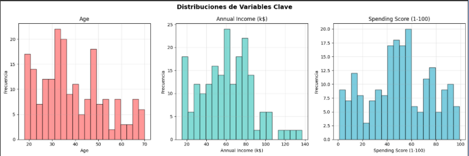

### Gráfica 2 - Relaciones entre variables:
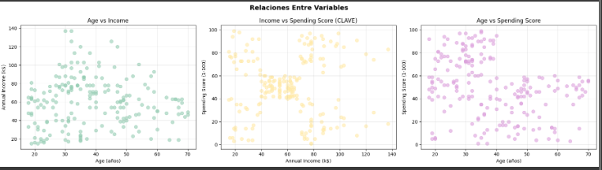

### Gráfica 3 - Matriz de correlación:
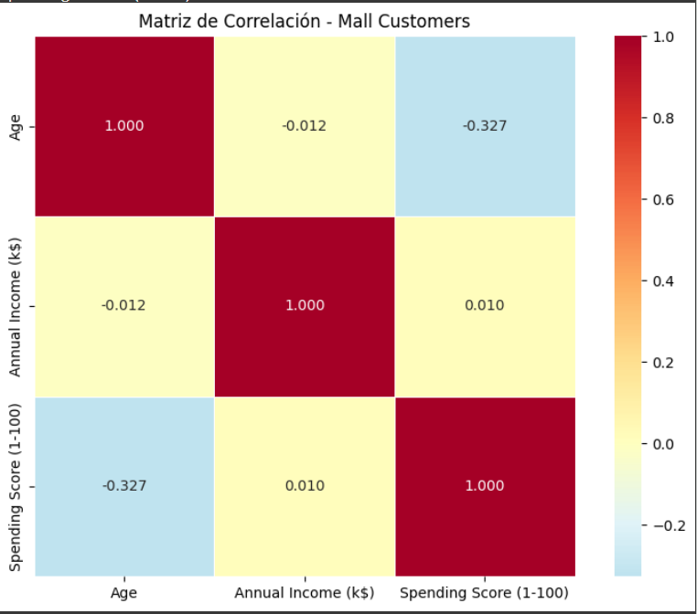

### Gráfica 4 - Comparación de scalers:
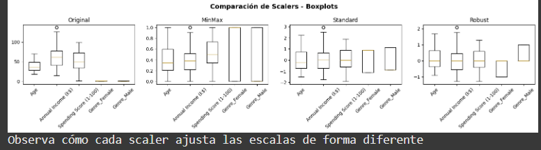

### Gráfica 5 - Annual Income: Original vs Scalers:
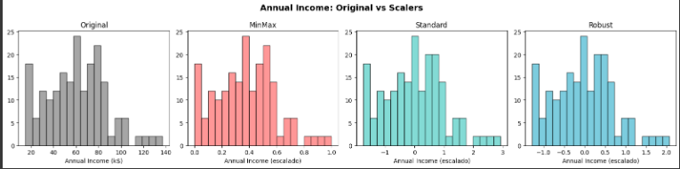

### Gráfica 6 - Varianzas en componentes:
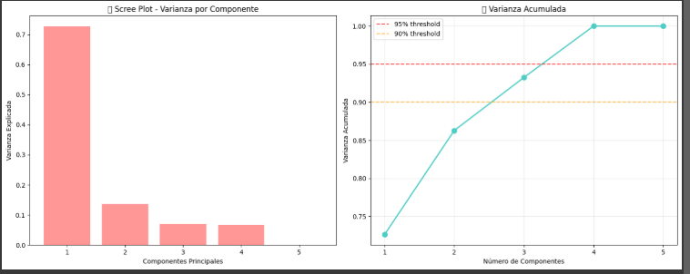

### Gráfica 7 - Mall customers en espacio PCA 2D:

### Gráfica 8 - Comparación de métodos:
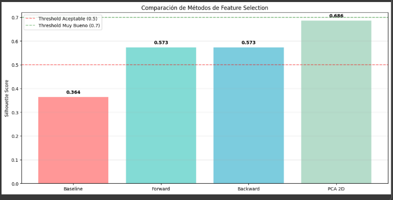

### Gráfica 9 - Visualización de métodos:
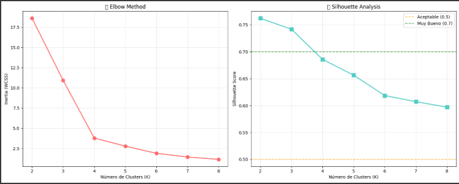

### Gráfica 10 - Visualización de clusters:
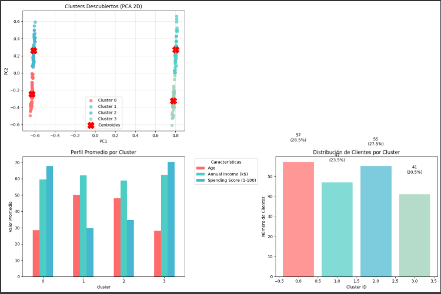

### Gráfica 11 - K-distance Graph para selección de eps:
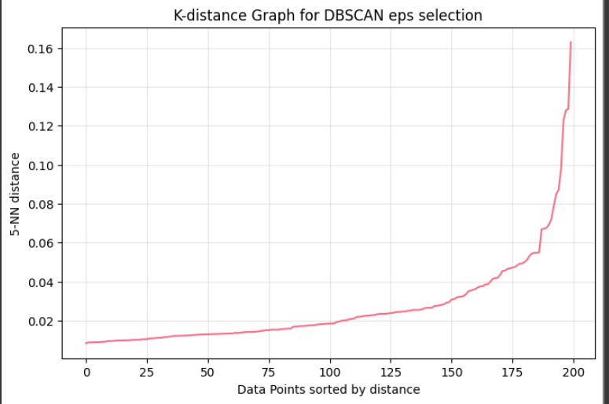

### Gráfica 12 - HDBSCAN Condensed Tree con clusters destacados:
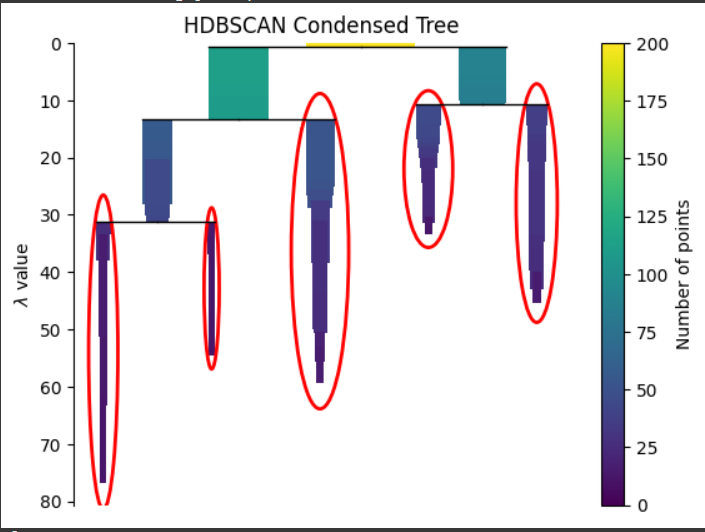

### Gráfica 13 - Curvas AIC vs BIC para selección de número de componentes:
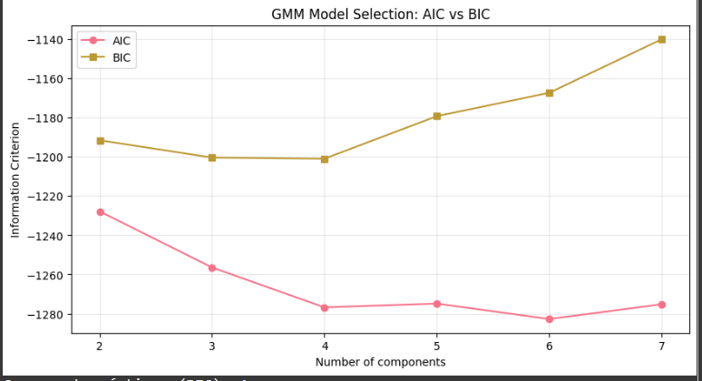

