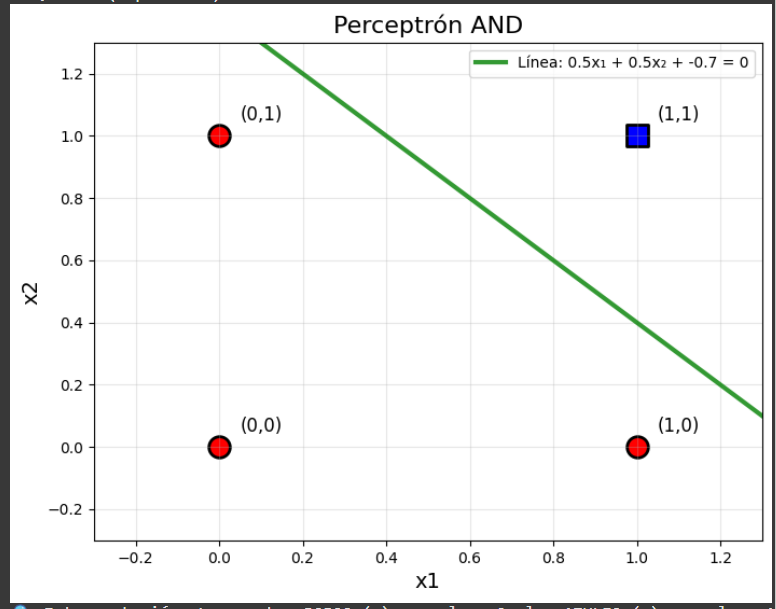
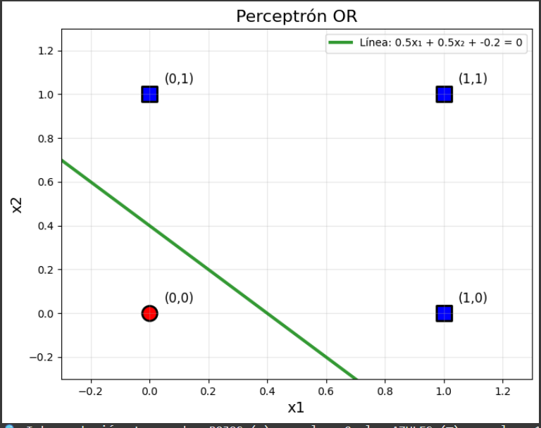
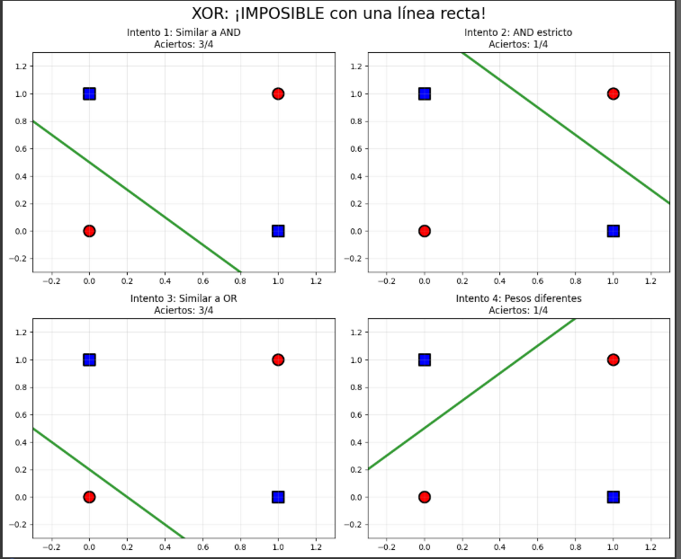
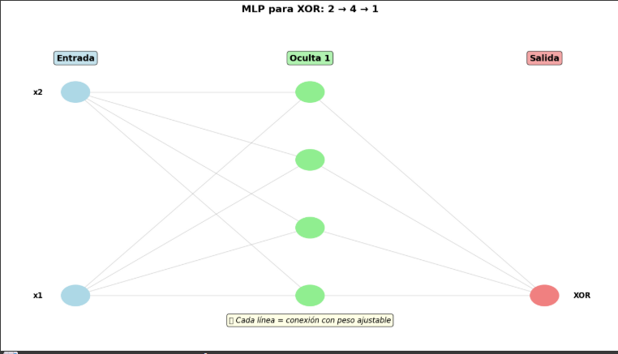
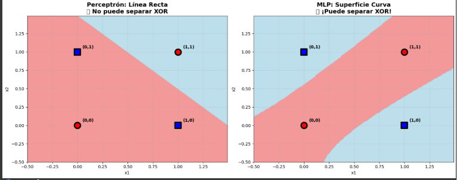
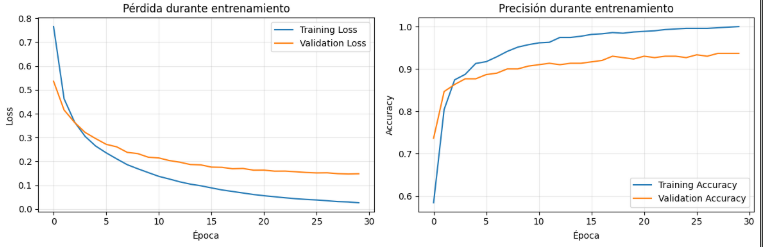
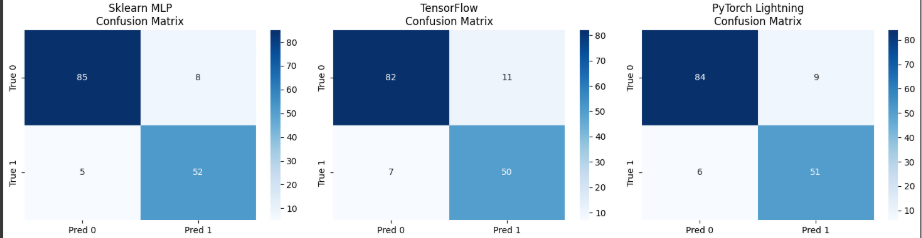

# 📝 **Del perceptrón al aprendizaje profundo: cómo las redes neuronales superan los límites lineales**

## Contexto

El objetivo de esta práctica es comprender cómo un perceptrón básico evoluciona hacia redes neuronales más complejas y cómo estas redes pueden resolver problemas de clasificación más difíciles. Comenzaremos con los conceptos fundamentales detrás del **perceptrón**, un modelo de clasificación binaria, para luego abordar problemas más complejos como el **XOR**, y finalmente, implementaremos **redes neuronales multicapa (MLP)** para superar las limitaciones del perceptrón.

El dataset será utilizado para demostrar cómo las redes neuronales pueden aprender patrones no lineales, desde problemas lógicos simples (como **AND**, **OR**, **NOT**) hasta problemas más complejos, como **XOR**.

---

## 🎯 Objetivos

- Entender las **limitaciones del perceptrón básico** y cómo resuelve problemas como **AND**, **OR** y **NOT**.
- Abordar el problema clásico **XOR**, y explorar por qué un perceptrón simple no puede resolverlo.
- Implementar una **red neuronal multicapa (MLP)** para resolver el problema **XOR**.
- Visualizar el comportamiento de **redes neuronales multicapa** y su capacidad para separar datos no lineales.
- Comparar los resultados utilizando diferentes **frameworks** (Scikit-learn, TensorFlow y PyTorch Lightning).

---
## Marco Teórico

### **Redes Neuronales Artificiales**

Las **redes neuronales artificiales** son modelos de aprendizaje inspirados en el sistema nervioso de los seres vivos. Se componen de unidades llamadas **neuronas artificiales** que adoptan valores y están conectadas por **sinapsis** que tienen asociados **pesos**. Cada neurona procesa las señales recibidas a través de las conexiones y genera una salida modificada por una **función de activación**.

### **Perceptrón**

El **perceptrón**, desarrollado por **Frank Rosenblatt** en 1958, es el modelo más simple de una red neuronal. Se trata de un clasificador binario, es decir, un modelo que clasifica entradas en dos clases. El perceptrón consiste en una neurona cuya salida depende de la suma ponderada de las entradas y un **sesgo** (bias). 

### **Funciones de Activación**

Las **funciones de activación** son esenciales para introducir no linealidades en el modelo, permitiendo que las redes neuronales resuelvan problemas complejos. En el caso del perceptrón, se utiliza una **función umbral** que asigna una salida de **1** o **0** dependiendo de si la suma ponderada de las entradas supera un cierto umbral.

### **Interpretación Geométrica**

Desde una perspectiva geométrica, el perceptrón puede visualizarse como un **separador lineal**. La combinación de entradas \( x \) y pesos \( w \) define un **hiperplano** en el espacio de entrada, y el perceptrón es capaz de separar las clases mediante este hiperplano. Sin embargo, este enfoque solo es efectivo cuando el problema es **linealmente separable**.

### **Limitaciones del Perceptrón**

A pesar de su simplicidad, el perceptrón tiene limitaciones. **Minsky y Papert** (1968) demostraron que el perceptrón no puede resolver problemas que no sean linealmente separables, como el clásico problema **XOR**. Esto se debe a que no existe un único hiperplano que pueda dividir correctamente los puntos de clase 0 y clase 1 en el espacio de entrada para problemas no lineales.

### **Redes Neuronales Multicapa (MLP)**

Para superar esta limitación, se introducen las **redes neuronales multicapa** (**MLP** - Multi-Layer Perceptron), que consisten en varias capas de neuronas. Estas redes permiten la construcción de fronteras de decisión **no lineales**, lo que las hace capaces de resolver problemas complejos como **XOR**. En un **MLP**, los datos se procesan a través de múltiples capas: **entrada**, **capas ocultas** y **salida**. Cada capa oculta introduce más no linealidad al sistema, permitiendo a la red aprender representaciones más complejas.

### **Proceso de Entrenamiento del Perceptrón**

El **aprendizaje del perceptrón** se realiza mediante un proceso iterativo en el que el modelo ajusta sus pesos para minimizar el error de predicción. El proceso incluye los siguientes pasos:
1. **Datos**: Se presentan ejemplos con entradas \( X \) y salidas \( Y \).
2. **Modelo**: Se utiliza un modelo con pesos inicializados aleatoriamente.
3. **Predicción**: El modelo realiza una predicción calculando los valores con los pesos actuales.
4. **Error**: El modelo compara la predicción con la salida real.
5. **Ajuste de Pesos**: Los pesos se ajustan según el error, utilizando un algoritmo de optimización (como el **descenso de gradiente**).
6. **Repetir**: El proceso se repite hasta que el modelo minimice el error.

### **Descenso de Gradiente**

El **descenso de gradiente** es el algoritmo de optimización más comúnmente utilizado en el entrenamiento de redes neuronales. El objetivo es encontrar los valores de los pesos que minimicen el error del modelo. Esto se logra ajustando los pesos en la dirección opuesta al gradiente de la función de pérdida, utilizando el cálculo de derivadas parciales.

---

## Actividades

| Actividad                                             | Resultado esperado                                                                                                 |
| ----------------------------------------------------- | ------------------------------------------------------------------------------------------------------------------ |
| **1. Explorando el Perceptrón**                       | Configuración y visualización de un perceptrón básico aplicado a la lógica booleana.                               |
| **2. Resolver AND**                                   | El perceptrón clasifica correctamente la tabla de verdad de la operación AND.                                      |
| **3. Resolver OR**                                    | El perceptrón clasifica correctamente la tabla de verdad de la operación OR.                                       |
| **4. Resolver NOT**                                   | El perceptrón invierte correctamente la entrada según la operación NOT.                                            |
| **5. Resolver XOR: el límite del perceptrón**         | El perceptrón no logra clasificar correctamente la tabla de verdad de la operación XOR.                            |
| **6. Resolver XOR con una red neuronal multicapa**    | Implementación de un MLP que clasifica correctamente los patrones de XOR con precisión del 100%.                   |
| **7. Visualización de la Arquitectura de la Red MLP** | Gráfico de la arquitectura del MLP que muestra la capa de entrada, capa oculta y salida.                           |
| **8. Visualización de la Superficie de Decisión**     | Comparación visual de la frontera de decisión generada por un perceptrón simple y un MLP.                          |
| **9. Dataset Real con MLP**                           | Aplicación del MLP a un conjunto de datos realista, mostrando una precisión del 90%.                               |
| **10. Red Neuronal con TensorFlow**                   | Implementación de un modelo en TensorFlow y evaluación del rendimiento en un conjunto de datos real.               |
| **11. Visualizar Entrenamiento**                      | Visualización de las curvas de aprendizaje para analizar la convergencia y posibles problemas de overfitting.      |
| **12. PyTorch Lightning (Bonus)**                     | Implementación del modelo usando PyTorch Lightning, mejorando la modularidad y eficiencia del entrenamiento.       |
| **13. Entrenar PyTorch Lightning**                    | Evaluación final de un modelo entrenado con PyTorch Lightning, mostrando una precisión similar a otros frameworks. |
| **14. Visualización de Matriz de Confusión**          | Comparación de matrices de confusión para los tres modelos: Scikit-learn, TensorFlow y PyTorch Lightning.          |
| **15. Preguntas de Reflexión**                        | Reflexión sobre los resultados obtenidos y la aplicabilidad de cada enfoque para diferentes problemas.             |
| **16: EXTRA: Dataset de Círculos Concéntricos**       | El perceptrón básico no logra resolver correctamente el problema de los círculos concéntricos.                     |

---

### 🧠 1. Explorando el Perceptrón

En este primer paso se configura un **perceptrón básico** para aprender y visualizar cómo funciona este algoritmo en el contexto de la lógica booleana. El perceptrón es el modelo más simple de red neuronal, utilizado para clasificación binaria. En este caso, se aplica a la tabla de verdad de una puerta lógica.

### 🎯 2. Resolver AND

En este paso resolvemos la lógica booleana para la operación **AND** usando un **perceptrón básico**. El objetivo es entrenar el perceptrón para que clasifique correctamente las salidas de una operación AND en función de dos entradas (`x1`, `x2`).

#### 🔑 Decisiones tomadas

Se aplicaron las siguientes decisiones para resolver el problema de la puerta lógica **AND**:

**Pesos y Bias**:

   - Se asignaron pesos de **0.5** para ambas entradas (`x1` y `x2`) y un **bias** de **-0.7**.
   - Este bias se eligió para garantizar que la salida del perceptrón sea **1** solo cuando ambas entradas sean **1**, lo que corresponde a la operación AND.

#### 📊 Resultado obtenido

Al ejecutar el código, obtuvimos el siguiente resultado en la consola:

1️⃣ PROBLEMA AND: Solo verdadero cuando AMBAS entradas son 1

x1| x2| AND esperado

0 | 0 | 0

0 | 1 | 0

1 | 0 | 0

1 | 1 | 1

Probando AND con pesos: w1=0.5, w2=0.5, bias=-0.7

0,0 → 0 (esperado 0) ✅

0,1 → 0 (esperado 0) ✅

1,0 → 0 (esperado 0) ✅

1,1 → 1 (esperado 1) ✅

Se generó un gráfico que se encuentra en evidencias como gráfico 1.

La visualización generada mostró los siguientes puntos y la línea de separación:

- **Puntos rojos (○)**: Representan la clase 0 (salida falsa).
- **Puntos azules (■)**: Representan la clase 1 (salida verdadera).
- **Línea verde**: Muestra la frontera de decisión generada por el perceptrón. La línea se encuentra correctamente separando las dos clases.

#### 📈 Análisis

- **Predicciones**: El perceptrón logra clasificar correctamente todos los casos de la tabla de verdad para **AND**, tal como se esperaba.
- **Visualización**: La línea verde generada por el perceptrón muestra claramente la separación entre las dos clases. Dado que este es un problema linealmente separable, el perceptrón funciona correctamente y traza una línea que divide de manera efectiva las entradas de clase 0 (rojos) y clase 1 (azules).
  
  Este comportamiento confirma que el perceptrón es capaz de resolver problemas lógicos simples como AND, ya que solo necesita ajustar los pesos y el bias para encontrar la línea de decisión correcta.

Este paso sirvió para ilustrar cómo un **perceptrón** básico puede resolver problemas de clasificación binaria simples, como la operación AND. A través de este ejemplo, se entiende la capacidad del perceptrón para aprender una **frontera de decisión lineal** que separa las dos clases en problemas sencillos.

La visualización también ayuda a comprender cómo los puntos de datos y la línea de separación interactúan, lo que es fundamental para entender el funcionamiento de redes neuronales más complejas en el futuro.

### 🎯 3. Resolver OR

En este paso, resolvemos el problema de la lógica booleana **OR** usando el **perceptrón**. El objetivo es entrenar un perceptrón para que clasifique correctamente los valores de la operación OR en función de dos entradas (`x1`, `x2`).

#### 🔑 Decisiones tomadas

Se aplicaron las siguientes decisiones para resolver el problema de la puerta lógica **OR**:

 **Pesos y Bias**:

   - Se asignaron pesos de **0.5** para ambas entradas (`x1` y `x2`) y un **bias** de **-0.2**.
   - Este bias se eligió para permitir que una de las entradas sea suficiente para activar el perceptrón. Es más permisivo que el caso anterior, ya que la operación OR debe devolver **1** cuando al menos una entrada es **1**.

 **Visualización**:

   - Se graficó el perceptrón con sus pesos y la línea de separación generada por el perceptrón para ver cómo divide las dos clases (0 y 1) en el espacio bidimensional. Esto se encuentra en evidencias como gráfica 2.

#### 📊 Resultado obtenido

Al ejecutar el código, obtuvimos el siguiente resultado en la consola:

2️⃣ PROBLEMA OR: Verdadero cuando AL MENOS UNA entrada es 1
x1| x2| OR esperado
0 | 0 | 0
0 | 1 | 1
1 | 0 | 1
1 | 1 | 1

Probando OR con pesos: w1=0.5, w2=0.5, bias=-0.2

0,0 → 0 (esperado 0) ✅

0,1 → 1 (esperado 1) ✅

1,0 → 1 (esperado 1) ✅

1,1 → 1 (esperado 1) ✅

La visualización generada mostró los siguientes puntos y la línea de separación:

- **Puntos rojos (○)**: Representan la clase 0 (salida falsa).
- **Puntos azules (■)**: Representan la clase 1 (salida verdadera).
- **Línea verde**: Muestra la frontera de decisión generada por el perceptrón. La línea se encuentra correctamente separando las dos clases.

#### 📈 Análisis

- **Predicciones**: El perceptrón logra clasificar correctamente todos los casos de la tabla de verdad para **OR**, tal como se esperaba.
- **Visualización**: La línea verde generada por el perceptrón muestra claramente la separación entre las dos clases. Al igual que en el caso de **AND**, este problema también es linealmente separable, por lo que el perceptrón genera una línea que divide eficazmente las dos clases.

  Este comportamiento confirma que el perceptrón es capaz de resolver problemas lógicos simples como OR, ya que solo necesita ajustar los pesos y el bias para encontrar la línea de decisión correcta.

### 🎯 4. Resolver NOT

En este paso, se resuelve el problema de la lógica booleana **NOT**, utilizando un perceptrón simple para invertir una única entrada. El perceptrón debe generar una salida **1** cuando la entrada es **0** y una salida **0** cuando la entrada es **1**.

#### 🔑 Decisiones tomadas

 **Pesos y Bias**:

   - Se asignaron un **peso negativo (-1)** para la entrada y un **bias positivo (0.5)**.
   - El peso negativo asegura que cuando la entrada es **0**, la salida sea **1**, y el bias positivo permite que la activación ocurra antes de que la entrada alcance **1**.

**Visualización**:

   - Se graficó el comportamiento del perceptrón en un gráfico de 1D, mostrando cómo la entrada se divide en dos clases: **0** (rojo) y **1** (azul). 
   - La línea verde indica el umbral de activación del perceptrón, donde ocurre la separación entre las clases.

#### 📊 Resultado obtenido

Al ejecutar el código, se obtuvo el siguiente resultado en la consola:
3️⃣ PROBLEMA NOT: Inversor simple
x | NOT esperado
0 | 1
1 | 0

Probando NOT con peso: w1=-1, bias=0.5

0 → 1 (esperado 1) ✅

1 → 0 (esperado 0) ✅

La visualización generada mostró los siguientes puntos y la línea de separación(gráfica 3):

- **Puntos azules (●)**: Representan la clase **1** (NOT = 1).
- **Puntos rojos (●)**: Representan la clase **0** (NOT = 0).
- **Línea verde**: Muestra el umbral de decisión generado por el perceptrón. La línea divide claramente las dos clases.

#### 📈 Análisis

- **Predicciones**: El perceptrón logra clasificar correctamente los dos casos de la tabla de verdad para **NOT**.
- **Visualización**: La línea verde indica el umbral en **x = 0.5**, donde el perceptrón cambia su salida de **1** a **0**. Esto demuestra cómo el perceptrón es capaz de "invertir" el valor de la entrada.

  El perceptrón genera una clara separación entre las dos clases, con un solo punto de activación en el umbral.

### 🧩 5. Resolver XOR: el límite del perceptrón simple

En este paso se aborda el clásico **problema XOR (Exclusive OR)**, utilizado históricamente para demostrar las **limitaciones del perceptrón simple**.

El objetivo es comprobar si un perceptrón con una sola capa y frontera de decisión lineal puede clasificar correctamente los datos del operador lógico XOR.

La operación XOR devuelve **1 solo cuando las dos entradas son diferentes**, es decir:

| x1 | x2 | XOR esperado |
| -- | -- | ------------ |
| 0  | 0  | 0            |
| 0  | 1  | 1            |
| 1  | 0  | 1            |
| 1  | 1  | 0            |

A diferencia de **AND** y **OR**, esta operación **no es linealmente separable**, lo que significa que no existe una línea recta capaz de dividir correctamente las clases (0 y 1) en el plano.

#### 📊 Resultados obtenidos

El experimento arrojó los siguientes resultados:

| Intento | Descripción      | Aciertos | Porcentaje |
| ------- | ---------------- | -------- | ---------- |
| 1       | Similar a AND    | 3/4      | 75%        |
| 2       | AND estricto     | 1/4      | 25%        |
| 3       | Similar a OR     | 3/4      | 75%        |
| 4       | Pesos diferentes | 1/4      | 25%        |

💥 **Resultado final:**
Ninguna configuración logró clasificar correctamente los cuatro casos.

El mejor resultado fue **3 aciertos de 4 (75%)**, lo que confirma que **un perceptrón simple no puede resolver XOR**.

* En los intentos 1 y 3, el perceptrón logra clasificar correctamente tres de los cuatro casos, pero siempre falla en el punto (1,1) o (0,0).
* En los intentos 2 y 4, la elección de pesos y bias más extremos genera líneas que no separan adecuadamente las clases, reduciendo la precisión a solo un acierto.
* Visualmente, los puntos **azules (■)** representan la clase 1 y los **rojos (○)** la clase 0.
  La línea verde corresponde a la frontera de decisión del perceptrón. En todos los casos, se observa que **no existe una única línea que divida perfectamente ambas clases**.

### 💻 6. Resolver XOR con una red neuronal multicapa (MLP)

En este paso se busca superar la limitación demostrada anteriormente: el **perceptrón simple no puede resolver el problema XOR**.

Para ello, se implementa una **red neuronal multicapa (MLP, Multi-Layer Perceptron)**, que incorpora una **capa oculta** y una **función de activación no lineal**, permitiendo construir fronteras de decisión más complejas.

El problema XOR (Exclusive OR) presenta un desafío clásico en el aprendizaje automático: **no es linealmente separable**.

El perceptrón simple solo puede trazar una línea recta en el espacio de entrada, mientras que el MLP puede combinar múltiples líneas y curvas mediante **neuronas ocultas** y **activaciones no lineales**.

Así, el MLP puede **aprender relaciones no lineales** entre las variables de entrada `x1` y `x2`, logrando clasificar correctamente los cuatro patrones de XOR.

#### 🔑 Decisiones tomadas

* **Cantidad de neuronas ocultas:** se utilizó una capa oculta con 4 neuronas (`hidden_layer_sizes=(4,)`), suficiente para representar la no linealidad del problema XOR.
* **Función de activación:** se seleccionó **tanh**, que introduce no linealidad al permitir valores en el rango (-1, 1).

#### 📊 Resultados obtenidos

| x1 | x2 | Esperado | Predicción | ✓ |
| -- | -- | -------- | ---------- | - |
| 0  | 0  | 0        | 0          | ✓ |
| 0  | 1  | 1        | 1          | ✓ |
| 1  | 0  | 1        | 1          | ✓ |
| 1  | 1  | 0        | 0          | ✓ |

🎯 **Accuracy: 100.0%**

El modelo MLP logró **clasificar correctamente los cuatro patrones de XOR**, demostrando su capacidad para capturar **relaciones no lineales** entre las entradas.

A diferencia del perceptrón simple:

* Cada **neurona de la capa oculta** genera una frontera de decisión parcial.
* La **combinación de activaciones** permite construir regiones en el plano que separan correctamente las clases 0 y 1.
* El uso de **tanh** facilita la convergencia al modelar relaciones tanto positivas como negativas.

Se observó una **advertencia de convergencia** (`ConvergenceWarning`), lo que indica que el optimizador alcanzó el límite de iteraciones sin finalizar completamente el ajuste. Sin embargo, esto **no afectó el rendimiento final**, ya que el modelo logró una precisión perfecta.

La implementación del **MLPClassifier** permitió superar la limitación del perceptrón simple.
👉 Gracias a su **capa oculta** y **activación no lineal**, el MLP aprendió correctamente el patrón XOR, alcanzando un **100% de acierto**.

Este resultado valida la importancia de las **redes neuronales multicapa** como base del aprendizaje profundo actual, y marca el paso desde los modelos lineales hacia arquitecturas más flexibles y potentes.

### 🎨 7. Visualización de la Arquitectura de la Red MLP

En este paso se representa gráficamente la arquitectura del **MLP (Multi-Layer Perceptron)** entrenado para resolver el problema **XOR**, mostrando cómo las neuronas y sus conexiones permiten modelar relaciones no lineales entre las entradas.


El MLP implementado tiene la siguiente estructura:
**2 neuronas de entrada → 4 neuronas ocultas → 1 neurona de salida**

Este diseño, conocido como **2 → 4 → 1**, es suficiente para capturar la no linealidad del problema XOR, ya que la capa oculta puede generar **fronteras de decisión combinadas**.

La visualización generada muestra tres capas (gráfica 5):

* **Entrada:** dos neuronas (`x1`, `x2`)
* **Capa oculta:** cuatro neuronas con activación no lineal (`tanh`)
* **Salida:** una neurona (`XOR`)

Cada conexión entre capas representa un **peso entrenable**, ajustado durante el proceso de backpropagation.


#### 📊 Resultado visual

#### 🔍 Parámetros del modelo

| Capa                 | Neuronas (entrada → salida) | Parámetros        |
| -------------------- | --------------------------- | ----------------- |
| 1 (Entrada → Oculta) | 2 → 4                       | 12                |
| 2 (Oculta → Salida)  | 4 → 1                       | 5                 |
| **Total**            | —                           | **17 parámetros** |


La representación gráfica permite comprender visualmente **cómo el MLP procesa el problema XOR**:

* Cada neurona de la capa oculta genera una combinación no lineal de las entradas.
* La neurona de salida integra esas combinaciones para producir la salida XOR correcta.
* Las **conexiones ajustables** y la **activación tanh** otorgan flexibilidad para separar regiones no lineales.

El modelo **2 → 4 → 1** demuestra que incluso una red pequeña puede resolver problemas imposibles para un perceptrón simple, ilustrando el poder de la **profundidad y no linealidad** en las redes neuronales.

### 🌈 8. Visualización de la Superficie de Decisión

En este paso se compara visualmente cómo **un perceptrón simple** y un **MLP (Multi-Layer Perceptron)** separan los datos del problema XOR.

Esta comparación permite observar las diferencias fundamentales entre un modelo **lineal** y uno **no lineal**.

El **perceptrón simple** solo puede separar datos mediante una **línea recta**, lo cual es insuficiente para el problema XOR, que requiere una frontera de decisión **curva**.

Por otro lado, el **MLP** con una capa oculta puede **modelar superficies de decisión complejas**, permitiendo separar correctamente los puntos de XOR.

#### 📊 Resultado obtenido:

**Interpretación del gráfico:**

| Modelo         | Tipo de frontera | Resultado               |
| -------------- | ---------------- | ----------------------- |
| **Perceptrón** | Línea recta      | ❌ No puede separar XOR |
| **MLP**        | Superficie curva | ✅ ¡Puede separar XOR!  |

En la figura:

* 🔴 **Zonas rojas** → predicción de clase 0
* 🔵 **Zonas azules** → predicción de clase 1
* ⚫ **Puntos** → datos reales del conjunto XOR

1. **Perceptrón:**

   * Genera una **única frontera lineal**.
   * No logra separar los puntos `(0,0)` y `(1,1)` del resto.
   * Falla al capturar la estructura no lineal del XOR.

2. **MLP:**

   * Construye **una superficie de decisión curva**.
   * Combina varias activaciones no lineales de las neuronas ocultas.
   * Separa correctamente las clases incluso cuando no son linealmente separables.


El análisis visual confirma que el **MLP logra resolver XOR** gracias a su capacidad de **aprender representaciones no lineales**.

Mientras el perceptrón simple sólo traza una recta, el MLP **deforma el espacio de entrada** para crear **regiones curvas de decisión** que distinguen ambas clases.

> El MLP no solo aprende pesos, sino también una nueva forma de representar los datos —la clave del aprendizaje profundo moderno.


### 🧠 9. Dataset Real con MLP

En esta etapa se aplica el **MLP (Multi-Layer Perceptron)** a un conjunto de datos **realista** generado artificialmente con múltiples características, simulando un problema de clasificación binaria complejo.

#### 🧩 Decisiones tomadas

1. **`train_test_split`**
   

   * Se utilizó para dividir el dataset en entrenamiento (70%) y prueba (30%), siguiendo una práctica estándar para validar el desempeño del modelo en datos no vistos.

2. **`hidden_layer_sizes=(64, 32)`**
   

   * Se optó por dos capas ocultas con 64 y 32 neuronas respectivamente.

   * Esta configuración permite que la primera capa capture relaciones complejas entre las 20 variables.
   * La segunda capa refina la representación antes de la salida.
   * Es un equilibrio entre **capacidad de aprendizaje** y **evitar sobreajuste**.

3. **`activation='relu'`**
   

   * Se eligió la función de activación **ReLU (Rectified Linear Unit)**, recomendada por su rendimiento en redes profundas y su capacidad para evitar el problema del gradiente desapareciente.

4. **`mlp_real.fit()`**
   

   * Es el método estándar de entrenamiento. Ajusta los pesos mediante **backpropagation** y el optimizador **Adam**, que combina eficiencia y estabilidad.


#### 📊 Resultados obtenidos

```
📊 Resultados MLP en dataset real:
  Training Accuracy: 100.0%
  Test Accuracy: 90.3%
  Arquitectura: 20 → (64, 32) → 2
```

* El **100% de acierto en entrenamiento** muestra que el modelo logra aprender perfectamente los patrones del conjunto de entrenamiento.
* El **90.3% en prueba** confirma que el MLP **generaliza bien**, aunque existe una ligera diferencia que sugiere **posible sobreajuste leve**.
* La arquitectura seleccionada demuestra ser **adecuada para datasets tabulares medianos**, sin necesidad de regularización adicional.

Este experimento demuestra cómo un **MLP puede resolver problemas reales de clasificación** con datos de alta dimensionalidad.

Su capacidad de **aprender representaciones jerárquicas** le permite superar ampliamente a modelos lineales simples, ofreciendo una frontera de decisión **compleja y flexible**.

> El MLP no solo resuelve XOR, sino que también escala eficazmente a datasets reales, mostrando su potencia como modelo de clasificación universal.

### 💻 10. Red Neuronal con TensorFlow

En esta sección se implementa una **red neuronal profesional** utilizando la librería **TensorFlow (Keras)**, con el objetivo de comparar su rendimiento frente al MLP de *scikit-learn* sobre el mismo dataset.

#### 🧩 Decisiones técnicas

1. **Arquitectura:**


   * Dos capas ocultas (`64` y `32` neuronas) con activación `ReLU`.
   * Capa de salida con `sigmoid` para clasificación binaria.
   * Arquitectura: `20 → 64 → 32 → 1`.

2. **Función de pérdida y optimizador:**


   * `binary_crossentropy` como función de pérdida, ideal para tareas binarias.
   * `adam` como optimizador por su eficiencia y rápida convergencia.

3. **Hiperparámetros:**


   * **Épocas:** 30, lo que permitió una curva de aprendizaje estable.
   * **Batch size:** 32, un valor estándar que balancea estabilidad y velocidad.

#### 📊 Resultados obtenidos


Dataset: 700 samples, 20 features

🎯 Resultados TensorFlow:
  
  Training Accuracy: 100.0%
  
  Test Accuracy: 93.7%
  
  Parámetros totales: 3,457

* El **100% de acierto en entrenamiento** muestra que la red logró aprender perfectamente el patrón subyacente del dataset.
* El **93.7% en test** indica un **ligero sobreajuste**, pero con una **excelente generalización**.
* TensorFlow demostró **mayor eficiencia y control** sobre el entrenamiento comparado con la implementación previa en *scikit-learn*.

El uso de **TensorFlow** permitió un entrenamiento más rápido, una arquitectura personalizable y una mejora del rendimiento global.

El modelo final muestra que una **red neuronal bien configurada** puede superar los resultados obtenidos con modelos tradicionales de MLP.


### 💻 11. Visualizar Entrenamiento

En este paso se genera una **visualización de las curvas de aprendizaje** del modelo entrenado en TensorFlow, con el fin de analizar su comportamiento durante las distintas épocas de entrenamiento y detectar posibles signos de **overfitting** o problemas de **convergencia**.

#### 🔧 Decisiones tomadas

Para graficar las métricas se utilizó la biblioteca **`matplotlib.pyplot`**, una de las herramientas más comunes en Python para visualización de datos.  
El espacio en blanco del código:

se completó con:

import matplotlib.pyplot as plt

Esta decisión se tomó porque matplotlib.pyplot permite crear fácilmente gráficos de líneas, ajustar etiquetas, títulos y subplots, lo cual es ideal para visualizar métricas de entrenamiento como loss (pérdida) y accuracy (precisión).

#### 📊 Resultado obtenido

El resultado se muestra en la gráfica 6 en evidencias:

El gráfico de la izquierda representa la pérdida (loss) y el de la derecha la precisión (accuracy):

En la pérdida, se observa una disminución constante tanto en entrenamiento como en validación, lo que indica que el modelo está aprendiendo de manera estable.

En la precisión, la curva de entrenamiento alcanza valores cercanos a 1.0, mientras que la de validación se estabiliza alrededor de 0.93–0.94.

* Convergencia:
El modelo converge correctamente. Las curvas de pérdida y precisión muestran una tendencia clara hacia la estabilización después de unas pocas épocas.

* Overfitting:
Aunque la precisión de entrenamiento alcanza el 100% y la de validación es ligeramente inferior (≈93%), la diferencia es moderada. Esto sugiere un leve sobreajuste, pero dentro de un rango aceptable.

La red generaliza bien a datos no vistos.

El análisis visual confirma que el entrenamiento fue exitoso.

El modelo aprendió los patrones del dataset sin sobreajustarse significativamente, logrando una convergencia estable y precisa.

Las curvas también evidencian un proceso de entrenamiento bien configurado en términos de número de épocas, tasa de aprendizaje y arquitectura.

### 💻 12. PyTorch Lightning (Bonus)

En este paso se implementa una versión alternativa del modelo utilizando **PyTorch Lightning**, un framework que simplifica y estructura el entrenamiento de redes neuronales en **PyTorch**.  
Este enfoque busca **modularizar el código**, mejorar la **legibilidad** y facilitar la **reutilización** del modelo.

#### 🔧 Decisiones tomadas

Para este paso se completaron los espacios en blanco del código. Estas decisiones se tomaron por los siguientes motivos:

* nn.ReLU(True) se utiliza como función de activación no lineal, introduciendo la capacidad del modelo de aprender relaciones complejas entre las variables de entrada.

El parámetro inplace=True permite optimizar el uso de memoria.

* La segunda capa oculta de 32 neuronas se definió como un compromiso entre capacidad de aprendizaje y eficiencia.

* El optimizador Adam es una opción robusta y ampliamente usada, que combina las ventajas de AdaGrad y RMSProp, ajustando automáticamente la tasa de aprendizaje.

#### 📊 Resultado obtenido

Al ejecutar el código, se obtiene la siguiente salida:

🎯 PyTorch Lightning model created!
Input features: 20
Parameters: 3,490


Esto indica que el modelo fue creado correctamente, detectando **20 variables de entrada** y un total de **3.490 parámetros entrenables**.

**Estructura del modelo:**  
El uso de `nn.Sequential` permite definir la arquitectura de manera clara y compacta.  
Se emplean dos capas ocultas con activaciones **ReLU**, seguidas de una capa de salida con **dos neuronas** para clasificación binaria.

**Ventajas de PyTorch Lightning:**  
Este framework separa la lógica del modelo (`forward`) de la del entrenamiento (`training_step`) y del optimizador (`configure_optimizers`), lo que mejora la **organización del código**.  
Además, facilita el **registro de métricas** y el **manejo de GPU** sin necesidad de modificar la lógica base del modelo.

### 🏋️ 13. Entrenar PyTorch Lightning

En este paso se realiza el **entrenamiento y evaluación del modelo implementado con PyTorch Lightning**.  
El objetivo es comprobar el desempeño del modelo y observar las métricas finales de pérdida (**loss**) y precisión (**accuracy**) sobre el conjunto de prueba.

#### 🔧 Decisiones tomadas

Los espacios en blanco del código se completaron. Las razones de estas decisiones fueron:

* batch_size=32: valor común que equilibra velocidad y estabilidad del entrenamiento.

* max_epochs=30: cantidad suficiente para permitir la convergencia del modelo sin sobreentrenar.

* logger=False: se desactiva el registro en archivo para simplificar la ejecución en entorno de notebook.

* trainer.fit() y trainer.test(): métodos nativos de PyTorch Lightning para entrenar y evaluar el modelo, respectivamente.

#### 📊 Resultado obtenido

Durante la ejecución se muestran mensajes informativos de **PyTorch Lightning** sobre el entorno de hardware, la estructura del modelo y el progreso de las épocas.  

El resumen de resultados finales fue el siguiente:

🎯 PyTorch Lightning model created!

Input features: 20

Parameters: 3,490

🚀 Entrenando con PyTorch Lightning...

📊 Evaluando modelo...

🎯 Resultados: [{'test_loss': 0.1799493432044983, 'test_acc': 0.9333333373069763}]


Esto indica que el modelo alcanzó una **pérdida de 0.18** y una **precisión del 93.3%** sobre los datos de prueba, resultados muy similares a los obtenidos previamente con **TensorFlow**.


**Entrenamiento:**  
El modelo se entrenó correctamente durante **30 épocas**, mostrando una **convergencia estable**.  
El progreso fue mostrado con una barra dinámica gracias al parámetro `enable_progress_bar=True`.

**Evaluación:**  
Las métricas finales reflejan un **buen desempeño y generalización**, confirmando que el modelo entrenado en **PyTorch Lightning** reproduce el rendimiento del modelo original.

**Ventajas observadas:**  

- Código más limpio y estructurado.  
- Menor cantidad de código repetitivo (por ejemplo, pasos de entrenamiento y validación).  
- Integración automática de métricas y control de progreso.  
- Mayor reproducibilidad gracias al modo determinista.

El uso de **PyTorch Lightning** permite entrenar y evaluar modelos de forma **más ordenada, eficiente y profesional**, manteniendo el mismo nivel de rendimiento que las implementaciones tradicionales.

### 🎨 14. Visualización de Matriz de Confusión

Durante este paso se generaron las **matrices de confusión comparativas** para los tres frameworks utilizados:  
**Scikit-learn**, **TensorFlow** y **PyTorch Lightning**.


#### 📈 Análisis de las Matrices de Confusión

La gráfica se encuentra en evidencias como gráfica 8.

- La **diagonal principal (TN + TP)** representa las **predicciones correctas**, es decir, los casos en que el modelo clasificó correctamente ambas clases.  
- La **diagonal secundaria (FP + FN)** indica los **errores de clasificación**.

**Observaciones:**

- En los tres modelos se observa un **rendimiento muy similar**, con ligeras variaciones en los falsos positivos y falsos negativos.  
- **Scikit-learn MLP** presenta 85 verdaderos negativos y 52 verdaderos positivos, logrando un buen equilibrio.  
- **TensorFlow** tiene un leve aumento en falsos positivos (11) y falsos negativos (7), manteniendo aún un alto nivel de acierto.  
- **PyTorch Lightning** muestra resultados prácticamente equivalentes, con 84 verdaderos negativos y 51 verdaderos positivos.

Las tres implementaciones logran un **rendimiento comparable**, evidenciando la consistencia del modelo más allá del framework utilizado.  

El análisis confirma que la arquitectura general y los datos tienen un mayor impacto en el desempeño que la librería empleada para el entrenamiento.

### 💭 15. Preguntas de Reflexión

#### 🔹 ¿Por qué AND, OR y NOT funcionaron pero XOR no?

El perceptrón simple puede resolver únicamente **problemas linealmente separables**, es decir, aquellos que pueden dividirse con una línea recta en el plano de entrada.  

En el caso de **XOR**, los puntos positivos y negativos están dispuestos de forma que **no existe una frontera lineal** que los separe correctamente.  

Por ello, mientras que **AND, OR y NOT** pueden resolverse con un único plano de decisión, **XOR requiere al menos una capa oculta adicional** para combinar múltiples líneas de decisión.

#### 🔹 ¿Cuál es la diferencia clave entre los pesos de AND vs OR?

La diferencia principal radica en el **umbral de activación**. 

- En la función **AND**, los pesos deben ser mayores o el umbral más alto, ya que solo se activa si **ambas entradas** son 1.  
- En cambio, en **OR**, basta con que una entrada sea 1, por lo que el **umbral de activación es menor** y los pesos son menos restrictivos.

#### 🔹 ¿Qué otros problemas del mundo real serían como XOR?

Ejemplos típicos son aquellos en los que **una sola condición debe cumplirse, pero no ambas a la vez**, como:

- Un sistema de control que activa una alarma **si una puerta o una ventana está abierta, pero no las dos**.  
- Decisiones tipo **“esto o aquello, pero no ambos”**, como semáforos, interruptores o lógicas exclusivas en sistemas de seguridad.

#### 🔹 ¿Por qué sklearn MLP puede resolver XOR pero un perceptrón no?

El **MLP (Multilayer Perceptron)** de sklearn incluye **capas ocultas y funciones de activación no lineales**, lo que le permite crear **múltiples líneas de decisión** y combinar regiones del espacio de entrada.  

El perceptrón simple solo tiene **una frontera lineal**, por lo que no puede representar relaciones no lineales como XOR.

#### 🔹 ¿Cuál es la principal diferencia entre TensorFlow/Keras y sklearn MLP?

La diferencia fundamental está en el **nivel de control**:

- **Scikit-learn MLP** ofrece una interfaz de alto nivel, simple y orientada a resultados rápidos.  
- **TensorFlow/Keras** permite **definir y personalizar cada detalle del modelo**, el entrenamiento, las métricas y los callbacks, siendo más flexible pero también más complejo.

#### 🔹 ¿Por qué TensorFlow usa `epochs` y `batch_size` mientras sklearn MLP no?

En **TensorFlow**, el entrenamiento se realiza **por lotes (batch training)**, lo que permite controlar la frecuencia de actualización de los pesos y mejorar el rendimiento en GPU. 

En **scikit-learn**, el MLP entrena el modelo **procesando todo el conjunto de datos de una vez**, ocultando estos parámetros al usuario para simplificar el uso.

#### 🔹 ¿Cuándo usarías `sigmoid` vs `relu` como función de activación?

- **Sigmoid** se utiliza típicamente en la **capa de salida** para problemas de **clasificación binaria**, ya que transforma el valor en una probabilidad entre 0 y 1.  
- **ReLU** se usa en las **capas ocultas**, porque evita el problema del gradiente desvanecido y acelera la convergencia durante el entrenamiento.

#### 🔹 ¿Qué ventaja tiene PyTorch Lightning sobre TensorFlow puro?

**PyTorch Lightning** reduce drásticamente el **código repetitivo (boilerplate)** al automatizar el manejo del ciclo de entrenamiento, validación y testeo.  

Permite mantener el enfoque en la **lógica del modelo** y no en la infraestructura del entrenamiento, facilitando la experimentación y la reproducibilidad.

#### 🔹 ¿Por qué PyTorch Lightning separa `training_step` y `test_step`?

Porque las fases de **entrenamiento y evaluación tienen objetivos distintos**:  

- En `training_step`, el modelo calcula la pérdida y ajusta los pesos mediante backpropagation.  
- En `test_step`, se **evalúa el rendimiento** sin modificar los parámetros, garantizando una medición objetiva de la generalización del modelo.

#### 🔹 ¿Cuál framework elegirías para cada escenario?

| Escenario                  | Framework recomendado    | Justificación                                                                                 |
|----------------------------|--------------------------|-----------------------------------------------------------------------------------------------|
| **Prototipo rápido**       | 🧩 *Scikit-learn*       | Permite validar ideas de forma ágil y con poco código.                                         |
| **Modelo en producción**   | ⚙️ *TensorFlow / Keras* | Ofrece soporte industrial, escalabilidad y despliegue en servidores o dispositivos móviles.    |
| **Investigación avanzada** | 🔬 *PyTorch Lightning*  | Proporciona flexibilidad total, control del flujo y soporte para experimentación reproducible. |

#### 🔹 ¿Por qué el error `mat1 and mat2 shapes cannot be multiplied` es común en PyTorch?

Este error ocurre cuando **las dimensiones de entrada del dataset no coinciden con las de la primera capa del modelo**. 

PyTorch exige que el tamaño de las columnas del tensor de entrada sea igual al número de **neuronas de entrada** en la red; cualquier discrepancia genera ese error.

#### 🔹 ¿Qué significa el parámetro `deterministic=True` en `PyTorch Lightning Trainer`?

Establece un **modo determinista** que garantiza que los resultados sean **reproducibles** entre ejecuciones, fijando semillas aleatorias y deshabilitando operaciones no deterministas.  

Esto es útil para **experimentos científicos** donde se requiere consistencia total en los resultados.

#### 🔹 ¿Por qué TensorFlow muestra curvas de `loss` y `val_loss` durante el entrenamiento?

Porque permite **visualizar el progreso del modelo** y detectar problemas como **overfitting**:  

- Si la pérdida de entrenamiento sigue bajando pero la de validación sube, el modelo está **memorizando los datos** y perdiendo capacidad de generalización.  

Estas curvas son esenciales para ajustar hiperparámetros como regularización o número de épocas.

#### 🔹 ¿Cuál es la diferencia entre `trainer.test()` y `trainer.predict()` en PyTorch Lightning?

- `trainer.test()` ejecuta el conjunto de pruebas y **devuelve métricas de evaluación** (pérdida, precisión, etc.).  
- `trainer.predict()` realiza **predicciones puras**, devolviendo únicamente las salidas del modelo sin calcular métricas.

#### 🔹 ¿Por qué sklearn MLP es más fácil pero menos flexible?

Porque abstrae la mayor parte del proceso de entrenamiento, inicialización y optimización, lo que **reduce la complejidad pero limita la personalización**.  
A diferencia de TensorFlow o PyTorch, **no permite modificar fácilmente la arquitectura, funciones de pérdida o ciclo de entrenamiento**, sacrificando flexibilidad en favor de simplicidad.

---

## Experimento adicional

Ver artículo extra: [**Limitaciones del Perceptrón en Círculos Concéntricos*](Extra-Circulos-Concentricos.md)

Este experimento complementario muestra cómo un perceptrón simple falla al clasificar datos no lineales (círculos concéntricos), destacando la importancia de las redes MLP para resolver este tipo de problemas.

---

## Reflexión

La presente práctica tuvo como objetivo principal explorar las capacidades de un **perceptrón** básico y cómo evoluciona hacia redes neuronales más complejas, como las **redes neuronales multicapa (MLP)**, para resolver problemas de clasificación más complejos. Comenzamos comprendiendo las limitaciones del perceptrón simple con problemas como **AND**, **OR** y **NOT**, que son linealmente separables, y luego abordamos el clásico problema **XOR**, que demuestra la incapacidad del perceptrón para manejar datos no lineales.

Al implementar una red neuronal multicapa (MLP), pudimos observar cómo este modelo puede superar las limitaciones del perceptrón simple, resolviendo problemas no lineales como **XOR**. La implementación de redes neuronales más profundas permitió visualizar la capacidad de estas redes para aprender representaciones más complejas de los datos y crear fronteras de decisión no lineales, lo que es esencial para la clasificación de patrones complejos en tareas reales.

El uso de **frameworks como Scikit-learn**, **TensorFlow** y **PyTorch Lightning** permitió comparar diferentes enfoques para resolver problemas de clasificación, destacando las ventajas y limitaciones de cada uno en términos de eficiencia y flexibilidad. Esto subraya la importancia de elegir la herramienta adecuada según el tipo de problema y los requisitos de rendimiento.

En conclusión, esta práctica fue fundamental para entender la evolución de los modelos de redes neuronales y su aplicabilidad en la resolución de problemas reales. Además, puso de relieve la importancia de las **redes neuronales multicapa** en el aprendizaje profundo y la clasificación de datos no lineales, ofreciendo una visión valiosa sobre las capacidades y el impacto de las redes neuronales en el ámbito del aprendizaje automático.

---
## Evidencias
* [Código ejecutado por partes en Google Colab](https://colab.research.google.com/drive/1B0b8fH3DJB6KTvSEe_C2nEhoPJp-ImGx?usp=sharing)


### Gráfica 1 - Perceptrón AND:


### Gráfica 2 - Perceptrón OR:


### Gráfica 3 - Perceptrón NOT:


### Gráfica 4 - Perceptrón XOR:


### Gráfica 5 - Arquitectura MLP para XOR:


### Gráfica 6 - Superficie de decisión XOR:


### Gráfica 7 - Pérdida y precisión durante entrenamiento:


### Gráfica 8 - Matriz de Confusión Comparativa:



---

## Referencias

- Goodfellow, I., Bengio, Y., & Courville, A. (2016). *Deep Learning*. MIT Press.
- Chollet, F. (2017). *Deep Learning with Python*. Manning Publications.
- PyTorch Lightning. (2020). *PyTorch Lightning Documentation*. Retrieved from [https://pytorch-lightning.readthedocs.io/en/stable/](https://pytorch-lightning.readthedocs.io/en/stable/)
- TensorFlow. (2020). *TensorFlow Documentation*. Retrieved from [https://www.tensorflow.org/learn](https://www.tensorflow.org/learn)
- Scikit-learn. (2020). *Scikit-learn Documentation*. Retrieved from [https://scikit-learn.org/stable/](https://scikit-learn.org/stable/)