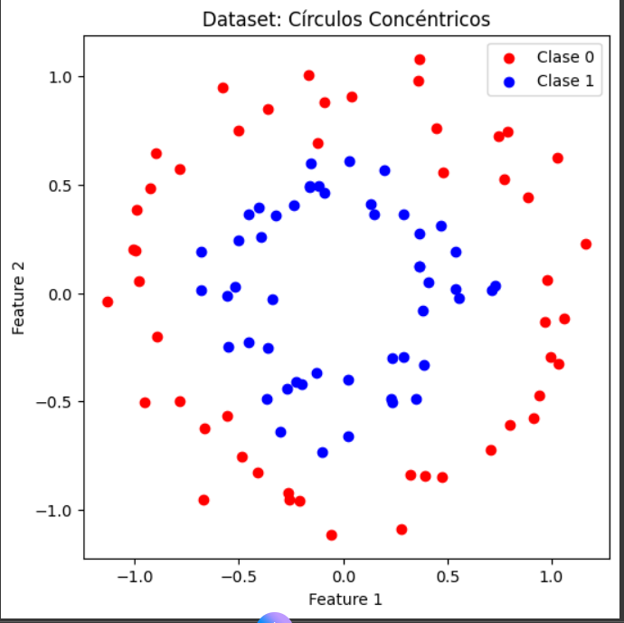
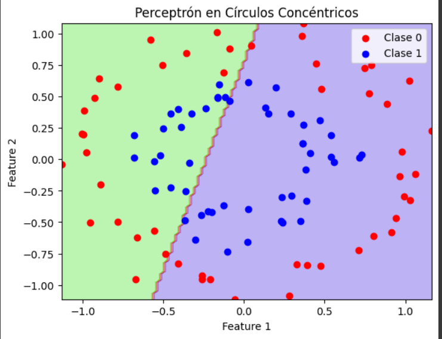

# 🧠 Explorando las limitaciones del Perceptrón: Círculos Concéntricos y Fronteras No Lineales

> En este experimento analizamos cómo un perceptrón simple fracasa al intentar separar datos no lineales, utilizando el dataset de círculos concéntricos. Este caso ilustra la necesidad de redes neuronales multicapa (MLP).

En este paso, experimentamos con el dataset de círculos concéntricos generado por make_circles() de Scikit-Learn. Este conjunto de datos es útil para comprender cómo un perceptrón básico maneja datos no linealmente separables. El dataset consiste en dos clases organizadas en círculos concéntricos, lo que implica que no pueden ser separadas por una simple línea recta.

#### Generación y Visualización del Dataset:

* Primero, generamos y visualizamos los datos en dos dimensiones, donde las características **Feature 1** y **Feature 2** se representan en un gráfico de dispersión. Las clases están representadas por puntos rojos y azules. Como resultado, observamos que los puntos de la **Clase 0** y **Clase 1** se distribuyen en círculos concéntricos.

* A continuación, entrenamos un **perceptrón básico** para clasificar este conjunto de datos. Dado que los círculos concéntricos no son linealmente separables, el perceptrón enfrenta dificultades para encontrar una solución que separe correctamente las dos clases.

* Para comprender mejor el comportamiento del perceptrón, graficamos su **frontera de decisión**, lo que nos permite visualizar cómo clasifica el espacio de características. Aunque el perceptrón intenta trazar una línea de separación, la frontera generada no divide correctamente las dos clases.

#### Resultado obtenido:

Las gráficas se encuentran en evidencias. 

* La imagen muestra claramente los dos grupos de puntos distribuidos de manera circular, con los puntos de la **Clase 0** (rojos) en el centro y los de la **Clase 1** (azules) en el borde exterior.

* El **perceptrón** obtiene una **precisión de 0.4000**, lo que indica que el modelo está fallando en clasificar correctamente las dos clases. Como era de esperar, debido a que el problema no es linealmente separable, el perceptrón no puede generar una correcta frontera de decisión utilizando solo una capa.

* La **frontera de decisión** del perceptrón es claramente visible en el gráfico. Aunque el modelo intenta generar una separación, la línea trazada no refleja una correcta división de las clases. El área verde y morada indica que el modelo no logra separar adecuadamente los puntos de las dos clases, lo que confirma las limitaciones del perceptrón para resolver este problema no lineal.


Este experimento destaca cómo el **perceptrón básico** enfrenta serias dificultades al tratar de resolver datasets no linealmente separables, como el caso de los círculos concéntricos. A pesar de que el modelo realiza una clasificación aproximada, su **precisión de solo 40%** evidencia que un perceptrón simple no es adecuado para problemas de clasificación complejos.

La visualización de la **frontera de decisión** subraya que, aunque el perceptrón intenta generar una separación, no puede manejar la complejidad inherente al problema. Esto demuestra la necesidad de redes neuronales más sofisticadas, como las redes **MLP (Multi-Layer Perceptron)**, que pueden manejar problemas no lineales mediante capas ocultas.

Este resultado marca el punto de partida hacia arquitecturas más complejas, como las redes MLP, capaces de modelar relaciones no lineales y resolver este tipo de problemas con precisión mucho mayor.


---
## Evidencias
* [Código ejecutado por partes en Google Colab](https://colab.research.google.com/drive/1B0b8fH3DJB6KTvSEe_C2nEhoPJp-ImGx?usp=sharing)

### Gráfica 1 - Dataset: Círculos Concéntricos:


### Gráfica 2 - Perceptrón en Círculos Concéntricos:


### Código completo:

```python
import numpy as np
import matplotlib.pyplot as plt
from sklearn.datasets import make_circles
from sklearn.model_selection import train_test_split
from sklearn.neural_network import MLPClassifier
# Generar el dataset de círculos concéntricos
X, y = make_circles(n_samples=100, noise=0.1, factor=0.5)

# Visualizar los datos
plt.figure(figsize=(6,6))
plt.scatter(X[y == 0][:, 0], X[y == 0][:, 1], color='red', label='Clase 0')
plt.scatter(X[y == 1][:, 0], X[y == 1][:, 1], color='blue', label='Clase 1')
plt.title('Dataset: Círculos Concéntricos')
plt.xlabel('Feature 1')
plt.ylabel('Feature 2')
plt.legend()
plt.show()
# Dividir en datos de entrenamiento y prueba
X_train, X_test, y_train, y_test = train_test_split(X, y, test_size=0.3, random_state=42)

# Crear y entrenar el perceptrón
clf = MLPClassifier(hidden_layer_sizes=(), activation='relu', max_iter=1000)
clf.fit(X_train, y_train)

# Evaluar el modelo
accuracy = clf.score(X_test, y_test)
print(f'Precisión del Perceptrón: {accuracy:.4f}')
# Graficar la frontera de decisión
xx, yy = np.meshgrid(np.linspace(X[:, 0].min(), X[:, 0].max(), 100), 
                     np.linspace(X[:, 1].min(), X[:, 1].max(), 100))
Z = clf.predict(np.c_[xx.ravel(), yy.ravel()])
Z = Z.reshape(xx.shape)

# Visualizar
plt.contourf(xx, yy, Z, alpha=0.3, cmap=plt.cm.brg)
plt.scatter(X[y == 0][:, 0], X[y == 0][:, 1], color='red', label='Clase 0')
plt.scatter(X[y == 1][:, 0], X[y == 1][:, 1], color='blue', label='Clase 1')
plt.title('Perceptrón en Círculos Concéntricos')
plt.xlabel('Feature 1')
plt.ylabel('Feature 2')
plt.legend()
plt.show()

```