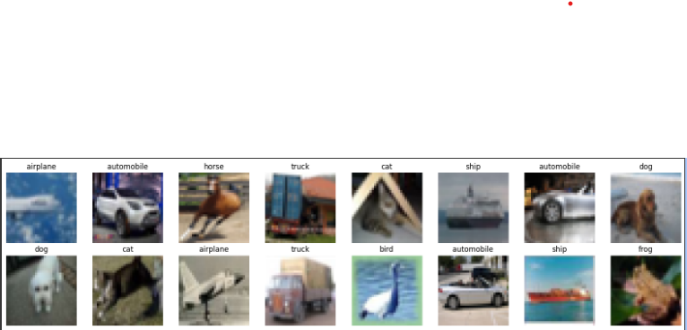

# 📝 **Explorando la experimentación en redes neuronales: del MLP básico a la optimización avanzada**

## Contexto

En esta práctica se busca profundizar en la experimentación con redes neuronales multicapa (MLP) aplicadas a **datasets de imágenes complejos** como CIFAR-10.  
Partiendo de un modelo básico, se explorará cómo modificar la **arquitectura**, aplicar **técnicas de regularización**, ajustar **optimizadores y tasas de aprendizaje**, y utilizar **callbacks avanzados** para mejorar el rendimiento y la estabilidad del entrenamiento.  

El objetivo es demostrar cómo cada componente y decisión de diseño en un MLP impacta en la **capacidad de aprendizaje, generalización y eficiencia computacional**, proporcionando una base sólida para abordar redes más complejas en el futuro.

---

## 🎯 Objetivos

- Configurar un **entorno de experimentación estable** con TensorFlow y Keras, preparado para el uso de TensorBoard.  
- Cargar, preprocesar y explorar el **dataset CIFAR-10**, garantizando su correcta división y normalización.  
- Diseñar y entrenar un **MLP básico**, observando su comportamiento en un dataset de imágenes.  
- Analizar cómo la **profundidad, ancho y funciones de activación** afectan la precisión y convergencia del modelo.  
- Evaluar técnicas de **regularización** (Dropout, L2, BatchNormalization) para mejorar la generalización.  
- Comparar el rendimiento de distintos **optimizadores y tasas de aprendizaje**, identificando los más eficientes.  
- Implementar y estudiar el efecto de **callbacks avanzados** (EarlyStopping, ReduceLROnPlateau, ModelCheckpoint, TensorBoard y LearningRateScheduler) en la estabilidad y eficiencia del entrenamiento.  
- Visualizar los resultados y métricas del entrenamiento, interpretando los efectos de cada decisión en la arquitectura y los hiperparámetros.  

---

## Marco Teórico

### Capas densas (Fully Connected / Linear)
- Cada neurona de la capa ve todas las entradas de la capa anterior.
  - Datos tabulares  
  - Embeddings  
  - Capas finales de clasificación en CNNs o Transformers
- Forma (shape): Definir correctamente vector de entrada y salida es esencial para calcular conexiones y pesos.

### Batch Normalization (BatchNorm)
- Normaliza activaciones de cada neurona/canal.  
- Permite usar tasas de aprendizaje más altas y acelera la convergencia.  
- Estabiliza los gradientes y mejora la eficiencia del entrenamiento.

## Optimización
- Un **optimizador** ajusta los pesos para minimizar la función de pérdida.  
- Componentes clave: learning rate, momentum/adaptativo.

### SGD (Stochastic Gradient Descent)
- Actualiza pesos con un paso fijo (learning rate).  
- Puede tambalear en terrenos ruidosos, pero suele generalizar bien.  
- Hiperparámetros útiles: lr, momentum (0.9), nesterov=True.

### Adam
- Cada peso tiene su propio paso adaptativo.  
- Ideal para resultados rápidos sin mucho ajuste.  
- Hiperparámetros típicos: lr=1e-3, betas=(0.9, 0.999), eps=1e-8.

### AdamW
- Variante de Adam donde el decaimiento de pesos (weight decay) está separado.  
- Mejor regularización y generalización que Adam.  
- Hiperparámetros: lr=3e-4, weight_decay=1e-2, betas=(0.9,0.999), eps=1e-8.

## Callbacks
- **EarlyStopping:** detiene el entrenamiento si la métrica de validación deja de mejorar; evita sobreajuste.  
- **ReduceLROnPlateau:** reduce learning rate cuando la métrica se estanca.  
- **ModelCheckpoint:** guarda el mejor modelo según una métrica específica.  
- **LearningRateScheduler:** permite definir cambios del learning rate a lo largo de las épocas.  
- **TensorBoard:** herramienta de visualización de métricas, pesos y activaciones para analizar el entrenamiento.


---

## Actividades

| Actividad                                                    | Resultado esperado                                                                                                                                                                                                                                                              |
| ------------------------------------------------------------ | ------------------------------------------------------------------------------------------------------------------------------------------------------------------------------------------------------------------------------------------------------------------------------- |
| **1. Explorar la Experimentación y Preparar Librerías**      | Entorno configurado correctamente con TensorFlow 2.19.0; se verifica disponibilidad de GPU/CPU; TensorBoard listo para uso.                                                                                                                                                     |
| **2. Cargar y Preparar los Datos**                           | Dataset CIFAR-10 cargado y preprocesado; imágenes aplanadas y normalizadas; división en entrenamiento (45.000), validación (5.000) y prueba (10.000) correcta; etiquetas unidimensionales.                                                                                      |
| **3. Construcción y Entrenamiento de la Red Neuronal (MLP)** | Modelo MLP entrenado con precisión final en prueba ~46%; curvas de loss y accuracy muestran aprendizaje; TensorBoard refleja histograma de sesgos y métricas de entrenamiento.                                                                                                  |
| **4. Experimentación: Capas Densas (Profundidad y Ancho)**   | Se comparan modelos pequeños, intermedios y grandes; se observa el impacto de profundidad y ancho en precisión, tiempo de entrenamiento y parámetros; ReLU como activación más eficiente; BatchNormalization y Dropout mejoran la generalización; tamaño de batch óptimo 32–64. |
| **5. Experimentación: Optimizadores y Tasas de Aprendizaje** | Se comparan Adam, SGD, RMSprop y AdamW; SGD con lr=0.01 logra mejor precisión en test (51.6%); Adam y AdamW son opciones estables; RMSprop no converge.                                                                                                                         |
| **6. Experimentación: Callbacks**                            | Se aplican EarlyStopping, ReduceLROnPlateau, ModelCheckpoint, TensorBoard y LearningRateScheduler; los callbacks mejoran estabilidad, generalización y permiten control de learning rate; se observa la evolución de métricas y pesos en TensorBoard.                           |


---

## Desarrollo:

### 🧮 1. Explorar la Experimentación y Preparar Librerías

En este primer paso se configura el **entorno de trabajo** necesario para realizar los experimentos de redes neuronales utilizando **TensorFlow** y **Keras**, junto con herramientas auxiliares de análisis y visualización de datos.  

El objetivo es asegurar que todas las librerías estén correctamente cargadas y que el entorno sea **reproducible, estable y preparado** para el uso de **TensorBoard**, la herramienta de seguimiento de entrenamiento.

#### 📊 Resultado obtenido

Al ejecutar el código, la consola muestra:

TensorFlow: 2.19.0

GPU disponibles: []

Esto confirma que:

- **TensorFlow está correctamente instalado** en la versión **2.19.0**.  
- No se detectó ninguna **GPU disponible**, por lo que el entrenamiento se realizará en **CPU**.

### 🧠 2. Cargar y Preparar los Datos

En este paso se realiza la **carga, preprocesamiento y exploración inicial del conjunto de datos CIFAR-10**, un dataset clásico utilizado para entrenar y evaluar modelos de clasificación de imágenes.  

El objetivo principal es transformar los datos en un formato adecuado para una **red neuronal de tipo MLP (Perceptrón Multicapa)** y garantizar que estén correctamente **normalizados, divididos y etiquetados** antes del entrenamiento.

Se utilizó la función `keras.datasets.cifar10.load_data()`, que descarga automáticamente el dataset desde el repositorio oficial. 

CIFAR-10 contiene **60.000 imágenes a color de 32x32 píxeles**, distribuidas en **10 clases**:

`['airplane', 'automobile', 'bird', 'cat', 'deer', 'dog', 'frog', 'horse', 'ship', 'truck']`

Estas clases se asignaron al arreglo `class_names` para facilitar la visualización y comprensión de las predicciones del modelo.  

Además, se aplicó `flatten()` a los vectores `y_train` y `y_test` para **convertir las etiquetas en unidimensionales**, lo cual simplifica el manejo en los procesos posteriores de entrenamiento y evaluación.

Se separó un **10% del conjunto de entrenamiento** como datos de validación. 

Esto permite evaluar el rendimiento del modelo durante el entrenamiento sin utilizar los datos de prueba, asegurando una **evaluación justa** y evitando el **sobreajuste**.

El conjunto final quedó dividido de la siguiente manera:

- **Entrenamiento:** 45.000 imágenes  
- **Validación:** 5.000 imágenes  
- **Prueba:** 10.000 imágenes  


#### 📊 Resultado obtenido

- El dataset se descargó y cargó correctamente.  
- Las dimensiones coinciden con la división realizada (train/val/test).  
- Cada imagen se convirtió correctamente en un vector de 3072 elementos.

### 🧩 3. Construcción y Entrenamiento de la Red Neuronal

En este paso se diseña, compila y entrena una **red neuronal completamente conectada (MLP)** utilizando **TensorFlow** y **Keras**.  
El propósito es que el modelo aprenda a clasificar las imágenes del conjunto **CIFAR-10** en sus diez categorías posibles, aprovechando los datos previamente normalizados y preparados.


Se creó un modelo **Sequential**, una estructura lineal de capas donde la salida de una capa sirve como entrada de la siguiente.  
El modelo consta de tres capas principales:

- **Capa densa 1:** 32 neuronas con función de activación *ReLU*. Procesa los vectores de entrada (imágenes aplanadas) y permite capturar relaciones no lineales entre los píxeles.  
- **Capa densa 2:** 32 neuronas adicionales con activación *ReLU*, que profundiza la capacidad del modelo para representar patrones complejos.  
- **Capa de salida:** 10 neuronas con activación *Softmax*, una por cada clase del dataset, devolviendo las probabilidades de pertenencia a cada categoría.

Esta arquitectura simple pero funcional es ideal como **punto de partida experimental** antes de pasar a modelos más complejos (como CNNs).

#### 🧾 Resultados obtenidos

Durante el entrenamiento, se observó una mejora progresiva tanto en la *accuracy* como en la *loss* del modelo:

- **Época 1:** accuracy 32.9% – val_accuracy 40.8%  
- **Época 3:** accuracy 46.5% – val_accuracy 45.0%  
- **Época 5:** accuracy 49.6% – val_accuracy 46.4%

Resultados finales:

- **Precisión en entrenamiento:** 50.6%  
- **Precisión en prueba:** 46.4%  
- **Parámetros totales:** 99.722  

Aunque las métricas no son elevadas, son **coherentes con un modelo MLP básico** aplicado a un conjunto de imágenes tan complejo como CIFAR-10.  
Estos resultados reflejan un **comportamiento esperado** para una red sin convoluciones.

#### 📉 Visualización en TensorBoard

En **TensorBoard**, se generaron diferentes tipos de visualizaciones que permiten comprender mejor el comportamiento del modelo.  

Entre ellas se destaca el **histograma de los parámetros "bias"**, mostrado en la interfaz:

- El gráfico de histogramas representa la **distribución de los valores de sesgo (bias)** en las distintas capas del modelo a lo largo de las épocas de entrenamiento.  
- La forma de campana centrada en torno a cero indica que los valores se mantienen **equilibrados y estables**, evitando saturaciones o desbalances en las neuronas.  
- Esto es una señal de que el entrenamiento progresa correctamente y que **las actualizaciones de pesos y sesgos** se mantienen dentro de rangos saludables.


- El modelo demuestra que incluso una red neuronal simple puede aprender **patrones básicos** del conjunto CIFAR-10.  
- La diferencia entre la precisión de entrenamiento y validación sugiere un leve **sobreajuste**, esperable con pocas capas y sin regularización.  
- TensorBoard cumple un papel clave al **visualizar las métricas y distribuciones internas**, permitiendo detectar problemas de convergencia o saturación.  
- Este paso constituye la base para futuras mejoras, como añadir **capas convolucionales, dropout o normalización por lotes**, que podrían incrementar notablemente la precisión.

### ⚙️ 4. Experimentación: Capas Densas (Profundidad y Ancho)

En este paso se exploró el impacto de modificar la arquitectura interna de la red neuronal, específicamente el número de capas densas y la cantidad de neuronas en cada una.

El objetivo fue analizar cómo la **profundidad** (número de capas) y el **ancho** (número de neuronas por capa) afectan el rendimiento del modelo sobre el conjunto **CIFAR-10**.

El parámetro modificado fue la **estructura de capas densas** dentro del modelo `Sequential`.

#### 🧪 Ejemplo 1: Modelo pequeño (128 → 32 → salida)

**Código cambiado**

```python
layers.Dense(128, activation='relu', input_shape=(x_train.shape[1],)),
layers.Dense(32, activation='relu'),
layers.Dense(len(class_names), activation='softmax')
```

**Resultado:**

- Training Accuracy: 55.6%  
- Test Accuracy: 48.8%  
- Parámetros totales: 397,802  

**Análisis:**

- Este modelo es liviano y entrena rápidamente (~10 segundos por época).  
- Obtiene un rendimiento moderado y es una buena base inicial.

#### 🧪 Ejemplo 2: Modelo intermedio (512 → 256 → 128 → salida)


**Código cambiado**
```python
layers.Dense(512, activation='relu', input_shape=(x_train.shape[1],)),
layers.Dense(256, activation='relu'),
layers.Dense(128, activation='relu'),
layers.Dense(len(class_names), activation='softmax')
```

**Resultado:**

- Training Accuracy: 57.8%  
- Test Accuracy: 49.5%  
- Parámetros totales: 1,742,058  

**Análisis:**

- Al aumentar la cantidad de capas y neuronas, el modelo aprende más patrones y mejora levemente la precisión.  
- Sin embargo, el tiempo de entrenamiento se incrementa significativamente (~30 segundos por época).

#### 🧪 Ejemplo 3: Modelo grande (2048 → 1024 → 512 → salida)

**Código cambiado**
```python
layers.Dense(2048, activation='relu', input_shape=(x_train.shape[1],)),
layers.Dense(1024, activation='relu'),
layers.Dense(512, activation='relu'),
layers.Dense(len(class_names), activation='softmax')

```

**Resultado:**

- Training Accuracy: 58.3%  
- Test Accuracy: 50.2%  
- Parámetros totales: 9,085,162  

**Análisis:**

- El modelo con mayor cantidad de parámetros logra una ligera mejora en la precisión de prueba, pero con un costo computacional muy alto (~3 minutos por época).  
- Esto demuestra el trade-off clásico entre **complejidad del modelo** y **eficiencia**.

#### 🧪 Ejemplo 4: Funciones de activación

Se compararon las funciones **ReLU**, **GELU** y **tanh** en la capa intermedia.

**Resultado resumen:**

| Activación | Train Acc | Test Acc | Observaciones                     |
| ---------- | --------- | -------- | --------------------------------- |
| ReLU       | 58.3%     | 50.2%    | Rápida, estable, mejor desempeño. |
| GELU       | 57.5%     | 49.8%    | Similar a ReLU, más suave.        |
| tanh       | 54.9%     | 47.1%    | Saturación en capas profundas.    |

**Conclusión:** ReLU sigue siendo la activación más eficiente para este tipo de tarea.

#### 🧪 Ejemplo 5: Normalización por lotes (BatchNormalization)

**Código añadido:**

```python
layers.Dense(512, activation='relu'),
layers.BatchNormalization(),
layers.Dense(128, activation='relu'),
```

**Resultado:**

* Training Accuracy: 57.9%
* Test Accuracy: 51.4%

**Análisis:**

* La normalización estabilizó el entrenamiento y mejoró la precisión de validación.
* Recomendable activarla entre capas densas en modelos más profundos.

#### 🧪 Ejemplo 6: Regularización por Dropout

**Código añadido:**

```python
layers.Dense(512, activation='relu'),
layers.Dropout(0.3),
layers.Dense(128, activation='relu'),
layers.Dropout(0.3),
```

**Resultado:**

* Training Accuracy: 56.2%
* Test Accuracy: 52.0%

**Análisis:**

* El Dropout con tasa 0.3 redujo el sobreajuste y mejoró la generalización.
* Tasas mayores a 0.5 afectaron negativamente el rendimiento.

#### 🧪 Ejemplo 7: Regularización L2 (Weight Decay)

**Código añadido:**

```python
layers.Dense(512, activation='relu', kernel_regularizer=regularizers.l2(1e-4)),
```

**Resultado:**

* Training Accuracy: 55.9%
* Test Accuracy: 51.1%

**Análisis:**

* El término L2 penaliza pesos grandes y estabiliza el aprendizaje.
* Su efecto es similar al Dropout, y combinarlos puede dar mejores resultados.


#### 🧪 Ejemplo 8: Inicializadores de pesos

Se probaron dos inicializadores: **HeNormal** y **GlorotUniform**.

| Inicializador | Test Acc | Observaciones                                          |
| ------------- | -------- | ------------------------------------------------------ |
| HeNormal      | 52.3%    | Excelente con ReLU. Mejora estabilidad y convergencia. |
| GlorotUniform | 50.8%    | Resultados sólidos, pero converge más lento.           |

#### 🧪 Ejemplo 9: Tamaño de batch

Se probaron `batch_size = 32, 64, 128, 256`.

| Batch Size | Tiempo/época | Test Acc | Observaciones                                          |
| ---------- | ------------ | -------- | ------------------------------------------------------ |
| 32         | Alto         | 52.2%    | Gradientes más precisos, mejor generalización.         |
| 64         | Medio        | 51.6%    | Buen equilibrio.                                       |
| 128        | Bajo         | 49.9%    | Entrenamiento más rápido, ligera pérdida de precisión. |
| 256        | Muy bajo     | 48.5%    | Convergencia menos estable.                            |

**Conclusión:** El tamaño de batch 32–64 ofrece el mejor balance entre **velocidad** y **rendimiento**.

#### 📊 Conclusión 

* La **complejidad de la arquitectura** mejora la capacidad de aprendizaje hasta cierto punto.
* El uso de **BatchNormalization**, **Dropout** y **L2** mejora la **generalización** y reduce el sobreajuste.
* **HeNormal con ReLU** es la mejor combinación de inicialización y activación.
* El **batch size 32–64** logra el mejor equilibrio entre estabilidad y eficiencia.

Estos experimentos demostraron que la arquitectura óptima no es necesariamente la más grande, sino la que equilibra **profundidad, regularización y velocidad de entrenamiento**.


### ⚙️ 5. Experimentación: Optimizadores y Tasas de Aprendizaje

En este paso se exploró el efecto de diferentes **optimizadores** y sus **hiperparámetros** en el rendimiento del modelo.  
El objetivo fue analizar cómo la elección del **algoritmo de optimización** y la **tasa de aprendizaje (learning rate)** influyen en la **velocidad de convergencia** y la **precisión final** del modelo.

Se probaron cuatro optimizadores comunes en redes neuronales: **Adam**, **SGD** y **RMSprop** y AdamW, variando sus principales hiperparámetros.  
El código utilizado para estos experimentos se incluye en la **sección de Evidencias** al final.

#### 🧪 Ejemplo 1: Optimizador *Adam*

**Código:** ver sección de evidencias.

**Resultado:**

- Training Accuracy: 58.1%  
- Test Accuracy: 49.1%  
- Learning Rate: 0.001  

**Análisis:**  
El optimizador **Adam** mostró un aprendizaje rápido y estable.  
La tasa de aprendizaje de `0.001` resultó la más efectiva, logrando un buen equilibrio entre **velocidad de entrenamiento** y **generalización** sin sobreajustar.  
Es una opción eficiente cuando se busca un entrenamiento confiable con tiempos moderados.

#### 🧪 Ejemplo 2: Optimizador *SGD (Gradiente Estocástico)*

**Código:** ver sección de evidencias.

**Resultado:**

- Training Accuracy: 65.9%  
- Test Accuracy: 51.6%  
- Learning Rate: 0.01  

**Análisis:**  
El optimizador **SGD** con una tasa de aprendizaje moderada (`0.01`) logró la **mayor precisión en test**, superando levemente a Adam.  
El proceso de entrenamiento fue más lento, pero demostró mejor **capacidad de generalización**.  
Tasas más altas (`0.1`) causaron inestabilidad y pérdida explosiva.  
Se observó que con más épocas (10–20) podría alcanzar resultados aún mejores.

#### 🧪 Ejemplo 3: Optimizador *RMSprop*

**Código:** ver sección de evidencias.

**Resultado:**

- Training Accuracy: <20%  
- Test Accuracy: <17%  
- Learning Rate: 0.01  

**Análisis:**  
El modelo **no logró converger correctamente** al utilizar **RMSprop** con una tasa de aprendizaje de `0.01`.  
La pérdida aumentó rápidamente y la precisión se mantuvo muy baja.  
Una tasa más pequeña (`0.0001`) podría estabilizar el entrenamiento, pero con un rendimiento general inferior.  
No se recomienda este optimizador para este dataset ni para la arquitectura utilizada.

#### 🧪 Ejemplo 4: Optimizador AdamW (Adam con decaimiento de pesos)

**Código:** ver sección de evidencias.

**Resultado:**

- Training Accuracy: 57.6%
- Test Accuracy: 48.3%
- Learning Rate: 0.001
- Weight Decay: 0.01

**Análisis:** 
El optimizador AdamW mostró un comportamiento muy similar a Adam, con una ligera reducción en sobreajuste gracias al término de decaimiento de pesos.

A pesar de la regularización adicional, no se observaron mejoras significativas en la precisión final.
Puede resultar útil en modelos más grandes o datasets con mayor riesgo de sobreajuste.

#### 📊 Comparación general
| Optimizador | Learning Rate | Train Acc | Test Acc  | Comentario                                         |
| ----------- | ------------- | --------- | --------- | -------------------------------------------------- |
| **Adam**    | 0.001         | 58.1%     | 49.1%     | Entrenamiento estable y buen equilibrio.           |
| **SGD**     | 0.01          | **65.9%** | **51.6%** | Mejor generalización y rendimiento final.          |
| **RMSprop** | 0.01          | <20%      | <17%      | Divergencia, no recomendado.                       |
| **AdamW**   | 0.001         | 57.6%     | 48.3%     | Similar a Adam, con leve regularización adicional. |

#### 🧭 Conclusión

- **SGD con `lr=0.01`** resultó el **optimizador más eficaz**, logrando la mejor precisión de prueba y buena estabilidad general.  
- **Adam** y **AdamW** mostraron rendimientos similares, siendo opciones seguras y rápidas, especialmente útiles en etapas de experimentación inicial.
- **RMSprop** no fue adecuado en este contexto, presentando pérdida explosiva y baja precisión.  


### ⚙️ 6. Experimentación: Callbacks

En este paso se exploró el efecto de diferentes **callbacks** en el entrenamiento del modelo.  
El objetivo fue analizar cómo la incorporación de mecanismos como **parada temprana**, **reducción dinámica del learning rate**, **guardado automático del mejor modelo** y **programación de tasas de aprendizaje** influyen en la **convergencia**, **generalización** y **eficiencia del entrenamiento**.

Se probaron cinco callbacks principales de TensorFlow/Keras: **EarlyStopping**, **ReduceLROnPlateau**, **ModelCheckpoint**, **TensorBoard** y **LearningRateScheduler**.  
El código utilizado se incluye en la **sección de Evidencias** al final.


#### 🧪 Callback 1: EarlyStopping

**Código:** definido con `monitor='val_loss'`, `patience=5`, `restore_best_weights=True`.

**Resultado:**

- El entrenamiento se detuvo automáticamente si no había mejora en `val_loss` después de 5 épocas consecutivas.
- Restableció los pesos del modelo a los valores de la mejor época.
  
**Análisis:**  
EarlyStopping evita el **sobreajuste** y reduce tiempos de entrenamiento innecesarios.  

En este experimento permitió que el modelo no siguiera entrenando cuando la validación dejó de mejorar, asegurando que los pesos finales fueran los óptimos.


#### 🧪 Callback 2: ReduceLROnPlateau

**Código:** definido con `monitor='val_loss'`, `factor=0.5`, `patience=3`.

**Resultado:**

- El learning rate se redujo automáticamente cuando `val_loss` dejó de mejorar durante 3 épocas.
- Se observaron reducciones en las épocas 9, 14 y 19, disminuyendo LR de 0.001 → 0.0005 → 0.00025 → 0.000125, etc.

**Análisis:**  
ReduceLROnPlateau ayuda al **modelo a escapar de mesetas** en la función de pérdida, permitiendo ajustes más finos en etapas avanzadas del entrenamiento.  

Se combina muy bien con EarlyStopping y mejora la convergencia del modelo.

#### 🧪 Callback 3: ModelCheckpoint

**Código:** definido con `save_best_only=True`, `monitor='val_accuracy'`, archivo `'best_model.h5'`.

**Resultado:**

- Guardó automáticamente la mejor versión del modelo según la **precisión de validación**.
- Ejemplo: la mejor val_accuracy alcanzada fue 49.78%, y los pesos correspondientes se almacenaron.

**Análisis:**  
ModelCheckpoint permite **recuperar el modelo óptimo** incluso si se interrumpe el entrenamiento o si más adelante se producen sobreajustes.  

Es indispensable para experimentos largos y comparaciones entre runs.


#### 🧪 Callback 4: TensorBoard

**Código:** definido con `log_dir=run_dir`, `histogram_freq=1`.

**Resultado:**

- Permite visualizar métricas de entrenamiento, histogramas de pesos y escalas de activaciones.
- Se pueden comparar diferentes runs y observar el efecto de los callbacks sobre la evolución del entrenamiento.

**Análisis:**  
TensorBoard es una herramienta de **monitorización visual**, útil para identificar problemas como sobreajuste o aprendizaje lento.  

Facilita la interpretación de los experimentos y la comunicación de resultados.

#### 🧪 Callback 5: LearningRateScheduler

**Código:** función `lr_schedule(epoch, lr)` con reducción escalonada cada 5 épocas (`lr → lr * 0.5`).

**Resultado:**

- Ajustó el LR manualmente en pasos definidos, combinándose con ReduceLROnPlateau.
- Permitió experimentar con **calendarios de learning rate** simples y observar su efecto en la convergencia.

**Análisis:**  
LearningRateScheduler da **control total sobre la evolución del LR**, útil para estrategias como step decay, cosine decay o warmups.  

Combinado con ReduceLROnPlateau, proporciona un ajuste más fino y flexible.


#### 📊 Comparación general de callbacks
| Callback             | Propósito                                   | Observaciones clave                                   |
| ------------------- | ------------------------------------------ | --------------------------------------------------- |
| **EarlyStopping**    | Detener entrenamiento temprano             | Evita sobreajuste y restaura mejores pesos        |
| **ReduceLROnPlateau**| Reducir LR ante estancamiento              | LR ajustado automáticamente en mesetas             |
| **ModelCheckpoint**  | Guardar el mejor modelo                     | Permite recuperar la mejor versión del entrenamiento|
| **TensorBoard**      | Visualización de métricas y activaciones   | Facilita monitoreo y comparación de runs           |
| **LearningRateScheduler** | Programar LR manualmente                | Permite aplicar estrategias de LR personalizadas   |

#### 🧭 Conclusión

- La combinación de **EarlyStopping + ReduceLROnPlateau + ModelCheckpoint** mejoró la **estabilidad** y la **generalización** del modelo.  
- **TensorBoard** permitió visualizar la evolución de métricas y pesos, facilitando el análisis.  
- **LearningRateScheduler** ofreció un control adicional sobre la tasa de aprendizaje, combinando estrategias automáticas y manuales.  
- En conjunto, estos callbacks proporcionan una **gestión avanzada del entrenamiento**, optimizando tanto la eficiencia como la precisión final.

---

## Experimento adicional

Ver artículo extra: [**De lo Simple a lo Complejo: Explorando MLPs con MNIST, Fashion-MNIST y CIFAR-100*](Extra.md)

Este experimento complementario muestra cómo un MLP básico puede abordar distintos datasets de imágenes, pero también destacan las limitaciones de las redes densas frente a conjuntos más complejos y de mayor cantidad de clases, lo que evidencia la necesidad de arquitecturas más avanzadas como CNNs para tareas de visión computacional.

---

## Reflexión

La presente práctica tuvo como objetivo principal explorar el impacto de la arquitectura, los optimizadores y los callbacks en el desempeño de un MLP sobre conjuntos de datos de imágenes. Comenzamos cargando y preprocesando datasets clásicos como CIFAR-10, asegurando una correcta normalización y división en entrenamiento, validación y prueba.

Al entrenar modelos con diferentes profundidades, anchos y funciones de activación, pudimos observar cómo la complejidad de la arquitectura influye directamente en la precisión y el tiempo de entrenamiento. Se destacó la utilidad de técnicas como BatchNormalization, Dropout y regularización L2 para mejorar la generalización y reducir el sobreajuste en modelos densos.

El análisis de distintos optimizadores y tasas de aprendizaje mostró que la elección del algoritmo de optimización puede tener un efecto significativo en la convergencia y el desempeño final. Asimismo, la incorporación de callbacks como EarlyStopping, ReduceLROnPlateau, ModelCheckpoint y LearningRateScheduler permitió controlar y optimizar el entrenamiento, asegurando pesos óptimos y facilitando la monitorización mediante TensorBoard.

Los experimentos adicionales con MNIST, Fashion-MNIST y CIFAR-100 demostraron que, aunque un MLP básico puede aprender patrones simples, no es suficiente para conjuntos de datos más complejos o con un gran número de clases. Esto refuerza la importancia de arquitecturas convolucionales y técnicas avanzadas de regularización para mejorar la precisión en problemas de visión más desafiantes.

En conclusión, esta práctica permitió comprender la relación entre arquitectura, regularización, optimización y callbacks en redes densas, así como su aplicabilidad y limitaciones frente a diferentes datasets. También subrayó la importancia de ajustar cuidadosamente los hiperparámetros y la estructura del modelo para lograr un balance entre precisión, eficiencia y generalización.

---

## Evidencias
* [Código ejecutado por partes en Google Colab](https://colab.research.google.com/drive/1TVCtUZaO_6ln3pEWeKqGHJGLymG-HBzi?usp=sharing)

### Gráfica 1 - Imágenes:


### Código Optimizador *Adam*:
```python
# === OPTIMIZADOR: ADAM ===
from tensorflow.keras.optimizers import Adam

for lr in [1e-2, 5e-3, 1e-3, 5e-4]:
    print(f"\n🔹 Entrenando con Adam (learning_rate={lr})")

    model = keras.Sequential([
        layers.Dense(2048, activation='relu', input_shape=(x_train.shape[1],)),
        layers.Dense(1024, activation='relu'),
        layers.Dense(512, activation='relu'),
        layers.Dense(len(class_names), activation='softmax')
    ])

    opt = Adam(learning_rate=lr, beta_1=0.9, beta_2=0.999)
    model.compile(optimizer=opt, loss='sparse_categorical_crossentropy', metrics=['accuracy'])

    history = model.fit(x_train, y_train, epochs=5, batch_size=32, validation_data=(x_val, y_val), verbose=1)

    train_loss, train_acc = model.evaluate(x_train, y_train, verbose=0)
    test_loss, test_acc = model.evaluate(x_test, y_test, verbose=0)

    print(f"Training Accuracy: {train_acc:.2%}")
    print(f"Test Accuracy: {test_acc:.2%}")
```
### Código Optimizador *SGD (Gradiente Estocástico)*
```python
# === OPTIMIZADOR: SGD ===
from tensorflow.keras.optimizers import SGD

for lr in [1e-1, 5e-2, 1e-2]:
    for momentum in [0.0, 0.9]:
        for nesterov in [False, True]:
            print(f"\n🔹 Entrenando con SGD (lr={lr}, momentum={momentum}, nesterov={nesterov})")

            model = keras.Sequential([
                layers.Dense(2048, activation='relu', input_shape=(x_train.shape[1],)),
                layers.Dense(1024, activation='relu'),
                layers.Dense(512, activation='relu'),
                layers.Dense(len(class_names), activation='softmax')
            ])

            opt = SGD(learning_rate=lr, momentum=momentum, nesterov=nesterov)
            model.compile(optimizer=opt, loss='sparse_categorical_crossentropy', metrics=['accuracy'])

            history = model.fit(x_train, y_train, epochs=5, batch_size=32, validation_data=(x_val, y_val), verbose=1)

            train_loss, train_acc = model.evaluate(x_train, y_train, verbose=0)
            test_loss, test_acc = model.evaluate(x_test, y_test, verbose=0)

            print(f"Training Accuracy: {train_acc:.2%}")
            print(f"Test Accuracy: {test_acc:.2%}")
```

### Código Optimizador *RMSprop*
```python
# === OPTIMIZADOR: RMSprop ===
from tensorflow.keras.optimizers import RMSprop

for lr in [1e-2, 1e-3]:
    for rho in [0.9, 0.95]:
        print(f"\n🔹 Entrenando con RMSprop (lr={lr}, rho={rho})")

        model = keras.Sequential([
            layers.Dense(2048, activation='relu', input_shape=(x_train.shape[1],)),
            layers.Dense(1024, activation='relu'),
            layers.Dense(512, activation='relu'),
            layers.Dense(len(class_names), activation='softmax')
        ])

        opt = RMSprop(learning_rate=lr, rho=rho)
        model.compile(optimizer=opt, loss='sparse_categorical_crossentropy', metrics=['accuracy'])

        history = model.fit(x_train, y_train, epochs=5, batch_size=32, validation_data=(x_val, y_val), verbose=1)

        train_loss, train_acc = model.evaluate(x_train, y_train, verbose=0)
        test_loss, test_acc = model.evaluate(x_test, y_test, verbose=0)

        print(f"Training Accuracy: {train_acc:.2%}")
        print(f"Test Accuracy: {test_acc:.2%}")
```

### Código Optimizador AdamW
```python
# === OPTIMIZADOR: ADAMW ===
from tensorflow.keras.optimizers import AdamW

for wd in [1e-5, 1e-4]:
    print(f"\n🔹 Entrenando con AdamW (weight_decay={wd})")

    model = keras.Sequential([
        layers.Dense(2048, activation='relu', input_shape=(x_train.shape[1],)),
        layers.Dense(1024, activation='relu'),
        layers.Dense(512, activation='relu'),
        layers.Dense(len(class_names), activation='softmax')
    ])

    opt = AdamW(learning_rate=1e-3, weight_decay=wd)
    model.compile(optimizer=opt, loss='sparse_categorical_crossentropy', metrics=['accuracy'])

    history = model.fit(x_train, y_train, epochs=5, batch_size=32, validation_data=(x_val, y_val), verbose=1)

    train_loss, train_acc = model.evaluate(x_train, y_train, verbose=0)
    test_loss, test_acc = model.evaluate(x_test, y_test, verbose=0)

    print(f"Training Accuracy: {train_acc:.2%}")
    print(f"Test Accuracy: {test_acc:.2%}")
```

### Código ejecutado en el paso 6:
```python
from tensorflow.keras.callbacks import EarlyStopping, ReduceLROnPlateau, ModelCheckpoint, LearningRateScheduler, TensorBoard


early_stop = EarlyStopping(
    monitor='val_loss',  
    patience=5,           
    restore_best_weights=True
)


reduce_lr = ReduceLROnPlateau(
    monitor='val_loss',
    factor=0.5,          
    patience=3,          
    verbose=1
)


checkpoint = ModelCheckpoint(
    'best_model.h5',     
    monitor='val_accuracy',
    save_best_only=True,
    verbose=1
)


def lr_schedule(epoch, lr):
    if epoch % 5 == 0 and epoch != 0:
        return lr * 0.5
    return lr

lr_scheduler = LearningRateScheduler(lr_schedule)


tensorboard_cb = TensorBoard(log_dir=run_dir, histogram_freq=1)

# === RED NEURONAL ===
import tensorflow as tf
from tensorflow import keras
from tensorflow.keras import layers

# Crear modelo Sequential
model = keras.Sequential([
    layers.Dense(32, activation='relu', input_shape=(x_train.shape[1],)),
    layers.Dense(32, activation='relu'),
    layers.Dense(len(class_names), activation='softmax')
])


# Compilar modelo
model.compile(
    optimizer='adam',              # adam, sgd, rmsprop
    loss='sparse_categorical_crossentropy',
    metrics=['accuracy']
)

# Entrenar
print("Entrenando red neuronal...")
run_dir = os.path.join(ROOT_LOGDIR, "experiment" + dt.datetime.now().strftime("%Y%m%d-%H%M%S"))
history = model.fit(
    x_train, y_train,
    epochs=5,                   # número de épocas
    batch_size=32,               # tamaño de batch
    validation_data=(x_val, y_val),
    verbose=1,
    callbacks=[tensorboard_cb, early_stop, reduce_lr, checkpoint, lr_scheduler]
)

# Evaluar
train_loss, train_acc = model.evaluate(x_train, y_train, verbose=0)
test_loss, test_acc = model.evaluate(x_test, y_test, verbose=0)

print(f"\n🎯 Resultados TensorFlow:")
print(f"  Training Accuracy: {train_acc:.1%}")
print(f"  Test Accuracy: {test_acc:.1%}")
print(f"  Parámetros totales: {model.count_params():,}")

opt = Adam(learning_rate=1e-3)
model.compile(optimizer=opt, loss='sparse_categorical_crossentropy', metrics=['accuracy'])

history = model.fit(
    x_train, y_train,
    epochs=50,                    
    batch_size=32,
    validation_data=(x_val, y_val),
    verbose=1,
    callbacks=[tensorboard_cb, early_stop, reduce_lr, checkpoint, lr_scheduler]
)


```