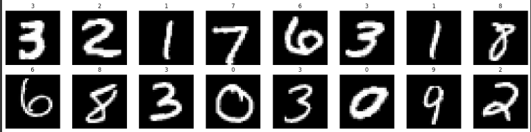
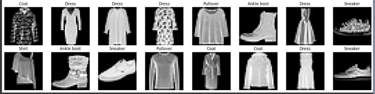
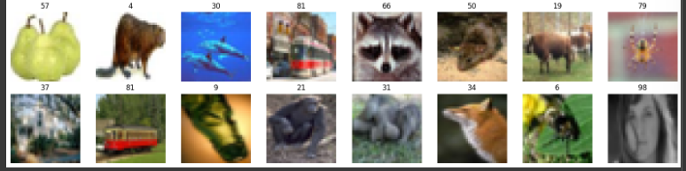

# De lo Simple a lo Complejo: Explorando MLPs con MNIST, Fashion-MNIST y CIFAR-100

## Contexto

En este experimento se buscó evaluar el rendimiento de un MLP básico frente a datasets de complejidad creciente: desde dígitos manuscritos (MNIST), hasta ropa (Fashion-MNIST) y finalmente imágenes de 100 clases (CIFAR-100).

El objetivo fue comprender las capacidades y limitaciones de las redes densas al enfrentarse a problemas más complejos y observar cómo varía la precisión según la naturaleza del dataset.

---

## 🎯 Objetivos

- Analizar el desempeño de un MLP simple en distintos conjuntos de datos de imágenes.
- Observar la relación entre complejidad del dataset, profundidad del modelo y precisión de entrenamiento y prueba.
- Destacar la necesidad de arquitecturas avanzadas (CNNs) para datasets complejos como CIFAR-100.

---

## Actividades

| Actividad                                      | Resultado esperado                                                                                                                         |
| ---------------------------------------------- | ------------------------------------------------------------------------------------------------------------------------------------------ |
| **1. MNIST: Clasificación de dígitos**         | El MLP básico logra alta precisión (>94%) tanto en entrenamiento como en prueba. Diferencia mínima indica bajo sobreajuste.                |
| **2. Fashion-MNIST: Clasificación de prendas** | El MLP obtiene precisión moderada (~86% test), mostrando mayor dificultad que MNIST debido a formas similares y clases más complejas.      |
| **3. CIFAR-100: Clasificación de 100 clases**  | El MLP logra baja precisión (~19% test), evidenciando la insuficiencia de redes densas para datasets complejos. Se recomienda usar CNNs.   |
| **4. Visualización de imágenes**               | Todas las imágenes de cada dataset se muestran correctamente en sus respectivas secciones de evidencias.                                   |
| **5. Comparación de resultados**               | Tabla comparativa con precisión de entrenamiento y prueba que permite ver claramente el efecto de la complejidad del dataset sobre el MLP. |

---

## Desarrollo:

### 🧪 Paso 1: MNIST

**Código cambiado:**

```python
(x_train, y_train), (x_test, y_test) = keras.datasets.mnist.load_data()
class_names = [str(i) for i in range(10)]
```

**Resultado:**

```
Downloading data from https://storage.googleapis.com/tensorflow/tf-keras-datasets/mnist.npz
11490434/11490434 ━━━━━━━━━━━━━━━━━━━━ 0s 0us/step
Train: (54000, 784) Val: (6000, 784) Test: (10000, 784)
```

**Código cambiado para visualizar imágenes:**

```python
ax.imshow((x_train[i].reshape(28,28)/2 + 0.5).clip(0,1), cmap='gray')
```

**Resultado:**
Las imágenes se muestran en la sección de evidencias.

**Código cambiado para entrenar el modelo:**

```python
layers.Dense(32, activation='relu', input_shape=(x_train.shape[1],)),
layers.Dense(32, activation='relu'),
layers.Dense(len(class_names), activation='softmax')
```

**Resultado:**

```
Entrenando red neuronal...
Epoch 1/5 ... val_accuracy: 0.9257 ...
Epoch 5/5 ... val_accuracy: 0.9463
🎯 Resultados TensorFlow:
  Training Accuracy: 94.8%
  Test Accuracy: 94.1%
  Parámetros totales: 26,506
```
#### Análisis:

El modelo MLP logra un rendimiento excelente sobre MNIST, dataset relativamente simple y con pocas clases (10).

La diferencia mínima entre entrenamiento y test indica bajo sobreajuste.

La arquitectura básica (2 capas de 32 neuronas) es suficiente para alcanzar >94% de precisión.

### 🧪 Paso 2: Fashion-MNIST

**Código cambiado:**

```python
(x_train, y_train), (x_test, y_test) = keras.datasets.fashion_mnist.load_data()
class_names = ['T-shirt/top','Trouser','Pullover','Dress','Coat',
               'Sandal','Shirt','Sneaker','Bag','Ankle boot']
```

**Resultado:**

```
Downloading data from ...
Train: (54000, 784) Val: (6000, 784) Test: (10000, 784)
```

**Código para visualizar imágenes:**

```python
ax.imshow((x_train[i].reshape(28,28)/2 + 0.5).clip(0,1), cmap='gray')
```

**Resultado:**
Las imágenes se encuentran en la sección de evidencias.

**Código cambiado al entrenar:**

```python
layers.Dense(32, activation='relu', input_shape=(x_train.shape[1],)),
layers.Dense(32, activation='relu'),
layers.Dense(len(class_names), activation='softmax')
```

**Resultado:**

```
Entrenando red neuronal...
Epoch 5/5 ... val_accuracy: 0.8732
🎯 Resultados TensorFlow:
  Training Accuracy: 88.5%
  Test Accuracy: 86.0%
  Parámetros totales: 26,506
```

#### Análisis:

Fashion-MNIST es más complejo que MNIST debido a formas más sutiles y clases de ropa similares.

La precisión cae ~8 puntos respecto a MNIST, lo que refleja la mayor dificultad del dataset.

Todavía hay un buen balance entre entrenamiento y test, aunque un MLP más profundo o regularizado podría mejorar la generalización.

### 🧪 Paso 3: CIFAR-100

**Código cambiado:**

```python
(x_train, y_train), (x_test, y_test) = keras.datasets.cifar100.load_data()
class_names = [str(i) for i in range(100)]
```

**Resultado:**

```
Downloading data from https://www.cs.toronto.edu/~kriz/cifar-100-python.tar.gz
169001437/169001437 ━━━━━━━━━━━━━━━━━━━━ 135s 1us/step
Train: (45000, 3072) Val: (5000, 3072) Test: (10000, 3072)
```

**Código para visualizar imágenes:**

```python
ax.imshow((x_train[i].reshape(32,32,3)/2 + 0.5).clip(0,1))
ax.set_title(class_names[y_train[i]])
```

**Resultado:**
Las imágenes se encuentran en la sección de evidencias.

**Código cambiado al entrenar:**

```python
layers.Dense(512, activation='relu', input_shape=(x_train.shape[1],)),
layers.Dense(256, activation='relu'),
layers.Dense(128, activation='relu'),
layers.Dense(len(class_names), activation='softmax')
```

**Resultado:**

```
Entrenando red neuronal...
Epoch 5/5 ... val_accuracy: 0.1786
🎯 Resultados TensorFlow:
  Training Accuracy: 24.8%
  Test Accuracy: 18.7%
  Parámetros totales: 1,750,500
```
#### Análisis:

CIFAR-100 es un dataset mucho más desafiante: 32x32x3 imágenes, 100 clases, con alta variabilidad de color y forma.

El MLP simple no es adecuado: el modelo alcanza solo ~19% de precisión en test.

Se observa sobreajuste leve (training 25%, test 19%) a pesar de la gran cantidad de parámetros.

Para este tipo de datos se recomienda usar redes convolucionales (CNN) que puedan capturar relaciones espaciales en imágenes.

#### Tabla comparativa:
| Dataset       | Clases | Train Acc | Test Acc | Observaciones                                         |
| ------------- | ------ | --------- | -------- | ----------------------------------------------------- |
| MNIST         | 10     | 94.8%     | 94.1%    | Dataset simple, MLP básico funciona muy bien          |
| Fashion-MNIST | 10     | 88.5%     | 86.0%    | Dataset más complejo, MLP aún aceptable               |
| CIFAR-100     | 100    | 24.8%     | 18.7%    | Dataset complejo, MLP insuficiente, se recomienda CNN |

---

## Reflexión

Este experimento permitió observar claramente la relación entre la complejidad del dataset y la efectividad de un MLP básico.

MNIST: un dataset simple, con pocas clases y alta linealidad, demuestra que un MLP con 2 capas de 32 neuronas es suficiente para lograr >94% de precisión.

Fashion-MNIST: con clases más parecidas y patrones más complejos, el mismo MLP mantiene un desempeño aceptable (~86%), pero se evidencia que modelos más profundos o regularizados podrían mejorar la generalización.

CIFAR-100: la gran cantidad de clases y la complejidad espacial y cromática de las imágenes muestran que un MLP simple es insuficiente; se requiere una arquitectura convolucional para capturar las relaciones espaciales en las imágenes y mejorar la precisión.

En conclusión, este experimento refuerza la idea de que la elección de la arquitectura debe estar alineada con la complejidad del problema. Los MLPs funcionan muy bien en problemas simples, pero para tareas de visión más complejas se deben usar CNNs u otras arquitecturas avanzadas, combinadas con técnicas de regularización y preprocesamiento adecuado.

---

## Evidencias
* [Código ejecutado por partes en Google Colab](https://colab.research.google.com/drive/1bDZhH7MZasskY83IhvxPR3qL9pxSSbq6?usp=sharing)

### Gráfica 1 - MNIST:


### Gráfica 2 - Fashion-MNIST:


### Gráfica 3 - CIFAR-100:


