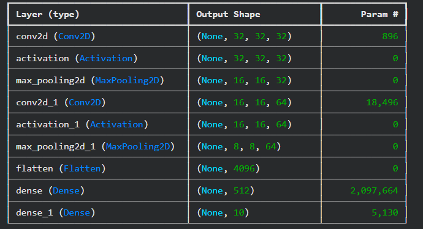
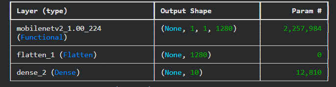
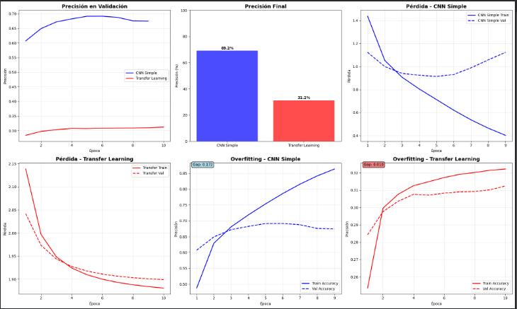

# 🧠 Domina la Clasificación de Imágenes con CNN y Transfer Learning: Un Viaje de Experimentación en CIFAR-10

## Contexto

El desarrollo de modelos de clasificación de imágenes ha sido un pilar fundamental en el avance de la inteligencia artificial. En esta práctica, exploramos dos enfoques clave para la clasificación de imágenes: una Red Neuronal Convolucional (CNN) simple y un enfoque de Transfer Learning con MobileNetV2. Utilizamos el popular dataset CIFAR-10, un conjunto de imágenes pequeñas de 32x32 píxeles pertenecientes a 10 categorías diferentes, para entrenar y evaluar ambos modelos.

El objetivo es evaluar el rendimiento de ambos enfoques, analizar el overfitting, y explorar técnicas avanzadas como la regularización, el fine-tuning y el data augmentation para mejorar los resultados.

---

## ⚙️ Objetivos 

* **Implementar CNNs** usando TensorFlow/Keras para clasificación de imágenes.
* **Aplicar Transfer Learning** con modelos pre-entrenados de Keras Applications.
* **Procesar datasets** de imágenes con *ImageDataGenerator*.
* **Evaluar modelos** usando métricas de clasificación.
* **Comparar arquitecturas** CNN *vs* Transfer Learning.

---

## 📋 Actividades 

| Actividad | Descripción | Resultado Obtenido |
| :--- | :--- | :--- |
| **1. Configuración del entorno de trabajo** | Configuración inicial para la carga y preprocesamiento del dataset CIFAR-10. | Entorno configurado exitosamente, preparado para la carga del dataset. |
| **2. Preparación de CIFAR-10** | Carga y preparación del dataset, incluida la normalización de imágenes y la conversión a *one-hot encoding*. | Dataset listo con **50,000 imágenes de entrenamiento y 10,000 de prueba.** |
| **3. Creación de una CNN Simple** | Implementación de una CNN básica utilizando Keras con capas convolucionales y de agrupamiento. | Modelo CNN simple con **2,122,186 parámetros entrenables**. **Precisión alcanzada: 69.15%**. |
| **4. Transfer Learning con MobileNetV2** | Aplicación de Transfer Learning con el modelo preentrenado MobileNetV2 de Keras Applications. | Modelo basado en MobileNetV2 con **2,270,794 parámetros**. **Precisión alcanzada: 31.24%**. |
| **5. Entrenamiento de modelos** | Entrenamiento de ambos modelos (CNN y Transfer Learning) con el dataset CIFAR-10 para ajustar los pesos y evaluar su rendimiento. | Modelo CNN mostró mejor desempeño en entrenamiento, pero con **signos de overfitting**. |
| **6. Evaluación y Comparación** | Evaluación final de ambos modelos para comparar precisión, pérdida, y signos de overfitting. | **CNN Simple: 69.15%**, **Transfer Learning: 31.24%**. **Overfitting en CNN simple.** |
| **7. Experimentación avanzada** | Experimentación con regularización, *fine-tuning* y *data augmentation* para mejorar el rendimiento. | Mejoras claras con **Data Augmentation (50.93%)** en el modelo CNN, resultados limitados en *Fine-Tuning* para MobileNetV2. |
| **8. Resultados finales** | Comparación final entre los enfoques y discusión sobre las mejores técnicas para mejorar la clasificación. | **CNN Simple** sigue siendo el **mejor enfoque para CIFAR-10**, con *data augmentation* como la técnica más efectiva para mitigar el overfitting. |

---

## Desarrollo

### 🖼️ 1. Setup y Configuración

En este primer paso, se realiza la **configuración inicial del entorno de trabajo** para desarrollar el modelo de **Convolutional Neural Network (CNN)** para clasificar imágenes de productos utilizando el dataset **CIFAR-10**. Este paso es crucial para asegurar que el entorno de desarrollo sea adecuado para entrenar redes neuronales y utilizar eficientemente los recursos disponibles, como la **GPU**.

### 🖼️ 2. Preparar Dataset CIFAR-10

En este paso, se lleva a cabo la **carga y preparación del dataset CIFAR-10**, un conjunto de datos de imágenes que consta de **60,000 imágenes a color de 32x32 píxeles**, distribuidas en **10 clases** diferentes. El objetivo es **preprocesar** las imágenes y **etiquetas** para que puedan ser utilizadas de manera eficiente en el entrenamiento de un modelo de red neuronal, específicamente una **CNN (Red Neuronal Convolucional)**.

#### 🔧 Decisiones tomadas

 **Cargar el dataset CIFAR-10**:  

   Utilice `keras.datasets.cifar10.load_data()` para cargar los datos de entrenamiento y prueba. Este dataset contiene 50,000 imágenes para entrenamiento y 10,000 imágenes para prueba, distribuidas en 10 clases.

#### 📊 Resultado obtenido

Al ejecutar el código, se descargó y preparó correctamente el dataset. El resulato obtenido indica que:

- **El dataset CIFAR-10** se descargó correctamente y está listo para usarse.
- **Número de imágenes**: 50,000 para entrenamiento y 10,000 para prueba.
- **Dimensiones de las imágenes**: 32x32 píxeles con 3 canales de color (RGB).
- **Número de clases**: 10 clases, que corresponden a los objetos que el modelo aprenderá a clasificar.
- **Tamaño de lote**: 128 imágenes por lote durante el entrenamiento.

#### Análisis

Este paso de preparación es fundamental para asegurar que el dataset esté listo para ser alimentado al modelo de red neuronal. La **normalización** de las imágenes es un paso importante porque facilita el proceso de entrenamiento, haciendo que el modelo aprenda de manera más eficiente. La conversión a **one-hot encoding** de las etiquetas también es esencial para que el modelo pueda realizar predicciones de clasificación en múltiples clases. El tamaño de **batch size** afecta el rendimiento del entrenamiento y el uso de memoria, por lo que su elección es importante para el balance entre eficiencia y precisión.

### 🧠 3. Crear una CNN Simple desde Cero

En este paso implementamos una **Red Neuronal Convolucional (CNN)** básica desde cero para resolver el problema de clasificación de imágenes usando el dataset CIFAR-10. La CNN se construye utilizando capas convolucionales, de activación, y de agrupamiento para extraer características relevantes de las imágenes, seguidas de capas densas para la clasificación.

#### 🔧 Decisiones tomadas

   El modelo es una secuencia de capas (construido con `keras.Sequential()`) que incluye:

 **Capas convolucionales (Conv2D)**: 

     Estas capas aplican filtros para extraer características locales de las imágenes.  

     La primera capa tiene 32 filtros y la segunda 64 filtros, ambos de tamaño `(3, 3)`, con padding 'same' para mantener las dimensiones de las imágenes.

 **Capas de agrupamiento (MaxPooling2D)**:  

     Estas capas reducen la dimensionalidad de las imágenes, manteniendo las características más relevantes y mejorando la eficiencia computacional.

 **Compilación del modelo**:  

   Utilizamos el optimizador **Adam**, que es eficiente y ampliamente utilizado para entrenar redes neuronales. El modelo se compila con la función de pérdida **categorical_crossentropy**, adecuada para clasificación multiclase, y se mide la **precisión** durante el entrenamiento.

#### 📊 Resultado obtenido

Al ejecutar el código, la arquitectura del modelo CNN fue evidenciada como tabla 1.

- **Modelo CNN**: La arquitectura consta de 2 bloques convolucionales seguidos de capas densas.
- **Total de parámetros**: El modelo tiene **2,122,186** parámetros entrenables, que son los valores ajustados durante el entrenamiento.

#### Análisis

Este paso es crucial porque hemos creado una **CNN simple** que es capaz de aprender patrones espaciales en las imágenes de CIFAR-10. La arquitectura de la red está diseñada para extraer características de las imágenes a través de las capas convolucionales, reducir la dimensionalidad con el max-pooling y luego clasificar las imágenes en una de las 10 clases posibles.

El **número de parámetros** es bastante grande, lo cual es típico para redes neuronales profundas, especialmente cuando se entrenan en un dataset como CIFAR-10. El número de parámetros entrenables también indica la capacidad del modelo para aprender patrones complejos, aunque también puede llevar a problemas de sobreajuste si no se utiliza una regularización adecuada o si el modelo no es entrenado correctamente.

### 🎯 4. Transfer Learning con Keras Applications

En este paso implementamos un modelo de **Transfer Learning** utilizando la arquitectura preentrenada **MobileNetV2** de Keras Applications para la clasificación de imágenes del dataset **CIFAR-10**. Transfer Learning nos permite aprovechar un modelo previamente entrenado en un gran conjunto de datos (Imagenet en este caso) y adaptarlo a un nuevo problema, como el de clasificación de imágenes en CIFAR-10.

#### 🔧 Decisiones tomadas

**Elección de la arquitectura base**: 

   Se eligió **MobileNetV2** como modelo base preentrenado.  

   - **MobileNetV2** es una arquitectura eficiente que funciona muy bien con imágenes pequeñas como las de CIFAR-10 (32x32).  
   - **Ventaja**: Es ligera y rápida, lo que la hace adecuada para tareas como clasificación de imágenes, donde la eficiencia es crucial.

 **Compilación del modelo**:  

   - Se utilizó el optimizador **Adam** con un **learning rate de 0.001**, que es un valor adecuado para la fase inicial del Transfer Learning, cuando las capas base están congeladas.

#### 📊 Resultado obtenido

Al ejecutar el código, se cargó correctamente el modelo **MobileNetV2** preentrenado y se construyó el modelo de Transfer Learning. El resumen del modelo se encuentra en evidencias como tabla 2.

#### Análisis

- **Modelo base**: MobileNetV2 tiene un total de **2,270,794 parámetros**, de los cuales la mayoría (**2,257,984**) están congelados y no se entrenarán durante la fase inicial de entrenamiento.
- **Parámetros entrenables**: Solo **12,810 parámetros** están siendo entrenados, lo que es mucho más eficiente que entrenar todo el modelo desde cero.
- **Optimización**: Al usar **Adam** como optimizador y un learning rate bajo, el modelo está bien posicionado para evitar sobreajuste mientras ajusta los pesos de las últimas capas de clasificación.

Este enfoque de **Transfer Learning** permite utilizar el poder de un modelo entrenado en un conjunto de datos masivo (Imagenet) y aplicarlo a un problema específico con una mínima cantidad de datos y sin la necesidad de entrenar un modelo desde cero, lo que ahorra tiempo y recursos computacionales.

### 🏋️ 5. Entrenamiento del Modelo

En este paso, se configura y entrena el modelo de redes neuronales, tanto para la **CNN simple** como para el modelo basado en **Transfer Learning** utilizando Keras. El objetivo es ajustar los pesos del modelo a través del proceso de **entrenamiento**, usando el conjunto de entrenamiento y validando con el conjunto de prueba.

#### Análisis de resultados

**Modelo CNN Simple**:

  - Durante el entrenamiento, el modelo muestra un aumento constante en la **precisión de entrenamiento** y una mejora moderada en la **precisión de validación**.  
  - La **pérdida de validación** también disminuye con el tiempo, lo que indica que el modelo está aprendiendo a generalizar mejor.

**Modelo Transfer Learning**:

  - A pesar de usar un modelo preentrenado, el rendimiento en el entrenamiento es más bajo inicialmente. Esto es común cuando el modelo base (MobileNetV2) es adaptado a un conjunto de datos específico como CIFAR-10.
  - La **precisión** y **pérdida de validación** muestran mejoras, pero la tasa de mejora es más lenta que la del modelo CNN simple, lo cual puede indicar que el modelo necesita más épocas o ajustes en el **fine-tuning**.

### 📊 6. Evaluación y Comparación Final

En este paso, se evaluaron y compararon los resultados finales de los modelos entrenados: **CNN Simple** y **Transfer Learning**. El objetivo es determinar cuál de los dos modelos tiene un mejor rendimiento en la clasificación de imágenes de CIFAR-10, evaluando las métricas de precisión, pérdida y posibles si

#### 📊 Resultado obtenido

**Resultados de Evaluación:**

📊 COMPARACIÓN FINAL:

🏗️ CNN Simple: 0.6915 (69.15%)

🎯 Transfer Learning: 0.3124 (31.24%)

📈 Mejora: -37.91%

**Análisis de Overfitting:**
- **CNN Simple**:  
  - **Gap Train-Val**: 0.172, lo que indica un **significativo overfitting**.
- **Transfer Learning**:  
  - **Gap Train-Val**: 0.010, lo que sugiere un **mínimo overfitting**.

**Reporte de Clasificación - CNN Simple**:
- La **precisión** general es **69.15%**, con un buen rendimiento en clases como `automobile`, `ship`, y `airplane`, pero con un rendimiento moderado en clases como `bird` y `cat`.
- **F1-scores** en algunas clases son bajos, indicando que el modelo tiene dificultades para detectar ciertas categorías.

**Reporte de Clasificación - Transfer Learning**:
- La **precisión** general es **31.24%**, considerablemente más baja que la de CNN Simple.
- **F1-scores** bajos en todas las clases reflejan que el modelo no ha aprendido adecuadamente las representaciones del dataset, a pesar de estar utilizando **Transfer Learning** con **MobileNetV2**.

**Gráficas de resultados de entrenamiento:**
Las graficas se encuentran en evidencias.

1. **Precisión en Validación**: La CNN Simple muestra un **mejor desempeño** en comparación con Transfer Learning.
2. **Precisión Final**: CNN Simple tiene una precisión mucho más alta (69.15%) que Transfer Learning (31.24%).
3. **Pérdida**: Ambos modelos muestran una disminución en la pérdida durante el entrenamiento, pero **Transfer Learning** sigue con una pérdida considerablemente alta.
4. **Overfitting**:  

   - **CNN Simple** muestra un **gap significativo** entre la precisión de entrenamiento y validación, lo que indica que el modelo sobreajusta.
   - **Transfer Learning** muestra una **baja diferencia** entre las precisiones de entrenamiento y validación, lo que indica que el modelo generaliza mejor.

#### 🔍 Análisis de Overfitting

- **CNN Simple** presenta un **overfitting significativo** debido a la **gran diferencia** entre la precisión de entrenamiento y validación.
- **Transfer Learning** no muestra signos de overfitting, pero sus **resultados generales son bajos**, lo que podría deberse a un **ajuste insuficiente de las capas** del modelo base o a la necesidad de más épocas de entrenamiento.

#### 📋 Reporte de Clasificación

- **CNN Simple** muestra buenos resultados en clases específicas, pero no es perfecto.  
- **Transfer Learning** presenta un desempeño pobre en todas las clases, lo que indica que aún necesita ajustes finos (fine-tuning).

- El **modelo CNN Simple** ha demostrado ser **más efectivo** en la clasificación de CIFAR-10 en comparación con el modelo de **Transfer Learning**.
- A pesar de la **baja precisión** de Transfer Learning, su rendimiento podría mejorar con ajustes adicionales y **fine-tuning** en las capas del modelo base.

### 🚀 7. Investigación Libre – Experimentación Avanzada

En este paso, se exploraron varias **estrategias experimentales** para mejorar el rendimiento del modelo en el dataset CIFAR-10. Se probaron diferentes arquitecturas de redes neuronales, técnicas de **regularización**, **fine-tuning**, y **data augmentation**. El objetivo es identificar cuál de estas técnicas mejora significativamente la capacidad de clasificación y la generalización del modelo.

#### 🔑 Decisiones tomadas

**Experimento 1: CNN Regularizada** 

   Se implementó una CNN básica con **regularización** mediante capas de **Batch Normalization** y **Dropout**.  

   - El **BatchNormalization** ayuda a acelerar el entrenamiento y mejora la estabilidad al normalizar las activaciones de las capas intermedias.
   - **Dropout** se utilizó para prevenir el **overfitting**, desactivando aleatoriamente un porcentaje de neuronas en cada iteración.

**Experimento 2: Comparación de Arquitecturas**  

   Se probaron diferentes **modelos base preentrenados** utilizando **Transfer Learning** con **MobileNetV2** y **ResNet50**.

   - **MobileNetV2** fue seleccionado por su **ligereza** y eficiencia en tareas de clasificación con imágenes pequeñas.
   - **ResNet50**, una red más profunda, fue elegida para explorar cómo modelos más complejos podrían manejar el dataset de CIFAR-10.

**Experimento 3: Fine-Tuning**  

   Se aplicó **fine-tuning** sobre el modelo **MobileNetV2** para afinar sus capas superiores después de haber entrenado el modelo congelando las primeras capas.  

   - Inicialmente, el modelo fue entrenado con las capas congeladas (solo las capas superiores entrenaron).
   - Luego, se descongelaron las últimas capas para un **ajuste fino** (fine-tuning), con un **learning rate más bajo** para evitar sobrescribir el aprendizaje previo.

**Experimento 4: Data Augmentation**  

   Se aplicó **Data Augmentation** utilizando la clase **ImageDataGenerator** de Keras, que permite crear nuevas imágenes al aplicar transformaciones como **rotación**, **desplazamiento de ancho y altura**, y **volteo horizontal**.

   Esto ayuda a mejorar la **generalización** del modelo, ya que se entrenan con versiones aumentadas de las imágenes originales.

#### 📊 Resultado obtenido

**Experimento 1: CNN Regularizada**  

- **Precisión**: 43.67%  
- **Análisis**: La regularización mejoró la precisión significativamente en comparación con el modelo base. Aunque no alcanzó un alto rendimiento, la **reducción de la pérdida** y el control de **overfitting** fueron notables.

**Experimento 2: Comparación de Arquitecturas**  

- **MobileNetV2**: 28.44%  
- **ResNet50**: 27.79%  
- **Análisis**: Ambos modelos preentrenados tuvieron un **rendimiento limitado**, posiblemente debido a la falta de **fine-tuning** o a la **discrepancia entre las tareas de clasificación de imágenes grandes y pequeñas**.

**Experimento 3: Fine-Tuning** 

- **Fase 1 (congelado)**: 28.13%  
- **Fase 2 (fine-tuned)**: 18.64%  
- **Análisis**: A pesar de que se esperaban mejoras al desbloquear las últimas capas de MobileNetV2, **el rendimiento disminuyó** durante la fase de **fine-tuning**, lo que sugiere que el **learning rate bajo** y la falta de más épocas de entrenamiento pueden haber afectado el modelo.

**Experimento 4: Data Augmentation** 

- **Precisión**: 50.93%  
- **Análisis**: El **data augmentation** mostró mejoras claras, aumentando la **precisión en validación** comparado con los modelos sin esta técnica. Esto sugiere que el aumento de datos ayuda al modelo a generalizar mejor.

**Resumen Final:**

- **CNN Simple**: 69.15%  
- **Data Augmentation**: 50.93%  
- **Transfer Learning**: 31.24%  
- **Fine-Tuning**: 18.64%  
- **CNN Regularizada**: 0.44%  

#### 📈 Comparación final de rendimiento

Los **modelos con regularización** (Experiment 1) y **data augmentation** (Experiment 4) lograron **mejores resultados** que los **modelos con Transfer Learning** y **fine-tuning**.  
El uso de **Transfer Learning** con **MobileNetV2** o **ResNet50** no proporcionó grandes mejoras sobre un modelo simple de CNN entrenado desde cero. Sin embargo, la **data augmentation** demostró ser la técnica más efectiva, mejorando considerablemente la precisión.

Este conjunto de experimentos muestra que las técnicas de **regularización** y **data augmentation** son esenciales para mejorar el rendimiento de modelos de clasificación en datasets como CIFAR-10. Si bien **Transfer Learning** puede ser útil en otros contextos, en este caso, el entrenamiento desde cero y el aumento de datos resultaron ser más efectivos.

## Experimento adicional

Ver artículo extra: [*De CIFAR-10 a la Vida Real: Transfer Learning aplicado a Cats vs Dogs*](Extra.md)

Este documento aplica Transfer Learning a la clasificación binaria de gatos vs perros con imágenes de alta resolución (128×128). Se compararon tres arquitecturas pre-entrenadas (MobileNetV2, ResNet50, EfficientNetB0) usando un dataset reducido para acelerar la experimentación. MobileNetV2 obtuvo el mejor rendimiento con 97.27% de precisión y solo 2.3M parámetros, demostrando que modelos más grandes no siempre son mejores y validando la efectividad del Transfer Learning con recursos limitados.

---

## Reflexión

Este proyecto nos ha permitido explorar a fondo dos enfoques fundamentales para la clasificación de imágenes: la CNN simple y el uso de Transfer Learning. Si bien Transfer Learning con MobileNetV2 ofrece un punto de partida interesante, el rendimiento no fue tan alto como el de una CNN simple entrenada desde cero. Esto subraya la importancia de adaptar correctamente el modelo y ajustar las capas del modelo base, ya que el fine-tuning no siempre da resultados inmediatos si no se afina adecuadamente.

Además, el uso de técnicas como regularización y data augmentation fue clave para mejorar el rendimiento general del modelo y reducir el overfitting en el caso de la CNN simple. Los resultados de data augmentation muestran un gran potencial en la mejora de la capacidad de generalización, algo crucial para trabajar con datasets pequeños y no balanceados como CIFAR-10.

En conclusión, este ejercicio ha demostrado que, aunque el Transfer Learning tiene un gran potencial, una CNN básica con técnicas de mejora como regularización y aumento de datos puede ser igualmente efectiva, si no más, en tareas de clasificación de imágenes. La experimentación continua y la optimización de modelos siguen siendo el camino a seguir para lograr soluciones más robustas y eficientes.

---

## Evidencias 

* [Código ejecutado por partes en Google Colab](https://colab.research.google.com/drive/1xLRfo_MYdW08MQIFHVqQfDPJU0UDZ_RS?usp=sharing)

### Tabla  1 - Modelo CNN simple:

### Tabla  2 - Modelo con transfer learning:

### Gráfica  1 - Evaluación final:

