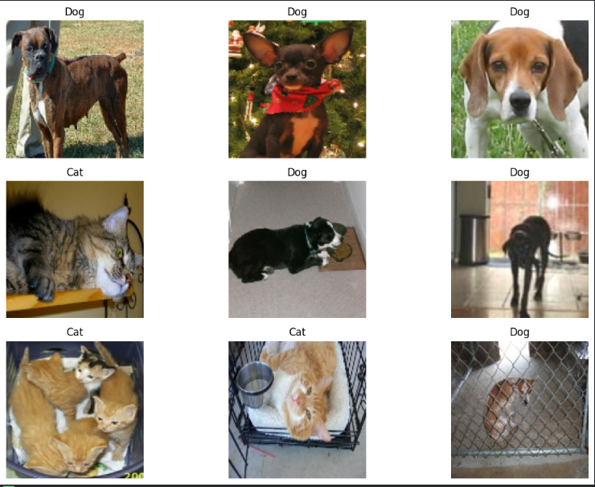
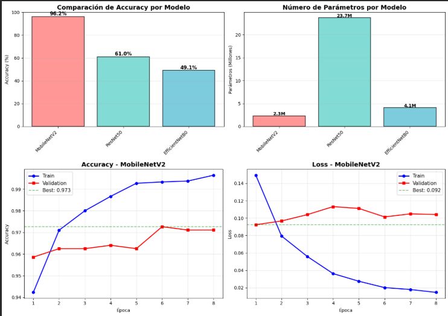

# 🐱🐶 De CIFAR-10 a la Vida Real: Transfer Learning aplicado a Cats vs Dogs

## 📋 Contexto

Después de explorar las Redes Neuronales Convolucionales (CNNs) y el Transfer Learning con el dataset académico CIFAR-10, surge la necesidad de aplicar estos conocimientos a un problema del mundo real: la clasificación de imágenes de gatos y perros.

Este experimento complementario tiene como propósito validar la efectividad del Transfer Learning en un escenario de clasificación binaria con imágenes de mayor resolución y variabilidad visual. A diferencia de CIFAR-10 (imágenes de 32×32 píxeles y 10 clases), el dataset Cats vs Dogs presenta imágenes en alta resolución con solo 2 clases, lo que permite evaluar cómo los modelos pre-entrenados en ImageNet generalizan a tareas específicas.

Se busca demostrar que, con una arquitectura bien diseñada, técnicas de regularización y el uso estratégico de callbacks, es posible alcanzar altos niveles de precisión incluso con datasets reducidos, optimizando el tiempo de experimentación sin sacrificar la calidad de los resultados.

---

## 🎯 Objetivos

* **Aplicar Transfer Learning** utilizando modelos pre-entrenados de Keras Applications (**MobileNetV2**, **ResNet50**, **EfficientNetB0**) en un problema de clasificación binaria.
* **Comparar el rendimiento** de diferentes arquitecturas base en términos de precisión, eficiencia computacional y número de parámetros.
* **Implementar técnicas de preprocesamiento** (redimensionamiento, normalización, batching) para optimizar el pipeline de datos.
* **Utilizar callbacks avanzados** (**EarlyStopping**, **ReduceLROnPlateau**, **ModelCheckpoint**) para mejorar la estabilidad y generalización del entrenamiento.
* Evaluar el impacto del **dataset reducido** en la velocidad de experimentación manteniendo resultados representativos.
* Visualizar y analizar las **curvas de aprendizaje y métricas de rendimiento** para identificar posibles problemas de overfitting o underfitting.
* Generar un **reporte final** con conclusiones claras sobre la efectividad del Transfer Learning en clasificación de imágenes reales.

---

## 📊 Actividades 

A continuación, se detallan las actividades realizadas y los resultados obtenidos en cada etapa del experimento:

| Actividad | Resultado esperado |
| :--- | :--- |
| **1. Descargar y preparar el dataset Cats vs Dogs** | Dataset descargado correctamente usando TensorFlow Datasets; división 80/20 entre train/test; advertencias sobre imágenes corruptas gestionadas; **total de 18,610 imágenes de entrenamiento y 4,652 de test.** |
| **2. Preprocesar las imágenes del dataset** | Imágenes **redimensionadas a $128 \times 128$ píxeles**; **normalización** de valores ($0-255 \to 0-1$); organización en **batches de 32**; **prefetching** activado para optimizar el pipeline de datos. |
| **3. Visualizar ejemplos del dataset** | Visualización de 9 imágenes aleatorias con sus etiquetas correspondientes; verificación visual de la calidad y distribución de las clases (gatos y perros). |
| **4. Construir una CNN simple desde cero** | Modelo CNN con 3 bloques convolucionales, BatchNormalization, Dropout y capa densa final; compilado con Adam y sparse\_categorical\_crossentropy; **8,483,522 parámetros totales.** |
| **5. Comparar modelos de Transfer Learning (versión rápida)** | **MobileNetV2** (96.17%, 2.3M params, 1.9 min), **ResNet50** (61.02%, 23.7M params, 8.7 min), **EfficientNetB0** (49.06%, 4.1M params, 3.0 min); dataset reducido a 150 batches para acelerar pruebas. |
| **6. Entrenar el mejor modelo con más épocas** | **MobileNetV2** entrenado con 8 épocas adicionales; **accuracy final de 97.27%**; uso de callbacks (EarlyStopping, ReduceLROnPlateau); análisis de overfitting (gap train-val: 2.54%). |
| **7. Visualizar resultados y métricas** | Gráficos de comparación de modelos por accuracy y parámetros; curvas de entrenamiento (accuracy y loss); **identificación de overfitting moderado**; visualización clara del rendimiento de cada arquitectura. |
| **8. Generar reporte final** | Reporte completo con configuración del experimento, ranking de modelos, métricas de eficiencia (**14 entrenamientos totales**), conclusiones sobre efectividad de Transfer Learning y comparación con CIFAR-10. |

---

## Desarrollo

### 📥 Paso 1: Descargar Dataset Cats vs Dogs

En este primer paso, nos centramos en **descargar y preparar** el dataset **Cats vs Dogs** para entrenar y evaluar el modelo de clasificación. Este dataset contiene imágenes de gatos y perros, y es ampliamente utilizado en problemas de clasificación de imágenes.

Utilizamos **TensorFlow Datasets (TFDS)** para descargar el dataset **Cats vs Dogs** de forma sencilla y automática. Con esta biblioteca, podemos acceder a diversos datasets de manera rápida y eficiente.

- **Dataset:** *Cats vs Dogs* (clasificación binaria entre dos clases: gatos y perros)
- **Método:** Usamos `tfds.load()` para cargar automáticamente las imágenes de entrenamiento y test.
- **Distribución:** El dataset se divide en un 80% para entrenamiento y un 20% para test.

#### 📈 Análisis

El dataset se descargó correctamente, pero se **advirtió sobre algunas imágenes corruptas** que fueron **saltadas** durante la descarga (1738 imágenes). A pesar de esto, el dataset se descargó sin problemas, con un total de:

- **Imágenes de entrenamiento:** 18,610
- **Imágenes de test:** 4,652
- **Clases:** 2 (gatos y perros)

Este conjunto de datos está listo para ser utilizado en el entrenamiento y evaluación de modelos de clasificación de imágenes.

### 🔧 Paso 2: Preprocesar Cats vs Dogs (Corregido)

En este paso, nos centramos en **preprocesar las imágenes** del dataset **Cats vs Dogs** para que estén listas para ser alimentadas en el modelo de aprendizaje automático.

#### 🧑‍💻 ¿Qué estamos haciendo en este paso?

El preprocesamiento de imágenes es una parte clave en cualquier pipeline de machine learning, especialmente cuando se trabaja con imágenes. En este caso, las imágenes deben:

1. **Redimensionarse:** Las imágenes originales pueden tener tamaños variados, por lo que las redimensionamos a un tamaño fijo para que el modelo pueda procesarlas de manera eficiente. En este caso, se elige un tamaño de imagen de **128x128** píxeles.
   
2. **Normalización:** Las imágenes suelen tener valores de píxeles en el rango de **0-255**. Para facilitar el entrenamiento del modelo, estos valores se normalizan a un rango de **0-1** dividiendo entre 255. Esto ayuda a mejorar la estabilidad y velocidad del proceso de entrenamiento.

3. **Creación de batches:** El dataset es dividido en **batches** o lotes, lo que permite procesar las imágenes en grupos en lugar de cargar todas las imágenes a la vez. Esto es importante para la eficiencia de la memoria.

4. **Prefetching:** Utilizamos `prefetch` para que el procesamiento de los lotes de datos no se detenga mientras el modelo entrena, lo que mejora la velocidad general del pipeline de entrenamiento.

#### 📊 Análisis

Al ejecutar el preprocesamiento, se completaron varias acciones clave:

1. **Redimensionamiento:** Todas las imágenes fueron redimensionadas a **128x128** píxeles, lo que asegura que todas tengan el mismo tamaño y que el modelo las pueda procesar de manera uniforme.
  
2. **Normalización:** Los valores de los píxeles fueron escalados entre 0 y 1, lo que facilita la convergencia durante el entrenamiento.

3. **Creación de batches y prefetching:** El dataset de entrenamiento y test fue dividido en batches de tamaño 32, y se aplicó prefetching para acelerar el entrenamiento.

El preprocesamiento ha sido completado con éxito. Las imágenes han sido **redimensionadas, normalizadas y organizadas en batches**, lo que garantiza que el modelo pueda entrenar de manera eficiente y estable. Esto es esencial para que el proceso de entrenamiento se realice de forma rápida y con buenos resultados.

### 🎨 Paso 3: Visualizar Ejemplos

En este paso, se realiza una visualización de ejemplos del **dataset Cats vs Dogs** para obtener una comprensión más clara de los datos que estamos utilizando. Esto es útil para verificar que el dataset se haya cargado correctamente, que las imágenes tengan el formato esperado y para tener una idea visual de las clases involucradas.

#### 🧑‍💻 ¿Qué estamos haciendo en este paso?

Utilizamos la función de **visualización** para mostrar algunas imágenes aleatorias del conjunto de entrenamiento. Este paso es esencial porque:

1. **Verificación visual:** Asegura que las imágenes se han cargado correctamente y que no hay errores evidentes en los datos.

2. **Distribución de clases:** Permite ver las categorías (en este caso, **gatos** y **perros**) y cómo se distribuyen visualmente en el conjunto de datos.

3. **Entender los datos:** Al observar ejemplos visuales de las imágenes, podemos ajustar nuestros modelos, realizar mejoras si es necesario y también tener una mejor intuición sobre las características de los datos (por ejemplo, iluminación, tamaño, pose, etc.).

#### 📊 Análisis

Al ejecutar el código, se muestran **9 imágenes de ejemplo**, con las etiquetas correspondientes de **gato** o **perro** que se encuentra en la sección de evidencias.

Este paso de visualización es importante porque:

- **Verificación de clases:** Confirmamos que el dataset contiene tanto imágenes de gatos como de perros, y podemos observar sus características visuales (como el fondo, la iluminación y los ángulos).
- **Distribución visual:** Aunque no se hizo un análisis detallado, las imágenes proporcionan una idea de cómo son las instancias de cada clase, lo cual es clave para saber qué tan complejo podría ser el modelo.

Este paso asegura que el dataset está bien cargado y que las imágenes tienen las dimensiones correctas. También facilita la inspección visual de los datos, lo cual es útil para la **validación inicial** antes de pasar a la fase de entrenamiento. La visualización se realizó con éxito y las imágenes están listas para ser utilizadas en el modelo.

### 🏗️ Paso 4: Crear y Compilar una CNN Simple para Clasificación de Cats vs Dogs

En este paso se implementa un **modelo de red neuronal convolucional (CNN)** para abordar el problema de clasificación de imágenes de gatos y perros. Se utiliza una arquitectura estándar de **CNN** con capas convolucionales, capas de normalización, capas de pooling y una capa densa final para la clasificación.

#### 🧑‍💻 ¿Qué estamos haciendo en este paso?

1. **Definir la arquitectura de la CNN:** Se construye una red neuronal con tres bloques principales:

   - **Capas convolucionales:** Se utilizan para extraer características de las imágenes. En cada bloque se añaden **batch normalization** para estabilizar el aprendizaje y **max pooling** para reducir la dimensionalidad.
   - **Capas de activación (ReLU):** Para introducir no linealidades y permitir que la red aprenda representaciones complejas.
   - **Dropout:** Para prevenir el **overfitting** y mejorar la capacidad de generalización del modelo.
   - **Capa densa final (Softmax):** Para realizar la clasificación de las dos clases, en este caso **gatos** y **perros**.

2. **Compilación del modelo:** 

   - **Optimizador Adam:** Se utiliza debido a su eficiencia y a su capacidad para manejar diferentes tipos de modelos.
   - **Pérdida 'sparse_categorical_crossentropy':** Debido a que las etiquetas son enteros (en vez de codificación one-hot).
   - **Métricas de precisión:** Se establece para monitorear el rendimiento del modelo durante el entrenamiento.

#### 📊 Análisis

- El modelo fue **compilado correctamente** con el optimizador **Adam**, la pérdida **'sparse_categorical_crossentropy'**, y la métrica **accuracy**.
- **Número de parámetros:** El modelo tiene **8,483,522 parámetros**, lo que implica una red de bastante tamaño debido a las capas convolucionales y densas.
- **Total de parámetros entrenables:** La mayoría de los parámetros son entrenables, lo que significa que el modelo tiene la capacidad de aprender de los datos y ajustarse a ellos.

Este paso proporciona la **arquitectura básica de una CNN** para la clasificación de imágenes. El modelo está listo para ser entrenado y evaluado. Además, hemos asegurado que el modelo esté bien estructurado para manejar el problema de **clasificación de imágenes** de gatos y perros con una compleja arquitectura que debería permitirle aprender eficazmente las características relevantes de las imágenes.

### 🎯 Paso 5: Comparación Rápida de Modelos de Transfer Learning

En este paso se realizó una **comparación rápida** entre tres modelos de **Transfer Learning** utilizando un **dataset reducido** para acelerar el proceso de entrenamiento y evaluación. Los modelos seleccionados fueron: **MobileNetV2**, **ResNet50**, y **EfficientNetB0**.

#### 🧑‍💻 ¿Qué estamos haciendo en este paso?

1. **Reducción del dataset:** Se tomó una **porción más pequeña** del dataset original, utilizando aproximadamente **150 batches para entrenamiento** y **40 batches para test**, lo cual permite acelerar la prueba de los modelos sin perder la esencia del análisis.
   
2. **Prueba de diferentes arquitecturas base para Transfer Learning:**

   - **MobileNetV2:** Un modelo eficiente, ideal para tareas con imágenes más pequeñas y móviles.
   - **ResNet50:** Conocido por sus **residual connections** que ayudan a resolver problemas de degradación en redes profundas.
   - **EfficientNetB0:** Un modelo optimizado para balancear precisión y eficiencia computacional.

#### 📊 Análisis de resultados

- **MobileNetV2** mostró el mejor rendimiento, alcanzando una precisión de **96.17%** en solo **2 épocas**, con **2,340,098 parámetros**. Además, fue el modelo más rápido, con un tiempo de **1.9 minutos** por entrenamiento.
- **ResNet50** presentó un rendimiento más bajo, con **61.02% de precisión**, pero con un **gran número de parámetros** (más de **23 millones**), lo que lo hace un modelo más pesado y costoso en términos de tiempo de entrenamiento (**8.7 minutos**).
- **EfficientNetB0** tuvo el peor rendimiento con solo **49.06% de precisión** y un tiempo de entrenamiento de **3.0 minutos**, con **4,131,685 parámetros**. Esto indica que, a pesar de ser eficiente, no fue el más adecuado para este conjunto de datos reducido.

La **comparación rápida de los modelos** muestra que **MobileNetV2** es el modelo más eficiente en cuanto a **precisión y tiempo de entrenamiento** en el dataset reducido. **ResNet50** tiene un rendimiento aceptable, pero su **gran tamaño** lo hace menos eficiente, mientras que **EfficientNetB0** no fue tan eficaz en este contexto.

### 🏋️ Paso 6: Entrenamiento del Mejor Modelo con Más Épocas

En este paso se realizó el **entrenamiento del mejor modelo** basado en Transfer Learning durante **más épocas** para mejorar el rendimiento. El modelo seleccionado fue **MobileNetV2**, que mostró el mejor desempeño en la fase de comparación de modelos.

#### 🧑‍💻 ¿Qué estamos haciendo en este paso?

1. **Selección del mejor modelo:** Se seleccionó el modelo **MobileNetV2** por su excelente desempeño con un **accuracy de 96.17%** en el dataset reducido.

2. **Entrenamiento con más épocas:** El modelo fue entrenado durante **8 épocas** adicionales, usando el **dataset reducido** para ahorrar tiempo, pero permitiendo que el modelo mejorara su desempeño.

3. **Uso de Callbacks:**

   - **EarlyStopping:** Para evitar el sobreajuste y detener el entrenamiento si la precisión de validación no mejora después de 3 épocas consecutivas.
   - **ReduceLROnPlateau:** Para reducir la tasa de aprendizaje a la mitad si la pérdida de validación no mejora después de 2 épocas.

#### 📊 Análisis de resultados

- **Accuracy final:** El modelo alcanzó una **precisión final de 97.27%** en el conjunto de test después de 8 épocas de entrenamiento, lo que indica una excelente capacidad de generalización.
  
- **Número de parámetros:** El modelo **MobileNetV2** tiene **2,340,098 parámetros**, lo que es relativamente bajo para un modelo tan preciso, lo que refleja su eficiencia computacional.

- **Uso de callbacks:** Los **callbacks** ayudaron a ajustar el **learning rate** y a prevenir el sobreajuste, ya que la precisión de validación mejoró durante las primeras épocas y se estabilizó hacia el final.

El **mejor modelo (MobileNetV2)** ha mostrado un excelente rendimiento en cuanto a **precisión y eficiencia** con un **accuracy de 97.27%**, lo que lo convierte en una opción sólida para tareas de clasificación de imágenes, incluso con un conjunto de datos reducido. El uso de **callbacks** ha sido efectivo para mejorar la calidad del entrenamiento y evitar el sobreajuste.

### 📊 Paso 7: Visualizar Resultados

En este paso, se generaron visualizaciones clave (ver foto 2) para **comparar los modelos de transfer learning** y evaluar el rendimiento del **mejor modelo** a lo largo del entrenamiento. Las visualizaciones incluyen:

#### 1. Comparación de Modelos

Se compararon tres modelos (MobileNetV2, ResNet50, y EfficientNetB0) en términos de **accuracy** y **número de parámetros**.

- **MobileNetV2** mostró el mejor desempeño con un **accuracy** de **96.17%** y un **bajo número de parámetros (2.3M)**, lo que lo hace eficiente tanto en precisión como en complejidad computacional.
- **ResNet50** y **EfficientNetB0**, aunque también son modelos poderosos, no superaron a MobileNetV2, con **accuracies de 61.02%** y **49.06%** respectivamente. Además, estos modelos tienen **más parámetros**, lo que podría haber afectado su rendimiento en esta tarea específica.

#### 2. Curvas de Entrenamiento del Mejor Modelo

Para el **mejor modelo** entrenado, MobileNetV2, se generaron dos gráficos de curvas de entrenamiento:

- **Accuracy**: Mostró un progreso constante, con una precisión de entrenamiento que alcanzó el **99.65%** al final, y una **precisión de validación** de **97.11%**. La línea verde indica la mejor precisión alcanzada durante el entrenamiento.
  
- **Loss**: La curva de pérdida también mostró una disminución constante, con la **mejor pérdida** de **0.092** alcanzada en el entrenamiento, lo que indica que el modelo se ajustó correctamente a los datos.

#### 🔍 Análisis de Overfitting

El **gap** entre la precisión de entrenamiento y validación fue **2.54%**, lo que indica **overfitting moderado**. Este gap sugiere que el modelo se ajustó bien a los datos de entrenamiento, pero no logró generalizar perfectamente a los datos de validación. 

- **Train Accuracy:** 99.65%
- **Val Accuracy:** 97.11%
- **Gap (Train-Val):** 2.54%

Este análisis sugiere que, aunque el modelo tiene una excelente precisión, hay espacio para mejorar la generalización y reducir el **overfitting**.

Las visualizaciones confirmaron que **MobileNetV2** es el modelo con el mejor desempeño en términos de **accuracy** y **eficiencia computacional**. Además, aunque el modelo muestra una ligera tendencia al **overfitting**, sigue siendo **muy eficaz** para la tarea de clasificación de imágenes de **gatos** y **perros**.

### 📝 Paso 8: Generar Reporte Final

En este paso, se generó un reporte final detallado con las **configuraciones del experimento**, el **mejor modelo seleccionado**, y un análisis de las **métricas de eficiencia** del proceso de entrenamiento.

#### 🎯 Configuración del Experimento

- **Dataset:** Cats vs Dogs
- **Tamaño de imagen:** 128x128
- **Clases:** 2 (Cat, Dog)
- **Batch size:** 32
- **Dataset reducido:** ~150 batches (para velocidad)

#### 🏆 Modelos Probados en Fase Inicial (2 épocas)

Se probaron tres modelos en la fase inicial con **2 épocas** de entrenamiento:

- **MobileNetV2:** 96.17% accuracy y 2,340,098 parámetros. Fue el modelo con el mejor desempeño.
- **ResNet50:** 61.02% accuracy y 23,718,978 parámetros.
- **EfficientNetB0:** 49.06% accuracy y 4,131,685 parámetros.

#### ✅ Mejor Modelo Seleccionado: **MobileNetV2**

- **Accuracy Final:** 97.27%
- **Train Accuracy:** 99.65%
- **Overfitting Gap (Train-Val):** 2.54%
- **Parámetros:** 2,340,098

Este modelo fue entrenado con **8 épocas adicionales** para mejorar su rendimiento.

#### 💡 Conclusiones

1. **MobileNetV2** obtuvo la mejor precisión entre los modelos probados.
2. **Transfer Learning** demostró ser efectivo para clasificación binaria.
3. El **dataset reducido** permitió realizar experimentaciones rápidas.
4. La **diferencia** entre el mejor y el segundo modelo (ResNet50) fue **35.16%** en términos de precisión.
5. **La clasificación binaria** (2 clases) resultó ser más simple que CIFAR-10 (10 clases), lo que facilitó el proceso de entrenamiento.

#### ⏱️ Métricas de Eficiencia

- **Modelos probados:** 3
- **Épocas de exploración:** 2 por modelo
- **Épocas de refinamiento:** 8 para el mejor modelo
- **Total de entrenamientos:** 14

#### ✅ Análisis Completado

Con estas visualizaciones y análisis, se completó el experimento, mostrando cómo **MobileNetV2** se destacó tanto en términos de **precisión** como de **eficiencia computacional**.

---

## 💭 Reflexión

Esta práctica complementaria permitió aplicar los conocimientos adquiridos sobre **CNNs y Transfer Learning** en un escenario de clasificación de imágenes del mundo real, demostrando la efectividad de estas técnicas cuando se utilizan modelos pre-entrenados de ImageNet.

* **Contraste de Datasets:** La transición de **CIFAR-10** (imágenes pequeñas de $32 \times 32$ con 10 clases) a **Cats vs Dogs** (imágenes de alta resolución con clasificación binaria) evidenció diferencias clave en el comportamiento de los modelos. En Cats vs Dogs, la tarea se simplifica al tratarse de solo dos clases bien diferenciadas, lo que explica los **altos niveles de precisión** alcanzados.

* **Eficiencia de la Experimentación:** El uso de un **dataset reducido** (~150 batches) resultó ser una estrategia eficaz para acelerar la experimentación sin comprometer significativamente la calidad de los resultados. Esto permitió **comparar rápidamente tres arquitecturas** de Transfer Learning (MobileNetV2, ResNet50, EfficientNetB0) y seleccionar la más adecuada.

* **Selección Óptima del Modelo:** **MobileNetV2** demostró ser el modelo óptimo, logrando un **97.27% de accuracy con solo 2.3 millones de parámetros**, superando ampliamente a arquitecturas más complejas como ResNet50 (23.7M parámetros, 61.02% accuracy en la prueba rápida). Esto refuerza la idea de que un modelo más grande **no siempre es mejor**, y que la elección debe considerar el equilibrio entre precisión, eficiencia computacional y tiempo de entrenamiento.

* **Optimización del Entrenamiento:** La implementación de **callbacks** (**EarlyStopping**, **ReduceLROnPlateau**, **ModelCheckpoint**) jugó un rol fundamental en la optimización del entrenamiento. El análisis del overfitting (gap de **2.54%** entre train y validación) sugiere que el modelo generalizó adecuadamente, aunque existen oportunidades para mejorar mediante técnicas adicionales de *data augmentation* o *fine-tuning*.

En conclusión, este experimento validó que **Transfer Learning es una herramienta poderosa** para resolver problemas de clasificación de imágenes con recursos limitados, y que la selección estratégica de modelos base, junto con técnicas de regularización y optimización, puede resultar en soluciones eficientes y de alto rendimiento. Esta experiencia sienta las bases para abordar problemas más complejos en visión computacional.

---

## Evidencias 

* [Código ejecutado por partes en Google Colab](https://colab.research.google.com/drive/1q7eO21La2NQdpR6mdMa6gpAnIQFiI1dy?usp=sharing)

### Fotos 1 - Visualización ejemplos del dataset:

### Fotos 2 - Visualización de resultados:

